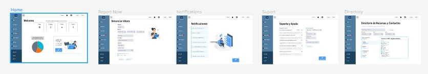
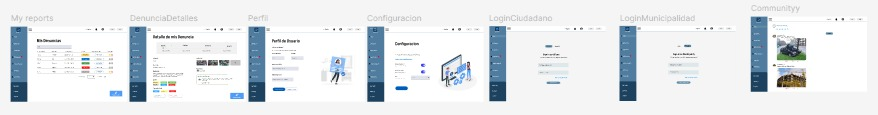
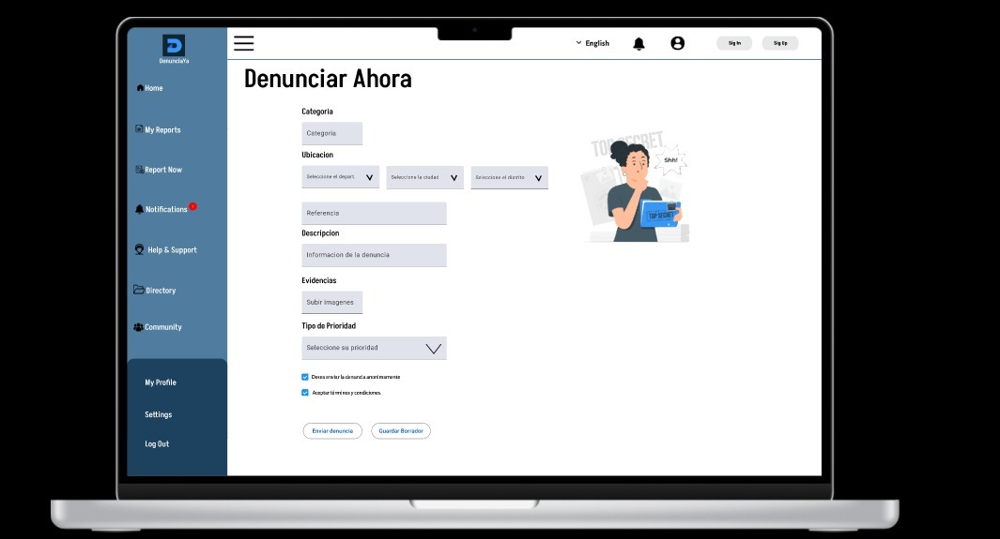

<div align="center">


# UNIVERSIDAD PERUANA DE CIENCIAS APLICADAS

### Carrera: Ingeniería de Software

### Desarrollo de Aplicaciones Open Source - Presencial (1ASI0729)

### Profesor: Hugo Allan Mori Paiva

### NRC: 7401

## Informe - TB1

## Startup: Prodevs

## Producto: DenunciaYa

### INTEGRANTES

<div style="text-align: center;">

|        Apellidos y Nombres        | Código de Alumno |
|:---------------------------------:|:----------------:|
|   Mamani Marca, Gabriel Cristian  | u202220659       |
|   Omar Harold Rivera Ticllacuri   | u202214214       |
|      Franco Diego Rioja Nuñez     | u202221597       |
| Gabriel Anthony Brabuaite Toledo  | U20201e889       |
|   Augusto Sebastian Montes Maza   | u202218645       |

</div>

### Ciclo 2025-20

---

</div>

# Registro de versiones del informe

| Versión | Fecha      | Autor                                 | Descripción de modificación                                                                                                                 |
|---------|------------|---------------------------------------|--------------------------------------------------------------------------------------------------------------------------

# PROJECT REPORT COLLABORATION INSIGHTS

| Repositorio del Informe en GitHub |
|--|
| https://github.com/1ASI0729-7401-2520-Prodevs-DenunciaYa/DenunciaYa-Proyect-Report
### 2. Actividades de elaboracion del informe 
### 3. Capturas en imagen de los analíticos de colaboración y commits en GitHub
### 4. Evidencia de participacion de todos los miembros del equipo |

# Contenido

## Tabla de Contenidos
### [Registro de versiones del informe](#registro-de-versiones-del-informe)
### [Project Report Collaboration Insights](#project-report-collaboration-insights)
### [Contenido](#contenido)
### [Student Outcome](#student-outcome-1)
### [Capítulo I: Introducción](#capc3adtulo-i-introduccic3b3n-1)
- [1.1. Startup Profile](#11-startup-profile)
    - [1.1.1. Descripción de la Startup](#111-description-de-la-startup)
    - [1.1.2. Perfiles de integrantes del equipo](#112-perfiles-de-integrantes-del-equipo)
- [1.2. Solution Profile](#12-solution-profile)
    - [1.2.1 Antecedentes y problemática](#121-antecedentes-y-problemática)
    - [1.2.2 Lean UX Process](#122-lean-ux-process)
        - [1.2.2.1. Lean UX Problem Statements](#1221-lean-ux-problem-statements)
        - [1.2.2.2. Lean UX Assumptions](#1222-lean-ux-assumptions)
        - [1.2.2.3. Lean UX Hypothesis Statements](#1223-lean-ux-hypothesis-statements)
        - [1.2.2.4. Lean UX Canvas](#1224-lean-ux-canvas)
- [1.3. Segmentos objetivo](#13-segmentos-objetivo)

### [Capítulo II: Requirements Elicitation & Analysis](#capc3adtulo-ii-requirements-elicitation--analysis-1)
- [2.1. Competidores](#21-competidores)
    - [2.1.1. Análisis competitivo](#211-análisis-competitivo)
    - [2.1.2. Estrategias y tácticas frente a competidores](#212-estrategias-y-tácticas-frente-a-competidores)
- [2.2. Entrevistas](#22-entrevistas)
    - [2.2.1. Diseño de entrevistas](#221-diseño-de-entrevistas)
    - [2.2.2. Registro de entrevistas](#222-registro-de-entrevistas)
    - [2.2.3. Análisis de entrevistas](#223-análisis-de-entrevistas)
- [2.3. Needfinding](#23-needfinding)
    - [2.3.1. User Personas](#231-user-personas)
    - [2.3.2. User Task Matrix](#232-user-task-matrix)
    - [2.3.3. User Journey Mapping](#233-user-journey-mapping)
    - [2.3.4. Empathy Mapping](#234-empathy-mapping)
    - [2.3.5. As-is Scenario Mapping](#235-as-is-scenario-mapping)
    - [2.4. Ubiquitous Language](#24-Ubiquitous-language)
### [Capítulo III: Requirements Specification](#capc3adtulo-iii-requirements-specification-1)
- [3.1. To-Be Scenario Mapping](#31-to-be-scenario-mapping)
- [3.2. User Stories](#32-user-stories)
- [3.3. Impact Mapping](#33-impact-mapping)
- [3.4. Product Backlog](#34-product-backlog)

### [Capítulo IV: Product Design](#capc3adtulo-iv-product-design-1)
- [4.1. Style Guidelines](#41-style-guidelines)
    - [4.1.1. General Style Guidelines](#411-general-style-guidelines)
    - [4.1.2. Web Style Guidelines](#412-web-style-guidelines)
- [4.2. Information Architecture](#42-information-architecture)
    - [4.2.1. Organization Systems](#421-organization-systems)
    - [4.2.2. Labeling Systems](#422-labeling-systems)
    - [4.2.3. SEO Tags and Meta Tags](#423-seo-tags-and-meta-tags)
    - [4.2.4. Searching Systems](#424-searching-systems)
    - [4.2.5. Navigation Systems](#425-navigation-systems)
- [4.3. Landing Page UI Design](#43-landing-page-ui-design)
    - [4.3.1. Landing Page Wireframe](#431-landing-page-wireframe)
    - [4.3.2. Landing Page Mock-up](#432-landing-page-mock-up)
- [4.4. Web Applications UX/UI Design](#44-web-applications-uxui-design)
    - [4.4.1. Web Applications Wireframes](#441-web-applications-wireframes)
    - [4.4.2. Web Applications Wireflow Diagrams](#442-web-applications-wireflow-diagrams)
    - [4.4.3. Web Applications Mock-ups](#443-web-applications-mock-ups)
    - [4.4.4. Web Applications User Flow Diagrams](#444-web-applications-user-flow-diagrams)
- [4.5. Web Applications Prototyping](#45-web-applications-prototyping)
- [4.6. Domain-Driven Software Architecture](#46-domain-driven-software-architecture)
    - [4.6.1. Software Architecture Context Diagram](#461-software-architecture-context-diagram)
    - [4.6.2. Software Architecture Container Diagrams](#462-software-architecture-container-diagrams)
    - [4.6.3. Software Architecture Components Diagrams](#463-software-architecture-components-diagrams)
- [4.7. Software Object-Oriented Design](#47-software-object-oriented-design)
    - [4.7.1. Class Diagrams](#471-class-diagrams)
    - [4.7.2. Class Dictionary](#472-class-dictionary)
- [4.8. Database Design](#48-database-design)
    - [4.8.1. Database Diagram](#481-database-diagram)

### [Capítulo V: Product Implementation, Validation & Deployment](#capc3adtulo-v-product-implementation-validation--deployment-1)
  - [5.1. Software Configuration Management.](#51-software-configuration-management)
    - [5.1.1. Software Development Environment Configuration.](#511-software-development-environment-configuration)
    - [5.1.2. Source Code Management.](#512-source-code-management)
    - [5.1.3. Source Code Style Guide \& Conventions.](#513-source-code-style-guide--conventions)
    - [5.1.4. Software Deployment Configuration.](#514-software-deployment-configuration)
  - [5.2. Landing Page, Services \& Applications Implementation.](#52-landing-page-services--applications-implementation)
    - [5.2.1. Sprint 1](#521-sprint-1)
    - [5.2.1.1. Sprint Planning 1.](#5211-sprint-planning-1)
    - [5.2.1.2. Aspect Leaders and Collaborators.](#5212-aspect-leaders-and-collaborators)
    - [5.2.1.3. Sprint Backlog 1.](#5213-sprint-backlog-1)
    - [5.2.1.4. Development Evidence for Sprint Review.](#5214-development-evidence-for-sprint-review)
    - [5.2.1.5. Execution Evidence for Sprint Review.](#5215-execution-evidence-for-sprint-review)
    - [5.2.1.6. Services Documentation Evidence for Sprint Review.](#5216-services-documentation-evidence-for-sprint-review)
    - [5.2.1.7. Software Deployment Evidence for Sprint Review.](#5217-software-deployment-evidence-for-sprint-review)
    - [5.2.1.8. Team Collaboration Insights during Sprint.](#5218-team-collaboration-insights-during-sprint)

# Student Outcome
**ABET – EAC - Student Outcome 5**  
*Criterio: La capacidad de funcionar efectivamente en un equipo cuyos miembros juntos proporcionan liderazgo, crean un entorno de colaboración e inclusivo, establecen objetivos, planifican tareas y cumplen objetivos.*

| Criterio específico                                                                            | Acciones realizadas | Conclusiones |
|------------------------------------------------------------------------------------------------|---------------------|--------------|
| Comunica oralmente con efectividad a diferentes rangos de audiencia.                           | | |
| Comunica por escrito conefectividad a diferentes rangosde audiencia | | |

# Capítulo I: Introducción
## 1.1. Startup Profile
### 1.1.1. Descripción de la Startup
### 1.1.2. Perfiles de integrantes del equipo
### 1.2. Solution Profile
### 1.2.1 Antecedentes y problemática
### 1.2.2 Lean UX Process.
### 1.2.2.1. Lean UX Problem Statements.
### 1.2.2.2. Lean UX Assumptions.
### 1.2.2.3. Lean UX Hypothesis Statements.
### 1.2.2.4. Lean UX Canvas.
## 1.3. Segmentos objetivo.
# Capítulo II: Requirements Elicitation & Analysis
## 2.1. Competidores.
### 2.1.1. Análisis competitivo.
### 2.1.2. Estrategias y tácticas frente a competidores.
## 2.2. Entrevistas.
### 2.2.1. Diseño de entrevistas.
### 2.2.2. Registro de entrevistas.
### 2.2.3. Análisis de entrevistas.
## 2.3. Needfinding.
### 2.3.1. User Personas.
### 2.3.2. User Task Matrix.
### 2.3.3. User Journey Mapping.
### 2.3.4. Empathy Mapping.
## 2.4. Big Picture Event Storming.
## 2.5. Ubiquitous Language.
# Capítulo III: Requirements Specification
## 3.1. User Stories.
## 3.2. Impact Mapping.
## 3.3. Product Backlog
# Capítulo IV: Product Design
## 4.1. Style Guidelines.
En este apartado, se mostrará de manera organizada los estilos y herramientas que se usarán para diseñar nuestra solución.

### 4.1.1. General Style Guidelines.
#### Brand Overview  

En muchas ciudades de Latinoamérica, los ciudadanos enfrentan barreras para reportar problemas que afectan su entorno, desde baches y basura acumulada hasta casos de corrupción o deficiencias en los servicios públicos. La mayoría de los procesos actuales son engorrosos, poco transparentes y generan desconfianza hacia las autoridades. Esto provoca que muchos reportes nunca lleguen a resolverse y que los ciudadanos sientan que su voz no es escuchada.  

**DenunciaYa** nace como una solución tecnológica que conecta directamente a los ciudadanos con las autoridades locales a través de un sistema simple, seguro y confiable. Nuestra plataforma permite realizar denuncias de manera rápida y opcionalmente anónima, con seguimiento en tiempo real y notificaciones inmediatas del estado de cada reporte. Al mismo tiempo, brinda a las autoridades paneles de control, métricas de eficiencia y herramientas de análisis que les ayudan a gestionar los problemas de forma más transparente y efectiva.  

De esta manera, **DenunciaYa no solo fortalece la participación ciudadana**, sino que también promueve gobiernos más abiertos, responsables y orientados a resultados.  

---

#### Brand name  

El nombre de nuestra solución, **DenunciaYa**, refleja su esencia: un llamado directo y urgente a la acción. La palabra **“Denuncia”** conecta inmediatamente con la función principal de la aplicación, mientras que **“Ya”** transmite inmediatez y simplicidad, invitando a los ciudadanos a reportar sin obstáculos ni demoras.  

Hemos elegido un nombre en español para que sea fácilmente identificable y comprensible en toda Latinoamérica, generando cercanía y confianza con los usuarios.  

**Logo:**  


---

#### Typography  

En **DenunciaYa**, la tipografía es un elemento esencial para comunicar confianza, cercanía y profesionalismo. Hemos seleccionado dos tipografías complementarias de Google Fonts que reflejan la identidad de la plataforma:  

- **Akshar**: utilizada en los *headings* y títulos principales. Su estilo moderno, limpio y geométrico transmite innovación y solidez, aportando jerarquía visual a la interfaz.  
- **Alegreya Sans**: aplicada en el *body text* y contenido general. Su diseño humanista y altamente legible brinda calidez y accesibilidad, asegurando que la experiencia de lectura sea cómoda y clara en cualquier dispositivo.  

Esta combinación logra un balance elegante entre **modernidad tecnológica** y **cercanía ciudadana**, asegurando que la aplicación sea visualmente atractiva, funcional y coherente en todos sus niveles de comunicación.  

**Typography Example:**  


---

#### Colors  

La paleta de colores de **DenunciaYa** está diseñada para transmitir solidez, confianza y cercanía, garantizando una experiencia visual clara y consistente. Los colores principales y secundarios definen la identidad de la marca, mientras que la gama de apoyo aporta flexibilidad para diferentes contextos de la interfaz.  

- **Color Primario (Azul Cívico – #3897F5):** Color principal de la marca, utilizado en elementos destacados como botones de acción y componentes clave de la interfaz. 

- **Color Secundario (Azul Profundo – #112433):** Aporta contraste y solidez. Ideal para fondos, encabezados o secciones que requieren un tono más institucional.  
 

- **Color Secundario (Blanco – #FFFFFF):** Mantiene la claridad y la legibilidad en toda la aplicación. Usado como fondo principal y para generar equilibrio visual.  
 

- **Color Terciario (Amarillo – #FFCB2E):** Complementa la identidad cromática y resalta elementos puntuales de la interfaz con energía y visibilidad.  
 

La identidad de **DenunciaYa** se completa con una gama de apoyo que permite jerarquizar la información, mantener consistencia y cubrir diferentes estados visuales:  


#### Spacing  

El **espaciado** en **DenunciaYa** cumple un rol fundamental para garantizar orden, legibilidad y claridad en la experiencia del usuario. Una estructura bien definida de márgenes, paddings y separaciones permite que cada elemento tenga el aire suficiente para destacar sin sobrecargar la interfaz.  

Hemos adoptado un **sistema de 8px** como unidad base, por ser un estándar ampliamente utilizado en diseño digital. Esto asegura consistencia en todos los niveles de la aplicación, facilita la escalabilidad y mantiene armonía visual en cualquier dispositivo.  

- **Micro-spacing (4px):** usado para separaciones muy pequeñas, como íconos dentro de botones o elementos estrechamente relacionados.  
- **Base-spacing (8px):** unidad principal para definir márgenes, paddings y distancias regulares entre componentes.  
- **Medium-spacing (16px):** recomendado para separar bloques de contenido, tarjetas o secciones dentro de la interfaz.  
- **Large-spacing (24px – 32px):** aplicado en márgenes exteriores, secciones principales o espacios que requieren mayor aire visual.  

Este sistema modular no solo aporta **consistencia visual**, sino que también mejora la **jerarquía de la información**, logrando que los reportes, formularios y paneles de control sean fáciles de leer, navegar y comprender.  

**Ejemplo visual de spacing:**  
  


#### Tone of Voice and Communication  

El tono de comunicación de **DenunciaYa** se alinea con los valores de confianza, cercanía y responsabilidad ciudadana. Hemos adoptado un estilo:  

- **Serio pero accesible**, ya que aborda problemas relevantes que impactan en la comunidad.  
- **Formal en su estructura**, pero **claro y sencillo en su lenguaje**, para que cualquier ciudadano pueda entenderlo sin dificultad.  
- **Respetuoso y transparente**, transmitiendo legitimidad y profesionalismo.  
- **Entusiasta y motivador**, para invitar a la acción inmediata de los usuarios sin caer en la rigidez institucional.  

De esta manera, el lenguaje utilizado refuerza la misión de la aplicación: **hacer que la voz de los ciudadanos sea escuchada y atendida**.


### 4.1.2. Web Style Guidelines.

Nuestra plataforma web está diseñada bajo un enfoque **responsive first**, garantizando que la experiencia sea clara, accesible y consistente en cualquier dispositivo. Todas las decisiones visuales se han tomado siguiendo principios de simplicidad, legibilidad y usabilidad, asegurando que los ciudadanos puedan navegar fácilmente y realizar denuncias sin obstáculos.  

---

#### Layout y Grid System  

El diseño de **DenunciaYa** se basa en un **sistema de 12 columnas** que permite una disposición flexible y escalable en todos los tamaños de pantalla. En la página de inicio se emplea un **patrón de lectura en Z**, que guía naturalmente la vista del usuario hacia los elementos más importantes:  

1. **Logo y menú principal** en la parte superior izquierda.  
2. **Botón de acción principal “Denunciar Ahora”** en la parte superior derecha.  
3. **Bloques informativos o destacados** en el centro.  
4. **Llamado a la acción o contacto** en la parte inferior derecha.  


Este sistema asegura jerarquía visual y mantiene coherencia entre las distintas secciones de la plataforma.  

---

#### Responsive Design  

Hemos definido **breakpoints principales** para garantizar que la interfaz se adapte a diferentes dispositivos sin perder claridad ni funcionalidad:  

- **Mobile (≤480px):**  
  - Menú en formato hamburguesa.  
  - Tipografía adaptada a 14–16px para máxima legibilidad.  
  - Botones ocupan el 100% del ancho para facilitar la interacción táctil.  
  - Formularios en una sola columna.  

- **Tablet (481–768px):**  
  - Distribución en dos columnas.  
  - Íconos más visibles y textos acompañados de descripciones cortas.  
  - Botones medianos con mayor espaciado.  

- **Desktop (≥1024px):**  
  - Estructura en 3 o 4 columnas según el contenido.  
  - Menú principal desplegado en la parte superior.  
  - Mayor aprovechamiento del espacio para paneles de control, métricas y gráficos.  


---


#### Componentes UI  

Los **componentes de interfaz** siguen los principios de consistencia, simplicidad y accesibilidad.  

**Botones:**  
- **Primario:** Azul Cívico (#3897F5) con texto blanco. Uso en acciones principales como “Denunciar Ahora”.  
- **Secundario:** Azul Profundo (#112433) con texto blanco. Uso en acciones de navegación o secundarias.  
- **Hover:** aumento de sombra sutil y variación ligera de color.  
- **Disabled:** tono gris (#D3D3D3) con texto atenuado.  

**Inputs y Formularios:**  
- Bordes redondeados de **8px** para transmitir accesibilidad y modernidad.  
- Estados claros:  
  - **Normal:** borde gris claro.  
  - **Hover:** borde azul (#3897F5).  
  - **Error:** borde rojo (#FF4C4C) con mensaje explicativo.  
  - **Success:** borde verde (#4CAF50).  

**Cards y Secciones:**  
- Esquinas redondeadas de **12px**.  
- Sombra ligera para dar profundidad.  
- Imagen o ícono en la parte superior, texto y acción en la parte inferior.  


---

#### Interacciones y Estados  

La plataforma utiliza microinteracciones para mejorar la experiencia del usuario:  

- Los **botones** muestran una ligera animación de escala al hacer *hover*.  
- Los **inputs** cambian de color al enfocarse, reforzando el estado activo.  
- Los **formularios** validan datos en tiempo real, mostrando feedback inmediato.  
- Los **links** subrayan al pasar el cursor, reforzando su función de navegación.  

---

#### Navegación  

La navegación se ha diseñado bajo los principios de **claridad y accesibilidad**:  

- **Barra superior fija (sticky navbar):** visible en todo momento para facilitar el acceso a “Denunciar Ahora” y al menú principal.  
- **Menú hamburguesa en mobile:** que despliega las opciones de navegación.  
- **Footer:** contiene accesos rápidos a ayuda, políticas de privacidad, términos de uso y contacto.  

---

#### Accesibilidad  

**DenunciaYa** se ha construido con un compromiso hacia la accesibilidad. 

- **Tipografía legible**, con tamaños mínimos de entre 10px a 14px en dispositivos móviles.  
- Uso de **atributos ARIA** en formularios y menús para apoyar la navegación con lectores de pantalla.  
- Todo el contenido puede ser navegado únicamente con teclado, garantizando inclusión.  

---


## 4.2. Information Architecture
En esta sección, el equipo define la manera en que se organizará el contenido dentro de la plataforma de denuncias, considerando tanto la página principal como la aplicación web. El objetivo es que los usuarios puedan entender y utilizar las funciones sin dificultad, logrando que el proceso de registrar, consultar o dar seguimiento a una denuncia sea lo más claro posible.  

Las decisiones abarcan la forma en que se estructuran las categorías de denuncias, el sistema de etiquetado para clasificar cada caso, la navegación entre secciones y los mecanismos de búsqueda que permitan localizar rápidamente información relevante. De esta forma, se busca garantizar una experiencia accesible y eficiente para todos los usuarios.  
### 4.2.1. Organization Systems

La organización de la información en DenunciaYa aplica distintos sistemas (jerárquico, secuencial, matricial) según el tipo de contenido y la meta del usuario. A continuación se detalla qué sistema se aplica a cada grupo de información y qué esquema de categorización se usará.

#### Aplicación por grupos de información

- **Landing Page (Información pública, acceso y conversión)**  
  - **Sistema:** **Jerárquico (visual hierarchy)** — la home prioriza mensajes clave (propuesta de valor, CTA "Denunciar" o "Denunciar Ahora", cómo funciona).  
  - **Categorización:** por **tópicos** (Qué es, Cómo funciona,Sobre Nosotros, Testimonios, Blog, Soporte y Contactos).  
  - **Justificación:** orientada a conversión y comprensión rápida.

- **Flujo de creación de denuncia (forms / wizard)**  
  - **Sistema:** **Secuencial (step-by-step)** — proceso guiado por pasos: 1) Seleccionar categoría -> 2) Ubicación-> 3) Descripción y evidencias -> 4) Revisión y envío.  
  - **Categorización:** por **audiencia** (ciudadano que reporta, anónimo vs identificado) y por **tópico** (tipo de incidencia).  
  - **Justificación:** evita errores y asegura captura completa de datos.

- **Historial / Lista de denuncias (usuario)**  
  - **Sistema:** **Jerárquico + filtrable** — lista con tarjetas ordenadas por prioridad/fecha y filtros laterales.  
  - **Categorización:** **Cronológica** por defecto (más reciente arriba); opción alternativa por **tópicos** o **estado**.  
  - **Justificación:** usuarios consultan por fecha y estado.

- **Panel de control / Dashboard (autoridades / admins)**  
  - **Sistema:** **Matricial** (grid / matrix) — vistas con matrices que cruzan dimensiones (ej. *categoría × distrito*, *estado × prioridad*).  
  - **Categorización:** **por tópico** y **por audiencia** (departamento responsable).  
  - **Justificación:** facilita análisis y priorización.

- **Directorio de recursos y contactos**  
  - **Sistema:** **Alfabético** para listados (oficinas, departamentos), con filtros por región.  
  - **Categorización:** **Alfabética** y por **audiencia** (ciudadano / empresa / autoridad).

- **Historial de intervenciones y timeline de casos**  
  - **Sistema:** **Cronológico** (línea de tiempo por caso).  
  - **Justificación:** rastrear evolución de la denuncia en tiempo.

#### Esquemas de categorización aplicados (resumen)
- **Alfabético:** directorios, listas de autoridades, glosarios.  
- **Cronológico:** historial de denuncias, timelines de caso, logs de actividad.  
- **Por tópicos:** categorías de denuncia (Infraestructura y Espacios Públicos, Servicios Públicos, Medio Ambiente, Seguridad Ciudadana, Transporte y Movilidad, Salud Pública, Comercio Informal, entre otros).  
- **Por audiencia:** vistas y accesos adaptados (ciudadano, gestor municipal, agente de campo, soporte).

---

### 4.2.2. Labeling Systems

El sistema de etiquetado prioriza **brevedad, consistencia, accesibilidad y claridad**. Se empleará español neutral (ES), lenguaje en **sentence case** (mayúscula sólo en la primera palabra salvo nombres propios), y un máximo recomendado de **1–2 palabras** en la mayor parte de botones y menús. Se define además una lista completa de etiquetas clave y reglas de microcopy.

#### Reglas generales de etiquetado
- Idioma: **Ingles (en-US)** por defecto, luego sera cambiado por internacionalizacion.  
- Longitud: **1–2 palabras** para botones y menús; **hasta 6–8 palabras** para títulos de secciones si es necesario.  
- Casos: **Sentence case** -> ej. **Denunciar**, **Mis Denuncias(historial)**, **Mi perfil**.  
- Iconos: usar icono + etiqueta para acciones primarias en móvil; icono sólo para estados secundarios.  
- Abreviación: evitar abreviaciones; si son necesarias, mostrar tooltip con la forma completa.  
- Plurales: usar forma singular en botones de acción, plural en listados.  
- Accesibilidad: todas las etiquetas deben tener atributos `aria-label` y textos alternativos en imágenes.

#### Etiquetas primarias (menú y CTAs)
- Menú superior / global: **Inicio**, **Notificaciones**, **Informacion de la cuneta**.  
- CTA primario: **Denunciar** o **Denunciar ahora**.  
- Footer: **Ayuda**, **Términos**, **Política de privacidad**, **Contacto**.  

### Etiquetas internas y de formularios
- **Formulario (pasos):** Categoría, Ubicación, Fecha, Descripción, Evidencia, Revisar y enviar  
- **Botones:**Continuar, Siguiente, Anterior, Enviar, Guardar borrador  
- **Estados de denuncia:** Pendiente, En proceso, Resuelto, Rechazado  
- **Acciones en listado:** Ver, Editar, 
- **Campos frecuentes:** Número de denuncia, Nombre (opcional si se activa el anonimato total), Teléfono (opcional), Correo , Adjuntar foto, anonimato total(checkbox).


#### Microcopy / mensajes y estados

**Mensajes de éxito**
- `Tu denuncia fue enviada correctamente. N.º: 12345.`
- `Los cambios se guardaron con éxito.`

**Mensajes de error**
- `Por favor, selecciona una categoría.`
- `No pudimos enviar tu denuncia. Inténtalo de nuevo más tarde.`
- `Archivo no válido. Sube una foto en formato JPG o PNG.`

**Mensajes de validación**
- `El campo correo electrónico no es válido.`
- `La descripción debe tener al menos 20 caracteres.`

**Mensajes de vacíos (empty states)**
- `Aún no tienes denuncias registradas.`
- `No se encontraron resultados para tu búsqueda.`

**Confirmaciones**
- `¿Estás seguro de que deseas eliminar esta denuncia?`
- `¿Deseas salir sin guardar los cambios?`

**Tooltips**
- `Número de denuncia: referencia única para seguimiento.`
- `Adjuntar foto: máximo 5 MB.`

---

### 4.2.3. SEO Tags and Meta Tags

Se definen tags base para cada tipo de página. 

### Reglas SEO generales
- **Title:** 50–60 caracteres recomendados.  
- **Meta description:** 140–160 caracteres.  
- **Keywords:** uso limitado (no spam).  
- **Canonical:** en páginas con contenido duplicado.  
- **Lang & hreflang:** `lang="en-US"` en HTML.  


#### Ejemplos de tags 

**Landing Page (index.html)**
```html
<title>DenunciaYa – Plataforma para reportar incidencias ciudadanas</title>
<meta name="description" content="DenunciaYa permite reportar incidencias de manera rápida, segura y en tiempo real. Únete y haz que tu voz sea escuchada.">
<meta name="keywords" content="denuncias, reportes ciudadanos, incidencias, participación ciudadana">
<meta name="author" content="Equipo DenunciaYa">
<meta name="robots" content="index, follow">
```

**Web Application — Panel**
```html
<title>Mi Panel – DenunciaYa</title>
<meta name="description" content="Gestiona tus denuncias, sigue su estado y accede a soporte desde tu panel en DenunciaYa.">
```

**Página de detalle de denuncia (dinámico)**
- **Title dinámico:** `Denuncia #12345 – Pendiente | DenunciaYa`  
- **Description dinámica:** `Detalle de la denuncia #12345: categoría, fecha, ubicación y estado. Sigue el avance en tiempo real.`

---

### 4.2.4. Searching Systems

El sistema de búsqueda está diseñado para ser **rápido, tolerante a errores y con filtros poderosos**. Se prioriza la usabilidad y la accesibilidad.

#### Ubicación e interacción principal
- Barra de búsqueda principal en la parte superior del panel de denuncias con placeholder:  
`Buscar por N.° de denuncia, categoría o palabra clave`  
- Atributos ARIA: `aria-label="Buscar denuncias"` y `role="search"`.

#### Capacidades de búsqueda
- **Autocompletado y sugerencias** en tiempo real.  
- **Búsqueda por campos:** N.º de denuncia, texto libre, etiquetas, ubicación.  
- **Filtros (facetas):** Categoría, Estado, Fechas, Prioridad, Ubicación, Evidencia, Responsable.  
- **Ordenamiento:** Más reciente, Más antiguo, Estado, Relevanci`.  
- **Resultados:** tarjetas con Nº de denuncia, categoría, estado, fecha, resumen y Ver.  
- **Paginación:** Paginacion Numerica.  
- **Empty state:** No se encontraron resultados. Revisa la ortografía o cambia los filtros.


**Para Ciudadanos:**
- **Reporte Guiado por Categorías:** Menú con las 7 categorías principales (Infraestructura, Servicios Públicos, etc.) y sus subcategorías.
- **Búsqueda por Palabras Clave:** Menu de categorias mas frecuentes.

**Para Autoridades:**
- **Dashboard de Gestión:** Vista principal con panel de filtros avanzados.
- **Búsqueda por ID:** Acceso directo a un reporte específico.
- **Mapa Interactivo:** Para visualizar incidencias por ubicación.


---

### 4.2.5. Navigation Systems

La navegación está pensada para que el usuario cumpla su objetivo en el menor número de pasos y con la menor fricción posible.

#### Patrón de navegación global
- **Desktop:** barra superior fija (logo a la izquierda, menú principal a la derecha, CTA Denunciar destacado).  
- **Mobile:** menú hamburguesa y botón flotante (FAB) Denunciar.  
- **Aplicación web (panel):** barra lateral colapsable con breadcrumb en el contenido.  
- **Footer:** accesos secundarios (Ayuda, Términos, Política).

#### Flujos de navegación clave
- **Crear denuncia (ciudadano):** Inicio -> Denunciar ->Wizard paso a paso -> Confirmación.  
- **Ver estado de una denuncia:** Panel -> Historial -> Seleccionar denuncia -> Detalle.  
- **Gestión (autoridad):** Panel -> Filtros/Alertas -> Seleccionar caso → Asignar responsable.

#### Buenas prácticas de navegación
- **Breadcrumbs** en páginas internas (`Panel > Mis denuncias > Denuncia #12345`).  
- **Persistencia del CTA `Denunciar`** siempre visible.  
- **Deep links** en notificaciones (/denuncias/{id}).  
- **Back button:** confirmar salida si hay datos sin guardar.  
- **Sitemap y URLs limpias:** `/`, `/denunciar`, `/denuncias`, `/denuncias/{id}`, `/panel`, `/soporte`.  
- **Accesibilidad:** navegación completa por teclado con foco visible.

## 4.3. Landing Page UI Design.
Presentamos los primeros diseños de la Landing Page en UI.
### 4.3.1. Landing Page Wireframe.


### 4.3.2. Landing Page Mock-up.


## 4.4. Web Applications UX/UI Design.
Presentamos los primeros diseños de la Web Aplication en UI.
### 4.4.1. Web Applications Wireframes.
## 1. Pantalla de Login  
**Wireframe**  
  

**Explicación**  
- **Principios de diseño:** Jerarquía visual clara con logo en la parte superior, formulario centrado y botón principal destacado.  
- **Elementos de diseño:** Colores claros y precisos, tipografía consistente y botones con esquinas redondeadas para mayor accesibilidad.  
- **Diseño inclusivo:** Contraste suficiente entre texto y fondo, etiquetas visibles en los campos, soporte para teclado.  
- **Arquitectura de información:** Flujo simple: logo → email/contraseña → entra al dashboard principal de ciudadano y autoridad.  
- **Design System:** Botón primario con color principal del sistema, tipografía uniforme y campos reutilizables.  

---

## 2. Pantalla de Register  
**Wireframe**  
  

**Explicación**  
- **Principios de diseño:** Uso de agrupación por proximidad para los campos.  
- **Elementos de diseño:** Campos con iconos de apoyo, botón destacado al final del formulario.  
- **Diseño inclusivo:** Labels claros, mensajes de error accesibles y compatibilidad con lector de pantalla.  
- **Arquitectura de información:** Orden lógico de los datos solicitados (nombre, apellido, correo, contraseña, teléfono opcional y confirmación).  
- **Design System:** Botón secundario para volver al login (return), estilos de formulario consistentes.  

---

## 3. Pantalla de Payment Card  
**Wireframe**  
  

**Explicación**  
- **Principios de diseño:** Contraste entre datos de la tarjeta y el fondo, buena alineación.  
- **Diseño inclusivo:** Tamaño de campos adecuado, validación visual clara de errores.  
- **Arquitectura de información:** Flujo secuencial: datos de tarjeta → confirmación → confirmar el pago.  
- **Design System:** Colores corporativos en botones, tarjetas con bordes redondeados, consistencia visual.  

---

## 4. Pantalla de Mis Denuncias  
**Wireframe**  
  

**Explicación**  
- **Principios de diseño:** Listado organizado en filas con jerarquía clara entre N° denuncia, categoría, estado y fecha.  
- **Elementos de diseño:** Colores para estados (verde: resuelto, azul: en proceso, amarillo: pendiente, rojo: rechazado, gris: guardado).  
- **Diseño inclusivo:** Iconografía + texto para estado, buena separación visual.  
- **Arquitectura de información:** Ordenado cronológicamente con filtros por estado/categoría.  
- **Design System:** Reutilización de componentes de listado.  

---

## 5. Pantalla de Denunciar Ahora  
**Wireframe**  
  

**Explicación**  
- **Principios de diseño:** Agrupación por secciones: datos básicos, descripción, adjuntos.  
- **Elementos de diseño:** Botón de adjuntar archivos, área de texto amplia.  
- **Diseño inclusivo:** Instrucciones claras, ayudas contextuales, validación accesible.  
- **Arquitectura de información:** Flujo guiado paso a paso.  
- **Design System:** Campos y botones reutilizados de otros formularios.  

---

## 6. Pantalla de Detalles de la Denuncia  
**Wireframe**  
  

**Explicación**  
- **Principios de diseño:** Línea de tiempo vertical con estados en orden cronológico.  
- **Elementos de diseño:** Íconos de estado, colores diferenciados.  
- **Diseño inclusivo:** Texto acompañando a cada ícono para claridad.  
- **Arquitectura de información:** Organización secuencial que refleja el progreso.  
- **Design System:** Timeline consistente con estilo de tarjetas y colores institucionales.  

---

## 7. Pantalla de Community  
**Wireframe**  
  

**Explicación**  
- **Principios de diseño:** Uso de tarjetas para cada post, jerarquía clara entre usuario, texto e interacciones.  
- **Elementos de diseño:** Íconos reconocibles (me gusta, comentar, compartir).  
- **Diseño inclusivo:** Texto alternativo para imágenes, interacciones accesibles vía teclado.  
- **Arquitectura de información:** Feed con scroll vertical y orden cronológico.  
- **Design System:** Botones e íconos consistentes con los demás módulos.  

---

## 8. Pantalla de Editar Denuncia  
**Wireframe**  
  

**Explicación**  
- **Principios de diseño:** Campos editables resaltados, botones de acción claramente visibles.  
- **Elementos de diseño:** Ícono de lápiz para edición, botones guardar/cancelar.  
- **Diseño inclusivo:** Mensajes de confirmación accesibles.  
- **Arquitectura de información:** Mantiene el mismo orden de campos que la denuncia original.  
- **Design System:** Reutilización de formularios ya definidos.  

---

## 9. Pantalla de Agregar Responsable  
**Wireframe**  
  

**Explicación**  
- **Principios de diseño:** Flujo lógico de datos personales → cargo → contacto.  
- **Elementos de diseño:** Campos con iconos de apoyo (celular, correo).  
- **Diseño inclusivo:** Etiquetas claras y soporte para autocompletar.  
- **Arquitectura de información:** Orden de captura de datos optimizado para usuario.  
- **Design System:** Campos de formulario y botones consistentes con otros módulos.  

---

## 10. Pantalla de Inicio  
**Wireframe**  
  

**Explicación**  
- **Principios de diseño:** Uso de visualizaciones claras (barras, pastel) con contraste de colores.  
- **Elementos de diseño:** Gráficas, tarjetas de resumen con métricas clave.  
- **Diseño inclusivo:** Texto acompañando a gráficas, colores accesibles.  
- **Arquitectura de información:** Métricas arriba, gráficas abajo, navegación lateral fija.  
- **Design System:** Gráficas integradas con tipografía y colores de la marca.  

---

## 11. Pantalla de Detalles de Equipo  
**Wireframe**  
  

**Explicación**  
- **Principios de diseño:** Información agrupada en tarjetas (nombre, estado, responsables).  
- **Elementos de diseño:** Íconos de estado, botones de acción.  
- **Diseño inclusivo:** Texto alternativo en imágenes y colores con suficiente contraste.  
- **Arquitectura de información:** Detalle individual en la parte superior, información complementaria en secciones inferiores.  
- **Design System:** Reutilización de componentes de formularios.  

### 4.4.2. Web Applications Wireflow Diagrams.
### 4.4.2. Web Applications Mock-ups.
---

##  Pantalla de Login  
**Mock-up**  


**Explicación**  
- **Principios de diseño:** Jerarquía visual clara con logo en la parte superior, formulario centrado y botón principal destacado.  
- **Elementos de diseño:** Colores claros y precisos, tipografía consistente y botones con esquinas redondeadas para mayor accesibilidad.  
- **Diseño inclusivo:** Contraste suficiente entre texto y fondo, etiquetas visibles en los campos, soporte para teclado.  
- **Arquitectura de información:** Flujo simple: logo → email/contraseña → entra al dashboard principal de ciudadano y autoridad.  
- **Design System:** Botón primario con color principal del sistema, tipografía uniforme y campos reutilizables.  

---

## Pantalla de Register  
**Mock-up**  


**Explicación**  
- **Principios de diseño:** Uso de agrupación por proximidad para los campos.  
- **Elementos de diseño:** Campos con iconos de apoyo, botón destacado al final del formulario.  
- **Diseño inclusivo:** Labels claros, mensajes de error accesibles y compatibilidad con lector de pantalla.  
- **Arquitectura de información:** Orden lógico de los datos solicitados (nombre, apellido, correo, contraseña,telefono(opcional) y confirmación).  
- **Design System:** Botón secundario para volver al login(return), estilos de formulario consistentes.  

---

## 3. Pantalla de Payment Card  
**Mock-up**  


**Explicación**  
- **Principios de diseño:** Contraste entre datos de la tarjeta y el fondo, buena alineación.  
- **Diseño inclusivo:** Tamaño de campos adecuado, validación visual clara de errores.  
- **Arquitectura de información:** Flujo secuencial: datos de tarjeta → confirmación → confirmar el pago.  
- **Design System:** Colores corporativos en botones, tarjetas con bordes redondeados, consistencia visual.  

---

## 4. Pantalla de Mis Denuncias 
**Mock-up**  


**Explicación**  
- **Principios de diseño:** Listado organizado en filas con jerarquía clara entre N° denuncia,categoria, estado y fecha.  
- **Elementos de diseño:** Colores para estados (verde: resuelto, azul: en proceso, amarillo: pendiente,rojo rechazado, gris en guardado).  
- **Diseño inclusivo:** Iconografía + texto para estado, buena separación visual.  
- **Arquitectura de información:** Ordenado cronológicamente con filtros por estado/categoría.  
- **Design System:** Reutilización de componentes de listado.  

---

## 5. Pantalla de Denunciar Ahora   
**Mock-up**  


**Explicación**  
- **Principios de diseño:** Agrupación por secciones: datos básicos, descripción, adjuntos.  
- **Elementos de diseño:** Botón de adjuntar archivos, área de texto amplia.  
- **Diseño inclusivo:** Instrucciones claras, ayudas contextuales, validación accesible.  
- **Arquitectura de información:** Flujo guiado paso a paso.  
- **Design System:** Campos y botones reutilizados de otros formularios.  

---

## 6. Pantalla de Detalles de la Denuncia
**Mock-up**  


**Explicación**  
- **Principios de diseño:** Línea de tiempo vertical con estados en orden cronológico.  
- **Elementos de diseño:** Íconos de estado, colores diferenciados.  
- **Diseño inclusivo:** Texto acompañando a cada ícono para claridad.  
- **Arquitectura de información:** Organización secuencial que refleja el progreso.  
- **Design System:** Timeline consistente con estilo de tarjetas y colores institucionales.  

---

## 7. Pantalla de Community   
**Mock-up**  


**Explicación**  
- **Principios de diseño:** Uso de tarjetas para cada post, jerarquía clara entre usuario, texto e interacciones.  
- **Elementos de diseño:** Íconos reconocibles (me gusta, comentar, compartir).  
- **Diseño inclusivo:** Texto alternativo para imágenes, interacciones accesibles vía teclado.  
- **Arquitectura de información:** Feed con scroll vertical y orden cronológico.  
- **Design System:** Botones e íconos consistentes con los demás módulos.  

---

## 8. Pantalla de Editar Denuncia  
**Mock-up**  


**Explicación**  
- **Principios de diseño:** Campos editables resaltados, botones de acción claramente visibles.  
- **Elementos de diseño:** Ícono de lápiz para edición, botones guardar/cancelar.  
- **Diseño inclusivo:** Mensajes de confirmación accesibles.  
- **Arquitectura de información:** Mantiene el mismo orden de campos que la denuncia original.  
- **Design System:** Reutilización de formularios ya definidos.  

---

## 9. Pantalla de Agregar Responsable 
**Mock-up**  

  

**Explicación**  
- **Principios de diseño:** Flujo lógico de datos personales → cargo → contacto.  
- **Elementos de diseño:** Campos iocnos de apoyo (celular, correo).  
- **Diseño inclusivo:** Etiquetas claras y soporte para autocompletar.  
- **Arquitectura de información:** Orden de captura de datos optimizado para usuario.  
- **Design System:** Campos de formulario y botones consistentes con otros módulos.  

---

## 10. Pantalla de Inicio  
**Mock-up**  


**Explicación**  
- **Principios de diseño:** Uso de visualizaciones claras (barras, pastel) con contraste de colores.  
- **Elementos de diseño:** Gráficas, tarjetas de resumen con métricas clave.  
- **Diseño inclusivo:** Texto acompañando a gráficas, colores accesibles.  
- **Arquitectura de información:** Métricas arriba, gráficas abajo, navegación lateral fija.  
- **Design System:** Gráficas integradas con tipografía y colores de la marca.  

---

## 11. Pantalla de Detalles de Equipo  
**Mock-up**  


**Explicación**  
- **Principios de diseño:** Información agrupada en tarjetas (nombre, estado, responsables).  
- **Elementos de diseño:** Íconos de estado, botones de acción.  
- **Diseño inclusivo:** Texto alternativo en imágenes y colores con suficiente contraste.  
- **Arquitectura de información:** Detalle individual en la parte superior, información complementaria en secciones inferiores.  
- **Design System:** Reutilización de componentes de  formularios.  

### 4.4.3. Web Applications User Flow Diagrams.
## 4.5. Web Applications Prototyping.

En esta sección se muestran los prototipos de la aplicación web DenunciaYa. Estos prototipos funcionan como representaciones interactivas que permiten a los usuarios visualizar y probar la interfaz antes de su implementación definitiva. Ofrecen una comprensión clara sobre la navegación, la organización de los elementos y las principales funcionalidades de la aplicación.

Módulos principales:

- Mis Denuncias – Sección destinada a la visualización y gestión de las denuncias registradas.

- Denunciar Ahora – Funcionalidad para la creación y envío de nuevas denuncias.

- Notificaciones – Módulo encargado de la gestión de alertas y actualizaciones de la aplicación.

- Ayuda y Soporte – Apartado con preguntas frecuentes y canales de contacto con el equipo de soporte.

- Directorio – Espacio que centraliza información y recursos relacionados con las denuncias.

- Comunidad – Sección orientada a la interacción entre usuarios mediante publicaciones y comunicación constante.





**Link del prototipo:** https://acortar.link/sb0GMy

#### Exposicion del prototipo 

A continuación, se presentará un video que expone el prototipo de DenunciaYa. En él se explicará en detalle cada una de las opciones del prototipo y cómo estas se implementarán en la aplicación frontend.



**Link del video:** https://acortar.link/IFlkZq


Web Aplication Prototyping Web Broswer Mobile 


link del Web Broswer Mobile en figma: https://www.figma.com/proto/ZoYnEmqqHBoCxPxLuVJJsg/DenunciaYa--Figma?node-id=187-13524&p=f&t=OaYMeQfkVqIwWOwI-0&scaling=scale-down&content-scaling=fixed&page-id=4%3A2390&starting-point-node-id=187%3A13524&show-proto-sidebar=1


link del video: https://upcedupe-my.sharepoint.com/:v:/g/personal/u202214214_upc_edu_pe/EcOYs3tWsYlAn8AZg2On-S4BEbvQwjJU5MeJHtJeR29Umg?nav=eyJyZWZlcnJhbEluZm8iOnsicmVmZXJyYWxBcHAiOiJTdHJlYW1XZWJBcHAiLCJyZWZlcnJhbFZpZXciOiJTaGFyZURpYWxvZy1MaW5rIiwicmVmZXJyYWxBcHBQbGF0Zm9ybSI6IldlYiIsInJlZmVycmFsTW9kZSI6InZpZXcifX0%3D&e=MYOiXr

## 4.6. Domain-Driven Software Architecture.
### 4.6.1. Design-Level Event Storming.
### 4.6.2. Software Architecture Context Diagram.
### 4.6.3. Software Architecture Container Diagrams.
### 4.6.4. Software Architecture Components Diagrams.
## 4.7. Software Object-Oriented Design.
### 4.7.1. Class Diagrams.
## 4.8. Database Design.
### 4.8.1. Database Diagrams.
# Capítulo V: Product Implementation, Validation & Deployment.
## 5.1. Software Configuration Management.
### 5.1.1. Software Development Environment Configuration.
### 5.1.2. Source Code Management.
### 5.1.3. Source Code Style Guide & Conventions.
### 5.1.4. Software Deployment Configuration.
## 5.2. Landing Page, Services & Applications Implementation.
### 5.2.1. Sprint 1
### 5.2.1.1. Sprint Planning 1.
### 5.2.1.2. Aspect Leaders and Collaborators.
### 5.2.1.3. Sprint Backlog 1.
### 5.2.1.4. Development Evidence for Sprint Review.
### 5.2.1.5. Execution Evidence for Sprint Review.
### 5.2.1.6. Services Documentation Evidence for Sprint Review.
### 5.2.1.7. Software Deployment Evidence for Sprint Review.
### 5.2.1.8. Team Collaboration Insights during Sprint.
Conclusiones
Bibliografía
Anexos