<div align="center">


# UNIVERSIDAD PERUANA DE CIENCIAS APLICADAS

### Carrera: Ingeniería de Software

### Desarrollo de Aplicaciones Open Source - Presencial (1ASI0729)

### Profesor: Hugo Allan Mori Paiva

### NRC: 7401

## Informe - TB1

## Startup: Prodevs

## Producto: DenunciaYa

### INTEGRANTES

<div style="text-align: center;">

|        Apellidos y Nombres        | Código de Alumno |
|:---------------------------------:|:----------------:|
|  Mamani Marca, Gabriel Cristian   |    u202220659    |
|  Rivera Ticllacuri, Omar Harold   |    u202214214    |
|     Rioja Nuñez, Franco Diego     |    u202221597    |
| Brabuaite Toledo, Gabriel Anthony |    U20201e889    |
|           Montes Maza, Augusto Sebastian           |    u202218645    |

</div>

### Ciclo 2025-20

---

</div>

# Registro de versiones del informe


| Versión | Fecha      | Autor                             | Descripción de modificación                                                                                                                                                                                                                 |
|---------|------------|------------------------------------|---------------------------------------------------------------------------------------------------------------------------------------------------------------------------------------------------------------------------------------------|
| 1.0     | 02/09/2025 | Mamani Marca, Gabriel Cristian     | Creación del reporte en formato Markdown.                                                                                                                                                                                                   |
| 1.1     | 08/09/2025 | Brabuaite Toledo, Gabriel Anthony  | Elaboración de las User Stories del Landing Page.                                                                                                                                                                                           |
| 1.2     | 11/09/2025 | Mamani Marca, Gabriel Cristian     | Desarrollo del análisis competitivo.                                                                                                                                                                                                       |
| 1.3     | 14/09/2025 | Brabuaite Toledo, Gabriel Anthony  | Desarrollo de las User Stories para la aplicación web.                                                                                                                                                                                      |
| 1.4     | 14/09/2025 | Rioja Nuñez, Franco Diego          | Elaboración de la User Task Matrix.                                                                                                                                                                                                         |
| 1.5     | 15/09/2025 | Mamani Marca, Gabriel Cristian     | Elaboración del Lean UX Canvas, Lean UX Assumption y Lean UX Problem Statements.                                                                                                                                                            |
| 1.6     | 15/09/2025 | Brabuaite Toledo, Gabriel Anthony  | Elaboración del Product Backlog y actualización de las User Stories.                                                                                                                                                                        |
| 1.7     | 18/09/2025 | Brabuaite Toledo, Gabriel Anthony  | Corrección de las User Stories de la aplicación web.                                                                                                                                                                                        |
| 1.8     | 19/09/2025 | Rivera Ticllacuri, Omar Harold     | Elaboración de Web Application Prototyping Mobile, Wireframes y Mockups.                                                                                                                                                                    |
| 1.9     | 19/09/2025 | Rioja Nuñez, Franco Diego          | Elaboración de los Web Application Wireflow Diagrams.                                                                                                                                                                                       |
| 2.0     | 19/09/2025 | Rioja Nuñez, Franco Diego          | Elaboración de los Web Application Wireflow Diagrams.                                                                                                                                                                                       |
| 2.1     | 20/09/2025 | Mamani Marca, Gabriel Cristian     | Elaboración de los diagramas C4 y Big Picture Event Storming.                                                                                                                                                                               |
| 2.2     | 20/09/2025 | Brabuaite Toledo, Gabriel Anthony  | Elaboración del diagrama de clases.                                                                                                                                                                                                         |
| 2.3     | 20/09/2025 | Rivera Ticllacuri, Omar Harold     | Elaboración del Needfinding.                                                                                                                                                                                                                |
| 2.4     | 20/09/2025 | Rioja Nuñez, Franco Diego          | Elaboración del Ubiquitous Language en el capítulo 2.                                                                                                                                                                                       |
| 2.5     | 20/10/2025 | Mamani Marca, Gabriel Cristian     | Elaboración del Sprint Backlog 2, Aspect Leaders and Collaborators y Sprint Planning 2.                                                                                                                                                     |
| 2.6     | 20/10/2025 | Mamani Marca, Gabriel Cristian     | Actualización del Sprint Backlog 2, Aspect Leaders and Collaborators y Sprint Planning 2.                                                                                                                                                   |
| 2.7     | 20/10/2025 | Rioja Nuñez, Franco Diego          | Elaboración del Development Evidence for Sprint Review, Execution Evidence for Sprint Review, Services Documentation Evidence for Sprint Review, Software Deployment Evidence for Sprint Review y Team Collaboration Insights during Sprint. |
| 2.8     | 20/10/2025 |Mamani Marca, Gabriel Cristian          | Elaboración del Development Evidence for Sprint Review, Execution Evidence for Sprint Review, Services Documentation Evidence for Sprint Review, Software Deployment Evidence for Sprint Review y Team Collaboration Insights during Sprint. |


# PROJECT REPORT COLLABORATION INSIGHTS
#### Repositorio del informe del proyecto 

| Enlace del repositorio del informe del proyecto                                    |
|------------------------------------------------------------------------------------|
| https://github.com/1ASI0729-7401-2520-Prodevs-DenunciaYa/DenunciaYa-Proyect-Report 

A continuación, se brindará un mayor detalle sobre las actividades realizadas en cada entrega, la participación de cada miembro de la startup y las evidencias correspondientes.

## Desarrollo del reporte
#### TB1:
Para la primera entrega (TB1), se trabajó mediante el uso de branches en GitHub para desarrollar los puntos requeridos en el statement del curso

**Evidencia de colaboración**

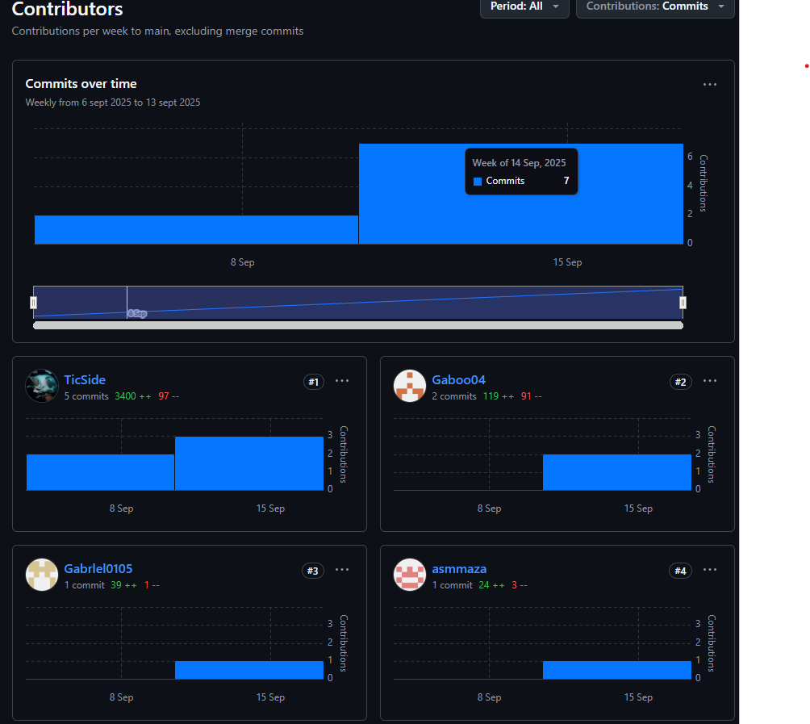

#### TP::
Para la entrega del trabajo parcial, se corrigieron los puntos observados según la retroalimentación recibida. Además, se añadió el Sprint 2.
![evidencitp.jpeg]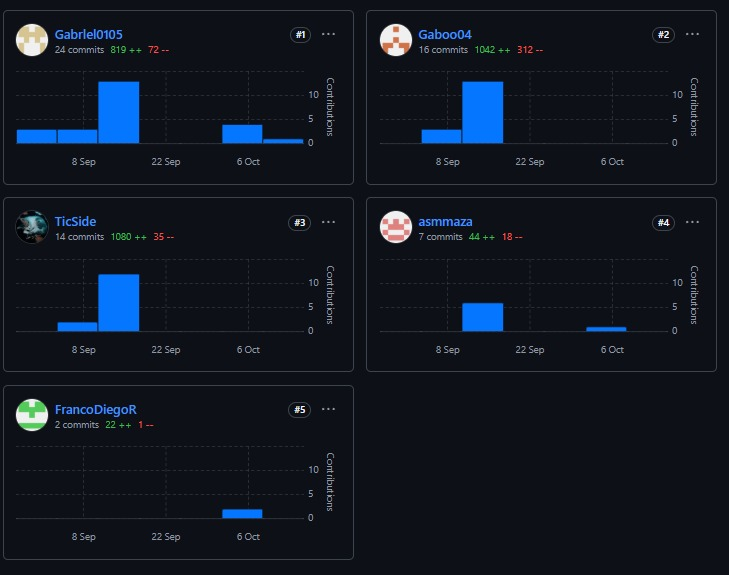(../assets/evidencitp.jpeg)


# Contenido

## Tabla de Contenidos

### [Registro de versiones del informe](#registro-de-versiones-del-informe)

### [Project Report Collaboration Insights](#project-report-collaboration-insights)

### [Contenido](#contenido)

### [Student Outcome](#student-outcome-1)

### [Capítulo I: Introducción](#capc3adtulo-i-introduccic3b3n-1)

- [1.1. Startup Profile](#11-startup-profile)
    - [1.1.1. Descripción de la Startup](#111-description-de-la-startup)
    - [1.1.2. Perfiles de integrantes del equipo](#112-perfiles-de-integrantes-del-equipo)
- [1.2. Solution Profile](#12-solution-profile)
    - [1.2.1 Antecedentes y problemática](#121-antecedentes-y-problemática)
    - [1.2.2 Lean UX Process](#122-lean-ux-process)
        - [1.2.2.1. Lean UX Problem Statements](#1221-lean-ux-problem-statements)
        - [1.2.2.2. Lean UX Assumptions](#1222-lean-ux-assumptions)
        - [1.2.2.3. Lean UX Hypothesis Statements](#1223-lean-ux-hypothesis-statements)
        - [1.2.2.4. Lean UX Canvas](#1224-lean-ux-canvas)
- [1.3. Segmentos objetivo](#13-segmentos-objetivo)

### [Capítulo II: Requirements Elicitation & Analysis](#capc3adtulo-ii-requirements-elicitation--analysis-1)

- [2.1. Competidores](#21-competidores)
    - [2.1.1. Análisis competitivo](#211-análisis-competitivo)
    - [2.1.2. Estrategias y tácticas frente a competidores](#212-estrategias-y-tácticas-frente-a-competidores)
- [2.2. Entrevistas](#22-entrevistas)
    - [2.2.1. Diseño de entrevistas](#221-diseño-de-entrevistas)
    - [2.2.2. Registro de entrevistas](#222-registro-de-entrevistas)
    - [2.2.3. Análisis de entrevistas](#223-análisis-de-entrevistas)
- [2.3. Needfinding](#23-needfinding)
    - [2.3.1. User Personas](#231-user-personas)
    - [2.3.2. User Task Matrix](#232-user-task-matrix)
    - [2.3.3. User Journey Mapping](#233-user-journey-mapping)
    - [2.3.4. Empathy Mapping](#234-empathy-mapping)
    - [2.3.5. As-is Scenario Mapping](#235-as-is-scenario-mapping)
    - [2.4. Ubiquitous Language](#24-Ubiquitous-language)

### [Capítulo III: Requirements Specification](#capc3adtulo-iii-requirements-specification-1)

- [3.1. To-Be Scenario Mapping](#31-to-be-scenario-mapping)
- [3.2. User Stories](#32-user-stories)
- [3.3. Impact Mapping](#33-impact-mapping)
- [3.4. Product Backlog](#34-product-backlog)

### [Capítulo IV: Product Design](#capc3adtulo-iv-product-design-1)

- [4.1. Style Guidelines](#41-style-guidelines)
    - [4.1.1. General Style Guidelines](#411-general-style-guidelines)
    - [4.1.2. Web Style Guidelines](#412-web-style-guidelines)
- [4.2. Information Architecture](#42-information-architecture)
    - [4.2.1. Organization Systems](#421-organization-systems)
    - [4.2.2. Labeling Systems](#422-labeling-systems)
    - [4.2.3. SEO Tags and Meta Tags](#423-seo-tags-and-meta-tags)
    - [4.2.4. Searching Systems](#424-searching-systems)
    - [4.2.5. Navigation Systems](#425-navigation-systems)
- [4.3. Landing Page UI Design](#43-landing-page-ui-design)
    - [4.3.1. Landing Page Wireframe](#431-landing-page-wireframe)
    - [4.3.2. Landing Page Mock-up](#432-landing-page-mock-up)
- [4.4. Web Applications UX/UI Design](#44-web-applications-uxui-design)
    - [4.4.1. Web Applications Wireframes](#441-web-applications-wireframes)
    - [4.4.2. Web Applications Wireflow Diagrams](#442-web-applications-wireflow-diagrams)
    - [4.4.3. Web Applications Mock-ups](#443-web-applications-mock-ups)
    - [4.4.4. Web Applications User Flow Diagrams](#444-web-applications-user-flow-diagrams)
- [4.5. Web Applications Prototyping](#45-web-applications-prototyping)
- [4.6. Domain-Driven Software Architecture](#46-domain-driven-software-architecture)
    - [4.6.1. Software Architecture Context Diagram](#461-software-architecture-context-diagram)
    - [4.6.2. Software Architecture Container Diagrams](#462-software-architecture-container-diagrams)
    - [4.6.3. Software Architecture Components Diagrams](#463-software-architecture-components-diagrams)
- [4.7. Software Object-Oriented Design](#47-software-object-oriented-design)
    - [4.7.1. Class Diagrams](#471-class-diagrams)
    - [4.7.2. Class Dictionary](#472-class-dictionary)
- [4.8. Database Design](#48-database-design)
    - [4.8.1. Database Diagram](#481-database-diagram)

### [Capítulo V: Product Implementation, Validation & Deployment](#capc3adtulo-v-product-implementation-validation--deployment-1)

- [5.1. Software Configuration Management.](#51-software-configuration-management)
    - [5.1.1. Software Development Environment Configuration.](#511-software-development-environment-configuration)
    - [5.1.2. Source Code Management.](#512-source-code-management)
    - [5.1.3. Source Code Style Guide \& Conventions.](#513-source-code-style-guide--conventions)
    - [5.1.4. Software Deployment Configuration.](#514-software-deployment-configuration)
- [5.2. Landing Page, Services \& Applications Implementation.](#52-landing-page-services--applications-implementation)
    - [5.2.1. Sprint 1](#521-sprint-1)
    - [5.2.1.1. Sprint Planning 1.](#5211-sprint-planning-1)
    - [5.2.1.2. Aspect Leaders and Collaborators.](#5212-aspect-leaders-and-collaborators)
    - [5.2.1.3. Sprint Backlog 1.](#5213-sprint-backlog-1)
    - [5.2.1.4. Development Evidence for Sprint Review.](#5214-development-evidence-for-sprint-review)
    - [5.2.1.5. Execution Evidence for Sprint Review.](#5215-execution-evidence-for-sprint-review)
    - [5.2.1.6. Services Documentation Evidence for Sprint Review.](#5216-services-documentation-evidence-for-sprint-review)
    - [5.2.1.7. Software Deployment Evidence for Sprint Review.](#5217-software-deployment-evidence-for-sprint-review)
    - [5.2.1.8. Team Collaboration Insights during Sprint.](#5218-team-collaboration-insights-during-sprint)

# Student Outcome

**ABET – EAC - Student Outcome 5**  
*Criterio: La capacidad de funcionar efectivamente en un equipo cuyos miembros juntos proporcionan liderazgo, crean un
entorno de colaboración e inclusivo, establecen objetivos, planifican tareas y cumplen objetivos.*

| Criterio específico | Acciones realizadas | Conclusiones |
|---------------------|---------------------|---------------|
| **Comunica oralmente con efectividad a diferentes rangos de audiencia.** | **TB1 <br> Gabriel Braithwaite:** Lideró la comunicación inicial para el planeamiento estratégico del proyecto, alineando al equipo en los objetivos.<br>Validó la propuesta de valor del proyecto mediante una entrevista oral estructurada con un usuario clave del segmento objetivo.<br><br>**TP1:** Articuló verbalmente las complejidades del *bounded context* asignado, explicando con claridad las relaciones entre dominios para asegurar una comprensión integral y compartida dentro del equipo.<br><br>**TB1 <br> Gabriel Mamani:** Comunicó eficazmente su progreso y organizó su tiempo para cumplir con las responsabilidades asignadas, tanto en las historias de usuario como en el capítulo de diagramas C4, garantizando la sincronización con el equipo.<br><br>**TP1:** Expuso sus ideas con precisión durante la definición de un segmento del *bounded context*, facilitando la integración conceptual y la cohesión técnica del sistema.<br><br>**TB1 <br> Omar Rivera:** Coordinó y lideró oralmente la conceptualización del diseño de la *landing page*, asegurando que la propuesta visual reflejara los objetivos estratégicos del proyecto.<br>Transmitió de forma clara los lineamientos de la guía de estilos, permitiendo al equipo aplicarlos consistentemente en los *mockups* y *wireframes*.<br><br>**TP1:** Presentó verbalmente las relaciones clave de su dominio asignado en el *bounded context*, manteniendo la coherencia entre los distintos módulos del proyecto.<br><br>**TB1 <br> Franco Rioja:** Mantuvo una comunicación constante y proactiva con el equipo, funcionando como un nexo para asegurar el avance mutuo y la alineación continua en todas las tareas.<br><br>**TP1:** Comunicó verbalmente los alcances y limitaciones de su sección del *bounded context*, apoyando activamente la sincronización del equipo en la comprensión del dominio general.<br><br>**TB1 <br> Augusto Montes:** Dirigió entrevistas estratégicas con segmentos objetivos, estableciendo un diálogo claro y conciso para obtener *insights* valiosos sobre las necesidades del usuario, información que fue crucial para la definición de los requisitos del proyecto.<br><br>**TP1:** Presentó sus aportes de manera oral durante la definición de su componente del *bounded context*, garantizando la alineación de su trabajo con la arquitectura global y los objetivos del equipo. | **TB1:** La comunicación oral fue un pilar fundamental para el equipo, permitiendo una alineación estratégica y una ejecución cohesionada. A través de discusiones lideradas, entrevistas a usuarios y presentaciones técnicas, se logró un entendimiento profundo y compartido de los objetivos, requisitos y diseño del proyecto. La constante interacción verbal entre los miembros no solo facilitó la planificación y la resolución de problemas en tiempo real, sino que también fortaleció la sinergia del equipo, asegurando que el avance fuera colaborativo y que todos los integrantes estuvieran sincronizados en cada fase del desarrollo. |
| **Comunica por escrito con efectividad a diferentes rangos de audiencia.** | **TB1 <br> Gabriel Braithwaite:** Plasmó por escrito propuestas detalladas sobre puntos clave del proyecto, compartiéndolas con el equipo para su revisión y aprobación.<br>Documentó sistemáticamente sus contribuciones en el repositorio del reporte, asegurando la trazabilidad y el registro histórico del trabajo.<br><br>**TP1:** Elaboró una sección detallada del *bounded context*, describiendo con alta claridad y precisión las entidades y relaciones lógicas, dejando constancia formal en la documentación del proyecto.<br><br>**TB1 <br> Gabriel Mamani:** Lideró la documentación del proceso de *event storming*, traduciendo la sesión colaborativa en un artefacto escrito que sirvió como base para la definición de los requisitos y funcionalidades clave de la aplicación.<br><br>**TP1:** Detalló por escrito la lógica de negocio y los límites funcionales de su componente en el *bounded context*, creando una documentación esencial para la comprensión técnica del dominio por parte de otros miembros.<br><br>**TB1 <br> Omar Rivera:** Documentó y centralizó en el repositorio del proyecto las guías de estilo y la propuesta de diseño, creando una fuente única de verdad para facilitar su consulta y aplicación por parte del equipo.<br>Creó y registró formalmente los *mockups* y *wireframes* de la *landing page* y las aplicaciones web, comunicando de manera visual y escrita las decisiones fundamentales de la interfaz de usuario.<br><br>**TP1:** Redactó la descripción de su módulo dentro del *bounded context*, especificando sus responsabilidades y garantizando una documentación coherente e integrada con el resto del sistema.<br><br>**TB1 <br> Franco Rioja:** Sintetizó los hallazgos de las entrevistas en los artefactos escritos de *user persona*, documentó extensamente los apartados de *needfinding* y modeló el diagrama de clases, aportando claridad tanto al perfil del usuario como a la estructura técnica inicial.<br><br>**TP1:** Contribuyó a la documentación del *bounded context* detallando por escrito las entidades y relaciones principales del dominio que le fue asignado.<br><br>**TB1 <br> Augusto Montes:** Definió y documentó formalmente los segmentos objetivos finales del proyecto.<br>Redactó resúmenes ejecutivos del progreso del equipo al final de cada *sprint*, proporcionando una comunicación escrita, clara y concisa sobre los logros y avances.<br><br>**TP1:** Documentó su porción del *bounded context*, expresando de forma precisa en texto los límites, responsabilidades y objetivos de su componente dentro del modelo general del sistema. | **TB1:** La comunicación escrita fue crucial para formalizar el conocimiento y garantizar la consistencia a lo largo del proyecto. El equipo demostró una gran disciplina en la documentación de cada artefacto clave, desde los requisitos iniciales (*event storming*, *user personas*) hasta las especificaciones de diseño (*guías de estilo*, *mockups*) y la arquitectura del sistema (*bounded context*, diagramas de clases). Este enfoque no solo creó un registro auditable y detallado del trabajo realizado, sino que también minimizó ambigüedades, facilitó la integración de los componentes y aseguró que todos los miembros compartieran una comprensión precisa y unificada de la solución a desarrollar. |

# Capítulo I: Introducción

## 1.1. Startup Profile

A continuación, se presenta información sobre a qué se dedica nuestra startup, Prodevs.

### 1.1.1. Descripción de la Startup

**Prodevs** es una startup tecnológica orientada a la creación de soluciones digitales que fortalecen la participación ciudadana y promueven la transparencia en la gestión pública. Nuestro objetivo general es cerrar la brecha entre los ciudadanos y las autoridades, utilizando la tecnología como un puente que facilite la comunicación, aumente la confianza y mejore la capacidad de respuesta de los gobiernos locales. Nos dedicamos a diseñar plataformas seguras, intuitivas y escalables que conviertan la voz ciudadana en datos accionables para la toma de decisiones.

Nuestra principal propuesta es **DenunciaYa**, una aplicación que permite a los ciudadanos reportar de manera rápida y segura problemas cotidianos como baches, basura, fugas de agua, corrupción o deficiencias en los servicios públicos. El propósito de la aplicación es simplificar el proceso de denuncia, garantizando anonimato opcional, seguimiento en tiempo real y notificaciones inmediatas sobre el estado de los reportes. Al mismo tiempo, ofrece a las autoridades un sistema integral de gestión con paneles de control, herramientas de análisis y métricas de eficiencia, contribuyendo a mejorar la calidad de los servicios municipales y gubernamentales.

**Misión:** Empoderar a los ciudadanos a través de la tecnología, brindándoles una herramienta confiable y accesible para denunciar problemas que afectan su entorno, mientras ayudamos a las autoridades a gestionar de manera más transparente, eficiente y responsable los recursos y soluciones públicas.

**Visión:** Convertirnos en la plataforma líder en Latinoamérica para denuncias ciudadanas y gestión de problemáticas urbanas, construyendo ciudades más transparentes, seguras y participativas, donde cada reporte ciudadano se traduzca en acción concreta y mejora de la calidad de vida.

**Alcance del proyecto:** Contempla en su fase inicial la implementación de la aplicación en municipios medianos y grandes, ofreciendo planes de suscripción adaptados a las capacidades de cada administración. A corto plazo, se busca consolidar la solución como un estándar en la gestión de denuncias urbanas; a mediano plazo, expandirse hacia distintas ciudades de la región, integrando la plataforma con sistemas existentes y canales de comunicación como WhatsApp; y a largo plazo, posicionarse como un ecosistema integral de gobernanza digital que promueva la participación activa de los ciudadanos y la modernización de los servicios públicos.

### 1.1.2. Perfiles de integrantes del equipo

| Foto                                                     |        Apellidos y Nombres        | Código de Alumno | Carrera                | Habilidades                                                                                                                                                                                                                                                                                                                                                                                                                                                             |
|----------------------------------------------------------|:---------------------------------:|:----------------:|------------------------|-------------------------------------------------------------------------------------------------------------------------------------------------------------------------------------------------------------------------------------------------------------------------------------------------------------------------------------------------------------------------------------------------------------------------------------------------------------------------|
|         |   Mamani Marca, Gabriel Cristian  | u202220659       | Ingenieria de software | Soy estudiante de sexto ciclo de la carrera de Ingeniería de Software.Durante el camino aprendi lenguajes como c++,python y java.Tambien,sobre motores de base de datos como MongoDb y MYSQL                                                                                                                                                                                                                                                                            |
|                 |   Omar Harold Rivera Ticllacuri   | u202214214       | Ingenieria de software | Soy estudiante de Ingeniería de Software, tengo 20 años y actualmente me encuentro en el sexto ciclo de mi carrera. Soy una persona con la cual tengo la disciplina y responsable para desarrollar proyectos de software y software de entretenimiento. Cuento con experiencia sobre el desarrollo de software de entretenimiento. Por ende, apoyaré al grupo en todo lo posible para poder desarrollar adecuadamente el trabajo y la propuesta que se nos asignó.	     |
|                                                          |      Franco Diego Rioja Nuñez     | u202221597       |    Ingenieria de software                    | Soy estudiante de Ingeniería de Software, tengo 20 años y actualmente curso el séptimo ciclo de la carrera. Me considero una persona proactiva y comprometida en el desarrollo de proyectos, además de ser colaborativa y atenta a las necesidades y problemas de mis compañeros de equipo. En paralelo, me encuentro llevando cursos de especialización en Análisis de Datos, con el objetivo de ampliar mis conocimientos y fortalecer mis competencias profesionales.                                                                                                                                                                                                                                                                                                                                                                                                                                   |
|  | Gabriel Anthony Brabuaite Toledo  | U20201e889       | Ingeniería de software | Soy estudiante de Ingeniería de Software. Tengo conocimientos en desarrollo web y móvil, así como en bases de datos y metodologías ágiles. Me considero una persona proactiva, responsable y con habilidades para trabajar en equipo. Estoy comprometido con la calidad del software y siempre busco aprender y mejorar mis habilidades técnicas y blandas. Estoy emocionado por contribuir al éxito de nuestro proyecto y aportar soluciones innovadoras.              |
|   |   Augusto Sebastian Montes Maza   | u202218645       | Ingenieria de software | Soy estudiante de Ingeniería de Software en sexto ciclo. Tengo una sólida formación en programación, análisis y diseño de sistemas, así como experiencia académica en el desarrollo de aplicaciones web y móviles, bases de datos y metodologías ágiles. Me destaco por mi capacidad de trabajo en equipo, pensamiento crítico y compromiso con la calidad del software, y busco aplicar mis habilidades para aportar soluciones innovadoras en proyectos tecnológicos. |

### 1.2. Solution Profile
**Product Name:** DenunciaYa

**Product Description:** DenunciaYa es una plataforma web y móvil que permite a los ciudadanos reportar problemas urbanos y actos de corrupción de forma rápida, segura y anónima. A través de fotos, videos y audios, los usuarios pueden denunciar incidencias como baches, fallas en el alumbrado público, acumulación de basura, fugas de agua y más. La aplicación envía los reportes a un sistema centralizado para que las autoridades municipales gestionen las incidencias en tiempo real. Además, ofrece notificaciones de seguimiento, paneles de control para gobiernos y herramientas de análisis que ayudan a mejorar la eficiencia y la transparencia en la gestión pública.

**Monetización:** El modelo de negocio está basado en suscripciones para gobiernos locales y entidades públicas, con distintos niveles de servicio:

* Plan Básico: recepción de denuncias y panel básico de gestión de tickets.
* Plan Premium: incluye analítica avanzada, dashboards, API para integraciones y soporte técnico prioritario.

### 1.2.1 Antecedentes y problemática

**Técnica de The 5 'W's y 2 'H's**

**What (Qué)?** <br>
¿Cuál es el problema?

En muchas ciudades de Latinoamérica, los ciudadanos enfrentan problemas cotidianos como baches, acumulación de basura, fugas de agua, fallas en el alumbrado público y actos de corrupción. Sin embargo, la mayoría de estos problemas no se denuncian debido a tres barreras principales:
- **Desconfianza**: Creen que reportar no servirá de nada.
- **Miedo**: Temen represalias si revelan su identidad.
- **Fricción**: Los procesos tradicionales (ir a oficinas, llenar formularios, esperar semanas) son lentos y poco accesibles.

Esto genera impunidad, baja calidad de vida y descontento ciudadano, mientras que las autoridades carecen de datos confiables y en tiempo real para gestionar los problemas urbanos de manera eficiente.


**When (Cuándo)?** <br>
¿Cuándo sucede el problema?

El problema ocurre a diario y de forma constante, ya que los desperfectos en la infraestructura urbana, la corrupción y las fallas en servicios públicos afectan a los ciudadanos en tiempo real. La falta de un canal accesible para reportar y dar seguimiento provoca que estas incidencias se acumulen, incrementando costos para los gobiernos y empeorando la percepción ciudadana de sus autoridades.


**Where (Dónde)?** <br>
¿Dónde surge el problema?

El problema surge principalmente en entornos urbanos de Latinoamérica, donde las ciudades crecen rápidamente pero los gobiernos locales no cuentan con plataformas modernas de gestión ciudadana. También se intensifica en comunidades donde existe desigualdad en el acceso a servicios digitales o falta de transparencia en la administración pública.


**Who (Quién)?** <br>
¿Quiénes son los afectados?

- **Ciudadanos**: Que viven con problemas no resueltos en su entorno inmediato.
- **Autoridades municipales y gubernamentales**: Que carecen de herramientas de gestión modernas y datos centralizados.
- **Comunidades enteras**: Que sufren deterioro en la calidad de vida y pérdida de confianza en las instituciones públicas.


**Why (Por qué)?** <br>
¿Cuál es la causa del problema?

- **Procesos de denuncia obsoletos**: Dependientes de oficinas físicas y trámites burocráticos.
- **Falta de transparencia**: Los ciudadanos rara vez reciben seguimiento sobre sus reportes.
- **Temor a represalias**: Muchos ciudadanos prefieren callar antes que exponerse.
- **Ausencia de datos estructurados**: Las autoridades no cuentan con métricas en tiempo real que les permitan priorizar y resolver de manera eficiente.
- **Escasa digitalización**: Muchos gobiernos locales aún no incorporan tecnologías de participación ciudadana.


**How (Cómo)?** <br>
¿Cómo se utilizará el producto?

DenunciaYa se utilizará como una plataforma integral accesible desde dispositivos móviles y web:

- **Para ciudadanos**:
    - Suben fotos, videos o audios de los problemas.
    - Pueden elegir entre anonimato total o parcial.
    - Obtienen un código de seguimiento y reciben notificaciones en tiempo real sobre el estado de su denuncia.

- **Para autoridades**:
    - Acceden a un panel de control centralizado para gestionar denuncias según ubicación, categoría, urgencia y estado.
    - Usan un sistema de ticketing para derivar reportes a las áreas correspondientes.
    - Visualizan dashboards y reportes automáticos para medir eficiencia y detectar patrones.
    - Se comunican de manera segura con los denunciantes sin exponer su identidad.


**How Much (Cuánto)?** <br>
¿Cuánto costará implementar la solución?

El modelo de negocio está basado en suscripciones para gobiernos locales y dependencias públicas, adaptadas a distintos niveles de gestión:

- **Plan Básico**: Recepción de denuncias y panel básico de asignación de tickets.
- **Plan Premium**: Incluye analytics, la API para integrarse con sus sistemas y soporte técnico prioritario.

La app será gratuita para los ciudadanos, con el objetivo de fomentar la participación masiva y la transparencia. La inversión inicial contempla el desarrollo de software, infraestructura en la nube, ciberseguridad y campañas de adopción ciudadana en municipios piloto.

### 1.2.2 Lean UX Process.

En esta sección, se presenta el proceso de Lean UX que se ha seguido para el desarrollo de la plataforma DenunciaYa. Este proceso incluye la creación de un Lean UX Problem Statement, Assumptions, Hypothesis Statements y un Lean UX Canvas.
El objetivo es definir claramente el problema que se busca resolver, las suposiciones que se tienen sobre los usuarios y el producto, así como las hipótesis que guiarán el desarrollo del mismo.

### 1.2.2.1. Lean UX Problem Statements.

Actualmente los ciudadanos enfrentan serias dificultades para denunciar problemas en sus comunidades, como baches, fallas en el alumbrado público, acumulación de basura, fugas de agua o incluso actos de corrupción. Los procesos tradicionales para reportar estas incidencias son lentos, burocráticos y poco accesibles, lo que genera desconfianza, miedo a represalias y una gran fricción para el ciudadano común. Como resultado, muchos problemas no se reportan ni se resuelven, lo que deteriora la calidad de vida, aumenta los costos de gestión y reduce la confianza en las instituciones públicas.

El desafío radica en que las soluciones actuales no ofrecen un canal unificado, seguro y accesible que permita a los ciudadanos denunciar de manera anónima, mientras que las autoridades carecen de datos en tiempo real para gestionar y priorizar los problemas urbanos de manera eficiente.

¿Cómo podemos construir una plataforma digital que permita a los ciudadanos reportar incidencias de forma rápida, anónima y confiable, y al mismo tiempo provea a las autoridades una herramienta moderna de gestión y análisis en tiempo real que aumente la transparencia y mejore la calidad de vida en las comunidades?

### 1.2.2.2. Lean UX Assumptions.

<ins>**Users Assumptions:**</ins>

1. **Creo que mis clientes necesitan** una herramienta fácil de usar para reportar problemas urbanos y actos de corrupción de forma rápida, segura y anónima, eliminando la fricción y la desconfianza de los procesos tradicionales.

2. **Estas necesidades se pueden resolver con** una aplicación web y móvil como DenunciaYa, que centraliza los reportes ciudadanos, permite el anonimato y brinda seguimiento en tiempo real a través de notificaciones.

3. **Mis clientes iniciales son** ciudadanos urbanos de Latinoamérica, especialmente jóvenes y adultos con acceso a smartphones, que enfrentan problemas en su entorno inmediato y desean denunciarlos de manera sencilla.

4. **El valor #1 que un cliente quiere de mi servicio es** la posibilidad de denunciar sin miedo ni burocracia, con la seguridad de que su reporte llegará a las autoridades y tendrá seguimiento.

5. **El cliente también puede obtener estos beneficios adicionales,** como recibir un código de seguimiento único, acceder a un historial de sus denuncias, contribuir a la transparencia en la gestión pública y mejorar la calidad de vida de su comunidad.

6. **Voy a adquirir la mayoría de mis clientes a través de estrategias de** campañas digitales en redes sociales, programas de concientización ciudadana y convenios con gobiernos locales como municipios piloto.

7. **Haré dinero a través de** un modelo de suscripción mensual o anual para gobiernos locales y entidades públicas, con diferentes niveles de servicio (básico y premium), mientras que la aplicación será gratuita para los ciudadanos.

8. **Mi competencia principal en el mercado serán** las plataformas municipales propias y otras aplicaciones de gestión ciudadana que suelen ser poco intuitivas, limitadas o con baja adopción.

9. **Los venceremos debido a** que ofrecemos una plataforma accesible, moderna y confiable, con énfasis en la facilidad de uso, la seguridad de datos y el anonimato del denunciante, lo que genera mayor confianza ciudadana.

10. **Mi mayor riesgo de producto es** que los ciudadanos no confíen en la plataforma, ya sea porque temen represalias, creen que su denuncia no será atendida o dudan de la transparencia de la gestión.

11. **Resolveremos esto a través de** un sistema de anonimato garantizado, un canal de seguimiento transparente con notificaciones en tiempo real, campañas educativas sobre la seguridad de la plataforma y convenios con autoridades que validen su uso.

12. **¿Qué otras suposiciones tenemos? ¿Eso, si se prueba que es falso, causará que nuestro negocio/proyecto no funcione?**

- Los ciudadanos están dispuestos a usar la aplicacion web para denunciar en lugar de métodos tradicionales.
- Las autoridades asignarán presupuesto y recursos para gestionar las denuncias en tiempo real.
- Los usuarios confiarán en que el anonimato está protegido y que no habrá represalias.
- Si alguna de estas suposiciones resulta falsa, el proyecto puede no generar adopción ni sostenibilidad.

**¿Quién es el usuario?**<br>

Vendrian a ser los ciudadanos urbanos que enfrentan problemas cotidianos en infraestructura y servicios públicos, así como los funcionarios municipales encargados de recibir, clasificar y atender las denuncias.

**¿Dónde encaja nuestro producto en su vida/trabajo?**<br>

Para los ciudadanos, el producto encaja en su vida diaria cuando necesitan reportar incidencias en tiempo real de forma sencilla. Para las autoridades, encaja en su trabajo cotidiano al centralizar reportes y permitir una gestión más ágil y transparente.

**¿Qué problemas tiene nuestro producto y cómo se pueden resolver?**<br>

El producto enfrenta problemas como la desconfianza en la gestión de denuncias, lo cual se puede resolver garantizando transparencia y brindando feedback en tiempo real. También sufre de baja adopción ciudadana, que puede superarse mediante un proceso de onboarding simple y campañas educativas. Además, existe resistencia institucional, que puede resolverse incentivando con dashboards de eficiencia y métricas claras de impacto social.

**¿¿Cuándo y cómo se usa el producto?**<br>

El ciudadano utiliza el producto en el momento en que observa un problema en la vía pública o un acto de corrupción, subiendo evidencia en forma de fotos, videos o audios desde su celular. El funcionario municipal lo utiliza de manera diaria para gestionar incidencias en un panel centralizado, asignarlas a las áreas responsables y darles seguimiento.

**¿Qué características son importantes?**<br>

Las características más importantes del producto son la posibilidad de realizar reportes rápidos con fotos, videos y audios, la opción de denuncia anónima o con identidad parcial, el uso de un código único con seguimiento en tiempo real, la existencia de un panel de control para autoridades con dashboards y analítica, la incorporación de un sistema de ticketing para priorizar incidencias y la seguridad y privacidad de los datos.

**¿Cómo debe verse nuestro producto y cómo debe comportarse?**<br>

Para los ciudadanos, el producto debe verse como una interfaz simple, limpia e intuitiva, con pasos mínimos para enviar una denuncia. Para las autoridades, debe presentarse como un panel profesional y moderno con visualizaciones claras de incidencias y métricas. El producto debe comportarse de manera estable, responsiva y rápida, ofreciendo notificaciones en tiempo real y un acceso fluido desde dispositivos móviles y web.

<ins>**Business Outcomes:**</ins>

1. Al desarrollar DenunciaYa, creemos que se generará una mayor confianza ciudadana en las autoridades gracias a un canal moderno, seguro y transparente.### 1.2.2.3. Lean UX Hypothesis Statements.
2. Generación de ingresos recurrentes mediante el modelo de suscripción a gobiernos locales.
3. Incremento de la eficiencia en la gestión municipal al centralizar reportes en tiempo real.
4. Posicionamiento como una plataforma líder en participación ciudadana y gobierno digital en Latinoamérica.

<ins>**User Outcomes:**</ins>

1. Los ciudadanos podrán denunciar sin miedo, de forma rápida y anónima.
2. Obtendrán visibilidad y seguimiento en tiempo real de sus reportes.
3. Las autoridades mejorarán su capacidad de respuesta y priorización de problemas urbanos.
4. La comunidad en general se beneficia de una mejor calidad de vida gracias a la resolución más rápida de incidencias.

<ins>**Features:**</ins>

- Envío de denuncias con foto, video y audio.
- Opción de denuncia anónima.
- Código de seguimiento y notificaciones en tiempo real.
- Panel de gestión centralizado para autoridades.
- Dashboards con métricas e indicadores de eficiencia.
- Historial de denuncias y estados.
- Sistema de ticketing para derivar incidencias.
- Gestión de suscripciones y planes para gobiernos.

### 1.2.2.4. Lean UX Canvas.

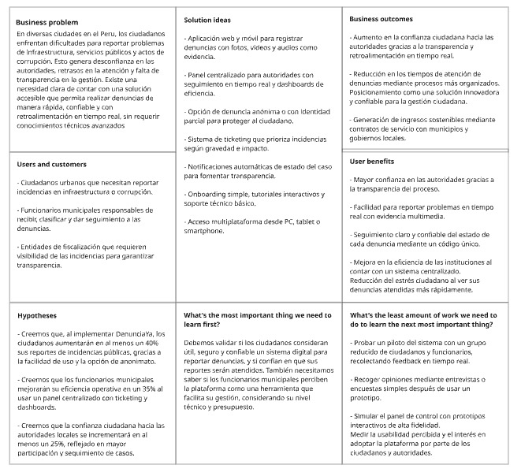

## 1.3. Segmentos objetivo.

1. Ciudadanos Urbanos Digitalmente Activos:
- Descripción: Este segmento incluye a personas cívicamente conscientes que residen en zonas urbanas, usan smartphones de forma habitual y desean un canal efectivo para reportar problemas que afectan a su comunidad.
Sexo: Masculino y femenino
- Edades: Adultos jóvenes (18-34 años), adultos de mediana edad (35-54 años) y adultos mayores (55+)
- Nivel socioeconómico: Clases B y C (Media-alta y media)
- Necesidades por satisfacer: La plataforma permite a estos usuarios superar la frustración y la desconfianza hacia las instituciones, ofreciendo un canal directo, rápido y seguro para ser escuchados. Satisface la necesidad de anonimato para evitar represalias, ahorra tiempo al eliminar procesos burocráticos y brinda certeza mediante notificaciones de seguimiento, empoderando al ciudadano para que participe activamente en la mejora de su entorno.
2. Entidades Gubernamentales y Autoridades Municipales:
- Descripción: El siguiente segmento incluye a las administraciones públicas y los funcionarios responsables de la gestión de servicios urbanos, obras públicas y participación ciudadana que buscan modernizar sus procesos y mejorar su capacidad de respuesta.
- Sexo: Masculino y Femenino
- Edades: Adultos jóvenes (18-34 años), Adultos de mediana edad (35 - 54) y adultos mayores (55+)
- Nivel socioeconómico: Clases B y C (Media-alta y media)
- Necesidades por satisfacer: Apoyar con el manejo de datos centralizados que se generan al momento en que los ciudadanos reportan incidencias. La plataforma ordena y prioriza los problemas, permitiendo tomar decisiones basadas en evidencia y optimizar el uso de recursos limitados. Además, promueve la transparencia y acelera los procesos de gestión, mejorando la percepción pública y la eficiencia interna de la administración.

# Capítulo II: Requirements Elicitation & Analysis

## 2.1. Competidores.

En esta sección se presentará un análisis de los posibles competidores de DenunciaYa y de sus respectivas tácticas. Asimismo, se incluirá un análisis competitivo con una comparación de fortalezas y debilidades entre cada competidor

### 2.1.1. Análisis competitivo.

<table>
  <tr>
    <th colspan="22">Competitive Analysis Landscape</th>
  </tr>
  <tr>
    <td colspan="1">¿Por qué llevar a cabo el análisis?</td>
    <td colspan="17">Este análisis se lleva a cabo con la finalidad de conocer a los competidores actuales en el ámbito de denuncias ciudadanas en línea, y cómo la propuesta <b>DenunciaYa</b> se diferencia al enfocarse en usabilidad, transparencia y cobertura integral de problemas cotidianos.</td>
  </tr>
  <tr>
    <td colspan="2"></td>
    <td><br></td>
    <td><br></td>
    <td><br></td>
    <td><br></td>
</tr>
  <tr>
    <td rowspan="2">Perfil</td>
    <td>Overview</td>
    <td>La plataforma de la Contraloría General de la República ayuda a que los ciudadanos denuncien casos de corrupción en entidades públicas. Se centra exclusivamente en irregularidades administrativas y de gestión pública.</td>
    <td>El sistema del Ministerio Público ayuda a que los ciudadanos presenten denuncias relacionadas a delitos como robo, estafa, homicidio, violencia, entre otros. El proceso es formal y se conecta directamente con la Fiscalía.</td>
    <td>La Central Única de Denuncias 1818 recibe, canaliza y deriva denuncias de delitos graves como trata de personas, extorsión, violencia familiar, corrupción y crimen organizado. Disponible en línea y vía llamada gratuita 1818.</td>
    <td><b>DenunciaYa</b> es una aplicacion web  que permite a los ciudadanos reportar problemas urbanos (baches, basura, agua, alumbrado, inseguridad) y actos de corrupción de manera rápida, anónima y con evidencia multimedia. Incluye un panel de seguimiento en tiempo real y herramientas para gobiernos locales.</td>
</tr>
 <tr>
  <td>Ventaja competitiva ¿Qué valor ofrece a los clientes?</td>
  <td><b>Contraloría</b> ofrece una plataforma enfocada exclusivamente en la lucha contra la corrupción en el sector público. Brinda a los ciudadanos un canal oficial con respaldo institucional, lo que asegura fiscalización formal y procesos de control directo sobre entidades estatales.</td>
  <td><b>Ministerio Público</b> proporciona un sistema de denuncias en línea con acceso directo a la Fiscalía. Ofrece a los ciudadanos la formalidad y el peso legal necesarios para iniciar procesos penales, garantizando seriedad y validez jurídica en cada denuncia presentada.</td>
  <td><b>Central Única de Denuncias 1818</b> ayuda a los ciudadanos a presentar denuncias de delitos graves a través de múltiples canales (web, teléfono y móvil). Su disponibilidad 24/7, junto con la opción de confidencialidad o anonimato, ofrece confianza y accesibilidad a nivel nacional.</td>
  <td><b>DenunciaYa</b> ofrece una aplicación web innovadora y fácil de usar para reportar problemas urbanos y corrupción. Brinda anonimato configurable, posibilidad de adjuntar evidencias multimedia y seguimiento en tiempo real. Además, proporciona paneles de transparencia y estadísticas para ciudadanos y gobiernos locales, fortaleciendo la participación ciudadana y la confianza pública.</td>
</tr>

<tr>
    <td rowspan="2">Perfil de Marketing</td>
    <td>Mercado Objetivo</td>
    <td>Ciudadanos que identifican actos de corrupción en entidades del Estado.</td>
    <td>Víctimas y testigos de delitos comunes y graves que buscan iniciar un proceso legal.</td>
    <td>Población en riesgo o testigos de delitos graves (corrupción, extorsión, trata de personas, violencia familiar).</td>
    <td>Ciudadanos en general y municipalidades que necesitan resolver problemas urbanos de forma rápida, transparente y eficiente. Está orientado a problemas cotidianos que impactan en la calidad de vida.</td>
  </tr>
  <tr>
  <td>Estrategias de Marketing</td>
    <td>Campañas de concientización anticorrupción, presencia institucional en medios y redes sociales.</td>
    <td>Campañas educativas sobre acceso a la justicia, difusión en medios y redes institucionales.</td>
    <td>Campañas masivas en radio, TV y redes sociales para fomentar el uso del número 1818 y la web.</td>
    <td>Campañas digitales en redes sociales, alianzas con municipalidades, gamificación de la denuncia ciudadana, incentivos a la participación y transparencia mediante reportes públicos.</td>
    </tr>
<tr>
    <td rowspan="3">Perfil de Producto</td>
    <td>Productos y Servicios</td>
    <td>Plataforma de denuncias en línea para corrupción administrativa. Genera alertas internas de fiscalización.</td>
    <td>Denuncia formal en línea con constancia digital que inicia el proceso legal ante el Ministerio Público.</td>
    <td>Plataforma web y línea 1818 para recibir denuncias de delitos graves. Incluye derivación y orientación legal.</td>
    <td>Plataforma web con registro multimedia (foto, video, audio), seguimiento en tiempo real, panel de gestión para municipios y tablero ciudadano de transparencia.</td>
  </tr>
  <tr>
  <td>Precios y Costos</td>
    <td>Servicio gratuito financiado por el Estado.</td>
    <td>Servicio gratuito financiado por el Estado.</td>
    <td>Servicio gratuito financiado por el Estado.</td>
    <td>Modelo SaaS dirigido a municipalidades y gratuito para los ciudadanos. También se ofrecen planes premium con análisis de datos avanzados.</td>
    </tr>
<td>Canales de distribución (Web y/o Móvil)</td>
    <td>Plataforma web oficial.</td>
    <td>Plataforma web oficial.</td>
    <td>Plataforma web, línea 1818 y aplicación móvil en algunos casos.</td>
    <td>Plataforma web y aplicación móvil para Android y IOS. Difusión directa en redes sociales y municipalidades.</td>
<tr>
    <td rowspan="4">Análisis SWOT</td>
    <td>Fortalezas</td>
    <td>Respaldo institucional de la Contraloría y enfoque en corrupción.</td>
    <td>Poder legal y formalidad en la denuncia, conexión directa con fiscales.</td>
    <td>Cobertura amplia de delitos, atención continua, múltiples canales.</td>
    <td>Innovación tecnológica, interfaz amigable, transparencia, alcance a problemas cotidianos, seguimiento en tiempo real.</td>
  </tr>
  <tr>
  <td>Debilidades</td>
    <td>Limitado solo a corrupción pública.</td>
    <td>Burocracia en los procesos y tiempos de respuesta largos.</td>
    <td>Sobrecarga de denuncias y limitaciones en derivación.</td>
    <td>Requiere adopción municipal, campañas de confianza y posicionamiento en el mercado.</td>
    </tr>
  <tr>
<td>Oportunidades</td>
    <td>Ampliar alcance a corrupción privada y municipal.</td>
    <td>Mayor digitalización del sistema judicial y conexión con otras instituciones.</td>
    <td>Integración con más servicios y uso de inteligencia artificial para clasificar denuncias.</td>
    <td>Alianzas con gobiernos locales, integración con sistemas de smart cities, analítica avanzada y big data para mejorar gestión pública.</td>
</tr>
  <tr>
<td>Amenazas</td>
    <td>Desconfianza ciudadana hacia instituciones públicas.</td>
    <td>Competencia de plataformas privadas de denuncias.</td>
    <td>Desconfianza por falta de resultados rápidos.</td>
    <td>Competencia con instituciones ya consolidadas, resistencia de gobiernos locales a utilizar la aplicacion web.</td>
</tr>
</table>


### 2.1.2. Estrategias y tácticas frente a competidores.

Elaborar estrategias y tácticas sólidas para competir de manera efectiva exige un enfoque estructurado y bien planificado. A continuación, se detallan algunas posibles estrategias y tácticas diseñadas para fortalecer la posición competitiva de DenunciaYa frente a alternativas del mercado, tomando en cuenta sus fortalezas, debilidades, oportunidades y amenazas:

* Usabilidad y accesibilidad: Frente a la complejidad burocrática de los competidores, DenunciaYa implementará una interfaz simple, intuitiva y disponible en web y móvil, reduciendo barreras técnicas y mejorando la experiencia ciudadana.

* Anonimato y seguridad: Dado que la desconfianza de los ciudadanos hacia las instituciones públicas representa una amenaza, DenunciaYa ofrecerá denuncias anónimas, confidencialidad garantizada y cifrado de evidencias multimedia, fortaleciendo la confianza del usuario.

* Cobertura integral y seguimiento en tiempo real: Cobertura integral y seguimiento en tiempo real: A diferencia de plataformas que solo se enfocan en delitos graves o corrupción, DenunciaYa permitirá reportar también problemas urbanos cotidianos. Esto aprovechará la oportunidad de vincularse con gobiernos locales

## 2.2. Entrevistas.

### 2.2.1. Diseño de entrevistas.

#### Preguntas para el segmento objetivo "Ciudadanos"
- ¿Alguna vez has presenciado problemas en tu zona (como baches, basura, corrupción, accidentes de tránsito, entre otros)?
- ¿Encontraste alguna plataforma para presentar una queja o denuncia?
- ¿Tuviste alguna dificultad al hacer la denuncia? ¿Cómo lo hiciste?
- ¿Crees que existen causas que te desmotivan a presentar una denuncia ?
- ¿Cuánta confianza tienes en nuestras autoridades que atienden y resuelven las denuncias de los ciudadanos?
- ¿Qué tipo de anonimato te daría más confianza para denunciar (público, identificado solo para autoridades, completamente anónimo)?
- ¿Como te gustaría dar seguimiento a tu denuncia?(Aplicación Web,mensaje,correo o mediante llamada)
- ¿Si te llegaran notificaciones de denuncias hechas por otras personas que viven cerca del lugar donde vives?
- ¿Tuviste alguna experiencia de hacer una denuncia y nunca recibir la ayuda necesaria?
- Imagina una application web que te permita denunciar fácil y dar seguimiento en tiempo real. ¿Qué características te parecerían más útiles?
- ¿Qué sucesos te harían dejar de usar una aplicación web de denuncias (por ejemplo: procesos lentos, exceso de datos personales, poca respuesta de autoridades)?
#### Preguntas para el segmento objetivo  "Autoridades Municipales y Gubernamentales"

- ¿Por qué medio reciben las denuncias de ciudadanos actualmente?
- ¿Se te hace fácil o difícil dar seguimiento constante a las denuncias?
- ¿A qué problemas te enfrentas al gestionar las denuncias?
- ¿Cómo asignan las denuncias a cada departamento o funcionario responsable?
- ¿Tienen algún sistema o software que utilicen para gestionar denuncias?
- ¿Qué tan importante es para ustedes poder comunicarse con el denunciante para pedir más información, manteniendo su anonimato si lo solicita?
- Si tuvieran un dashboard centralizado, ¿qué información debería mostrar para que realmente les ayude en su trabajo diario?
- ¿Qué riesgos ven en crear una aplicación web de denuncias ciudadanas?
- ¿Qué funcionalidades serían más valiosas en una aplicación web de gestión de denuncias?
- Si existieran planes de suscripción (básico y premium), ¿qué características diferenciales harían que valga la pena pagar por un plan más avanzado?

### 2.2.2. Registro de entrevistas.

## Segmento: Ciudadanos

### Entrevista 1 – Luis Fernández

**Datos del entrevistado**  
- Nombre y Apellido: Luis Fernández  
- Edad: 28 años  
- Ocupación: Analista contable  
- Distrito: Lima  

**Evidencia en video**  
- Screenshot del video: 
- 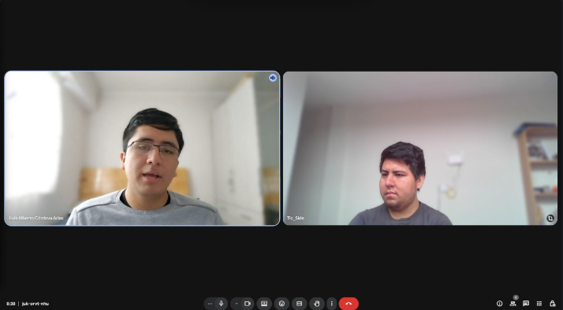
 
- [Video de las entrevistas](https://upcedupe-my.sharepoint.com/:v:/g/personal/u202214214_upc_edu_pe/EQNiTxyruylChmng1hwYL_YBJDfK927PPDDTKSNgDrmHFg?nav=eyJyZWZlcnJhbEluZm8iOnsicmVmZXJyYWxBcHAiOiJTdHJlYW1XZWJBcHAiLCJyZWZlcnJhbFZpZXciOiJTaGFyZURpYWxvZy1MaW5rIiwicmVmZXJyYWxBcHBQbGF0Zm9ybSI6IldlYiIsInJlZmVycmFsTW9kZSI6InZpZXcifX0%3D&e=7dP7rr)
- Timing de la entrevista: Inicio [00:05] – Duración [05:54]  

**Resumen descriptivo de la entrevista**  
Luis Fernández, joven analista contable, mostró una personalidad práctica y crítica frente a los problemas de su entorno. Vive en Lima, donde observa con frecuencia basura acumulada y accidentes de tránsito. Usa principalmente su celular y laptop, con Android y Windows como sistemas operativos, navegando desde Google Chrome. Se comunica mayormente por WhatsApp, herramienta que considera esencial tanto en el trabajo como en la vida cotidiana.  

En cuanto a denuncias, comentó que la web de la municipalidad no funciona correctamente y que por teléfono nunca le respondieron. Expresó frustración porque siente que sus reportes no son atendidos, lo que le genera poca confianza en las autoridades. Aun así, estaría dispuesto a usar una aplicación móvil de denuncias si le permite hacer seguimiento mediante notificaciones. Valoraría especialmente rapidez, facilidad para adjuntar fotos y simplicidad en el proceso. Subjetivamente, se mostró impaciente ante procesos burocráticos y señaló que abandonaría una plataforma si es lenta o pide demasiados datos personales.  

---

### Entrevista 2 –  Stephano Moscoso  

**Datos del entrevistado**  
- Nombre y Apellido: Stephano Moscoso  
- Edad: 25 años  
- Ocupación: Profesora  
- Distrito: Arequipa  

**Evidencia en video**  
- Screenshot del video: - 
 
- [Video de las entrevistas](https://upcedupe-my.sharepoint.com/:v:/g/personal/u202214214_upc_edu_pe/EQNiTxyruylChmng1hwYL_YBJDfK927PPDDTKSNgDrmHFg?nav=eyJyZWZlcnJhbEluZm8iOnsicmVmZXJyYWxBcHAiOiJTdHJlYW1XZWJBcHAiLCJyZWZlcnJhbFZpZXciOiJTaGFyZURpYWxvZy1MaW5rIiwicmVmZXJyYWxBcHBQbGF0Zm9ybSI6IldlYiIsInJlZmVycmFsTW9kZSI6InZpZXcifX0%3D&e=7dP7rr) 
- Timing de la entrevista: Inicio [10:07] – Duración [16:5]7  

**Resumen descriptivo de la entrevista**  
Stephano Moscoso  , profesora en un colegio público, vive en un barrio céntrico de Arequipa. Tiene una personalidad reflexiva y perseverante, aunque desanimada por la falta de respuesta de las autoridades. Utiliza principalmente su celular y laptop con Android y Windows, y accede a internet desde Chrome. Se comunica casi siempre por WhatsApp, pero también consulta Facebook para enterarse de problemas en su zona.  

Ha presenciado desorden vehicular y acumulación de basura. Intentó denunciar a través del WhatsApp municipal enviando fotos, pero nunca recibió respuesta. Esto ha reducido su motivación para denunciar y le genera muy poca confianza en las autoridades. Indicó que se sentiría más segura con un sistema en el que su identidad esté visible solo para las autoridades. Le interesaría dar seguimiento mediante una aplicación web en tiempo real y recibir notificaciones de denuncias cercanas. Considera útiles funciones como fotos, mapas y plazos visibles. Subjetivamente, enfatizó que dejaría de usar una app si la municipalidad no responde o si el sistema es lento.  

---

### Entrevista 3 – George Garcia Durand

**Datos del entrevistado**  
- Nombre y Apellido: George Garcia Durand  
- Edad: 24 años  
- Ocupación: Estudiante universitario y trabajador part-time en call center  
- Distrito: Trujillo  

**Evidencia en video**  
- Screenshot del video: 
- - 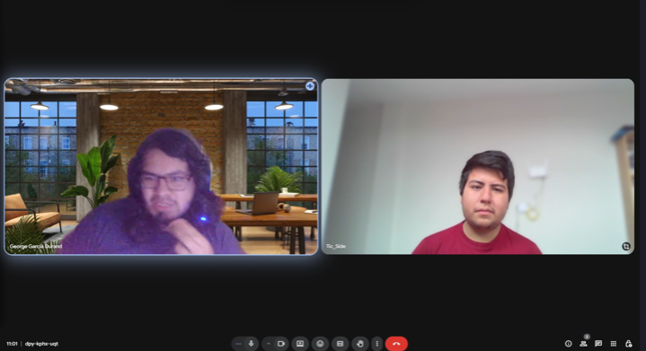
- [Video de las entrevistas](https://upcedupe-my.sharepoint.com/:v:/g/personal/u202214214_upc_edu_pe/EQNiTxyruylChmng1hwYL_YBJDfK927PPDDTKSNgDrmHFg?nav=eyJyZWZlcnJhbEluZm8iOnsicmVmZXJyYWxBcHAiOiJTdHJlYW1XZWJBcHAiLCJyZWZlcnJhbFZpZXciOiJTaGFyZURpYWxvZy1MaW5rIiwicmVmZXJyYWxBcHBQbGF0Zm9ybSI6IldlYiIsInJlZmVycmFsTW9kZSI6InZpZXcifX0%3D&e=7dP7rr) 
- Timing de la entrevista: Inicio [05:55] – Duración [10:06]  

**Resumen descriptivo de la entrevista**  
George García es un estudiante universitario que también trabaja part-time, con una personalidad práctica y un tanto incrédula respecto a la eficacia de las denuncias ciudadanas. Vive en Trujillo y usa principalmente su celular y laptop con Android y Windows, navegando desde Chrome. WhatsApp es su canal de comunicación central, y en ocasiones utiliza Instagram para enterarse de lo que ocurre en su barrio.  

Comentó que ha visto problemas como baches y basura en su zona, pero que la web de la municipalidad no funcionó al intentar denunciar. La página incluso se cayó durante su intento, lo que le generó frustración y una sensación de inutilidad en el proceso. Tiene muy baja confianza en las autoridades y preferiría mantener completo anonimato. Para dar seguimiento, desea recibir notificaciones únicamente en su celular. Le parecen indispensables las funciones de geolocalización y envío de fotos. Subjetivamente, considera que dejaría de usar una aplicación si pide demasiada información personal o si resulta lenta.  

---

## Segmento: Autoridades

### Entrevista 1 – Carolina Méndez

**Datos del entrevistado**  
- Nombre y Apellido: Carolina Méndez  
- Edad: 26 años  
- Ocupación: Asistente de participación ciudadana  
- Distrito: Lima  

**Evidencia en video**  
- Screenshot del video: 
- 
- URL del video en Microsoft Stream: [URL único del video]
- [Video de las entrevistas](https://upcedupe-my.sharepoint.com/:v:/g/personal/u202214214_upc_edu_pe/EQNiTxyruylChmng1hwYL_YBJDfK927PPDDTKSNgDrmHFg?nav=eyJyZWZlcnJhbEluZm8iOnsicmVmZXJyYWxBcHAiOiJTdHJlYW1XZWJBcHAiLCJyZWZlcnJhbFZpZXciOiJTaGFyZURpYWxvZy1MaW5rIiwicmVmZXJyYWxBcHBQbGF0Zm9ybSI6IldlYiIsInJlZmVycmFsTW9kZSI6InZpZXcifX0%3D&e=7dP7rr)
- Timing de la entrevista: Inicio [17:04] – Duración [19:48]  

**Resumen descriptivo de la entrevista**  
Carolina Méndez trabaja como asistente de participación ciudadana en Lima. Se muestra organizada y crítica, consciente de las limitaciones en la gestión de denuncias. Usa PC de oficina y celular con Windows y Android, navegando en Chrome. Se comunica principalmente por correo institucional y WhatsApp para la coordinación diaria.  

Explicó que las denuncias llegan por teléfono y WhatsApp, pero el seguimiento es difícil por la falta de un sistema integrado. Señaló problemas como duplicidad de reportes y carencia de datos claros. Actualmente gestionan denuncias en Excel, de manera manual. Considera muy importante mantener contacto con el denunciante, respetando el anonimato. Sugiere que un dashboard debería mostrar el número de denuncias, estado y responsables. Como riesgos de una app, mencionó las denuncias falsas, aunque valoraría funcionalidades como centralización de información y reportes automáticos. Un plan premium, en su opinión, debería integrar otras plataformas y generar alertas.  

---

### Entrevista 2 – Jorge Torres

**Datos del entrevistado**  
- Nombre y Apellido: Jorge Torres  
- Edad: 27 años  
- Ocupación: Inspector municipal  
- Distrito: Chiclayo  

**Evidencia en video**  
- 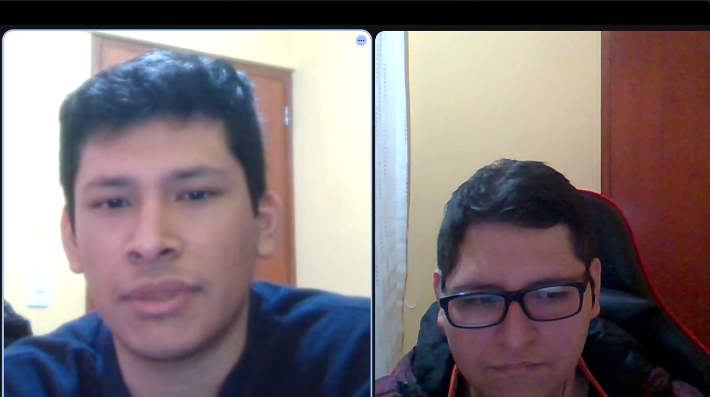
- [Video de las entrevistas](https://upcedupe-my.sharepoint.com/:v:/g/personal/u202214214_upc_edu_pe/EQNiTxyruylChmng1hwYL_YBJDfK927PPDDTKSNgDrmHFg?nav=eyJyZWZlcnJhbEluZm8iOnsicmVmZXJyYWxBcHAiOiJTdHJlYW1XZWJBcHAiLCJyZWZlcnJhbFZpZXciOiJTaGFyZURpYWxvZy1MaW5rIiwicmVmZXJyYWxBcHBQbGF0Zm9ybSI6IldlYiIsInJlZmVycmFsTW9kZSI6InZpZXcifX0%3D&e=7dP7rr) 
- Timing de la entrevista: Inicio [19:49] – Duración [25:28]  

**Resumen descriptivo de la entrevista**  
Jorge Torres, inspector municipal en Chiclayo, tiene un perfil operativo y resolutivo, acostumbrado a trabajar en campo. Usa celular y PC con Android y Windows, navegando desde Chrome. Se comunica principalmente por WhatsApp y llamadas, ya que su trabajo es dinámico.  

Actualmente reciben denuncias por WhatsApp o llamadas, pero el seguimiento es complicado por la ausencia de un registro centralizado. Mencionó la falta de coordinación y la información incompleta como problemas recurrentes. No usan software especializado, solo papel y Excel. Considera clave comunicarse con el denunciante para obtener datos precisos. Un dashboard, según él, debería mostrar ubicación, fecha y estado de la denuncia. Ve como riesgo las denuncias falsas, pero valoraría funcionalidades como fotos, ubicación y actualización de estado directamente desde el campo. Un plan premium debería ofrecer geolocalización precisa y mejorar la coordinación entre inspector y oficina.  

---

### Entrevista 3 – Juan José

**Datos del entrevistado**  
- Nombre y Apellido: Juan José  
- Edad: 24 años  
- Ocupación: Asistente de Participación Ciudadana y Gestión de Denuncias  
- Distrito: Lima  

**Evidencia en video**  
- 
- [Video de las entrevistas](https://upcedupe-my.sharepoint.com/:v:/g/personal/u202214214_upc_edu_pe/EQNiTxyruylChmng1hwYL_YBJDfK927PPDDTKSNgDrmHFg?nav=eyJyZWZlcnJhbEluZm8iOnsicmVmZXJyYWxBcHAiOiJTdHJlYW1XZWJBcHAiLCJyZWZlcnJhbFZpZXciOiJTaGFyZURpYWxvZy1MaW5rIiwicmVmZXJyYWxBcHBQbGF0Zm9ybSI6IldlYiIsInJlZmVycmFsTW9kZSI6InZpZXcifX0%3D&e=7dP7rr)
- Timing de la entrevista: Inicio [25:29] – Duración [28:51]  

**Resumen descriptivo de la entrevista**  
Juan José, asistente de participación ciudadana y gestión de denuncias en Lima, señaló que actualmente las denuncias se reciben por teléfono, libros de reclamaciones, correo y redes sociales, pero la ausencia de un sistema unificado genera duplicidad y demoras. La asignación se hace de manera manual y algunos departamentos usan herramientas propias sin conexión entre sí.  

Destacó la importancia de la comunicación con los denunciantes y la necesidad de un dashboard que muestre en tiempo real el estado, ubicación y responsable de cada denuncia. Reconoció riesgos como reportes falsos y problemas de seguridad de datos, aunque valoró funciones como notificaciones, geolocalización, categorización y adjuntar evidencias.  

Finalmente, consideró que un plan premium sería útil si incluyera reportes avanzados, integración con otros sistemas municipales y soporte técnico especializado.


### 2.2.3. Análisis de entrevistas.
#### Segmento: Ciudadanos

**Características objetivas más comunes**  
- 100% usan **smartphone y laptop** con Android y Windows.  
- 100% navegan principalmente en **Google Chrome**.  
- 100% utilizan **WhatsApp** como canal de comunicación central.  
- 67% también usan **otras redes sociales** (Facebook o Instagram).  

**Características subjetivas más comunes**  
- 100% expresan **desconfianza hacia las autoridades** por falta de respuesta.  
- 100% valoran **rapidez, simplicidad y notificaciones en tiempo real**.  
- 67% prefieren **mantener anonimato** en el proceso de denuncia.  
- 100% muestran **frustración** cuando el sistema no responde o es lento.  

**Síntesis para arquetipo**  
El ciudadano entrevistado es un joven adulto (20–30 años), urbano, con alta dependencia del celular y uso cotidiano de WhatsApp. Tiene poca confianza en autoridades, pero estaría dispuesto a denunciar si la aplicación es rápida, sencilla, con seguimiento en tiempo real y con posibilidad de anonimato.  

---

#### Segmento: Autoridades  

**Características objetivas más comunes**  
- 100% usan **PC y smartphone** con Windows y Android.  
- 100% navegan principalmente en **Google Chrome**.  
- 100% se comunican por **WhatsApp** y llamadas; algunos también por **correo institucional**.  
- 100% gestionan denuncias de forma **manual** (Excel, papel o memorandos).  

**Características subjetivas más comunes**  
- 100% reconocen la **falta de un sistema unificado** para la gestión de denuncias.  
- 100% resaltan la **importancia de mantener comunicación con el denunciante**, cuidando su anonimato.  
- 100% consideran riesgos las **denuncias falsas** y la **seguridad de datos**.  
- 100% valoran la posibilidad de un **dashboard centralizado** con estado, ubicación y responsables.  
- 67% expresan la necesidad de mejorar la **coordinación interna** entre áreas y con inspectores de campo.  

**Síntesis para arquetipo**  
La autoridad entrevistada es un joven profesional (24–27 años), con un perfil operativo y administrativo, dependiente del uso de PC y smartphone, y con WhatsApp como herramienta principal de coordinación. Reconoce las limitaciones de los métodos manuales y demanda una plataforma centralizada que permita trazabilidad, asignación clara de responsables, geolocalización y adjuntos. Desconfía de la sobrecarga de denuncias falsas y la vulnerabilidad de los datos, pero ve valor en notificaciones, reportes y funciones que optimicen la gestión. Un plan premium sería atractivo si integra sistemas municipales, brinda reportes estadísticos avanzados y facilita la coordinación en tiempo real.


### 2.2.3. Análisis de entrevistas.

## 2.3. Needfinding.

### 2.3.1. User Personas.

## User Persona - Ciudadano


## User Persona - Autoridad


### 2.3.2. User Task Matrix.

## Task Matrix - Ciudadano

|                                      **Tarea**                                       | **Frecuencia** | **Importancia** |
|:------------------------------------------------------------------------------------:|----------------|-----------------|
| Identificar problemas en su distrito (baches, basura, alumbrado, fugas, corrupción). | Alta           | Alta            |
|         Intentar reportar problemas en la municipalidad (presencial o web).          | Media          | Alta            |
| Usar redes sociales (WhatsApp, Facebook) para compartir evidencias (fotos, videos).  | Alta           | Media           |
|                  Adjuntar fotos, videos o ubicación como evidencia.                  | Media          | Alta            |
|                     Dar seguimiento al estado de las denuncias.                      | Media          | Alta            |
|            Escuchar comentarios de vecinos sobre problemas no resueltos.             | Alta           | Media           |
|       Expresar frustración o desconfianza en la respuesta de las autoridades.        | Media          | Alta            |
|           Buscar soluciones digitales alternativas (apps, foros, grupos).            | Baja           | Media           |
|                Desistir de denunciar por percibir que “no pasa nada”.                | Media          | Alta            |

## Task Matrix - Autoridad

|                                  **Tarea**                                  | **Frecuencia** | **Importancia** |
|:---------------------------------------------------------------------------:|----------------|-----------------|
|    Recibir denuncias por múltiples canales (teléfono, WhatsApp, correo).    | Alta           | Alta            |
| Registrar manualmente casos en hojas de cálculo u otros sistemas dispersos. | Alta           | Alta            |
|  Clasificar y organizar denuncias según tipo, urgencia o área responsable.  | Alta           | Alta            |
|         Comunicar demoras o falta de información a los ciudadanos.          | Media          | Alta            |
|          Coordinar con otras áreas municipales para derivar casos.          | Media          | Alta            |
|        Escuchar quejas ciudadanas por la lentitud en las respuestas.        | Alta           | Alta            |
|              Buscar maneras de reducir sobrecarga de trabajo.               | Media          | Alta            |
|      Explicar procesos internos a superiores para justificar retrasos.      | Media          | Media           |
|   Imaginar o investigar soluciones digitales que automaticen su trabajo.    | Baja           | Alta            |

### 2.3.3. User Journey Mapping.

## Journey Map - Ciudadano


## Journey Map - Autoridad


### 2.3.4. Empathy Mapping.

## Empathy map - Ciudadano


## Empathy map - Autoridad


## 2.4. Big Picture Event Storming.

A continuación, se presenta el Big Picture Event Storming realizado para el sistema DenunciaYa. Esta representación visual permite identificar los eventos más relevantes del dominio, mostrando de manera colaborativa cómo los segmentos objetivos interactúan con la plataforma en distintos procesos, como la creación de denuncias, gestión de cuentas, publicación de contenido, recepción de notificaciones y personalización de la experiencia. Este primer nivel de exploración brinda una visión general del negocio, resaltando los procesos clave y posibles áreas de mejora u oportunidad.

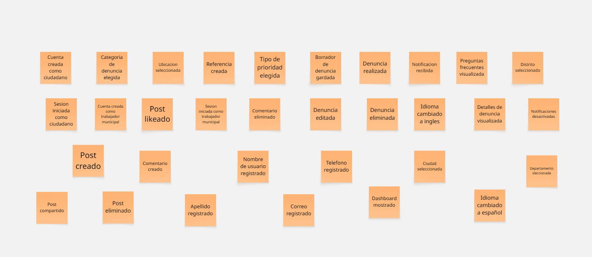

**Link del figma:** https://acortar.link/eh5Gx6
## 2.5. Ubiquitous Language.

A continuación, se presenta el Ubiquitous Language desarrollado para el sistema DenunciaYa. Este glosario de términos clave define de manera clara y precisa los conceptos fundamentales del dominio, facilitando la comunicación efectiva entre todos los miembros del equipo y asegurando una comprensión compartida de los elementos esenciales del negocio. Al establecer un lenguaje común, se minimizan las ambigüedades y se promueve la colaboración fluida durante todo el ciclo de vida del proyecto.


## Actores / Roles
| Término       | Definición                                                                 |
|---------------|----------------------------------------------------------------------------|
| Visitante     | Usuario no registrado que accede a la landing page.                        |
| Ciudadano     | Usuario registrado que realiza denuncias, las gestiona y participa en la comunidad. |
| Autoridad / Administrador | Usuario con privilegios avanzados para gestionar denuncias, ver métricas y dashboards. |
| Developer     | Miembro del equipo técnico responsable del diseño y funcionamiento.        |

---

## Conceptos Clave (Landing Page)
| Término            | Definición                                                                 |
|--------------------|----------------------------------------------------------------------------|
| Landing Page       | Página principal que presenta la plataforma a los visitantes.              |
| How it works       | Sección que explica de manera resumida el proceso de denuncia.             |
| About us           | Información sobre el objetivo y equipo desarrollador.                      |
| Testimonials       | Opiniones de ciudadanos que generan confianza.                             |
| News & Blog        | Espacio con novedades y artículos de la plataforma.                        |
| CTA (Call to Action)| Botón de acceso a la aplicación.                                           |
| Sección de Soporte | Espacio con FAQs, guías o contacto para resolver dudas.                    |
| Sección de Contacto| Información para comunicarse con el equipo (correo u otros medios).        |

---

## Denuncias
| Término             | Definición                                                                 |
|---------------------|----------------------------------------------------------------------------|
| Denuncia            | Reporte ciudadano de un problema urbano o de corrupción.                   |
| Categoría de denuncia | Clasificación del incidente (baches, basura, alumbrado, etc.).            |
| Ubicación           | Dirección exacta o zona del incidente.                                     |
| Descripción         | Texto explicativo del problema.                                            |
| Evidencia           | Archivos adjuntos (fotos, videos, audios).                                 |
| Borrador de denuncia| Denuncia guardada sin enviar para completarla más tarde.                   |
| Resumen de denuncia | Vista previa antes de enviar.                                              |
| Código de seguimiento| Identificador único generado al enviar.                                   |

---

## Gestión de Denuncias
| Término     | Definición                                                                 |
|-------------|----------------------------------------------------------------------------|
| Historial   | Lista de denuncias registradas por un usuario.                             |
| Detalle de denuncia | Información completa de un caso.                                    |
| Filtros     | Opciones para reducir los resultados (estado, categoría, fecha, ubicación).|
| Ordenar     | Reorganizar denuncias por fecha o estado.                                  |
| Búsqueda    | Localizar denuncias por número o palabra clave.                            |
| Timeline / Evolución del caso | Línea de tiempo con actualizaciones de estado.            |
| Empty state | Mensaje mostrado cuando no existen denuncias registradas.                  |

---

## Dashboard de Autoridades
| Término               | Definición                                                                 |
|-----------------------|----------------------------------------------------------------------------|
| Dashboard / Panel de control | Vista centralizada de métricas y denuncias.                          |
| Asignación de denuncia| Derivación de denuncias a un área responsable.                             |
| Métricas de eficiencia| Reportes de tiempos de resolución y desempeño de áreas.                    |
| Patrones de incidencias| Tendencias en categorías o zonas críticas.                                |
| Alertas internas      | Notificaciones para casos urgentes.                                        |
| Comunicación segura   | Mensajería entre autoridad y ciudadano manteniendo anonimato si aplica.    |

---

## Directorio
| Término             | Definición                                                                 |
|---------------------|----------------------------------------------------------------------------|
| Directorio de recursos | Listado de oficinas, contactos y recursos relevantes.                     |
| Filtros de directorio | Filtrar por región o distrito.                                             |
| Búsqueda de directorio | Localizar oficinas/contactos por nombre o palabra clave.                  |
| Detalle de contacto | Información detallada (dirección, teléfono, correo, horario).               |
| Acceso extendido    | Vista adicional para autoridades (responsables, jerarquía interna).         |

---

## Historial de Intervenciones
| Término                 | Definición                                                                 |
|-------------------------|----------------------------------------------------------------------------|
| Historial de intervenciones | Registro cronológico de acciones asociadas a una denuncia.             |
| Intervención            | Acción específica tomada en el proceso (asignación, comentario, adjunto). |
| Responsable             | Autoridad o área que ejecutó la acción.                                   |
| Adjunto                 | Documentos o reportes cargados en el historial.                           |
| Notificación de actualización | Aviso automático al ciudadano sobre cambios.                         |

---

## Autenticación y Gestión de Cuentas
| Término          | Definición                                                                 |
|------------------|----------------------------------------------------------------------------|
| Registro         | Creación de una cuenta (ciudadano o autoridad).                            |
| Inicio de sesión | Acceso a la plataforma con credenciales.                                   |
| Recuperar contraseña | Función para recuperar acceso en caso de olvido.                       |
| Restablecer contraseña | Definir nueva contraseña para volver a acceder.                       |
| Perfil básico    | Información básica del usuario.                                            |

---

## Comunidad
| Término             | Definición                                                                 |
|---------------------|----------------------------------------------------------------------------|
| Publicación / Post  | Mensaje creado por un ciudadano (texto, imagen, video, GIF, encuesta, emoji, recordatorio). |
| Me gusta            | Reacción positiva a una publicación.                                       |
| Comentario          | Respuesta a una publicación.                                               |
| Compartir publicación | Difusión de publicaciones de otros en el propio feed.                    |
| Encuesta            | Publicación interactiva con opciones de voto.                             |
| Feed comunitario    | Línea de tiempo de publicaciones de la comunidad.                         |

# Capítulo III: Requirements Specification

## 3.1. User Stories.

En esta sección se describen las historias de usuario que representan las funcionalidades y características del producto
desde la perspectiva del usuario final. Cada historia de usuario incluye una descripción clara y concisa de la necesidad
del usuario, el valor que aporta y los criterios de aceptación para su implementación.

| Epic / Story ID | Título                                           | Descripción                                                                                                                                                                                                                              | Criterios de Aceptación                                                                                                                                                                                                                                                                                                                                                                                                                                                                                                                                                                                                                                       | Relacionado con (Epic ID) |
|-----------------|--------------------------------------------------|------------------------------------------------------------------------------------------------------------------------------------------------------------------------------------------------------------------------------------------|---------------------------------------------------------------------------------------------------------------------------------------------------------------------------------------------------------------------------------------------------------------------------------------------------------------------------------------------------------------------------------------------------------------------------------------------------------------------------------------------------------------------------------------------------------------------------------------------------------------------------------------------------------------|---------------------------|
| EP1             | Landing Page de DenunciaYa                       | Como visitante quiero visualizar una descripción clara de la plataforma para comprender su propósito y beneficios.                                                                                                                       |                                                                                                                                                                                                                                                                                                                                                                                                                                                                                                                                                                                                                                                               | -                         |
| US1             | Sección “How it works”                           | Como visitante quiero ver un resumen de cómo funciona la plataforma para entender fácilmente el proceso de denuncia.                                                                                                                     | Scenario: Visualización del proceso<br>Given que el visitante accede a la Landing Page<br>When la sección “¿Cómo funciona?” está disponible<br>Then el visitante observa los pasos del flujo de denuncia descritos de manera resumida.                                                                                                                                                                                                                                                                                                                                                                                                                        | EP1                       |
| US2             | Sección “Home”                                   | Como visitante quiero ver una explicación clara sobre qué es DenunciaYa para comprender su propósito principal.                                                                                                                          | Scenario: Visualización de sección “Qué es”<br>Given que el visitante accede a la Landing Page<br>When la página carga<br>Then el visitante observa un bloque con la explicación de qué es la plataforma.                                                                                                                                                                                                                                                                                                                                                                                                                                                     | EP1                       |
| US3             | Llamado a la acción (CTA)                        | Como visitante quiero encontrar un botón de acceso a la aplicación para comenzar a utilizar la plataforma de manera inmediata.                                                                                                           | Scenario: Acceso a la app<br>Given que el visitante accede a la Landing Page<br>When el visitante visualiza el CTA<br>Then el visitante identifica un botón que le permite ingresar a la aplicación web.                                                                                                                                                                                                                                                                                                                                                                                                                                                      | EP1                       |
| US4             | Seccion About us                                 | Como visitante quiero conocer el objetivo principal de la plataforma y el equipo detrás de ella para generar confianza y credibilidad.                                                                                                   | Scenario: Visualización de sección “About us”<br>Given que el visitante accede a la Landing Page<br>When la sección “About us” está disponible<br>Then el visitante observa información sobre el objetivo de la plataforma y detalles del equipo desarrollador.                                                                                                                                                                                                                                                                                                                                                                                               | EP1                       |
| US5             | Sección Testimonials                             | Como visitante quiero leer testimonios de usuarios satisfechos para aumentar mi confianza en la plataforma.                                                                                                                              | Scenario: Visualización de testimonios<br>Given que el visitante accede a la Landing Page<br>When la sección “Testimonials” está disponible<br>Then el visitante puede leer opiniones positivas de usuarios que han utilizado la plataforma.                                                                                                                                                                                                                                                                                                                                                                                                                  | EP1                       |
| US6             | Sección News & Blog                              | Como visitante quiero mantenerme informado sobre cambios que haya en la plataforma y leer artículos relacionados para estar al día con las novedades.                                                                                    | Scenario: Visualización de sección “News & Blog”<br>Given que el visitante accede a la Landing Page<br>When la sección “News & Blog” está disponible<br>Then el visitante puede leer artículos y noticias relevantes sobre la plataforma y temas relacionados.                                                                                                                                                                                                                                                                                                                                                                                                | EP1                       |
| US7             | Sección de Soporte                               | Como visitante quiero encontrar una sección de soporte o ayuda para resolver dudas comunes o problemas que tenga utilizando la plataforma.                                                                                               | Scenario: Visualización de sección de soporte<br>Given que el visitante accede a la Landing Page<br>When la sección de soporte está disponible<br>Then el visitante puede acceder a FAQs, guías o contacto para asistencia.                                                                                                                                                                                                                                                                                                                                                                                                                                   | EP1                       |
| US8             | Sección de Contacto                              | Como visitante quiero encontrar una sección de contacto para comunicarme con el equipo de DenunciaYa en caso de necesitar asistencia personalizada.                                                                                      | Scenario: Visualización de sección de contacto<br>Given que el visitante accede a la Landing Page<br>When la sección de contacto está disponible<br>Then el visitante puede ver información para comunicarse con el equipo (correo).                                                                                                                                                                                                                                                                                                                                                                                                                          | EP1                       |
| TS1             | Responsive Design                                | Como developer quiero implementar un diseño adaptable para que la landing page se visualice correctamente en dispositivos móviles, tablets y desktops.                                                                                   | Scenario: Visualización en distintos dispositivos<br>Given que un visitante accede a la Landing Page desde un dispositivo móvil<br>When la página carga<br>Then el contenido se adapta al tamaño de la pantalla sin perder legibilidad ni funcionalidad.<br><br>Scenario: Visualización en desktop<br>Given que un visitante accede desde un computador<br>When la página carga<br>Then los elementos se ajustan al ancho de pantalla manteniendo coherencia visual.<br><br>Scenario: Visualización en tablet<br>Given que un visitante accede desde una tablet<br>When la página carga<br>Then los elementos se muestran de manera proporcional y navegable. | EP1                       |
| EP2             | Creación de denuncias                            | Como ciudadano quiero realizar una denuncia siguiendo un proceso guiado para asegurar la captura completa de datos.                                                                                                                      |                                                                                                                                                                                                                                                                                                                                                                                                                                                                                                                                                                                                                                                               | -                         |
| US9             | Selección de categoría                           | Como ciudadano quiero seleccionar la categoría de la denuncia para clasificar mi reporte correctamente.                                                                                                                                  | Scenario: Selección de categoría<br>Given que el ciudadano se encuentra en el paso de categoría<br>When elige una opción válida<br>Then la categoría queda registrada para la denuncia. <br><br>Scenario: Validación obligatoria<br>Given que el ciudadano intenta continuar sin seleccionar categoría<br>When presiona “Siguiente”<br>Then el sistema muestra un mensaje de error indicando que el campo es obligatorio.                                                                                                                                                                                                                                     | EP2                       |
| US10            | Registro de ubicación                            | Como ciudadano quiero ingresar la ubicación exacta del incidente para contextualizar la denuncia.                                                                                                                                        | Scenario: Registro de ubicación<br>Given que el ciudadano se encuentra en el paso de ubicación<br>When ingresa una dirección válida<br>Then el sistema guarda la ubicación en la denuncia. <br><br>Scenario: Validación de obligatoriedad<br>Given que el ciudadano no ingresa ubicación<br>When intenta continuar<br>Then el sistema muestra un mensaje de error indicando que la ubicación es requerida.                                                                                                                                                                                                                                                    | EP2                       |
| US11            | Registro de la descripción del incidente         | Como ciudadano quiero ingresar la descripción del incidente para aportar datos importantes.                                                                                                                                              | Scenario: Ingreso de descripción <br>Given que el ciudadano se encuentra en el paso descripción<br>When ingresa la información de la denuncia <br>Then el sistema guarda la descripción de la denuncia. <br><br>Scenario: Validación de descripción<br>Given que el ciudadano no ingesa una descripción<br>When intenta continuar<br>Then el sistema muestra un mensaje indicando que la descripción no puede estar vacía.                                                                                                                                                                                                                                    | EP2                       |
| US12            | Ingreso de descripción                           | Como ciudadano quiero redactar una descripción detallada del problema para explicar el incidente.                                                                                                                                        | Scenario: Ingreso de descripción<br>Given que el ciudadano se encuentra en el paso de descripción<br>When ingresa al menos 20 caracteres<br>Then el sistema guarda la descripción en la denuncia.<br><br>Scenario: Validación de mínimo<br>Given que el ciudadano ingresa menos de 20 caracteres<br>When intenta continuar<br>Then el sistema muestra un mensaje de error indicando que debe completar la descripción.                                                                                                                                                                                                                                        | EP2                       |
| US13            | Adjuntar evidencias                              | Como ciudadano quiero adjuntar fotos, videos o audios para respaldar la denuncia.                                                                                                                                                        | Scenario: Adjuntar archivo válido<br>Given que el ciudadano adjunta un archivo JPG o PNG menor a 5 MB<br>When confirma la acción<br>Then el archivo queda registrado como evidencia de la denuncia.<br><br>Scenario: Adjuntar archivo inválido<br>Given que el ciudadano adjunta un archivo de formato no permitido<br>When intenta cargarlo<br>Then el sistema muestra un mensaje de error indicando los formatos válidos.                                                                                                                                                                                                                                   | EP2                       |
| US14            | Guardar denuncia como borrador                   | Como ciudadano quiero guardar mi denuncia en cualquier paso como borrador para completarla más tarde.                                                                                                                                    | Scenario: Guardar borrador<br>Given que el ciudadano se encuentra en cualquier paso del wizard<br>When selecciona “Guardar borrador”<br>Then el sistema almacena los datos ingresados hasta ese momento.<br><br>Scenario: Reanudar borrador<br>Given que el ciudadano tiene denuncias guardadas<br>When selecciona reanudar<br>Then el sistema carga los datos previamente guardados en el wizard.                                                                                                                                                                                                                                                            | EP2                       |
| US15            | Revisión de datos antes de enviar                | Como ciudadano quiero revisar un resumen de la denuncia antes de enviarla para confirmar su exactitud.                                                                                                                                   | Scenario: Visualización de resumen<br>Given que el ciudadano completa todos los pasos<br>When accede al último paso<br>Then el sistema muestra un resumen con categoría, ubicación, fecha, descripción y evidencias.<br><br>Scenario: Corrección<br>Given que el ciudadano detecta un error en el resumen<br>When selecciona editar<br>Then el sistema lo redirige al paso correspondiente para corregir.                                                                                                                                                                                                                                                     | EP2                       |
| US16            | Envío de denuncia y código de seguimiento        | Como ciudadano quiero enviar la denuncia y recibir un código de seguimiento único para consultar su estado.                                                                                                                              | Scenario: Envío exitoso<br>Given que el ciudadano completó todos los pasos<br>When selecciona “Enviar”<br>Then el sistema registra la denuncia, genera un código de seguimiento y muestra un mensaje de confirmación.<br><br>Scenario: Error en el envío<br>Given que ocurre un error al registrar la denuncia<br>When el ciudadano intenta enviar<br>Then el sistema muestra un mensaje de error invitando a reintentar más tarde.                                                                                                                                                                                                                           | EP2                       |
| EP3             | Historial y seguimiento de denuncias             | Como ciudadano quiero consultar, filtrar y dar seguimiento al estado de mis denuncias a través de un historial organizado y accesible.                                                                                                   |                                                                                                                                                                                                                                                                                                                                                                                                                                                                                                                                                                                                                                                               | -                         |
| US17            | Ver historial básico                             | Como ciudadano autenticado quiero ver una lista de todas mis denuncias registradas para consultar su estado actual y acceder a los detalles.                                                                                             | Scenario: Lista de denuncias visible<br>Given que el usuario tiene denuncias registradas<br>When accede a la sección de Historial<br>Then debe visualizar una lista con Nº de denuncia, categoría, estado y fecha<br>                                                                                                                                                                                                                                                                                                                                                                                                                                         | EP3                       |
| US18            | Ver detalles de denuncia                         | Como ciudadano quiero acceder al detalle completo de una denuncia seleccionada para revisar su descripción, evidencias y estado de seguimiento.                                                                                          | Scenario: Acceso al detalle de denuncia<br>Given que el usuario abre una denuncia desde el historial<br>When selecciona "Ver"<br>Then el sistema muestra todos los campos capturados y el timeline de cambios<br>                                                                                                                                                                                                                                                                                                                                                                                                                                             | EP3                       |
| US19            | Filtrar denuncias                                | Como ciudadano o autoridad quiero filtrar mis denuncias por categoría, estado, fecha o ubicación para encontrar rápidamente la denuncia que busco.                                                                                       | Scenario: Aplicar filtros de estado<br>Given que el usuario está en el historial de denuncias<br>When selecciona el filtro "Estado: En proceso"<br>Then el sistema muestra solo las denuncias con dicho estado<br>                                                                                                                                                                                                                                                                                                                                                                                                                                            | EP3                       |
| US20            | Ordenar denuncias                                | Como usuario quiero ordenar mis denuncias por fecha o estado para visualizar primero las más relevantes para mí.                                                                                                                         | Scenario: Ordenar por fecha más reciente<br>Given que el usuario está en el historial de denuncias<br>When selecciona el orden "Más reciente"<br>Then el sistema muestra primero las denuncias con fecha más cercana<br>                                                                                                                                                                                                                                                                                                                                                                                                                                      | EP3                       |
| US21            | Búsqueda de denuncias                            | Como usuario quiero buscar una denuncia por número, categoría o palabra clave para ubicar rápidamente un caso específico.                                                                                                                | Scenario: Búsqueda por número de denuncia<br>Given que el usuario introduce un Nº de denuncia válido en la barra de búsqueda<br>When confirma la búsqueda<br>Then el sistema muestra el resultado exacto de la denuncia<br>                                                                                                                                                                                                                                                                                                                                                                                                                                   | EP3                       |
| US22            | Timeline de seguimiento                          | Como ciudadano quiero visualizar un timeline con los cambios de estado de mi denuncia para entender el progreso y acciones tomadas.                                                                                                      | Scenario: Visualización del timeline<br>Given que el usuario abre el detalle de una denuncia<br>When accede a la sección "Evolución del caso"<br>Then el sistema muestra una línea de tiempo cronológica con cada actualización de estado<br>                                                                                                                                                                                                                                                                                                                                                                                                                 | EP3                       |
| US23            | Empty states en historial                        | Como usuario nuevo sin denuncias registradas quiero ver un mensaje claro cuando no existan denuncias en mi historial para entender que debo registrar una nueva denuncia.                                                                | Scenario: Historial vacío<br>Given que el usuario no tiene denuncias registradas<br>When accede a la sección Historial<br>Then el sistema muestra el mensaje "Aún no tienes denuncias registradas"<br>                                                                                                                                                                                                                                                                                                                                                                                                                                                        | EP3                       |
| EP4             | Dashboard de autoridades/admins                  | Como autoridad o administrador quiero un panel de control centralizado que me permita gestionar denuncias, priorizar casos, analizar métricas y derivar reportes a las áreas correspondientes.                                           |                                                                                                                                                                                                                                                                                                                                                                                                                                                                                                                                                                                                                                                               | -                         |
| US24            | Visualizar tablero principal                     | Como autoridad quiero acceder a un panel centralizado con resumen de denuncias por estado, categoría y distrito para obtener una visión general de la situación.                                                                         | Scenario: Acceso al tablero principal<br>Given que la autoridad inicia sesión<br>When accede al dashboard<br>Then visualiza métricas generales (denuncias por estado, categoría y ubicación)<br>                                                                                                                                                                                                                                                                                                                                                                                                                                                              | EP4                       |
| US25            | Filtrar denuncias en el dashboard                | Como autoridad quiero aplicar filtros por categoría, estado, fecha o ubicación para analizar casos específicos y priorizarlos.                                                                                                           | Scenario: Filtro por categoría en el dashboard<br>Given que la autoridad accede al dashboard<br>When aplica el filtro "Categoría: Baches"<br>Then el sistema muestra únicamente las métricas y denuncias relacionadas a baches<br>                                                                                                                                                                                                                                                                                                                                                                                                                            | EP4                       |
| US26            | Asignar denuncias a áreas responsables           | Como autoridad quiero derivar denuncias a diferentes departamentos municipales para que se atiendan de manera más eficiente.                                                                                                             | Scenario: Asignación de denuncia<br>Given que la autoridad visualiza una denuncia sin asignar<br>When selecciona "Asignar" y elige un área responsable<br>Then la denuncia queda registrada bajo el área seleccionada<br>                                                                                                                                                                                                                                                                                                                                                                                                                                     | EP4                       |
| US27            | Visualizar métricas de eficiencia                | Como autoridad quiero consultar reportes automáticos sobre tiempos de resolución, volumen de denuncias y desempeño de áreas para evaluar la eficiencia de la gestión.                                                                    | Scenario: Consulta de métricas<br>Given que la autoridad accede al dashboard<br>When abre la sección de métricas<br>Then el sistema muestra reportes con tiempos promedio de resolución y desempeño de áreas<br>                                                                                                                                                                                                                                                                                                                                                                                                                                              | EP4                       |
| US28            | Detectar patrones de incidencias                 | Como autoridad quiero identificar tendencias o patrones en las denuncias (ej. categorías frecuentes o zonas críticas) para tomar decisiones preventivas.                                                                                 | Scenario: Detección de patrones<br>Given que la autoridad accede al dashboard<br>When abre la vista de "Patrones"<br>Then el sistema muestra gráficas de distribución por categorías y zonas con mayor incidencia<br>                                                                                                                                                                                                                                                                                                                                                                                                                                         | EP4                       |
| US29            | Comunicación segura con ciudadanos               | Como autoridad quiero enviar mensajes al ciudadano denunciante de manera segura, manteniendo su anonimato si corresponde, para dar seguimiento al caso.                                                                                  | Scenario: Comunicación anónima<br>Given que la denuncia fue registrada como anónima<br>When la autoridad responde al ciudadano<br>Then el sistema entrega el mensaje sin exponer los datos personales del denunciante<br>                                                                                                                                                                                                                                                                                                                                                                                                                                     | EP4                       |
| US30            | Alertas y notificaciones internas                | Como autoridad quiero recibir alertas sobre denuncias críticas o urgentes para priorizar su atención de inmediato.                                                                                                                       | Scenario: Alerta de denuncia urgente<br>Given que se registra una denuncia marcada como urgente<br>When la autoridad accede al dashboard<br>Then el sistema muestra una notificación prioritaria en la bandeja de alertas<br>                                                                                                                                                                                                                                                                                                                                                                                                                                 | EP4                       |
| EP5             | Directorio de recursos y contactos               | Proveer un directorio de recursos, oficinas y contactos relevantes para que los ciudadanos y autoridades encuentren rápidamente la información y responsables adecuados para casos de denuncia o soporte.                                |                                                                                                                                                                                                                                                                                                                                                                                                                                                                                                                                                                                                                                                               | -                         |
| US31            | Acceder al directorio                            | Como ciudadano quiero acceder a un directorio de oficinas municipales y recursos disponibles para identificar dónde acudir según mi necesidad.                                                                                           | Scenario: Acceso al directorio<br>Given que el ciudadano accede al menú "Directorio"<br>When selecciona la opción<br>Then visualiza un listado de oficinas y recursos disponibles<br>                                                                                                                                                                                                                                                                                                                                                                                                                                                                         | EP5                       |
| US32            | Búsqueda por nombre o palabra clave              | Como ciudadano quiero buscar oficinas o contactos específicos por nombre o palabra clave para encontrarlos rápidamente.                                                                                                                  | Scenario: Búsqueda en directorio<br>Given que el ciudadano accede al directorio<br>When ingresa "Oficina de Limpieza Pública" en el buscador<br>Then el sistema muestra coincidencias relacionadas con Limpieza Pública<br>                                                                                                                                                                                                                                                                                                                                                                                                                                   | EP5                       |
| US33            | Filtrar por región o distrito                    | Como ciudadano quiero filtrar los contactos y oficinas por región o distrito para ver solo las que me corresponden.                                                                                                                      | Scenario: Filtrado por distrito<br>Given que el ciudadano accede al directorio<br>When aplica el filtro "Distrito: San Isidro"<br>Then el sistema muestra únicamente oficinas relacionadas a San Isidro<br>                                                                                                                                                                                                                                                                                                                                                                                                                                                   | EP5                       |
| US34            | Visualizar información detallada de contacto     | Como ciudadano quiero ver información detallada de una oficina (dirección, teléfono, correo, horario) para contactarme directamente.                                                                                                     | Scenario: Visualización de información<br>Given que el ciudadano selecciona una oficina en el directorio<br>When abre la tarjeta de detalle<br>Then el sistema muestra dirección, teléfono, correo y horario de atención<br>                                                                                                                                                                                                                                                                                                                                                                                                                                  | EP5                       |
| US35            | Acceso para autoridades                          | Como autoridad quiero acceder al mismo directorio con información extendida (responsables, jerarquía interna) para identificar rápidamente a quién derivar un caso.                                                                      | Scenario: Acceso extendido para autoridades<br>Given que la autoridad inicia sesión en la aplicación<br>When accede al directorio<br>Then visualiza información adicional como responsables y jerarquía<br>                                                                                                                                                                                                                                                                                                                                                                                                                                                   | EP5                       |
| EP6             | Historial de intervenciones y timeline de casos  | Permitir a ciudadanos y autoridades consultar el historial completo de acciones e intervenciones asociadas a cada denuncia, en formato cronológico, para garantizar transparencia y trazabilidad del proceso.                            |                                                                                                                                                                                                                                                                                                                                                                                                                                                                                                                                                                                                                                                               | -                         |
| US36            | Visualizar historial de una denuncia             | Como ciudadano quiero ver un historial cronológico de todas las acciones relacionadas con mi denuncia para conocer el progreso.                                                                                                          | Scenario: Visualización del historial<br>Given que el ciudadano accede al detalle de su denuncia<br>When selecciona la pestaña "Historial"<br>Then el sistema muestra en orden cronológico todas las intervenciones registradas<br>                                                                                                                                                                                                                                                                                                                                                                                                                           | EP6                       |
| US37            | Mostrar fecha y responsable de cada intervención | Como ciudadano quiero que cada acción del historial muestre fecha, hora y responsable para asegurar la transparencia del proceso.                                                                                                        | Scenario: Detalles de intervención<br>Given que el ciudadano visualiza el historial<br>When revisa una intervención<br>Then el sistema muestra fecha, hora y responsable asignado<br>                                                                                                                                                                                                                                                                                                                                                                                                                                                                         | EP6                       |
| US38            | Actualización automática del timeline            | Como ciudadano quiero que el historial de mi denuncia se actualice automáticamente cuando se registra una nueva acción para mantenerme informado en tiempo real.                                                                         | Scenario: Actualización del historial<br>Given que la autoridad registra una nueva acción en la denuncia<br>When el ciudadano abre el historial<br>Then el sistema refleja inmediatamente la nueva intervención registrada<br>                                                                                                                                                                                                                                                                                                                                                                                                                                | EP6                       |
| US39            | Acceso extendido para autoridades                | Como autoridad quiero ver un timeline con mayor nivel de detalle (comentarios internos, reasignaciones, adjuntos) para gestionar mejor los casos.                                                                                        | Scenario: Vista extendida para autoridades<br>Given que la autoridad accede al historial de una denuncia<br>When revisa el timeline<br>Then el sistema muestra detalles internos como reasignaciones y adjuntos<br>                                                                                                                                                                                                                                                                                                                                                                                                                                           | EP6                       |
| US40            | Adjuntar documentos o reportes al timeline       | Como autoridad quiero adjuntar documentos o reportes dentro del historial de una denuncia para mantener toda la información centralizada.                                                                                                | Scenario: Adjuntar documento al timeline<br>Given que la autoridad gestiona una denuncia<br>When sube un reporte en la sección de historial<br>Then el sistema guarda y muestra el documento como parte del timeline<br>                                                                                                                                                                                                                                                                                                                                                                                                                                      | EP6                       |
| US41            | Notificaciones por actualización de historial    | Como ciudadano quiero recibir notificaciones cada vez que se actualice el historial de mi denuncia para estar informado del avance.                                                                                                      | Scenario: Notificación por actualización<br>Given que la autoridad registra una nueva intervención<br>When el sistema actualiza el historial<br>Then se envía una notificación al ciudadano informando del cambio<br>                                                                                                                                                                                                                                                                                                                                                                                                                                         | EP6                       |
| EP7             | Autenticación y gestión de cuentas               | Permitir a ciudadanos y autoridades registrarse, iniciar sesión de manera segura, recuperar acceso en caso de olvido de contraseña y gestionar su perfil básico para poder utilizar la aplicación.                                       |                                                                                                                                                                                                                                                                                                                                                                                                                                                                                                                                                                                                                                                               | -                         |
| US42            | Registro de ciudadanos                           | Como ciudadano quiero registrarme en la plataforma proporcionando mis datos básicos para acceder a los servicios de denuncias.                                                                                                           | Scenario: Registro de ciudadano exitoso<br>Given que un visitante accede al formulario de registro<br>When completa los campos requeridos y selecciona el rol "Ciudadano"<br>Then el sistema crea su cuenta y confirma el registro<br>                                                                                                                                                                                                                                                                                                                                                                                                                        | EP7                       |
| US43            | Registro de autoridades                          | Como autoridad quiero registrarme en la plataforma con un rol diferenciado para acceder a las funciones de gestión y dashboard.                                                                                                          | Scenario: Registro de autoridad exitoso<br>Given que un visitante accede al formulario de registro<br>When completa los campos requeridos y selecciona el rol "Autoridad"<br>Then el sistema crea su cuenta con privilegios de autoridad<br>                                                                                                                                                                                                                                                                                                                                                                                                                  | EP7                       |
| US44            | Inicio de sesión                                 | Como usuario registrado quiero iniciar sesión con mi correo y contraseña para acceder a mis funciones según mi rol.                                                                                                                      | Scenario: Inicio de sesión exitoso<br>Given que el usuario registrado accede al formulario de login<br>When ingresa credenciales válidas<br>Then el sistema lo autentica y lo redirige a su panel correspondiente (ciudadano o autoridad)<br>                                                                                                                                                                                                                                                                                                                                                                                                                 | EP7                       |
| US45            | Recuperar contraseña olvidada                    | Como usuario quiero recuperar mi acceso en caso de olvidar mi contraseña para no perder mi cuenta.                                                                                                                                       | Scenario: Recuperar contraseña<br>Given que el usuario no recuerda su contraseña<br>When selecciona la opción "¿Olvidaste tu contraseña?" e ingresa un correo válido<br>Then el sistema envía un enlace de restablecimiento<br>                                                                                                                                                                                                                                                                                                                                                                                                                               | EP7                       |
| US46            | Restablecer contraseña                           | Como usuario quiero establecer una nueva contraseña ingresándola dos veces para confirmar, de modo que pueda recuperar acceso de forma segura.                                                                                           | Scenario: Restablecer contraseña<br>Given que el usuario accede al enlace de restablecimiento válido<br>When ingresa la nueva contraseña dos veces y ambas coinciden<br>Then el sistema guarda la nueva contraseña y permite iniciar sesión con ella<br>                                                                                                                                                                                                                                                                                                                                                                                                      | EP7                       |
| EP8             | Sección Community                                | Como ciudadano quiero acceder a un espacio comunitario donde pueda publicar mensajes, imágenes, encuestas y noticias, así como interactuar con publicaciones de otros ciudadanos, para mantenerme informado y contribuir a mi comunidad. |                                                                                                                                                                                                                                                                                                                                                                                                                                                                                                                                                                                                                                                               | -                         |
| US47            | Publicar post de texto                           | Como ciudadano, quiero publicar un post de texto, para compartir información con mi comunidad.                                                                                                                                           | Scenario: Publicar un post de texto  Given que el ciudadano está en la sección "¿Qué está pasando?"  When escribe un texto y presiona "Submit"  Then el sistema publica el post en el feed de la comunidad                                                                                                                                                                                                                                                                                                                                                                                                                                                    | EP8                       |
| US48            | Publicar imagen o video                          | Como ciudadano, quiero adjuntar imágenes o videos a mi publicación, para ilustrar mejor mi mensaje.                                                                                                                                      | Scenario: Adjuntar imagen a publicación  Given que el ciudadano está en "¿Qué está pasando?"  When selecciona una imagen y presiona "Submit"  Then el sistema publica el post con la imagen adjunta                                                                                                                                                                                                                                                                                                                                                                                                                                                           | EP8                       |
| US49            | Publicar GIF                                     | Como ciudadano, quiero incluir un GIF en mis publicaciones, para expresarme de manera más dinámica.                                                                                                                                      | Scenario: Adjuntar GIF a publicación  Given que el ciudadano está en "¿Qué está pasando?"  When selecciona un GIF y presiona "Submit"  Then el sistema publica el post con el GIF adjunto                                                                                                                                                                                                                                                                                                                                                                                                                                                                     | EP8                       |
| US50            | Publicar encuesta                                | Como ciudadano, quiero crear una encuesta en mi publicación, para recoger opiniones de la comunidad.                                                                                                                                     | Scenario: Crear encuesta en publicación  Given que el ciudadano está en "¿Qué está pasando?"  When define una pregunta con opciones de respuesta y presiona "Submit"  Then el sistema publica el post con la encuesta disponible para votar                                                                                                                                                                                                                                                                                                                                                                                                                   | EP8                       |
| US51            | Publicar con emoji                               | Como ciudadano, quiero añadir emojis en mis publicaciones, para expresar emociones o ideas de forma visual.                                                                                                                              | Scenario: Añadir emoji a publicación  Given que el ciudadano está en "¿Qué está pasando?"  When selecciona un emoji y presiona "Submit"  Then el sistema publica el post con el emoji incluido                                                                                                                                                                                                                                                                                                                                                                                                                                                                | EP8                       |
| US52            | Publicar recordatorio                            | Como ciudadano, quiero añadir un recordatorio o fecha importante a mi publicación, para informar a otros sobre eventos relevantes.                                                                                                       | Scenario: Añadir recordatorio a publicación  Given que el ciudadano está en "¿Qué está pasando?"  When selecciona una fecha y presiona "Submit"  Then el sistema publica el post con el recordatorio visible                                                                                                                                                                                                                                                                                                                                                                                                                                                  | EP8                       |
| US53            | Dar me gusta a publicación                       | Como ciudadano, quiero dar "me gusta" a una publicación, para expresar apoyo o interés en el contenido.                                                                                                                                  | Scenario: Dar me gusta a publicación  Given que el ciudadano visualiza un post en el feed  When presiona el botón "Me gusta"  Then el sistema registra el "me gusta" y actualiza el contador                                                                                                                                                                                                                                                                                                                                                                                                                                                                  | EP8                       |
| US54            | Comentar publicación                             | Como ciudadano, quiero comentar en una publicación, para compartir mi opinión o información adicional.                                                                                                                                   | Scenario: Comentar publicación  Given que el ciudadano visualiza un post en el feed  When escribe un comentario y presiona "Enviar"  Then el sistema muestra el comentario debajo del post                                                                                                                                                                                                                                                                                                                                                                                                                                                                    | EP8                       |
| US55            | Compartir publicación                            | Como ciudadano, quiero compartir publicaciones de otros, para difundir información relevante en la comunidad.                                                                                                                            | Scenario: Compartir publicación  Given que el ciudadano visualiza un post en el feed  When presiona el botón "Compartir"  Then el sistema publica la publicación compartida en su propio feed                                                                                                                                                                                                                                                                                                                                                                                                                                                                 | EP8                       |

## 3.2. Impact Mapping.

El Impact Mapping de DenunciaYa busca establecer la relación entre los objetivos estratégicos del proyecto (Business
Goals), los actores principales (ciudadanos y autoridades municipales), los cambios de comportamiento esperados (
Impacts), los entregables funcionales de la aplicación (Deliverables) y las User Stories que los habilitan. Esta
herramienta permite alinear el desarrollo de la plataforma con metas claras y medibles, garantizando trazabilidad entre
lo que se implementa y el valor generado para los distintos segmentos de usuarios.


## 3.3. Product Backlog

El Product Backlog es una lista de User Stories ordenadas por prioridad, que se utiliza para definir el trabajo
que se debe realizar en el proyecto.

| # Orden | User Story Id | Título                                           | Descripción                                                                                                                                                               | Story Points (1/2/3/5/8) |
|---------|---------------|--------------------------------------------------|---------------------------------------------------------------------------------------------------------------------------------------------------------------------------|--------------------------|
| 1       | US2           | Sección “Home”                                   | Como visitante quiero ver una explicación clara sobre qué es DenunciaYa para comprender su propósito principal.                                                           | 2                        |
| 2       | US3           | Llamado a la acción (CTA)                        | Como visitante quiero encontrar un botón de acceso a la aplicación para comenzar a utilizar la plataforma de manera inmediata.                                            | 2                        |
| 3       | US1           | Sección “How it works”                           | Como visitante quiero ver un resumen de cómo funciona la plataforma para entender fácilmente el proceso de denuncia.                                                      | 2                        |
| 4       | US4           | Seccion About us                                 | Como visitante quiero conocer el objetivo principal de la plataforma y el equipo detrás de ella para generar confianza y credibilidad.                                    | 2                        |
| 5       | US5           | Sección Testimonials                             | Como visitante quiero leer testimonios de usuarios satisfechos para aumentar mi confianza en la plataforma.                                                               | 2                        |
| 6       | US6           | Sección News & Blog                              | Como visitante quiero mantenerme informado sobre cambios que haya en la plataforma y leer artículos relacionados para estar al día con las novedades.                     | 2                        |
| 7       | US7           | Sección de Soporte                               | Como visitante quiero encontrar una sección de soporte o ayuda para resolver dudas comunes o problemas que tenga utilizando la plataforma.                                | 2                        |
| 8       | US8           | Sección de Contacto                              | Como visitante quiero encontrar una sección de contacto para comunicarme con el equipo de DenunciaYa en caso de necesitar asistencia personalizada.                       | 2                        |
| 9       | TS1           | Responsive Design                                | Como developer quiero implementar un diseño adaptable para que la landing page se visualice correctamente en dispositivos móviles, tablets y desktops.                    | 3                        |
| 10      | US9           | Selección de categoría                           | Como ciudadano quiero seleccionar la categoría de la denuncia para clasificar mi reporte correctamente.                                                                   | 3                        |
| 11      | US10          | Registro de ubicación                            | Como ciudadano quiero ingresar la ubicación exacta del incidente para contextualizar la denuncia.                                                                         | 3                        |
| 12      | US11          | Registro de la descripción del incidente         | Como ciudadano quiero ingresar la descripción del incidente para aportar datos importantes.                                                                               | 3                        |
| 13      | US12          | Ingreso de descripción                           | Como ciudadano quiero redactar una descripción detallada del problema para explicar el incidente.                                                                         | 3                        |
| 14      | US13          | Adjuntar evidencias                              | Como ciudadano quiero adjuntar fotos, videos o audios para respaldar la denuncia.                                                                                         | 5                        |
| 15      | US14          | Guardar denuncia como borrador                   | Como ciudadano quiero guardar mi denuncia en cualquier paso como borrador para completarla más tarde.                                                                     | 3                        |
| 16      | US15          | Revisión de datos antes de enviar                | Como ciudadano quiero revisar un resumen de la denuncia antes de enviarla para confirmar su exactitud.                                                                    | 3                        |
| 17      | US16          | Envío de denuncia y código de seguimiento        | Como ciudadano quiero enviar la denuncia y recibir un código de seguimiento único para consultar su estado.                                                               | 5                        | 
| 18      | US17          | Ver historial básico                             | Como ciudadano autenticado quiero ver una lista de todas mis denuncias registradas para consultar su estado actual y acceder a los detalles.                              | 5                        |
| 19      | US18          | Ver detalles de denuncia                         | Como ciudadano quiero acceder al detalle completo de una denuncia seleccionada para revisar su descripción, evidencias y estado de seguimiento.                           | 3                        |
| 20      | US19          | Filtrar denuncias                                | Como ciudadano o autoridad quiero filtrar mis denuncias por categoría, estado, fecha o ubicación para encontrar rápidamente la denuncia que busco.                        | 5                        |
| 21      | US20          | Ordenar denuncias                                | Como usuario quiero ordenar mis denuncias por fecha o estado para visualizar primero las más relevantes para mí.                                                          | 5                        | 
| 22      | US21          | Búsqueda de denuncias                            | Como usuario quiero buscar una denuncia por número, categoría o palabra clave para ubicar rápidamente un caso específico.                                                 | 5                        |
| 23      | US22          | Timeline de seguimiento                          | Como ciudadano quiero visualizar un timeline con los cambios de estado de mi denuncia para entender el progreso y acciones tomadas.                                       | 5                        | 
| 24      | US23          | Empty states en historial                        | Como usuario nuevo sin denuncias registradas quiero ver un mensaje claro cuando no existan denuncias en mi historial para entender que debo registrar una nueva denuncia. | 2                        | 
| 25      | US24          | Visualizar tablero principal                     | Como autoridad quiero acceder a un panel centralizado con resumen de denuncias por estado, categoría y distrito para obtener una visión general de la situación.          | 8                        | 
| 26      | US25          | Filtrar denuncias en el dashboard                | Como autoridad quiero aplicar filtros por categoría, estado, fecha o ubicación para analizar casos específicos y priorizarlos.                                            | 3                        |
| 27      | US26          | Asignar denuncias a áreas responsables           | Como autoridad quiero derivar denuncias a diferentes departamentos municipales para que se atiendan de manera más eficiente.                                              | 3                        |
| 28      | US27          | Visualizar métricas de eficiencia                | Como autoridad quiero consultar reportes automáticos sobre tiempos de resolución, volumen de denuncias y desempeño de áreas para evaluar la eficiencia de la gestión.     | 8                        |
| 29      | US28          | Detectar patrones de incidencias                 | Como autoridad quiero identificar tendencias o patrones en las denuncias (ej. categorías frecuentes o zonas críticas) para tomar decisiones preventivas.                  | 5                        |
| 30      | US29          | Comunicación segura con ciudadanos               | Como autoridad quiero enviar mensajes al ciudadano denunciante de manera segura, manteniendo su anonimato si corresponde, para dar seguimiento al caso.                   | 3                        |
| 31      | US30          | Alertas y notificaciones internas                | Como autoridad quiero recibir alertas sobre denuncias críticas o urgentes para priorizar su atención de inmediato.                                                        | 3                        | 
| 32      | US31          | Acceder al directorio                            | Como ciudadano quiero acceder a un directorio de oficinas municipales y recursos disponibles para identificar dónde acudir según mi necesidad.                            | 3                        |
| 33      | US32          | Búsqueda por nombre o palabra clave              | Como ciudadano quiero buscar oficinas o contactos específicos por nombre o palabra clave para encontrarlos rápidamente.                                                   | 3                        |
| 34      | US33          | Filtrar por región o distrito                    | Como ciudadano quiero filtrar los contactos y oficinas por región o distrito para ver solo las que me corresponden.                                                       | 3                        |
| 35      | US34          | Visualizar información detallada de contacto     | Como ciudadano quiero ver información detallada de una oficina (dirección, teléfono, correo, horario) para contactarme directamente.                                      | 3                        |
| 36      | US35          | Acceso para autoridades                          | Como autoridad quiero acceder al mismo directorio con información extendida (responsables, jerarquía interna) para identificar rápidamente a quién derivar un caso.       | 3                        |
| 37      | US36          | Visualizar historial de una denuncia             | Como ciudadano quiero ver un historial cronológico de todas las acciones relacionadas con mi denuncia para conocer el progreso.                                           | 5                        |
| 38      | US37          | Mostrar fecha y responsable de cada intervención | Como ciudadano quiero que cada acción del historial muestre fecha, hora y responsable para asegurar la transparencia del proceso.                                         | 3                        |
| 39      | US38          | Actualización automática del timeline            | Como ciudadano quiero que el historial de mi denuncia se actualice automáticamente cuando se registra una nueva acción para mantenerme informado en tiempo real.          | 5                        |
| 40      | US39          | Acceso extendido para autoridades                | Como autoridad quiero ver un timeline con mayor nivel de detalle (comentarios internos, reasignaciones, adjuntos) para gestionar mejor los casos.                         | 5                        |
| 41      | US40          | Adjuntar documentos o reportes al timeline       | Como autoridad quiero adjuntar documentos o reportes dentro del historial de una denuncia para mantener toda la información centralizada.                                 | 3                        |
| 42      | US41          | Notificaciones por actualización de historial    | Como ciudadano quiero recibir notificaciones cada vez que se actualice el historial de mi denuncia para estar informado del avance.                                       | 3                        |
| 43      | US47          | Publicar post de texto                           | Como ciudadano, quiero publicar un post de texto, para compartir información con mi comunidad.                                                                            | 3                        |
| 44      | US48          | Publicar imagen o video                          | Como ciudadano, quiero adjuntar imágenes o videos a mi publicación, para ilustrar mejor mi mensaje.                                                                       | 3                        |
| 45      | US49          | Publicar GIF                                     | Como ciudadano, quiero incluir un GIF en mis publicaciones, para expresarme de manera más dinámica.                                                                       | 3                        |
| 46      | US50          | Publicar encuesta                                | Como ciudadano, quiero crear una encuesta en mi publicación, para recoger opiniones de la comunidad.                                                                      | 3                        |
| 47      | US51          | Publicar con emoji                               | Como ciudadano, quiero añadir emojis en mis publicaciones, para expresar emociones o ideas de forma visual.                                                               | 3                        |
| 48      | US52          | Publicar recordatorio                            | Como ciudadano, quiero añadir un recordatorio o fecha importante a mi publicación, para informar a otros sobre eventos relevantes.                                        | 3                        |
| 49      | US53          | Dar me gusta a publicación                       | Como ciudadano, quiero dar "me gusta" a una publicación, para expresar apoyo o interés en el contenido.                                                                   | 3                        |
| 50      | US54          | Comentar publicación                             | Como ciudadano, quiero comentar en una publicación, para compartir mi opinión o información adicional.                                                                    | 3                        |
| 51      | US55          | Compartir publicación                            | Como ciudadano, quiero compartir publicaciones de otros, para difundir información relevante en la comunidad.                                                             | 3                        |
| 52      | US42          | Registro de ciudadanos                           | Como ciudadano quiero registrarme en la plataforma proporcionando mis datos básicos para acceder a los servicios de denuncias.                                            | 3                        |
| 53      | US43          | Registro de autoridades                          | Como autoridad quiero registrarme en la plataforma con un rol diferenciado para acceder a las funciones de gestión y dashboard.                                           | 3                        |
| 54      | US44          | Inicio de sesión                                 | Como usuario registrado quiero iniciar sesión con mi correo y contraseña para acceder a mis funciones según mi rol.                                                       | 3                        |
| 55      | US45          | Recuperar contraseña olvidada                    | Como usuario quiero recuperar mi acceso en caso de olvidar mi contraseña para no perder mi cuenta.                                                                        | 3                        |
| 56      | US46          | Restablecer contraseña                           | Como usuario quiero establecer una nueva contraseña ingresándola dos veces para confirmar, de modo que pueda recuperar acceso de forma segura.                            | 3                        |

# Capítulo IV: Product Design

## 4.1. Style Guidelines.

En este apartado, se mostrará de manera organizada los estilos y herramientas que se usarán para diseñar nuestra solución.

### 4.1.1. General Style Guidelines.
#### Brand Overview  

En muchas ciudades de Latinoamérica, los ciudadanos enfrentan barreras para reportar problemas que afectan su entorno, desde baches y basura acumulada hasta casos de corrupción o deficiencias en los servicios públicos. La mayoría de los procesos actuales son engorrosos, poco transparentes y generan desconfianza hacia las autoridades. Esto provoca que muchos reportes nunca lleguen a resolverse y que los ciudadanos sientan que su voz no es escuchada.  

**DenunciaYa** nace como una solución tecnológica que conecta directamente a los ciudadanos con las autoridades locales a través de un sistema simple, seguro y confiable. Nuestra plataforma permite realizar denuncias de manera rápida y opcionalmente anónima, con seguimiento en tiempo real y notificaciones inmediatas del estado de cada reporte. Al mismo tiempo, brinda a las autoridades paneles de control, métricas de eficiencia y herramientas de análisis que les ayudan a gestionar los problemas de forma más transparente y efectiva.  

De esta manera, **DenunciaYa no solo fortalece la participación ciudadana**, sino que también promueve gobiernos más abiertos, responsables y orientados a resultados.  

---

#### Brand name  

El nombre de nuestra solución, **DenunciaYa**, refleja su esencia: un llamado directo y urgente a la acción. La palabra **“Denuncia”** conecta inmediatamente con la función principal de la aplicación, mientras que **“Ya”** transmite inmediatez y simplicidad, invitando a los ciudadanos a reportar sin obstáculos ni demoras.  

Hemos elegido un nombre en español para que sea fácilmente identificable y comprensible en toda Latinoamérica, generando cercanía y confianza con los usuarios.  

**Logo:**  


---

#### Typography  

En **DenunciaYa**, la tipografía es un elemento esencial para comunicar confianza, cercanía y profesionalismo. Hemos seleccionado dos tipografías complementarias de Google Fonts que reflejan la identidad de la plataforma:  

- **Akshar**: utilizada en los *headings* y títulos principales. Su estilo moderno, limpio y geométrico transmite innovación y solidez, aportando jerarquía visual a la interfaz.  
- **Alegreya Sans**: aplicada en el *body text* y contenido general. Su diseño humanista y altamente legible brinda calidez y accesibilidad, asegurando que la experiencia de lectura sea cómoda y clara en cualquier dispositivo.  

Esta combinación logra un balance elegante entre **modernidad tecnológica** y **cercanía ciudadana**, asegurando que la aplicación sea visualmente atractiva, funcional y coherente en todos sus niveles de comunicación.  

**Typography Example:**  


---

#### Colors  

La paleta de colores de **DenunciaYa** está diseñada para transmitir solidez, confianza y cercanía, garantizando una experiencia visual clara y consistente. Los colores principales y secundarios definen la identidad de la marca, mientras que la gama de apoyo aporta flexibilidad para diferentes contextos de la interfaz.  

- **Color Primario (Azul Cívico – #3897F5):** Color principal de la marca, utilizado en elementos destacados como botones de acción y componentes clave de la interfaz. 

- **Color Secundario (Azul Profundo – #112433):** Aporta contraste y solidez. Ideal para fondos, encabezados o secciones que requieren un tono más institucional.  
 

- **Color Secundario (Blanco – #FFFFFF):** Mantiene la claridad y la legibilidad en toda la aplicación. Usado como fondo principal y para generar equilibrio visual.  
 

- **Color Terciario (Amarillo – #FFCB2E):** Complementa la identidad cromática y resalta elementos puntuales de la interfaz con energía y visibilidad.  
 

La identidad de **DenunciaYa** se completa con una gama de apoyo que permite jerarquizar la información, mantener consistencia y cubrir diferentes estados visuales:  


#### Spacing  

El **espaciado** en **DenunciaYa** cumple un rol fundamental para garantizar orden, legibilidad y claridad en la experiencia del usuario. Una estructura bien definida de márgenes, paddings y separaciones permite que cada elemento tenga el aire suficiente para destacar sin sobrecargar la interfaz.  

Hemos adoptado un **sistema de 8px** como unidad base, por ser un estándar ampliamente utilizado en diseño digital. Esto asegura consistencia en todos los niveles de la aplicación, facilita la escalabilidad y mantiene armonía visual en cualquier dispositivo.  

- **Micro-spacing (4px):** usado para separaciones muy pequeñas, como íconos dentro de botones o elementos estrechamente relacionados.  
- **Base-spacing (8px):** unidad principal para definir márgenes, paddings y distancias regulares entre componentes.  
- **Medium-spacing (16px):** recomendado para separar bloques de contenido, tarjetas o secciones dentro de la interfaz.  
- **Large-spacing (24px – 32px):** aplicado en márgenes exteriores, secciones principales o espacios que requieren mayor aire visual.  

Este sistema modular no solo aporta **consistencia visual**, sino que también mejora la **jerarquía de la información**, logrando que los reportes, formularios y paneles de control sean fáciles de leer, navegar y comprender.  

**Ejemplo visual de spacing:**  
  


#### Tone of Voice and Communication  

El tono de comunicación de **DenunciaYa** se alinea con los valores de confianza, cercanía y responsabilidad ciudadana. Hemos adoptado un estilo:  

- **Serio pero accesible**, ya que aborda problemas relevantes que impactan en la comunidad.  
- **Formal en su estructura**, pero **claro y sencillo en su lenguaje**, para que cualquier ciudadano pueda entenderlo sin dificultad.  
- **Respetuoso y transparente**, transmitiendo legitimidad y profesionalismo.  
- **Entusiasta y motivador**, para invitar a la acción inmediata de los usuarios sin caer en la rigidez institucional.  

De esta manera, el lenguaje utilizado refuerza la misión de la aplicación: **hacer que la voz de los ciudadanos sea escuchada y atendida**.


### 4.1.2. Web Style Guidelines.

Nuestra plataforma web está diseñada bajo un enfoque **responsive first**, garantizando que la experiencia sea clara, accesible y consistente en cualquier dispositivo. Todas las decisiones visuales se han tomado siguiendo principios de simplicidad, legibilidad y usabilidad, asegurando que los ciudadanos puedan navegar fácilmente y realizar denuncias sin obstáculos.  

---

#### Layout y Grid System  

El diseño de **DenunciaYa** se basa en un **sistema de 12 columnas** que permite una disposición flexible y escalable en todos los tamaños de pantalla. En la página de inicio se emplea un **patrón de lectura en Z**, que guía naturalmente la vista del usuario hacia los elementos más importantes:  

1. **Logo y menú principal** en la parte superior izquierda.  
2. **Botón de acción principal “Denunciar Ahora”** en la parte superior derecha.  
3. **Bloques informativos o destacados** en el centro.  
4. **Llamado a la acción o contacto** en la parte inferior derecha.  


Este sistema asegura jerarquía visual y mantiene coherencia entre las distintas secciones de la plataforma.  

---

#### Responsive Design  

Hemos definido **breakpoints principales** para garantizar que la interfaz se adapte a diferentes dispositivos sin perder claridad ni funcionalidad:  

- **Mobile (≤480px):**  
  - Menú en formato hamburguesa.  
  - Tipografía adaptada a 14–16px para máxima legibilidad.  
  - Botones ocupan el 100% del ancho para facilitar la interacción táctil.  
  - Formularios en una sola columna.  

- **Tablet (481–768px):**  
  - Distribución en dos columnas.  
  - Íconos más visibles y textos acompañados de descripciones cortas.  
  - Botones medianos con mayor espaciado.  

- **Desktop (≥1024px):**  
  - Estructura en 3 o 4 columnas según el contenido.  
  - Menú principal desplegado en la parte superior.  
  - Mayor aprovechamiento del espacio para paneles de control, métricas y gráficos.  


---


#### Componentes UI  

Los **componentes de interfaz** siguen los principios de consistencia, simplicidad y accesibilidad.  

**Botones:**  
- **Primario:** Azul Cívico (#3897F5) con texto blanco. Uso en acciones principales como “Denunciar Ahora”.  
- **Secundario:** Azul Profundo (#112433) con texto blanco. Uso en acciones de navegación o secundarias.  
- **Hover:** aumento de sombra sutil y variación ligera de color.  
- **Disabled:** tono gris (#D3D3D3) con texto atenuado.  

**Inputs y Formularios:**  
- Bordes redondeados de **8px** para transmitir accesibilidad y modernidad.  
- Estados claros:  
  - **Normal:** borde gris claro.  
  - **Hover:** borde azul (#3897F5).  
  - **Error:** borde rojo (#FF4C4C) con mensaje explicativo.  
  - **Success:** borde verde (#4CAF50).  

**Cards y Secciones:**  
- Esquinas redondeadas de **12px**.  
- Sombra ligera para dar profundidad.  
- Imagen o ícono en la parte superior, texto y acción en la parte inferior.  


---

#### Interacciones y Estados  

La plataforma utiliza microinteracciones para mejorar la experiencia del usuario:  

- Los **botones** muestran una ligera animación de escala al hacer *hover*.  
- Los **inputs** cambian de color al enfocarse, reforzando el estado activo.  
- Los **formularios** validan datos en tiempo real, mostrando feedback inmediato.  
- Los **links** subrayan al pasar el cursor, reforzando su función de navegación.  

---

#### Navegación  

La navegación se ha diseñado bajo los principios de **claridad y accesibilidad**:  

- **Barra superior fija (sticky navbar):** visible en todo momento para facilitar el acceso a “Denunciar Ahora” y al menú principal.  
- **Menú hamburguesa en mobile:** que despliega las opciones de navegación.  
- **Footer:** contiene accesos rápidos a ayuda, políticas de privacidad, términos de uso y contacto.  

---

#### Accesibilidad  

**DenunciaYa** se ha construido con un compromiso hacia la accesibilidad. 

- **Tipografía legible**, con tamaños mínimos de entre 10px a 14px en dispositivos móviles.  
- Uso de **atributos ARIA** en formularios y menús para apoyar la navegación con lectores de pantalla.  
- Todo el contenido puede ser navegado únicamente con teclado, garantizando inclusión.  

---


## 4.2. Information Architecture
En esta sección, el equipo define la manera en que se organizará el contenido dentro de la plataforma de denuncias, considerando tanto la página principal como la aplicación web. El objetivo es que los usuarios puedan entender y utilizar las funciones sin dificultad, logrando que el proceso de registrar, consultar o dar seguimiento a una denuncia sea lo más claro posible.  

Las decisiones abarcan la forma en que se estructuran las categorías de denuncias, el sistema de etiquetado para clasificar cada caso, la navegación entre secciones y los mecanismos de búsqueda que permitan localizar rápidamente información relevante. De esta forma, se busca garantizar una experiencia accesible y eficiente para todos los usuarios.  
### 4.2.1. Organization Systems

La organización de la información en DenunciaYa aplica distintos sistemas (jerárquico, secuencial, matricial) según el tipo de contenido y la meta del usuario. A continuación se detalla qué sistema se aplica a cada grupo de información y qué esquema de categorización se usará.

#### Aplicación por grupos de información

- **Landing Page (Información pública, acceso y conversión)**  
  - **Sistema:** **Jerárquico (visual hierarchy)** — la home prioriza mensajes clave (propuesta de valor, CTA "Denunciar" o "Denunciar Ahora", cómo funciona).  
  - **Categorización:** por **tópicos** (Qué es, Cómo funciona,Sobre Nosotros, Testimonios, Blog, Soporte y Contactos).  
  - **Justificación:** orientada a conversión y comprensión rápida.

- **Flujo de creación de denuncia (forms / wizard)**  
  - **Sistema:** **Secuencial (step-by-step)** — proceso guiado por pasos: 1) Seleccionar categoría -> 2) Ubicación-> 3) Descripción y evidencias -> 4) Revisión y envío.  
  - **Categorización:** por **audiencia** (ciudadano que reporta, anónimo vs identificado) y por **tópico** (tipo de incidencia).  
  - **Justificación:** evita errores y asegura captura completa de datos.

- **Historial / Lista de denuncias (usuario)**  
  - **Sistema:** **Jerárquico + filtrable** — lista con tarjetas ordenadas por prioridad/fecha y filtros laterales.  
  - **Categorización:** **Cronológica** por defecto (más reciente arriba); opción alternativa por **tópicos** o **estado**.  
  - **Justificación:** usuarios consultan por fecha y estado.

- **Panel de control / Dashboard (autoridades / admins)**  
  - **Sistema:** **Matricial** (grid / matrix) — vistas con matrices que cruzan dimensiones (ej. *categoría × distrito*, *estado × prioridad*).  
  - **Categorización:** **por tópico** y **por audiencia** (departamento responsable).  
  - **Justificación:** facilita análisis y priorización.

- **Directorio de recursos y contactos**  
  - **Sistema:** **Alfabético** para listados (oficinas, departamentos), con filtros por región.  
  - **Categorización:** **Alfabética** y por **audiencia** (ciudadano / empresa / autoridad).

- **Historial de intervenciones y timeline de casos**  
  - **Sistema:** **Cronológico** (línea de tiempo por caso).  
  - **Justificación:** rastrear evolución de la denuncia en tiempo.

#### Esquemas de categorización aplicados (resumen)
- **Alfabético:** directorios, listas de autoridades, glosarios.  
- **Cronológico:** historial de denuncias, timelines de caso, logs de actividad.  
- **Por tópicos:** categorías de denuncia (Infraestructura y Espacios Públicos, Servicios Públicos, Medio Ambiente, Seguridad Ciudadana, Transporte y Movilidad, Salud Pública, Comercio Informal, entre otros).  
- **Por audiencia:** vistas y accesos adaptados (ciudadano, gestor municipal, agente de campo, soporte).

---

### 4.2.2. Labeling Systems

El sistema de etiquetado prioriza **brevedad, consistencia, accesibilidad y claridad**. Se empleará ingles neutral (EN), lenguaje en **sentence case** (mayúscula sólo en la primera palabra salvo nombres propios), y un máximo recomendado de **1–2 palabras** en la mayor parte de botones y menús. Se define además una lista completa de etiquetas clave y reglas de microcopy.

#### Reglas generales de etiquetado
- Idioma: **Ingles (en-US)** por defecto, luego sera cambiado por internacionalizacion.  
- Longitud: **1–2 palabras** para botones y menús; **hasta 6–8 palabras** para títulos de secciones si es necesario.  
- Casos: **Sentence case** -> ej. **Denunciar**, **Mis Denuncias(historial)**, **Mi perfil**.  
- Iconos: usar icono + etiqueta para acciones primarias en móvil; icono sólo para estados secundarios.  
- Abreviación: evitar abreviaciones; si son necesarias, mostrar tooltip con la forma completa.  
- Plurales: usar forma singular en botones de acción, plural en listados.  
- Accesibilidad: todas las etiquetas deben tener atributos `aria-label` y textos alternativos en imágenes.

#### Etiquetas primarias (menú y CTAs)
- Menú superior / global: **Inicio**, **Notificaciones**, **Informacion de la cuneta**.  
- CTA primario: **Denunciar** o **Denunciar ahora**.  
- Footer: **Ayuda**, **Términos**, **Política de privacidad**, **Contacto**.  

### Etiquetas internas y de formularios
- **Formulario (pasos):** Categoría, Ubicación, Fecha, Descripción, Evidencia, Revisar y enviar  
- **Botones:**Continuar, Siguiente, Anterior, Enviar, Guardar borrador  
- **Estados de denuncia:** Pendiente, En proceso, Resuelto, Rechazado  
- **Acciones en listado:** Ver, Editar, 
- **Campos frecuentes:** Número de denuncia, Nombre (opcional si se activa el anonimato total), Teléfono (opcional), Correo , Adjuntar foto, anonimato total(checkbox).


#### Microcopy / mensajes y estados

**Mensajes de éxito**
- `Tu denuncia fue enviada correctamente. N.º: 12345.`
- `Los cambios se guardaron con éxito.`

**Mensajes de error**
- `Por favor, selecciona una categoría.`
- `No pudimos enviar tu denuncia. Inténtalo de nuevo más tarde.`
- `Archivo no válido. Sube una foto en formato JPG o PNG.`

**Mensajes de validación**
- `El campo correo electrónico no es válido.`
- `La descripción debe tener al menos 20 caracteres.`

**Mensajes de vacíos (empty states)**
- `Aún no tienes denuncias registradas.`
- `No se encontraron resultados para tu búsqueda.`

**Confirmaciones**
- `¿Estás seguro de que deseas eliminar esta denuncia?`
- `¿Deseas salir sin guardar los cambios?`

**Tooltips**
- `Número de denuncia: referencia única para seguimiento.`
- `Adjuntar foto: máximo 5 MB.`

---

### 4.2.3. SEO Tags and Meta Tags

Se definen tags base para cada tipo de página. 

### Reglas SEO generales
- **Title:** 50–60 caracteres recomendados.  
- **Meta description:** 140–160 caracteres.  
- **Keywords:** uso limitado (no spam).  
- **Canonical:** en páginas con contenido duplicado.  
- **Lang & hreflang:** `lang="en-US"` en HTML.  


#### Ejemplos de tags 

**Landing Page (index.html)**
```html
<title>DenunciaYa – Plataforma para reportar incidencias ciudadanas</title>
<meta name="description" content="DenunciaYa permite reportar incidencias de manera rápida, segura y en tiempo real. Únete y haz que tu voz sea escuchada.">
<meta name="keywords" content="denuncias, reportes ciudadanos, incidencias, participación ciudadana">
<meta name="author" content="Equipo DenunciaYa">
<meta name="robots" content="index, follow">
```

**Web Application — Panel**
```html
<title>Mi Panel – DenunciaYa</title>
<meta name="description" content="Gestiona tus denuncias, sigue su estado y accede a soporte desde tu panel en DenunciaYa.">
```

**Página de detalle de denuncia (dinámico)**
- **Title dinámico:** `Denuncia #12345 – Pendiente | DenunciaYa`  
- **Description dinámica:** `Detalle de la denuncia #12345: categoría, fecha, ubicación y estado. Sigue el avance en tiempo real.`

---

### 4.2.4. Searching Systems

El sistema de búsqueda está diseñado para ser **rápido, tolerante a errores y con filtros poderosos**. Se prioriza la usabilidad y la accesibilidad.

#### Ubicación e interacción principal
- Barra de búsqueda principal en la parte superior del panel de denuncias con placeholder:  
`Buscar por N.° de denuncia, categoría o palabra clave`  
- Atributos ARIA: `aria-label="Buscar denuncias"` y `role="search"`.

#### Capacidades de búsqueda
- **Autocompletado y sugerencias** en tiempo real.  
- **Búsqueda por campos:** N.º de denuncia, texto libre, etiquetas, ubicación.  
- **Filtros (facetas):** Categoría, Estado, Fechas, Prioridad, Ubicación, Evidencia, Responsable.  
- **Ordenamiento:** Más reciente, Más antiguo, Estado, Relevanci`.  
- **Resultados:** tarjetas con Nº de denuncia, categoría, estado, fecha, resumen y Ver.  
- **Paginación:** Paginacion Numerica.  
- **Empty state:** No se encontraron resultados. Revisa la ortografía o cambia los filtros.


**Para Ciudadanos:**
- **Reporte Guiado por Categorías:** Menú con las 7 categorías principales (Infraestructura, Servicios Públicos, etc.) y sus subcategorías.
- **Búsqueda por Palabras Clave:** Menu de categorias mas frecuentes.

**Para Autoridades:**
- **Dashboard de Gestión:** Vista principal con panel de filtros avanzados.
- **Búsqueda por ID:** Acceso directo a un reporte específico.
- **Mapa Interactivo:** Para visualizar incidencias por ubicación.


---

### 4.2.5. Navigation Systems

La navegación está pensada para que el usuario cumpla su objetivo en el menor número de pasos y con la menor fricción posible.

#### Patrón de navegación global
- **Desktop:** barra superior fija (logo a la izquierda, menú principal a la derecha, CTA Denunciar destacado).  
- **Mobile:** menú hamburguesa y botón flotante (FAB) Denunciar.  
- **Aplicación web (panel):** barra lateral colapsable con breadcrumb en el contenido.  
- **Footer:** accesos secundarios (Ayuda, Términos, Política).

#### Flujos de navegación clave
- **Crear denuncia (ciudadano):** Inicio -> Denunciar ->Wizard paso a paso -> Confirmación.  
- **Ver estado de una denuncia:** Panel -> Historial -> Seleccionar denuncia -> Detalle.  
- **Gestión (autoridad):** Panel -> Filtros/Alertas -> Seleccionar caso → Asignar responsable.

#### Buenas prácticas de navegación
- **Breadcrumbs** en páginas internas (`Panel > Mis denuncias > Denuncia #12345`).  
- **Persistencia del CTA `Denunciar`** siempre visible.  
- **Deep links** en notificaciones (/denuncias/{id}).  
- **Back button:** confirmar salida si hay datos sin guardar.  
- **Sitemap y URLs limpias:** `/`, `/denunciar`, `/denuncias`, `/denuncias/{id}`, `/panel`, `/soporte`.  
- **Accesibilidad:** navegación completa por teclado con foco visible.

## 4.3. Landing Page UI Design.
Presentamos los primeros diseños de la Landing Page en UI.
### 4.3.1. Landing Page Wireframe.


### 4.3.2. Landing Page Mock-up.


## 4.4. Web Applications UX/UI Design.
Presentamos los primeros diseños de la Web Aplication en UI.
### 4.4.1. Web Applications Wireframes.
## 1. Pantalla de Login  
**Wireframe Deskopt**  
  
**Wireframe Mobile**  
  

**Explicación**  
- **Principios de diseño:** Jerarquía visual clara con logo en la parte superior, formulario centrado y botón principal destacado.  
- **Elementos de diseño:** Colores claros y precisos, tipografía consistente y botones con esquinas redondeadas para mayor accesibilidad.  
- **Diseño inclusivo:** Contraste suficiente entre texto y fondo, etiquetas visibles en los campos, soporte para teclado.  
- **Arquitectura de información:** Flujo simple: logo → email/contraseña → entra al dashboard principal de ciudadano y autoridad.  
- **Design System:** Botón primario con color principal del sistema, tipografía uniforme y campos reutilizables.  

---

## 2. Pantalla de Register  
**Wireframe Deskopt**  
  
**Wireframe Mobile**  
  
**Explicación**  
- **Principios de diseño:** Uso de agrupación por proximidad para los campos.  
- **Elementos de diseño:** Campos con iconos de apoyo, botón destacado al final del formulario.  
- **Diseño inclusivo:** Labels claros, mensajes de error accesibles y compatibilidad con lector de pantalla.  
- **Arquitectura de información:** Orden lógico de los datos solicitados (nombre, apellido, correo, contraseña, teléfono opcional y confirmación).  
- **Design System:** Botón secundario para volver al login (return), estilos de formulario consistentes.  

---

## 3. Pantalla de Payment Card  
**Wireframe**  
  
**Wireframe Mobile**  
  
**Explicación**  
- **Principios de diseño:** Contraste entre datos de la tarjeta y el fondo, buena alineación.  
- **Diseño inclusivo:** Tamaño de campos adecuado, validación visual clara de errores.  
- **Arquitectura de información:** Flujo secuencial: datos de tarjeta → confirmación → confirmar el pago.  
- **Design System:** Colores corporativos en botones, tarjetas con bordes redondeados, consistencia visual.  

---

## 4. Pantalla de Mis Denuncias  
**Wireframe**  
  
**Wireframe Mobile**  
  
**Explicación**  
- **Principios de diseño:** Listado organizado en filas con jerarquía clara entre N° denuncia, categoría, estado y fecha.  
- **Elementos de diseño:** Colores para estados (verde: resuelto, azul: en proceso, amarillo: pendiente, rojo: rechazado, gris: guardado).  
- **Diseño inclusivo:** Iconografía + texto para estado, buena separación visual.  
- **Arquitectura de información:** Ordenado cronológicamente con filtros por estado/categoría.  
- **Design System:** Reutilización de componentes de listado.  

---

## 5. Pantalla de Denunciar Ahora  
**Wireframe**  
  
**Wireframe Mobile**  
  
**Explicación**  
- **Principios de diseño:** Agrupación por secciones: datos básicos, descripción, adjuntos.  
- **Elementos de diseño:** Botón de adjuntar archivos, área de texto amplia.  
- **Diseño inclusivo:** Instrucciones claras, ayudas contextuales, validación accesible.  
- **Arquitectura de información:** Flujo guiado paso a paso.  
- **Design System:** Campos y botones reutilizados de otros formularios.  

---

## 6. Pantalla de Detalles de la Denuncia  
**Wireframe**  
  
**Wireframe Mobile**  
 
**Explicación**  
- **Principios de diseño:** Línea de tiempo horizontal con estados en orden cronológico.  
- **Elementos de diseño:** Íconos de estado, colores diferenciados.  
- **Diseño inclusivo:** Texto acompañando a cada ícono para claridad.  
- **Arquitectura de información:** Organización secuencial que refleja el progreso.  
- **Design System:** Timeline consistente con estilo de tarjetas y colores institucionales.  

---

## 7. Pantalla de Community  
**Wireframe**  
  
**Wireframe Mobile**  
 
**Explicación**  
- **Principios de diseño:** Uso de tarjetas para cada post, jerarquía clara entre usuario, texto e interacciones.  
- **Elementos de diseño:** Íconos reconocibles (me gusta, comentar, compartir).  
- **Diseño inclusivo:** Texto alternativo para imágenes, interacciones accesibles vía teclado.  
- **Arquitectura de información:** Feed con scroll vertical y orden cronológico.  
- **Design System:** Botones e íconos consistentes con los demás módulos.  

---

## 8. Pantalla de Editar Denuncia  
**Wireframe**  
  
**Wireframe Mobile**  
 
**Explicación**  
- **Principios de diseño:** Campos editables resaltados, botones de acción claramente visibles.  
- **Elementos de diseño:** Ícono de lápiz para edición, botones guardar/cancelar.  
- **Diseño inclusivo:** Mensajes de confirmación accesibles.  
- **Arquitectura de información:** Mantiene el mismo orden de campos que la denuncia original.  
- **Design System:** Reutilización de formularios ya definidos.  

---

## 9. Pantalla de Agregar Responsable  
**Wireframe**  
  
**Wireframe Mobile**  
 
**Explicación**  
- **Principios de diseño:** Flujo lógico de datos personales → cargo → contacto.  
- **Elementos de diseño:** Campos con iconos de apoyo (celular, correo).  
- **Diseño inclusivo:** Etiquetas claras y soporte para autocompletar.  
- **Arquitectura de información:** Orden de captura de datos optimizado para usuario.  
- **Design System:** Campos de formulario y botones consistentes con otros módulos.  

---

## 10. Pantalla de Inicio  
**Wireframe**  
  
**Wireframe Mobile**  
 
**Explicación**  
- **Principios de diseño:** Uso de visualizaciones claras (barras, pastel) con contraste de colores.  
- **Elementos de diseño:** Gráficas, tarjetas de resumen con métricas clave.  
- **Diseño inclusivo:** Texto acompañando a gráficas, colores accesibles.  
- **Arquitectura de información:** Métricas arriba, gráficas abajo, navegación lateral fija.  
- **Design System:** Gráficas integradas con tipografía y colores de la marca.  

---

## 11. Pantalla de Detalles de Equipo  
**Wireframe**  
  
**Wireframe Mobile**  
 
**Explicación**  
- **Principios de diseño:** Información agrupada en tarjetas (nombre, estado, responsables).  
- **Elementos de diseño:** Íconos de estado, botones de acción.  
- **Diseño inclusivo:** Texto alternativo en imágenes y colores con suficiente contraste.  
- **Arquitectura de información:** Detalle individual en la parte superior, información complementaria en secciones inferiores.  
- **Design System:** Reutilización de componentes de formularios.  

### 4.4.2. Web Applications Wireflow Diagrams.

### User goal: Creación de quejas

#### Happy path:


#### Unhappy path:


### User goal: Directorio de recursos y contactos


### User goal: Historial de seguimiento de quejas


### User goal: Panel de autoridades

#### Happy path:


#### Unhappy path:


### User goal: Authentication y gestión de cuentas

#### Happy path:


#### Unhappy path:


### User goal: Comunidad

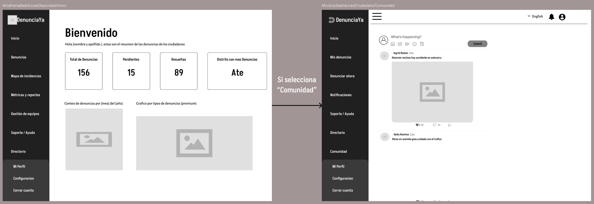

### 4.4.3. Web Applications Mock-ups.

---

##  Pantalla de Login  
**Mock-up**  

**Mock-up Mobile**  
 
**Explicación**  
- **Principios de diseño:** Jerarquía visual clara con logo en la parte superior, formulario centrado y botón principal destacado.  
- **Elementos de diseño:** Colores claros y precisos, tipografía consistente y botones con esquinas redondeadas para mayor accesibilidad.  
- **Diseño inclusivo:** Contraste suficiente entre texto y fondo, etiquetas visibles en los campos, soporte para teclado.  
- **Arquitectura de información:** Flujo simple: logo → email/contraseña → entra al dashboard principal de ciudadano y autoridad.  
- **Design System:** Botón primario con color principal del sistema, tipografía uniforme y campos reutilizables.  

---

## Pantalla de Register  
**Mock-up**  

**Mock-up Mobile**  
 
**Explicación**  
- **Principios de diseño:** Uso de agrupación por proximidad para los campos.  
- **Elementos de diseño:** Campos con iconos de apoyo, botón destacado al final del formulario.  
- **Diseño inclusivo:** Labels claros, mensajes de error accesibles y compatibilidad con lector de pantalla.  
- **Arquitectura de información:** Orden lógico de los datos solicitados (nombre, apellido, correo, contraseña,telefono(opcional) y confirmación).  
- **Design System:** Botón secundario para volver al login(return), estilos de formulario consistentes.  

---

## 3. Pantalla de Payment Card  
**Mock-up**  

**Mock-up Mobile**  
 
**Explicación**  
- **Principios de diseño:** Contraste entre datos de la tarjeta y el fondo, buena alineación.  
- **Diseño inclusivo:** Tamaño de campos adecuado, validación visual clara de errores.  
- **Arquitectura de información:** Flujo secuencial: datos de tarjeta → confirmación → confirmar el pago.  
- **Design System:** Colores corporativos en botones, tarjetas con bordes redondeados, consistencia visual.  

---

## 4. Pantalla de Mis Denuncias 
**Mock-up**  

**Mock-up Mobile**  
 
 
**Explicación**  
- **Principios de diseño:** Listado organizado en filas con jerarquía clara entre N° denuncia,categoria, estado y fecha.  
- **Elementos de diseño:** Colores para estados (verde: resuelto, azul: en proceso, amarillo: pendiente,rojo rechazado, gris en guardado).  
- **Diseño inclusivo:** Iconografía + texto para estado, buena separación visual.  
- **Arquitectura de información:** Ordenado cronológicamente con filtros por estado/categoría.  
- **Design System:** Reutilización de componentes de listado.  

---

## 5. Pantalla de Denunciar Ahora   
**Mock-up**  

**Mock-up Mobile**  
 
**Explicación**  
- **Principios de diseño:** Agrupación por secciones: datos básicos, descripción, adjuntos.  
- **Elementos de diseño:** Botón de adjuntar archivos, área de texto amplia.  
- **Diseño inclusivo:** Instrucciones claras, ayudas contextuales, validación accesible.  
- **Arquitectura de información:** Flujo guiado paso a paso.  
- **Design System:** Campos y botones reutilizados de otros formularios.  

---

## 6. Pantalla de Detalles de la Denuncia
**Mock-up**  

**Mock-up Mobile**  
 
**Explicación**  
- **Principios de diseño:** Línea de tiempo horizontal con estados en orden cronológico.  
- **Elementos de diseño:** Íconos de estado, colores diferenciados.  
- **Diseño inclusivo:** Texto acompañando a cada ícono para claridad.  
- **Arquitectura de información:** Organización secuencial que refleja el progreso.  
- **Design System:** Timeline consistente con estilo de tarjetas y colores institucionales.  

---

## 7. Pantalla de Community   
**Mock-up**  
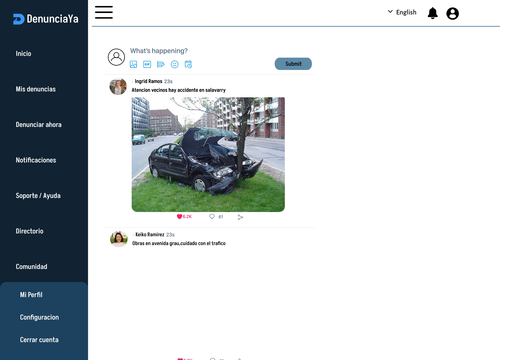
**Mock-up Mobile**  
 
**Explicación**  
- **Principios de diseño:** Uso de tarjetas para cada post, jerarquía clara entre usuario, texto e interacciones.  
- **Elementos de diseño:** Íconos reconocibles (me gusta, comentar, compartir).  
- **Diseño inclusivo:** Texto alternativo para imágenes, interacciones accesibles vía teclado.  
- **Arquitectura de información:** Feed con scroll vertical y orden cronológico.  
- **Design System:** Botones e íconos consistentes con los demás módulos.  

---

## 8. Pantalla de Editar Denuncia  
**Mock-up**  

**Mock-up Mobile**  
 

**Explicación**  
- **Principios de diseño:** Campos editables resaltados, botones de acción claramente visibles.  
- **Elementos de diseño:** Ícono de lápiz para edición, botones guardar/cancelar.  
- **Diseño inclusivo:** Mensajes de confirmación accesibles.  
- **Arquitectura de información:** Mantiene el mismo orden de campos que la denuncia original.  
- **Design System:** Reutilización de formularios ya definidos.  

---

## 9. Pantalla de Agregar Responsable 
**Mock-up**  

  **Mock-up Mobile**  
 

**Explicación**  
- **Principios de diseño:** Flujo lógico de datos personales → cargo → contacto.  
- **Elementos de diseño:** Campos iocnos de apoyo (celular, correo).  
- **Diseño inclusivo:** Etiquetas claras y soporte para autocompletar.  
- **Arquitectura de información:** Orden de captura de datos optimizado para usuario.  
- **Design System:** Campos de formulario y botones consistentes con otros módulos.  

---

## 10. Pantalla de Inicio  
**Mock-up**  

  **Mock-up Mobile**  
 

**Explicación**  
- **Principios de diseño:** Uso de visualizaciones claras (barras, pastel) con contraste de colores.  
- **Elementos de diseño:** Gráficas, tarjetas de resumen con métricas clave.  
- **Diseño inclusivo:** Texto acompañando a gráficas, colores accesibles.  
- **Arquitectura de información:** Métricas arriba, gráficas abajo, navegación lateral fija.  
- **Design System:** Gráficas integradas con tipografía y colores de la marca.  

---

## 11. Pantalla de Detalles de Equipo  
**Mock-up**  

  **Mock-up Mobile**  
 
**Explicación**  
- **Principios de diseño:** Información agrupada en tarjetas (nombre, estado, responsables).  
- **Elementos de diseño:** Íconos de estado, botones de acción.  
- **Diseño inclusivo:** Texto alternativo en imágenes y colores con suficiente contraste.  
- **Arquitectura de información:** Detalle individual en la parte superior, información complementaria en secciones inferiores.  
- **Design System:** Reutilización de componentes de formularios.

### 4.4.4. Web Applications User Flow Diagrams

### User goal: Creación de quejas

#### Happy path:


#### Unhappy path:


### User goal: Directorio de recursos y contactos


### User goal: Historial de seguimiento de quejas


### User goal: Panel de autoridades

#### Happy path:


#### Unhappy path:


### User goal: Authentication y gestión de cuentas

#### Happy path:


#### Unhappy path:


### User goal: Comunidad

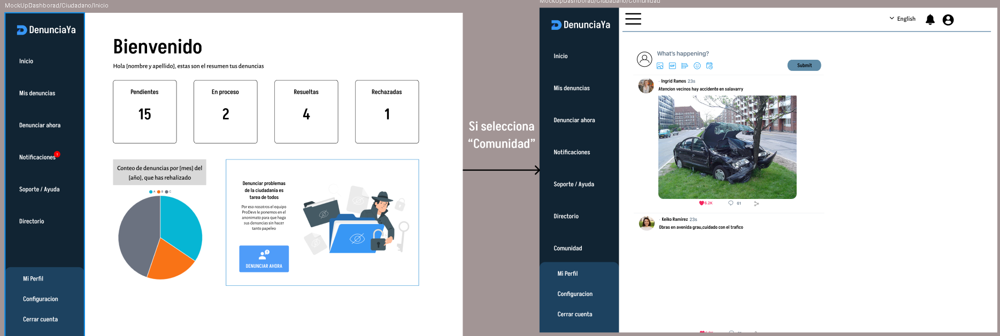

## 4.5. Web Applications Prototyping.

En esta sección se muestran los prototipos de la aplicación web DenunciaYa. Estos prototipos funcionan como representaciones interactivas que permiten a los usuarios visualizar y probar la interfaz antes de su implementación definitiva. Ofrecen una comprensión clara sobre la navegación, la organización de los elementos y las principales funcionalidades de la aplicación.

Módulos principales:

- Mis Denuncias – Sección destinada a la visualización y gestión de las denuncias registradas.

- Denunciar Ahora – Funcionalidad para la creación y envío de nuevas denuncias.

- Notificaciones – Módulo encargado de la gestión de alertas y actualizaciones de la aplicación.

- Ayuda y Soporte – Apartado con preguntas frecuentes y canales de contacto con el equipo de soporte.

- Directorio – Espacio que centraliza información y recursos relacionados con las denuncias.

- Comunidad – Sección orientada a la interacción entre usuarios mediante publicaciones y comunicación constante.


**Link del prototipo:** https://acortar.link/sb0GMy

#### Exposicion del prototipo 

A continuación, se presentará un video que expone el prototipo de DenunciaYa. En él se explicará en detalle cada una de las opciones del prototipo y cómo estas se implementarán en la aplicación frontend.


**Link del video:** https://acortar.link/IFlkZq


Web Aplication Prototyping Web Broswer Mobile 


link del Web Broswer Mobile en figma: https://www.figma.com/proto/ZoYnEmqqHBoCxPxLuVJJsg/DenunciaYa--Figma?node-id=187-13524&p=f&t=OaYMeQfkVqIwWOwI-0&scaling=scale-down&content-scaling=fixed&page-id=4%3A2390&starting-point-node-id=187%3A13524&show-proto-sidebar=1


link del video: https://upcedupe-my.sharepoint.com/:v:/g/personal/u202214214_upc_edu_pe/EcOYs3tWsYlAn8AZg2On-S4BEbvQwjJU5MeJHtJeR29Umg?nav=eyJyZWZlcnJhbEluZm8iOnsicmVmZXJyYWxBcHAiOiJTdHJlYW1XZWJBcHAiLCJyZWZlcnJhbFZpZXciOiJTaGFyZURpYWxvZy1MaW5rIiwicmVmZXJyYWxBcHBQbGF0Zm9ybSI6IldlYiIsInJlZmVycmFsTW9kZSI6InZpZXcifX0%3D&e=MYOiXr

## 4.6. Domain-Driven Software Architecture.

### 4.6.1. Design-Level Event Storming.

En esta sección se presenta el Design-Level EventStorming realizado para DenunciaYa. A través de esta actividad se identificaron con mayor detalle los eventos de dominio, comandos, actores, agregados, vistas y procesos de negocio que conforman cada Bounded Context. El resultado permite visualizar de forma clara la dinámica interna de cada contexto y cómo se relacionan entre sí, facilitando un entendimiento más profundo del dominio.

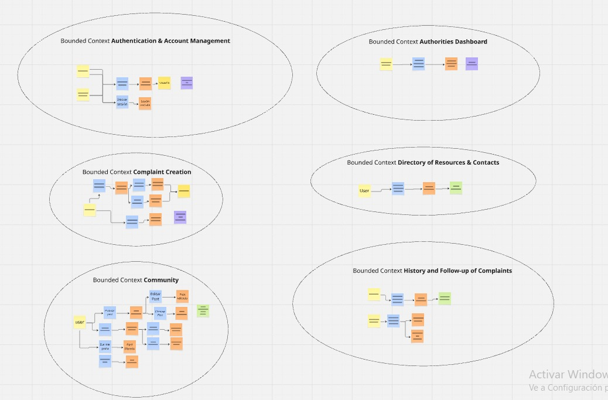

**Link del miro: https://acortar.link/eh5Gx6**

### 4.6.2. Software Architecture Context Diagram.

A continuación, se presenta el diagrama de contexto para el sistema DenunciaYa. Este nivel muestra cómo la plataforma se relaciona con los segmentos objetivos principales: los ciudadanos, que reportan incidencias urbanas y actos de corrupción, y las autoridades municipales, que gestionan dichos reportes. También se ilustra la interacción entre los usuarios y el sistema a través de la aplicación web

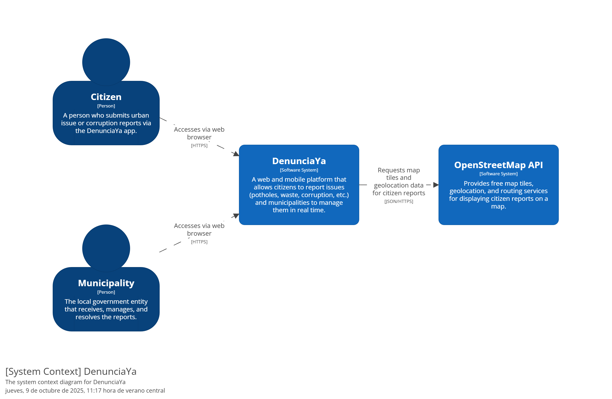

### 4.6.3. Software Architecture Container Diagrams.

A continuación, se presenta el diagrama de contenedores para el sistema DenunciaYa. Este nivel muestra los principales elementos de software que conforman la solución y cómo se relacionan entre sí para ofrecer la experiencia completa a los segmentos objetivos. La aplicación web entrega la interfaz y los recursos estáticos, mientras que la Single Page Application, desarrollada con Angular, proporciona la funcionalidad para ciudadanos y municipios directamente en el navegador. La API Application, implementada con Spring Boot, concentra la lógica de negocio y expone servicios REST para la gestión de denuncias, usuarios, comunidad y paneles de control. Finalmente, la base de datos, implementada en MySQL, almacena la información esencial como denuncias, perfiles, evidencias y datos de gestión municipal.

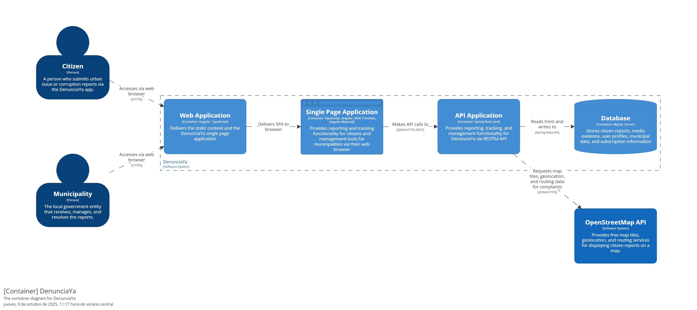

### 4.6.4. Software Architecture Components Diagrams.

A continuación, se presenta el diagrama de componentes para el sistema DenunciaYa. Este nivel muestra los Bounded Contexts definidos dentro de la API Application, cada uno con responsabilidades específicas orientadas a los segmentos objetivos. Se incluyen la gestión de autenticación y cuentas, la creación y el seguimiento de denuncias, los paneles de análisis para autoridades, la interacción social en la comunidad y el directorio de recursos y contactos. Este diagrama refleja cómo los componentes se integran con la base de datos y con la SPA para dar soporte a los principales flujos del sistema.

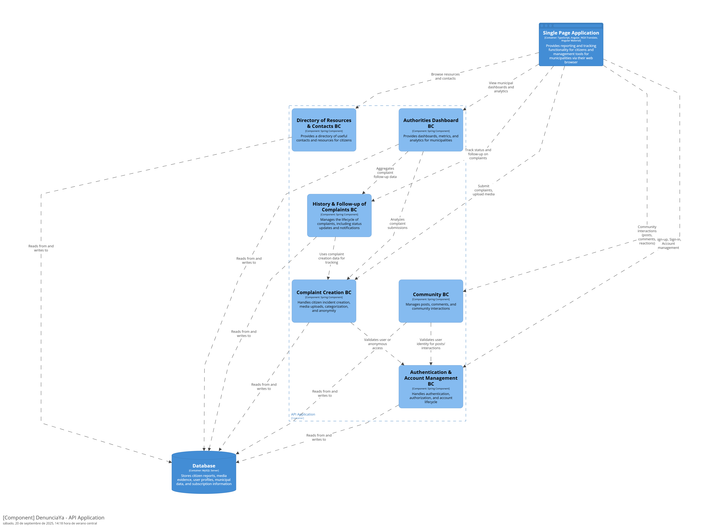

## 4.7. Software Object-Oriented Design.
En esta sección, se detallan los aspectos clave del diseño orientado a objetos de la solución, incluyendo diagramas de
clases y una descripción las entidades principales, sus atributos y métodos. Este enfoque asegura que el sistema sea
modular, escalable y fácil de mantener.

### 4.7.1. Class Diagrams.

En esta sección, se presentan los diagramas de clases que ilustran las principales entidades del sistema, sus atributos y las relaciones entre ellas. Estos diagramas son fundamentales para entender la estructura del software y cómo interactúan los diferentes componentes.

Se considera lo siguiente:
- Atributos en private (-)
- Métodos en public (+)

**COMPLAINT CREATION BOUNDED CONTEXT UML**
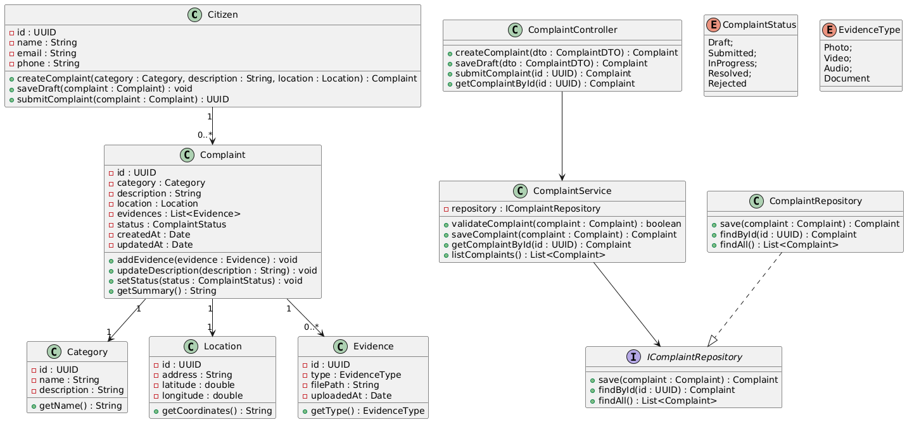

- **Citizen** como actor principal que crea/gestiona denuncias.
- **Complaint** como entidad central con relación a Category, Location y Evidence.
- **Controller**, **Service**, **Repository** con interfaz `IComplaintRepository`.
- **Enums** para `ComplaintStatus` y `EvidenceType`.

**DIRECTORY OF RESOURCES & CONTACTS BOUNDED CONTEXT UML**
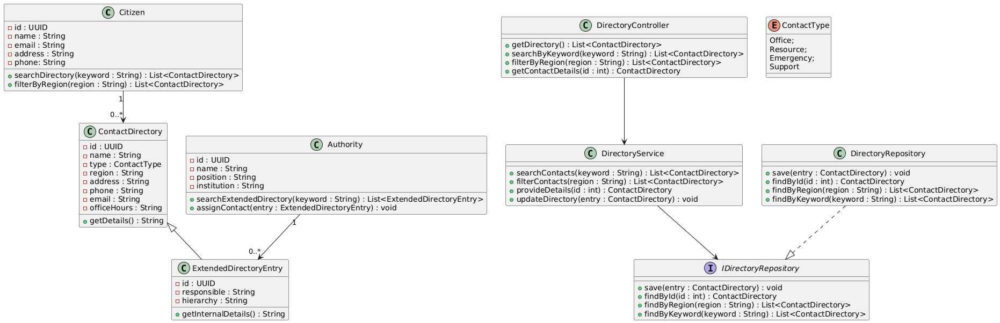

- **Roles principales (Citizen y Authority)** como consumidores.
- **ContactDirectory** para información general.
- **ExtendedDirectoryEntry** para autoridades con datos internos (jerarquías/responsables).
- **Technical layer**: Controller, Service y Repository.
- **Enum ContactType** para clasificar contactos.
- **interfaz** IDirectoryRepository.
- `DirectoryService` no depende directamente de la clase concreta `DirectoryRepository`, sino de la **interfaz**, siguiendo el principio de inversión de dependencias.

**HISTORY AND FOLLOW-UP OF COMPLAINTS BOUNDED CONTEXT UML**
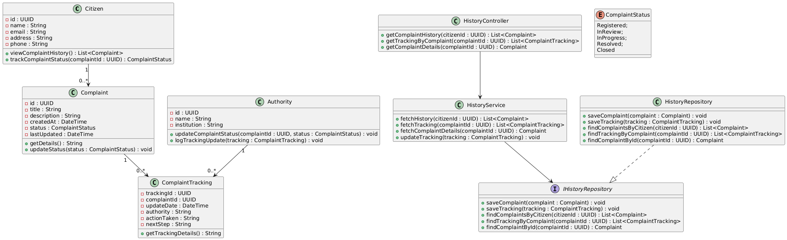
- El **ciudadano** puede ver el historial de denuncias y consultar su estado.
- Cada **denuncia (Complaint)** tiene un estado (`ComplaintStatus`) y múltiples registros de seguimiento (`ComplaintTracking`).
- La **autoridad** actualiza estados y registra acciones.
- La capa de aplicación está organizada con **Controller → Service → Repository (interface + implementación).**

**AUTHORITIES DASHBOARD BOUNDED CONTEXT UML**
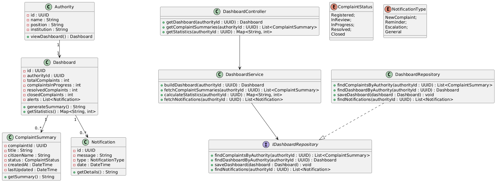

- **Authority** accede a un **Dashboard** personalizado.
- El **Dashboard** muestra estadísticas, alertas y un resumen de denuncias.
- Incluye **ComplaintSummary** (versión ligera de las denuncias para listado rápido).
- Manejo de **notificaciones** asociadas a las denuncias.
- Arquitectura organizada con **Controller → Service → Repository (interface + implementación)**.

**AUTHENTICATION & ACCOUNT MANAGEMENT BOUNDED CONTEXT UML**
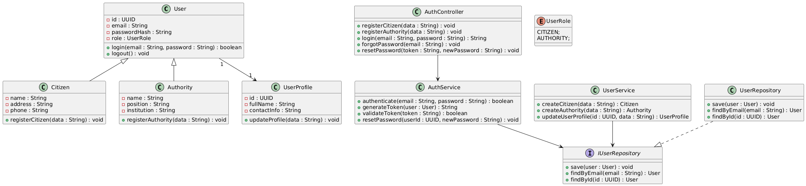

- `User` es la clase base con credenciales y rol.
- `Citizen` y `Authority` heredan de User.
- `UserProfile` maneja la info editable del usuario.
- Se agregan servicios (`AuthService`, `UserService`) y el controlador (`AuthController`).
- El repositorio sigue el patrón `IUserRepository` con su implementación concreta.
- El enum `UserRole` asegura control de permisos.

**COMMUNITY BOUNDED CONTEXT UML**
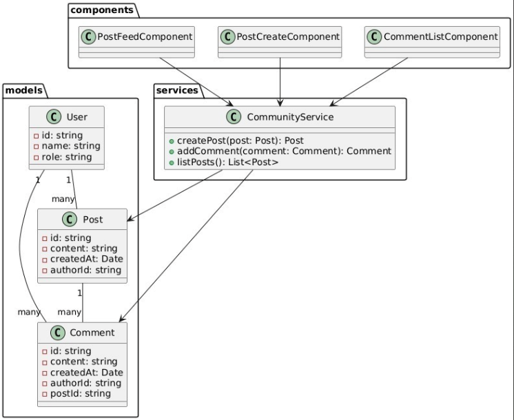


## 4.8. Database Design.

En esta sección, se presenta el diseño de la base de datos para la solución, incluyendo diagramas entidad-relación (ER) y una descripción de las tablas principales, sus atributos y relaciones. Este diseño asegura que los datos se almacenen de manera eficiente y coherente, facilitando el acceso y la gestión de la información.

### 4.8.1. Database Diagrams.

**COMPLAINT CREATION BOUNDED CONTEXT ERD**

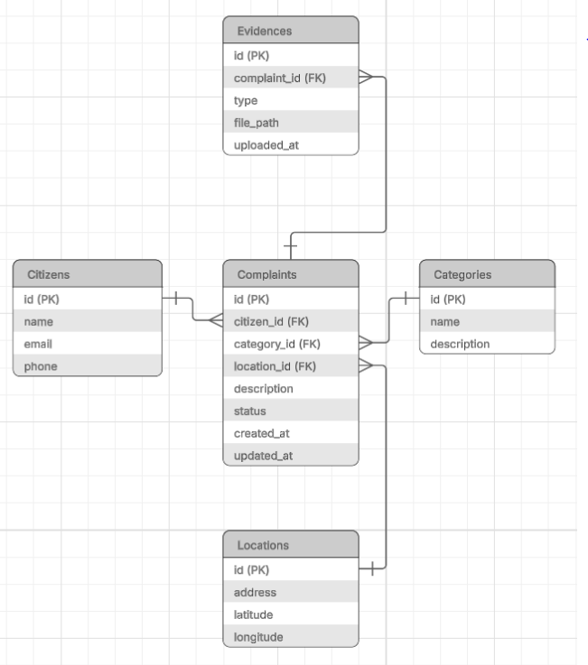

**Tablas y atributos principales**

- Citizens
Almacena la información de los ciudadanos que presentan denuncias.<br>
***Atributos: id, name, email, phone.***

- Complaints
Es la entidad central que representa cada denuncia registrada en el sistema.<br>
***Atributos: id, citizen_id, category_id, location_id, description, status, created_at, updated_at.***

- Categories
Define los tipos de denuncias disponibles (ej: basura, baches, alumbrado).<br>
***Atributos: id, name, description.***

- Locations
Registra la ubicación de la denuncia. <br>
***Atributos: id, address, latitude, longitude.***

- Evidences
Guarda los archivos o pruebas que sustentan una denuncia. <br>
***Atributos: id, complaint_id, type, file_path, uploaded_at.***

**DIRECTORY OF RESOURCES & CONTACTS BOUNDED CONTEXT ERD**

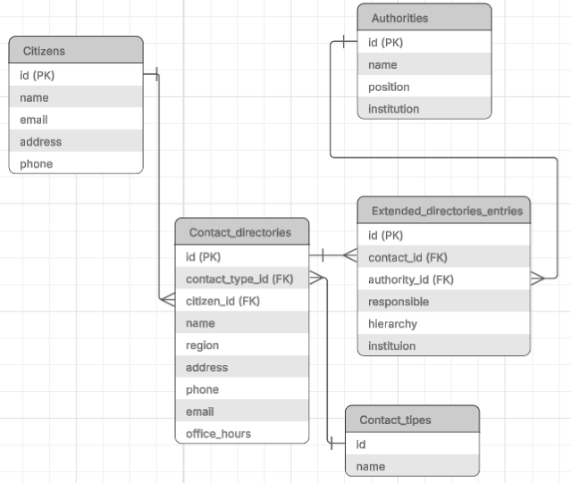

**Tablas y atributos principales**

- Citizens: Registra la información básica de los ciudadanos que consultan o utilizan el directorio de contactos.<br>
***Atributos: id, name, email, address, phone.***

- Contact_directories: Representa los contactos disponibles en el directorio, con sus datos generales y de referencia.<br><br
***Atributos: id, contact_type_id, citizen_id, name, region, address, phone, email, office_hours.***

- Authorities: Contiene los datos de las autoridades relacionadas al directorio.<br>
***Atributos: id, name, position, institution.***

- Extended_directories_entries: Almacena la información extendida de un contacto dentro del directorio, vinculándolo con una autoridad y detallando aspectos internos.<br>
***Atributos: id, contact_id, authority_id, responsible, hierarchy, institution.***

- Contact_types: Tabla de catálogo para clasificar los contactos según su tipo<br>
***Atributos: id, name.***

**HISTORY AND FOLLOW-UP OF COMPLAINTS BOUNDED CONTEXT ERD**

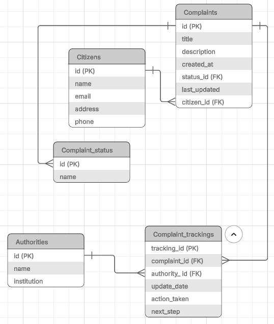

**Tablas y atributos principales**

- **Citizens:** Almacena la información básica de los ciudadanos que presentan denuncias y pueden consultar su historial.  
  **Atributos:** `id`, `name`, `email`, `address`, `phone`.

- **Complaints:** Representa cada denuncia registrada en el sistema, incluyendo su título, descripción, fechas y estado actual.  
  **Atributos:** `id`, `title`, `description`, `created_at`, `status_id`, `last_updated`, `citizen_id`.

- **Complaint_status:** Define los posibles estados de una denuncia dentro de su ciclo de vida (ejemplo: Registered, InReview, InProgress, Resolved, Closed).  
  **Atributos:** `id`, `name`.

- **Authorities:** Contiene la información de las autoridades responsables de dar seguimiento a las denuncias y registrar acciones.  
  **Atributos:** `id`, `name`, `institution`.

- **Complaint_trackings:** Registra el historial de seguimiento de cada denuncia, documentando las actualizaciones realizadas por una autoridad, las acciones tomadas y los próximos pasos.  
  **Atributos:** `tracking_id`, `complaint_id`, `authority_id`, `update_date`, `action_taken`, `next_step`.

**AUTHORITIES DASHBOARD BOUNDED CONTEXT ERD**

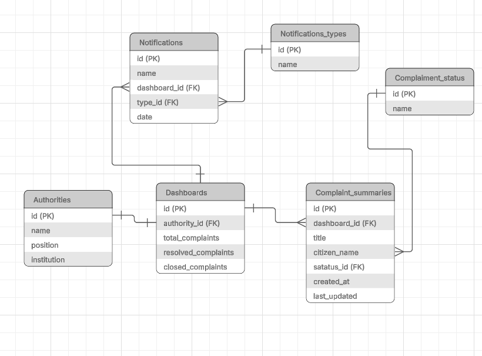

**Tablas y atributos principales**


- **Authorities:** Contiene la información de las autoridades que acceden al dashboard personalizado.  
  **Atributos:** `id`, `name`, `position`, `institution`.

- **Dashboards:** Representa el panel de control de cada autoridad, mostrando estadísticas de las denuncias asignadas.  
  **Atributos:** `id`, `authority_id`, `total_complaints`, `resolved_complaints`, `closed_complaints`.

- **Complaint_summaries:** Almacena una versión ligera de las denuncias para listados rápidos en el dashboard, incluyendo datos básicos y el estado actual.  
  **Atributos:** `id`, `dashboard_id`, `title`, `citizen_name`, `status_id`, `created_at`, `last_updated`.

- **Complaint_status:** Tabla de catálogo que define los posibles estados de una denuncia (ejemplo: *Registered, InReview, InProgress, Resolved, Closed*).  
  **Atributos:** `id`, `name`.

- **Notifications:** Registra las notificaciones asociadas al dashboard de una autoridad, indicando mensajes y fechas.  
  **Atributos:** `id`, `dashboard_id`, `type_id`, `message`, `date`.

- **Notifications_types:** Tabla de catálogo que clasifica las notificaciones según su naturaleza (ejemplo: *NewComplaint, Reminder, Escalation, General*).  
  **Atributos:** `id`, `name`.

**AUTHENTICATION & ACCOUNT MANAGEMENT BOUNDED CONTEXT ERD**

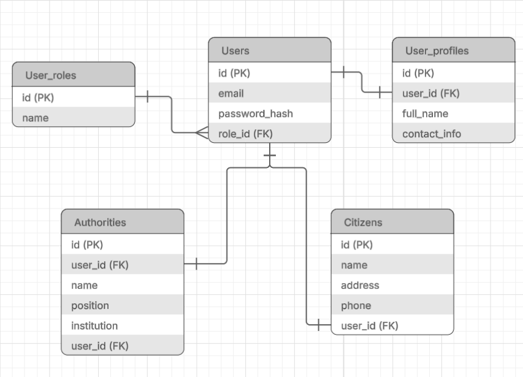

**Tablas y atributos principales**

- **User_roles:** Tabla de catálogo que define los roles disponibles dentro del sistema (ejemplo: *CITIZEN, AUTHORITY*).  
  **Atributos:** `id`, `name`.

- **Users:** Tabla base que almacena las credenciales y rol de cada usuario en el sistema.  
  **Atributos:** `id`, `email`, `password_hash`, `role_id`.

- **User_profiles:** Contiene la información editable y de contacto asociada a cada usuario.  
  **Atributos:** `id`, `user_id`, `full_name`, `contact_info`.

- **Citizens:** Tabla que hereda de `Users` y almacena información específica de los ciudadanos registrados.  
  **Atributos:** `id`, `user_id`, `name`, `address`, `phone`.

- **Authorities:** Tabla que hereda de `Users` y almacena información específica de las autoridades.  
  **Atributos:** `id`, `user_id`, `name`, `institution`, `position`.

**COMMUNITY BOUNDED CONTEXT ERD**

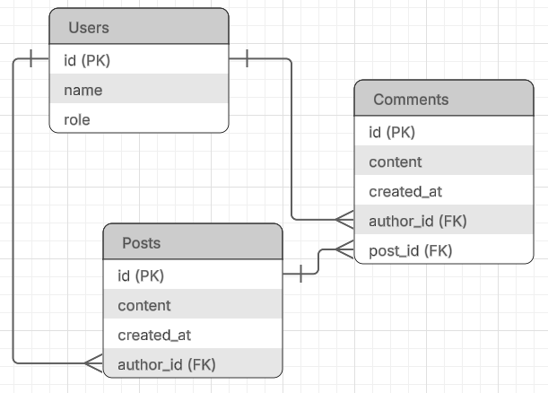

**Tablas y atributos principales**

- **Users:** Almacena la información de los usuarios registrados en la comunidad.  
  **Atributos:** `id`, `name`, `role`.

- **Posts:** Representa las publicaciones creadas por los usuarios dentro de la comunidad.  
  **Atributos:** `id`, `content`, `created_at`, `author_id`.

- **Comments:** Registra los comentarios hechos por los usuarios en relación a un post.  
  **Atributos:** `id`, `content`, `created_at`, `author_id`, `post_id`.

# Capítulo V: Product Implementation, Validation & Deployment.

En este capítulo se detallará la implementación del producto, la validación y la configuración de despliegue del
software.

## 5.1. Software Configuration Management.

En este apartado, se detallan las herramientas y configuraciones empleadas para mantener la consistencia y organización
del entorno de desarrollo durante el ciclo de vida del proyecto. La gestión de la configuración del software es crucial
para asegurar que todos los miembros del equipo trabajan de manera coordinada, utilizando las mismas versiones de
herramientas y respetando las convenciones establecidas. Esta sección abarca desde la configuración del entorno de
desarrollo hasta la gestión del código fuente y el despliegue de la solución.

### 5.1.1. Software Development Environment Configuration.

#### Project Management

**Discord:**<br>
Discord ha sido la herramienta principal de comunicación y coordinación del equipo. Se ha utilizado para realizar
reuniones virtuales, mantener discusiones continuas sobre el progreso del proyecto, y para compartir recursos y
actualizaciones de forma eficiente.<br>
**Ruta de referencia:** www.discord.com/

**Trello:**<br>
Trello se ha para la gestión del proyecto, permitiendo la visualización y actualización del estado de tareas y sprints
en los que trabaja el equipo. Aunque su uso ha sido ocasional, ha proporcionado una estructura básica para el
seguimiento de actividades.
<br> **Ruta de referencia:
** https://trello.com/invite/b/68c01f0af7dc026747b717e0/ATTId2a59168991076607501cc44ce36c36889169CFD/prodevs

**Product UX/UI Design**<br>
Para la elaboración de la interfaz de usuario y la experiencia de usuario, se emplearán las siguientes herramientas:

- **Figma:**<br> Una plataforma colaborativa de diseño que permite la creación de wireframes, mock-ups y prototipos
  interactivos. Será utilizada para diseñar tanto las interfaces de usuario como los flujos de interacción de la
  aplicación.
- LucidChart: Herramienta de diagramación en línea que será utilizada para la elaboración de wireflows y user flows,
  facilitando la visualización y planificación de las interacciones y navegaciones dentro de la aplicación.

**Rutas de referencia:**<br>

- https://www.figma.com/design/ZoYnEmqqHBoCxPxLuVJJsg/DenunciaYa--Figma?node-id=0-1&t=Y8rN524Bxh5u0uG8-1
- www.lucidchart.com/

**Software Development**<br>
Para el desarrollo del software, se han seleccionado las siguientes herramientas y tecnologías, con el fin de
proporcionar un entorno robusto y eficiente para el desarrollo del proyecto:

- **WebStorm:**<br> Un entorno de desarrollo integrado (IDE) potente y completo, que ofrece herramientas avanzadas para
  el desarrollo de aplicaciones. Será utilizado para escribir, depurar y gestionar el código del proyecto, aprovechando
  sus características de soporte para múltiples lenguajes y sistemas de control de versiones.
- **HTML5:**<br> El lenguaje estándar de marcado para la creación de páginas web. Será empleado en el desarrollo del
  frontend de la aplicación, estructurando el contenido de manera semántica y accesible.
- **CSS:**<br> Hojas de estilo en cascada utilizadas para diseñar y estilizar la presentación visual de la aplicación
  web. Permitirá definir el diseño responsivo y adaptativo del frontend.
- **TypeScript:**<br> Un superconjunto tipado de JavaScript que proporciona una mayor seguridad y productividad en el
  desarrollo de aplicaciones web. Será utilizado en el frontend para mejorar la calidad y mantenibilidad del código.
- **Angular:**<br> Un framework de desarrollo de aplicaciones web de código abierto, mantenido por Google. Será
  utilizado para la creación del frontend de la aplicación, aprovechando su estructura modular y su capacidad de
  creación de componentes reutilizables.
- **Java:** <br> Un lenguaje de programación orientado a objetos, ampliamente utilizado para el desarrollo de
  aplicaciones backend. Será empleado para la lógica del servidor y la gestión de datos.
- **Spring Boot:**<br> Un framework basado en Java que facilita la creación de aplicaciones independientes y de
  producción. Será utilizado para desarrollar el backend de la aplicación, proporcionando una configuración simplificada
  y una integración fluida con bases de datos y servicios web.

**Rutas de referencia:**<br>

- www.jetbrains.com/webstorm/
- https://www.w3schools.com/html/html5_syntax.asp
- https://google.github.io/styleguide/htmlcssguide.html
- www.typescriptlang.org/
- https://angular.dev/style-guide
- https://google.github.io/styleguide/javaguide.html

**Software Deployment**

En esta sección, se detallan las herramientas y plataformas utilizadas para el despliegue de las aplicaciones
desarrolladas, garantizando que estén accesibles y operativas en el entorno de producción.

- **GitHub Pages:**<br>Un servicio de alojamiento web estático que se integra con los repositorios de GitHub. Será
  utilizado para desplegar la landing page del proyecto, proporcionando un enlace accesible para los usuarios finales.
  <br>**Rutas de referencia:**
  https://docs.github.com/es/pages

**Software Documentation**

En esta sección, se especifican las herramientas utilizadas para la documentación del software, proporcionando un
registro detallado de los aspectos técnicos y funcionales del proyecto.

- **GitHub:** Además de servir como plataforma para el control de versiones y la colaboración en el código, GitHub
  también se utiliza para alojar la documentación del proyecto. Los miembros del equipo pueden acceder y actualizar la
  documentación a través de los repositorios del proyecto.
  <br>**Ruta de referencia:**
  https://github.com/orgs/1ASI0729-7401-2520-Prodevs-DenunciaYa/repositories

### 5.1.2. Source Code Management.

El equipo utilizará GitHub como plataforma principal para el control de versiones, implementando el modelo GitFlow. A
continuación, se describen los medios y el esquema de organización que se aplicarán para el seguimiento de
modificaciones:

**Repositorios de GitHub**

- Landing Page: https://github.com/1ASI0729-7401-2520-Prodevs-DenunciaYa/DenunciaYa-Landing-Page
- Project Report: https://github.com/1ASI0729-7401-2520-Prodevs-DenunciaYa/DenunciaYa-Proyect-Report
- Front-end:
- Back-end:

Cada repositorio alojará el código fuente correspondiente a su respectivo producto.

**Implementación de GitFlow**

Se implementará el modelo GitFlow para el control de versiones, siguiendo las convenciones establecidas por Vincent
Driessen en su artículo "A successful Git branching model". El esquema de ramas incluirá:

- **Main branch:** La rama principal donde se alojarán las versiones estables del proyecto.
- **Develop branch:** Rama de desarrollo donde se integran las nuevas funcionalidades antes de pasar a la rama
  principal.
- **Feature branches:** Cada nueva característica o capítulo desarrollado por el equipo se trabajará en una rama
  específica. Las convenciones para nombrar estas ramas seguirán un patrón descriptivo, por ejemplo, feat/chapter-5.
- **Release branches:** Ramas destinadas a preparar una nueva versión para el lanzamiento, siguiendo el esquema de
  versionado semántico.
- **Hotfix branches:** Ramas para corregir errores críticos en versiones ya lanzadas, aplicando convenciones similares a
  las usadas en las Release branches.

**Conventional Commits**

El equipo aplicará las convenciones de Conventional Commits para los mensajes de commit, asegurando que cada cambio en
el código sea fácilmente comprensible y rastreable. Los mensajes seguirán la estructura:

- **tipo(scope):** mensaje
- **Tipo:** indica la naturaleza del cambio (e.g., feat, fix, chore).
- **Scope:** define la sección del código afectada (e.g., ui, backend).
- **Mensaje:** descripción concisa del cambio realizado.

### 5.1.3. Source Code Style Guide & Conventions.

**HTML**

- **Estructura del Documento:** Declara el tipo de documento en la primera línea: `<!DOCTYPE html>`. Usa una estructura
  de etiqueta HTML válida: `<html>`, `<head>`, `<body>`. Cierra todos los elementos HTML: `<p>Texto</p>.`
- **Comentarios:** Escribe comentarios en una sola línea cuando sean cortos. Usa comentarios para secciones importantes:
  `<!-- Inicio de la sección de navegación -->`.
- **Atributos:** Usa comillas dobles para los valores de los atributos: ``.
  Especifica siempre los atributos alt y las dimensiones width y height en las imágenes.
- **Indentación y Espaciado:** Usa dos espacios para la indentación. No uses espacios alrededor de los signos de igual
  en los atributos.

**CSS**

- **Indentación y Espaciado:** Usa dos espacios para la indentación; no uses tabulaciones. El código CSS debe estar en
  minúsculas.
- **Comentarios:** Usa comentarios para explicar secciones complejas del código.
- **Nombres de Clases:** Utiliza nombres de clase significativos que reflejen el propósito del elemento. Evita los
  nombres de clases genéricos como .box o .container.
- **Organización:** Agrupa las reglas CSS relacionadas en un solo bloque.

**JavaScript**

- **Indentación y Espaciado:** Usa dos espacios para la indentación. Mantén un espacio después de las comas y antes de
  los corchetes de apertura.
- **Comentarios:** Usa comentarios para explicar la lógica del código, especialmente en bloques complejos.
- **Nombres de Variables y Funciones:** Usa nombres descriptivos y en camelCase para variables y funciones. Por ejemplo,
  getUserInfo en lugar de getuserinfo.
- **Estructura del Código:** Usa funciones y módulos para mantener el código organizado y reutilizable. Evita el uso de
  código no utilizado y realiza limpieza regularmente.

**TypeScript**

- **Indentación y Espaciado:** Usa dos espacios para la indentación. Sigue el formato recomendado por el estándar
  TypeScript.
- **Comentarios:** Usa comentarios para describir el propósito de las funciones y las interfaces.
- **Nombres de Variables y Funciones:** Usa camelCase para variables y funciones. Usa PascalCase para nombres de clases
  e interfaces.
- **Tipos:** Especifica tipos explícitos en las variables y las funciones para mayor claridad y seguridad de tipo.

**Java**

- **Indentación y Espaciado:** Usa cuatro espacios para la indentación. Sigue las convenciones de espaciado estándar en
  el código Java.
- **Comentarios:** Usa comentarios Javadoc para documentar clases y métodos.
- **Nombres de Variables y Funciones:** Usa camelCase para nombres de variables y métodos. Usa PascalCase para nombres
  de clases.
- **Organización del Código:** Sigue la estructura de paquetes recomendada y organiza el código en clases y métodos
  claros.

**Gherkin (para archivos .feature)**

- **Estructura de las Características:** Usa Feature, Scenario, Given, When, Then para estructurar los archivos
  .feature.
- **Nombres y Descripciones:** Usa descripciones claras y concisas en inglés. Usa un formato de verbo en presente para
  los pasos del escenario.

### 5.1.4. Software Deployment Configuration.

**Landing Page**

Para desplegar la Landing Page del proyecto, se utilizará GitHub Pages como servicio de hosting estático. A continuación
se detallan los pasos de configuración y despliegue:

1. **Creación del repositorio**
    - Dentro de la organización "1ASI0729-7401-2520-Prodevs-DenunciaYa", se creará un nuevo repositorio llamado "
      DenunciaYa-Landing-Page".
2. **Carga del código fuente**
    - El código de la Landing Page se subirá al repositorio utilizando Git, siguiendo las convenciones de commits
      establecidas por el equipo.
    - La estructura de carpetas será la siguiente:
    ``` 
    index.html
    docs/
       css/
       js/
       images/
   ```
3. **Configuración de GitHub Pages**
    - En la configuración del repositorio, se habilitará GitHub Pages
    - Se seleccionará la rama `main` y la carpeta raíz (`root`) como fuente de publicación.

4. **Acceso a la Landing Page**
    - Una vez configurado, la página estará disponible en la URL generada automáticamente por GitHub Pages, con el
      siguiente formato:
      `https://<username>.github.io/<repository-name>/`
5. **Actualizaciones y mantenimiento**
    - Cualquier modificación en el código fuente se subirá a la rama `main`.
    - GitHub Pages actualizará automáticamente la Landing Page con la última versión del código.

## 5.2. Landing Page, Services & Applications Implementation.

En esta sección, explicamos y documentamos el proceso de implementación, pruebas, documentación y despliegue de la
Landing Page, Web Services y Frontend Web Applications. A medida que avanzamos en el desarrollo, desglosamos el trabajo
en secciones específicas para cada Sprint, comenzando con el Sprint 1.

### 5.2.1. Sprint 1

Es fundamental que el equipo dedique especial atención a la identificación del Sprint Goal, siguiendo las guías
establecidas por el Scrum Guide. El Sprint Goal debe enfocarse en el negocio o en la perspectiva de los usuarios,
buscando la entrega de un nuevo feature o un set de features.
Para nuestro Sprint, utilizamos la estructura sugerida por Scrum.org para redactar el Sprint Goal.

### 5.2.1.1. Sprint Planning 1.

En el Sprint #1, que comienza el 13/09/2025, nos enfocaremos en desarrollar una landing page para Denuncia-Ya. El
objetivo es crear una página que no solo capte la atención de los visitantes, sino que también transmita claramente los
beneficios de nuestro producto. Este sprint estará dedicado al diseño y desarrollo de la landing page para cumplir con
nuestros objetivos estratégicos.

| **Sprint #**                    | Sprint 1                                                                                                                                                                                                                                                                                                                                                                                                                                    |
|---------------------------------|---------------------------------------------------------------------------------------------------------------------------------------------------------------------------------------------------------------------------------------------------------------------------------------------------------------------------------------------------------------------------------------------------------------------------------------------|
| Sprint Planning Background      |                                                                                                                                                                                                                                                                                                                                                                                                                                             |
| Date                            | 13/09/2025                                                                                                                                                                                                                                                                                                                                                                                                                                  |
| Time                            | 10:00-12:00                                                                                                                                                                                                                                                                                                                                                                                                                                 |
| Location                        | Virtual via discord                                                                                                                                                                                                                                                                                                                                                                                                                         |
| Prepared By                     | Gabriel Anthony Braithuaite Toledo, Omar Harold Rivera Ticllacuri                                                                                                                                                                                                                                                                                                                                                                           |
| Attendees (to planning meeting) | Gabriel Anthony Braithuaite Toledo, Omar Harold Rivera Ticllacuri, Gabriel Cristian Mamani Marca, Franco Diego Rioja Nuñez, Augusto Sebastian Montes Maza                                                                                                                                                                                                                                                                                   |
| Sprint Goal & User Stories      |                                                                                                                                                                                                                                                                                                                                                                                                                                             |
| Sprint 1 Goal                   | **Our focus is on** delivering the first version of the Denuncia-Ya landing page to present the platform’s purpose and main functionalities.<br> **We believe it delivers** initial visibility and credibility to potential citizens and authorities interested in the platform. <br>**This will be confirmed when** visitors can access the landing page, understand the service offering, and navigate the basic sections without errors. |
| Sprint 1 Velocity               | El equipo ha establecido una capacidad de 20 story points para este sprint, basándose en la experiencia previa y la complejidad de las tareas planificadas.                                                                                                                                                                                                                                                                                 |
| Sum of Story Points             | 19                                                                                                                                                                                                                                                                                                                                                                                                                                          |

### 5.2.1.2. Aspect Leaders and Collaborators.

En este primer Sprint, los principales aspectos considerados corresponden al desarrollo y despliegue de la primera
versión del Landing Page de Denuncia-Ya.
Los aspectos clave incluyen:

- **Diseño de interfaz básica** (estructura de la landing, secciones informativas).
- **Contenido de la landing** (texto descriptivo, mensajes clave, misión del producto).
- **Implementación técnica** (configuración de frontend, HTML/CSS/JS).
- **Pruebas funcionales básicas** (verificar navegación, carga de secciones y responsividad).
- **Gestión de despliegue** (subida a un entorno accesible para los usuarios).

| Team Member (Last Name, First Name) | GitHub Username | Diseño de Interfaz | Contenido de la Landing | Implementación Técnica | Pruebas Funcionales | Despliegue |
|-------------------------------------|-----------------|--------------------|-------------------------|------------------------|---------------------|------------|
| Omar Harold Rivera Ticllacuri       | TicSide         | **L**              | **L**                   | C                      | C                   |            |
| Gabriel Anthony Braithuaite Toledo  | Gaboo04         | C                  | **L**                   | C                      | C                   | **L**      |
| Franco Diego Rioja Nuñez            | FrancoDiegoR    | C                  | C                       | **L**                  | C                   |            |
| Gabriel Cristian Mamani Marca       | Gabrlel0105     | C                  | C                       | C                      | **L**               |            |
| Augusto Sebastian Montes Maza       | asmmaza         | C                  | C                       | C                      | C                   |            |

### 5.2.1.3. Sprint Backlog 1.

El Sprint Backlog para el Sprint #1 tiene como objetivo definir las tareas que se deben realizar para cumplir con el
objetivo principal, el cual es desarrollar y desplegar la primera versión del Landing Page de Denuncia-Ya. A
continuación, se detallan las historias de usuario seleccionadas para este sprint, junto con sus respectivas
estimaciones, asignaciones y estados.

| Sprint #   | Sprint n                  |                  |                                     |                                                                                                                             |                    |                               |                                             |
|------------|---------------------------|------------------|-------------------------------------|-----------------------------------------------------------------------------------------------------------------------------|--------------------|-------------------------------|---------------------------------------------|
| User Story |                           | Work-Item / Task |                                     |                                                                                                                             |                    |                               |                                             |
| Id         | Title                     | Id               | Title                               | Description                                                                                                                 | Estimation (Hours) | Assigned To                   | Status (To-do /In-Process /To-Review /Done) |
| US2        | Sección “Home”            | WI1              | Implementación de la sección Home   | Implementar Una sección en la cual se muestra el contenido principal, un slogan y una breve descripción del producto.       | 2                  | Omar Harold Rivera Ticllacuri | Done                                        |
| US3        | Llamado a la acción (CTA) | WI2              | Implementación del CTA              | Implementar un botón de llamado a la acción (CTA) que dirija a los usuarios a registrarse o aprender más sobre el producto. | 2                  | Omar Harold Rivera Ticllacuri | Done                                        |
| US1        | Sección “How it works”    | WI3              | Implementación de How it works      | Implementar una sección que explique cómo funciona el producto, utilizando texto e ilustrando el proceso.                   | 3                  | Franco Diego Rioja Nuñez      | Done                                        |
| US4        | Seccion About us          | WI4              | Implementación de About us          | Implementar una sección que describa la misión, visión y valores de la empresa.                                             | 3                  | Gabriel Anthony Braithuaite   | Done                                        |
| US5        | Sección Testimonials      | WI5              | Implementación de Testimonials      | Implementar una sección que muestre testimonios de usuarios o clientes satisfechos con el producto.                         | 3                  | Gabriel Cristian Mamani Marca | Done                                        |
| US6        | Sección News & Blog       | WI6              | Implementación de News & Blog       | Implementar una sección que presente noticias, artículos o blogs relacionados con el producto o la industria.               | 3                  | Augusto Sebastian Montes Maza | Done                                        |
| US7        | Sección de Soporte        | WI7              | Implementación de Soporte           | Implementar una sección que ofrezca soporte al usuario, incluyendo preguntas frecuentes y opciones de contacto.             | 3                  | Omar Harold Rivera Ticllacuri | Done                                        |
| US8        | Sección de Contacto       | WI8              | Implementación de Contacto          | Implementar una sección que permita a los usuarios ponerse en contacto con la empresa a través de un correo.                | 2                  | Omar Harold Rivera Ticllacuri | Done                                        |
| TS1        | Responsive Design         | WI9              | Implementación de diseño responsivo | Asegurar que la landing page sea completamente responsiva y se vea bien en dispositivos móviles y de escritorio.            | 2                  | Omar Harold Rivera Ticllacuri | Done                                        |

### 5.2.1.4. Development Evidence for Sprint Review.

Durante el Sprint #1, el equipo se centró en desarrollar y desplegar la primera versión del Landing Page de Denuncia-Ya.
A continuación, se presentan las evidencias de desarrollo que respaldan los logros alcanzados durante este sprint.

| Repository                           | Branch  | Commit Id | Commit Message                                                    | Commit Message Body                                               | Commited on (Date) |
|--------------------------------------|---------|-----------|-------------------------------------------------------------------|-------------------------------------------------------------------|--------------------|
| TicSide/DenunciaYa-Landing-Page      | develop | 77fa8f9   | fix(index): delete errors                                         | fix(index): delete errors                                         | 19/09/2025         |
| FrancoDiegoR/DenunciaYa-Landing-Page | develop | ab01789   | feat(index): added how it works section                           | feat(index): added how it works section                           | 19/09/2025         |
| Gaboo04/DenunciaYa-Landing-Page      | develop | ea759db   | fix(index): improve HTML structure and formatting for readability | fix(index): improve HTML structure and formatting for readability | 19/09/2025         |
| Gabrlel0105/DenunciaYa-Landing-Page  | develop | 69bd440   | feat: add testimonials                                            | feat: add testimonials                                            | 19/09/2025         |
| asmmaza/DenunciaYa-Landing-Page      | develop | 9a422b1   | index.html                                                        | blog-section                                                      | 20/09/2025         |

### 5.2.1.5. Execution Evidence for Sprint Review.

### 5.2.1.6. Services Documentation Evidence for Sprint Review.

En este Sprint, el enfoque principal del equipo se centró en el desarrollo y despliegue de la página de aterrizaje (landing page) de Denuncia-Ya. Este objetivo, cuidadosamente definido en la planificación, no incluyó la implementación de ningún servicio web ni de una API. Por lo tanto, no se generó ninguna documentación relacionada con la definición de endpoints, esquemas de datos o protocolos de comunicación. La arquitectura del proyecto en esta fase inicial se mantiene en una capa de presentación simple y estática. La implementación de la lógica de negocio y los servicios de backend se abordarán en Sprints futuros, una vez que se establezca una base sólida para el frontend. Esto asegura que el equipo se mantenga enfocado en los objetivos del sprint actual, evitando la dispersión de esfuerzos y optimizando la entrega de valor incremental.

### 5.2.1.7. Software Deployment Evidence for Sprint Review.

El despliegue exitoso de la primera versión de la Landing Page de Denuncia-Ya fue un hito crucial en este Sprint. Se utilizó GitHub Pages como la plataforma de alojamiento estático, una elección estratégica que capitalizó la integración nativa con nuestro sistema de control de versiones y simplificó el proceso de publicación. A continuación, se detalla el proceso paso a paso y la evidencia de su finalización.

1. **Creación del repositorio**
    - Se creó el repositorio "DenunciaYa-Landing-Page" dentro de la organización 1ASI0729-7401-2520-Prodevs-DenunciaYa
      en GitHub.
    - **Evidencia:** 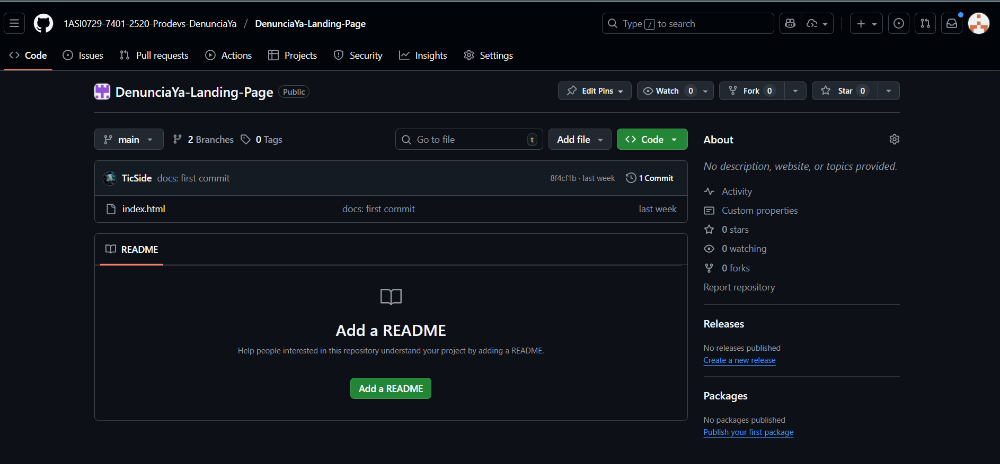
2. **Carga del código fuente**
    - Se subió el código fuente al repositorio mediante Git.
    - La estructura de carpetas utilizada fue:
    ```
    index.html
    docs/
       css/
       js/
       images/
    ```
   - **Evidencia:** 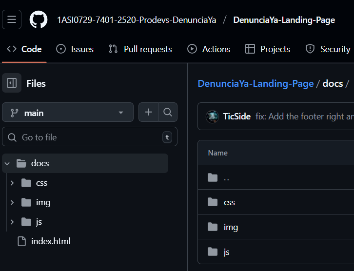
3. **Configuración de GitHub Pages**
    - En la configuración del repositorio, se habilitó GitHub Pages
    - Se seleccionó la rama `main` y la carpeta raíz (`root`) como fuente de publicación.
    - **Evidencia:** 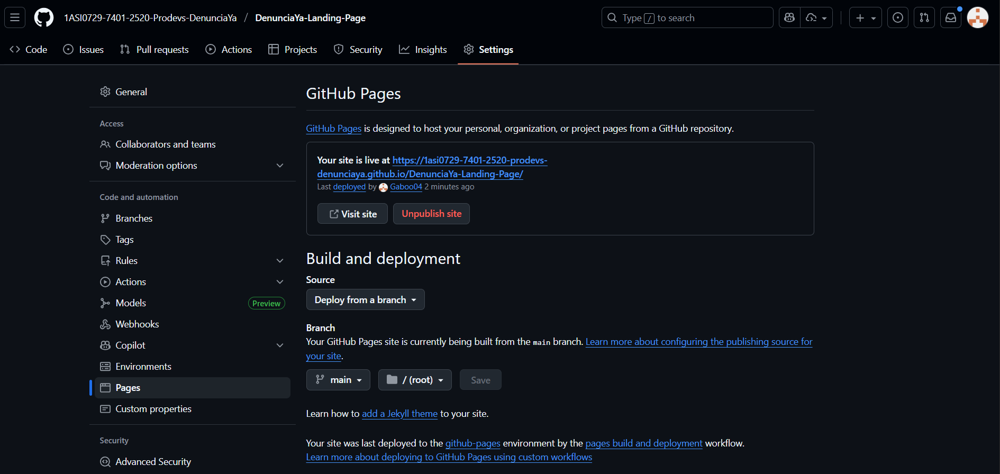
4. **Publicación de la Landing Page**
    - Tras la configuración, GitHub Pages generó automáticamente la URL pública de acceso.
    - La página quedó disponible en: https://1asi0729-7401-2520-prodevs-denunciaya.github.io/DenunciaYa-Landing-Page/
    - **Evidencia:** 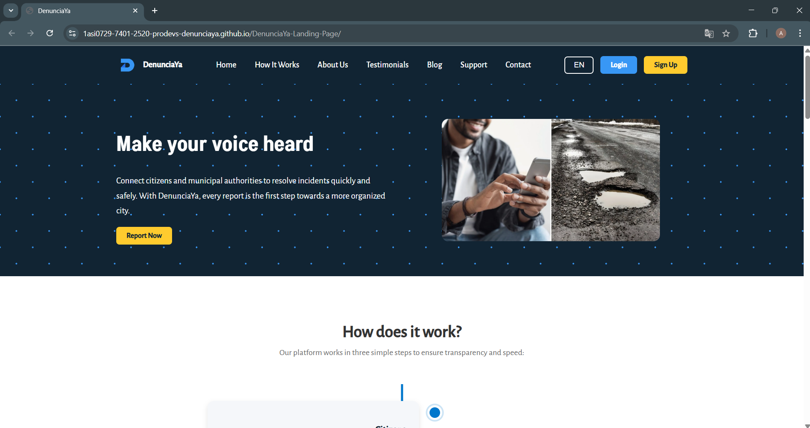
5. **Actualizaciones y mantenimiento**
    - Al realizar un cambio en index.html y subirlo al repositorio, la actualización se reflejará automáticamente en la
      página publicada.

### 5.2.1.8. Team Collaboration Insights during Sprint.

En este Sprint, el equipo demostró una colaboración efectiva y estructurada, adhiriéndose a los roles definidos en la Matriz de Liderazgo y Colaboración (LACX). El objetivo principal de esta sección es mostrar la evidencia de dicha colaboración, reflejada en la ejecución de las actividades de implementación y en las métricas de GitHub.

Evidencia de la Colaboración en GitHub
El repositorio de GitHub sirvió como el centro de nuestra actividad, proporcionando datos concretos sobre la interacción y las contribuciones de cada miembro.

Analíticas del Repositorio
La sección Pulse de GitHub ofreció una visión clara de la dinámica del equipo. Las siguientes métricas demuestran la alta participación y el flujo de trabajo coordinado:

Commits por Autor: Se observó un número considerable de commits, distribuidos equitativamente entre los miembros del equipo. Esto no solo confirmó que cada desarrollador contribuyó activamente, sino que también aseguró que la carga de trabajo se compartiera de manera justa, evitando cuellos de botella y maximizando la productividad.

Pull Requests: La creación constante de Pull Requests fue una práctica estándar. Cada PR fue sometida a revisión por otro miembro del equipo, asegurando la calidad del código, la conformidad con los estándares de estilo y la detección temprana de posibles errores. El proceso de revisión y fusión demostró la confianza y la responsabilidad compartida dentro del equipo.

Issues Abiertos y Cerrados: El seguimiento de las historias de usuario y las tareas a través de issues en GitHub permitió una gestión de tareas transparente y eficiente. El alto número de issues cerrados al final del sprint evidencia que el equipo logró los objetivos establecidos de manera oportuna.

Metodologías de Desarrollo y Convenciones
El éxito del Sprint 1 no fue solo un resultado de la actividad, sino de cómo se organizó esa actividad. La adopción de metodologías como GitFlow y Conventional Commits fue crucial:

GitFlow: El uso de ramas de feature para cada nueva tarea permitió a los desarrolladores trabajar en paralelo sin conflictos de código. Esto facilitó un desarrollo fluido y una integración continua del trabajo de cada colaborador.

Conventional Commits: La estandarización de los mensajes de commit (ej., feat:, fix:) proporcionó un historial de cambios legible y significativo, lo que ayudó a la revisión del código y a la comprensión del progreso general del proyecto por parte de todos los miembros.

**Pulse Analytics**

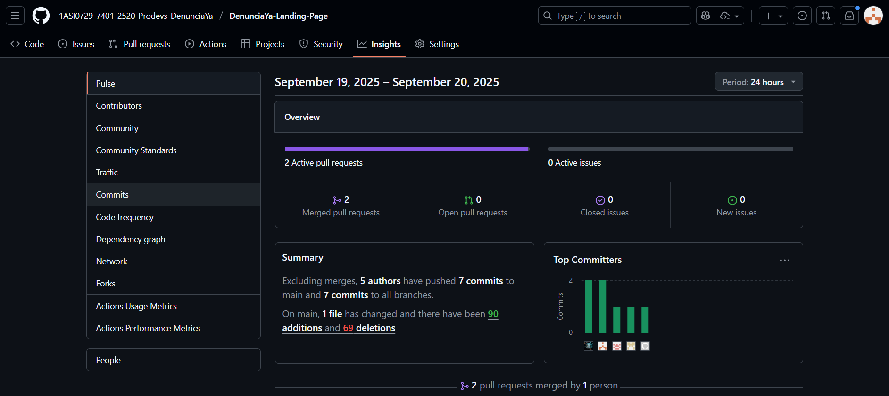
**Contributors Analytics**


# 5.2.2. Sprint 2

# 5.2.2.1. Sprint Planning 2.

<p>En esta sección se especifican los aspectos principales del Sprint Planning Meeting. En el Sprint 2 se planificaron las tareas necesarias para continuar con el desarrollo del Frontend de DenunciaYa, definiendo objetivos claros, asignando historias de usuario y estableciendo métricas de éxito para el sprint.</p>

<table>
  <tr>
    <th colspan="5">Sprint 2</th>
    <th colspan="9">Sprint 2</th>
  </tr>
  <tr>
    <td colspan="13">Sprint Planning Background</td>
  </tr>
  <tr>
    <td colspan="5">Date</td>
    <td colspan="8">08/10/2025</td>
  </tr>
  <tr>
    <td colspan="5">Time</td>
    <td colspan="8">6:59 pm</td>
  </tr>
  <tr>
    <td colspan="5">Location</td>
    <td colspan="8">Via Discord</td>
  </tr>
  <tr>
    <td colspan="5">Prepared By</td>
    <td colspan="8">Gabriel Mamani Marca</td>
  </tr>
  <tr>
    <td colspan="5">Attendees (to planning meeting)</td>
    <td colspan="8">Gabriel Mamani Marca, Omar Harold Rivera Ticllacuri, Franco Diego Rioja Nuñez, Gabriel Anthony Braithuaite Toledo, Augusto Sebastian Montes Maza</td>
  </tr>
  <tr>
    <td colspan="5">Sprint 1 Review Summary</td>
    <td colspan="8">Durante el Sprint 1 se desarrollaron las funcionalidades iniciales del proyecto DenunciaYa, incluyendo el sistema de registro de usuarios, carga de reportes con fotos y geolocalización, y notificaciones básicas. El Product Owner destacó la entrega de un prototipo funcional y el equipo compartió su feedback sobre la planificación y coordinación de tareas.</td>
  </tr>
  <tr>
    <td colspan="5">Sprint 1 Retrospective Summary</td>
    <td colspan="8">El equipo identificó fortalezas en la colaboración y la comunicación, y oportunidades de mejora en la estimación de tiempos para las tareas y en la priorización de historias de usuario. Se acordó reforzar las reuniones de seguimiento y documentar mejor los criterios de aceptación.</td>
  </tr>
  <tr>
    <td colspan="13">Sprint Goal & User Stories</td>
  </tr>
  <tr>
    <td colspan="5">Sprint 2 Goal</td>
    <td colspan="8">Implementar el <strong>Frontend de DenunciaYa</strong>, asegurando que los usuarios puedan navegar fácilmente por los principales bounded contexts: Reports, Complaints, Community Dashboard, Notifications y Analytics, incluyendo la opción de cambio de idioma. El éxito se mide cuando los usuarios pueden visualizar toda la información de manera clara y acceder a los reportes sin problemas.</td>
  </tr>
  <tr>
    <td colspan="5">Sprint 2 Velocity</td>
    <td colspan="8">5 story points</td>
  </tr>
  <tr>
    <td colspan="5">Sum of Story Points</td>
    <td colspan="8">5 story points</td>
  </tr>
</table>

# 5.2.2.1. Aspect Leaders and Collaborators.

En este apartado se presentan los responsables asignados a cada área. Para este primer Sprint, los entregables se han estructurado en tres categorías diferenciadas.

| Team member (LastName, First Name) | GitHub UserName | Aspect 1: Community (L/C) | Aspect 2: Authentication & Account Manager (L/C) | Aspect 3: History & Follow-up of Complaints (L/C) | Aspect 4: Complaint Creation (L/C) | Aspect 5: Directory of Resources & Contacts (L/C) |
|------------------------------------|-----------------|----------------------------|--------------------------------------------------|---------------------------------------------------|-----------------------------------|---------------------------------------------------|
| Mamani Gabriel                     | Gabriel0105     | L                          | C                                                | C                                                 | C                                 | C                                                 |
| Rivera Omar Harold                 | TicSide         | C                          | L                                                | C                                                 | C                                 | C                                                 |
| Rioja Franco Diego                 | FrancoDiegoR    | C                          | C                                                | L                                                 | C                                 | C                                                 |
| Braithuaite Gabriel Anthony        | Gaboo04         | C                          | C                                                | C                                                 | L                                 | C                                                 |
| Montes Augusto Sebastian           | asmmaza         | C                          | C                                                | C                                                 | C                                 | L                                                 |


# 5.2.2.3. Sprint Backlog 2.

En este segundo Sprint, el objetivo principal es implementar las funcionalidades esenciales del módulo de Comunidad, Directorio y Autenticación, así como la visualización del historial de denuncias. Además, se busca integrar la creación de denuncias y sus evidencias dentro del flujo del ciudadano.

|  Sprint 2  |               Sprint 2                |     |                                       |                                                                                                                      |                    |             |                                                |
|:----------:|:-------------------------------------:|:---:|:-------------------------------------:|:--------------------------------------------------------------------------------------------------------------------:|:------------------:|:-----------:|:----------------------------------------------:|
| User Story |           Work-Item / Task            |     |                                       |                                                                                                                      |                    |             |                                                |
|     Id     |                 Title                 | Id  |                 Title                 |                                                     Description                                                      | Estimation (Hours) | Assigned To | Status (To do / In process / To review / Done) |
| **EP1 - Community** ||||||||  
| US01 | Crear sección de comunidad | W01 | Crear vista “Community” | Diseñar e implementar la interfaz donde los usuarios puedan visualizar publicaciones y comentarios de otros ciudadanos. | 3 | Mamani Gabriel | To do |
| US02 | Publicar comentarios o experiencias | W02 | Implementar formulario de publicación | Desarrollar el formulario que permita a los usuarios escribir y enviar sus comentarios o experiencias dentro de la comunidad. | 3 | Mamani Gabriel | To do |
| **EP2 - Authentication & Account Manager** ||||||||  
| US03 | Iniciar sesión en DenunciaYa | W03 | Crear vista de Login | Implementar la pantalla de inicio de sesión con validación de credenciales y conexión con el backend de autenticación. | 2 | Rivera Omar Harold | To do |
| US04 | Registro de nuevos usuarios | W04 | Crear vista de Sign Up | Diseñar e implementar el formulario de registro con validaciones básicas y almacenamiento temporal del usuario. | 3 | Rivera Omar Harold | To do |
| **EP3 - History & Follow-up of Complaints** ||||||||  
| US05 | Visualizar historial de denuncias | W05 | Crear vista de Historial | Mostrar la lista de denuncias enviadas por el usuario con su respectivo estado y fecha. | 3 | Rioja Franco Diego | To do |
| US06 | Filtrar denuncias por estado | W06 | Implementar filtros de seguimiento | Agregar funcionalidad de filtrado por estado (pendiente, en proceso, resuelto) en el historial de denuncias. | 2 | Rioja Franco Diego | To do |
| **EP4 - Complaint Creation** ||||||||  
| US07 | Crear nueva denuncia | W07 | Implementar formulario de denuncia | Desarrollar el formulario principal para registrar una nueva denuncia, incluyendo campos de texto, ubicación y tipo de incidente. | 4 | Braithuaite Gabriel Anthony | To do |
| US08 | Subir evidencia multimedia | W08 | Implementar carga de imágenes/videos | Permitir al usuario adjuntar fotos o videos como evidencia al momento de crear una denuncia. | 3 | Braithuaite Gabriel Anthony | To do |
| **EP5 - Directory of Resources & Contacts** ||||||||  
| US09 | Visualizar directorio de contactos | W09 | Crear vista de directorio | Desarrollar la vista que muestre las instituciones y contactos relevantes para atención de denuncias. | 2 | Montes Augusto Sebastian | To do |
| US10 | Búsqueda por institución o tipo | W10 | Implementar función de búsqueda | Añadir campo de búsqueda para filtrar el directorio por nombre de institución o categoría de servicio. | 2 | Montes Augusto Sebastian | To do |

Link del trello: https://trello.com/invite/b/68e83aee5365f87fab4f1f3a/ATTI85791f99be177861607df46edb02f27e2701DAE2/tpopen

# 5.2.2.4. Development Evidence for Sprint Review.

En esta sección se presentan las evidencias de desarrollo realizadas durante el Sprint, reflejadas a través de los commits registrados en el repositorio del frontend.

Los avances corresponden a la implementación del formulario de denuncias, panel de autoridades, gestión de denuncias y la integración de vistas con internacionalización y mapas interactivos.

Enlace al repositorio del frontend: https://github.com/1ASI0729-7401-2520-Prodevs-DenunciaYa/DenunciaYa.-Frontend.git

| Repository | Branch                      | Commit Id | Commit Message | Commit Message Body | Committed on (Date) |
|:------------|:----------------------------|:------------|:----------------|:---------------------|:--------------------|
| DenunciaYa-Frontend | feature/complaint-creation  | `c09325415c680ab9a6a5cb1018667617ed2d0238` | feat: implement complaint creation form with validation and layout | Added form validation, responsive layout and integrated API call for complaint submission. | 08-10-2025          |
| DenunciaYa-Frontend | feature/complaint-creation  | `422f14c4346dd7235e192209a374b518fa48b9c6` | feat: add createComplaint method to handle complaint creation via API | Implemented Axios call to POST endpoint, included error handling and success notification. | 08-10-2025          |
| DenunciaYa-Frontend | feature/complaint-class     | `4fe872edcd1f6cf6020b4bf4bd555bfced0c200a` | feat: refactor Complaint class to use private properties and add getters/setters | Improved encapsulation and data handling for Complaint model. | 08-10-2025          |
| DenunciaYa-Frontend | feature/complaint-creation  | `850f57cd534abed201583fffae26ce7ee7c3ddd7` | Merge pull request #2 from feature/complaint-creation | Merged complaint creation feature into main branch. | 06-10-2025          |
| DenunciaYa-Frontend | feature/authorities-panel   | `84802d1b7276d367d2de4a9cb0a6ae98669b5dd7` | feat(authorities): Add authorities-panel bounded context | Added new bounded context for authorities module with routing and components. | 07-10-2025          |
| DenunciaYa-Frontend | feature/complaints-creation | `c04116d40ea61b67ebd7193a841f92bc65b6b9e1` | feat(complaints-table): added complaints table in authorities panel | Displayed complaint data dynamically using table component with filters. | 07-10-2025          |
| DenunciaYa-Frontend | feature/complaints-creation | `e92c0d96afbabf1108ba655f43c36f90fc225e38` | feat(edit-complaint): added edit complaint component in authorities panel | Enabled complaint editing with validation and API update. | 08-10-2025         |
| DenunciaYa-Frontend | feature/develop             | `af6c01c12ff1f3094100acbbbd051c7da877ee27` | feat(app): Adding I18n For Views | Implemented multi-language support for key pages. | 08-10-2025         |
| DenunciaYa-Frontend | feature/map                 | `fb671430f3e95f3798615834904180b9f8bf78f5` | feat(map): Adding View Map Tracking | Added interactive map view to track complaints geolocation. | 08-10-2025        |
# 5.2.2.5. Execution Evidence for Sprint Review.

Durante este sprint se desarrolló la primera versión del frontend de DenunciaYa utilizando Angular. Se configuró la estructura base del proyecto y se implementaron las vistas iniciales correspondientes a los bounded contexts Community y Complaint Creation.

El desarrollo incluyó la creación del layout principal, el enrutamiento entre módulos, y el formulario de registro de denuncias con validaciones y almacenamiento temporal de datos para simular la conexión con el backend. Asimismo, se aplicó un diseño responsivo con Angular Material, garantizando una interfaz moderna y funcional.

A continuación, se presentan las capturas de las principales vistas implementadas y un video demostrativo que muestra la navegación y funcionalidades alcanzadas en esta primera versión.

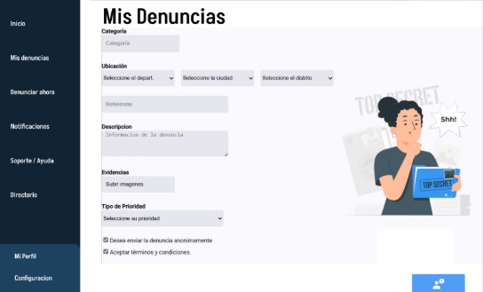

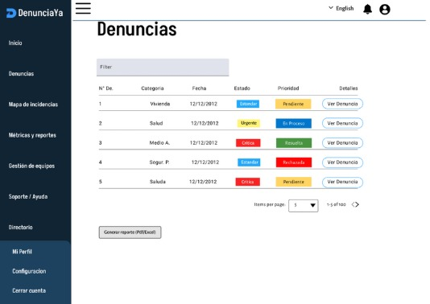

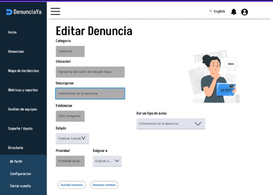


Link del video:
# 5.2.2.6. Services Documentation Evidence for Sprint Review.

Durante la creación del frontend de la aplicación, se optó por utilizar **JSON Server** como una *fake API*, con el propósito de emular el comportamiento del backend, ya que este aún no estaba desarrollado. Gracias a JSON Server, fue posible disponer de un entorno de pruebas completamente funcional, capaz de responder a solicitudes HTTP (**GET, POST, PUT, DELETE**) de la misma forma que lo haría un servidor real, empleando un archivo `db.json` como base de datos persistente. Esta herramienta permitió avanzar en el desarrollo, validación y prueba de los servicios e interfaces del frontend de manera eficiente, manteniendo al mismo tiempo una arquitectura desacoplada y lista para integrarse con el backend definitivo una vez esté disponible.

Durante este sprint, los siguientes recursos fueron documentados y probados usando JSON Server como fake API. Todos los recursos permiten los métodos HTTP: **GET, POST, PUT, PATCH, DELETE, OPTIONS**.

| Recurso       | Registros existentes en db.json | Métodos HTTP Disponibles           |
|---------------|--------------------------------|------------------------------------|
| /communities  | 2                              | GET, POST, DELETE,                 |
| /responsibles | 5                              | GET, POST, DELETE                  |
| /citizen      | 5                              | GET, POST, DELETE                  |
| /authority    | 5                              | GET, POST, DELETE             |
| /complaints   | 34                             | GET, POST, DELETE |


# 5.2.2.7. Software Deployment Evidence for Sprint Review.

Durante este sprint se realizaron actividades de **deployment** relacionadas con el frontend y el entorno de pruebas de *DenunciaYa*. El proyecto frontend fue desarrollado con **Angular**, configurando rutas, componentes y servicios, e integrando **Angular Material** para el diseño de la interfaz.

Para simular el backend, se desplegó el archivo `db.json` en **Render** como un JSON Server, proporcionando un entorno remoto funcional capaz de responder a solicitudes HTTP (GET, POST, PUT, DELETE). Esto permitió que la aplicación Angular consuma datos desde un endpoint accesible en la nube, asegurando pruebas más realistas y validación del flujo de datos sin necesidad de un backend definitivo.

Se documentaron los pasos para levantar y consumir la aplicación:
1. **Frontend Angular:** instalado y ejecutado localmente usando Angular CLI.
2. **JSON Server en Render:** desplegado para simular endpoints de la API, accesible desde la URL remota proporcionada por Render.
3. **Pruebas de integración:** verificación de consumo de datos desde los endpoints remotos, navegación por la aplicación y creación/visualización de denuncias utilizando los datos del JSON Server.

Link del Fake API desplegado: https://denunciaya-fakeapi-xf50.onrender.com

### Capturas de pantalla

A continuación se presentan capturas que demuestran que la segunda versión del frontend de DenunciaYa fue desplegada correctamente. Estas imágenes evidencian la carga de la aplicación y la visualización de las vistas implementadas, confirmando el funcionamiento del entorno de desarrollo y la integración con los servicios simulados o remotos.


# 5.2.2.8. Team Collaboration Insights during Sprint.

Durante el Sprint 2, se trabajó de forma colaborativa utilizando GitHub como herramienta principal para el control de versiones. La aplicación frontend fue organizada mediante *bounded contexts*, los cuales fueron desarrollados de manera independiente por cada miembro del equipo a través de *branches* asignadas. Cada integrante contribuyó con el desarrollo de su *bounded context* correspondiente.

Una vez finalizado el desarrollo de cada funcionalidad, se realizaron los *merge requests* hacia la rama **develop**, con el objetivo de integrar el producto y posteriormente proceder con el despliegue de **“DenunciaYa”**, realizado en Vercel. La coordinación del trabajo se llevó a cabo mediante reuniones diarias, *pull requests* y revisiones cruzadas del código desarrollado en cada *bounded context*.

A continuación, se presentan los analíticos de *commits* y participación, evidenciando la contribución activa de cada integrante del equipo.

* **Gabriel Mamani:** Desarrolló la vista **Community**, donde el usuario podrá publicar noticias y tendrá la opción de realizar comentarios en otras publicaciones.
* **Franco Rioja:** Desarrolló el historial y seguimiento de denuncias, donde el usuario puede visualizar en qué estado se encuentra su denuncia.
* **Omar Rivera:** Implementó la autenticación y la vista de gestión de usuario, permitiendo al usuario crear y editar su información dentro de la aplicación web.
* **Gabriel Brabuaite:** Se encargó de la vista de creación de denuncias, la cual permite al usuario crear y eliminar denuncias.
* **Augusto Montes:** Desarrolló la vista de directorio de denuncias, donde se muestran instituciones y contactos relevantes para la atención de denuncias.

  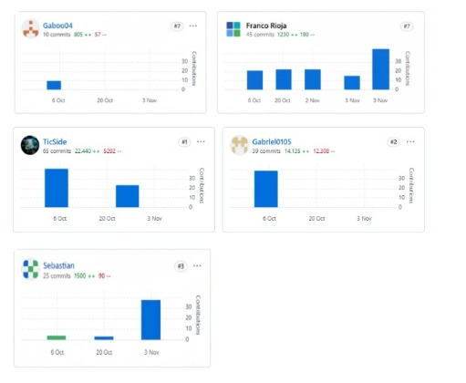

  


Repostorio del Frontend: https://github.com/1ASI0729-7401-2520-Prodevs-DenunciaYa/DenunciaYa.-Frontend.git


# 5.2.3. Sprint 3
# 5.2.3.1.Spring Planning 3

A continuación se presenta el acta correspondiente a la planificación del Sprint 3, en la cual se establecieron los objetivos principales y las actividades que se desarrollarán durante este periodo.

### Sprint 3
<table>
<tr>
    <th colspan="5">Sprint 3</th>
    <th colspan="9">Sprint 3</th>
</tr>

<tr>
    <td colspan="13">Sprint Planning Background</td>
</tr>

<tr>
    <td colspan="5">Date</td>
    <td colspan="8">6/11/2025</td>
</tr>

<tr>
    <td colspan="5">Time</td>
    <td colspan="8">3:00 pm</td>
</tr>

<tr>
    <td colspan="5">Location</td>
    <td colspan="8">Via Discord</td>
</tr>

<tr>
    <td colspan="5">Prepared By</td>
    <td colspan="8">Mamani Marca, Gabriel Cristian</td>
</tr>

<tr>
    <td colspan="5">Attendees (to planning meeting)</td>
    <td colspan="8">Mamani Marca Gabriel Cristian, Rivera Ticllacuri Omar Harold, Rioja Núñez Franco Diego, Brabuaite Toledo Gabriel Anthony, Montes Maza Augusto Sebastián</td>
</tr>

<tr>
    <td colspan="5">Sprint 3 Review Summary</td>
    <td colspan="8">En esta reunión se planificaron las tareas correspondientes al desarrollo del backend de DenunciaYa. Asimismo, se establecieron fechas límite para cada bounded context con el fin de contar con tiempo para realizar el despliegue y la integración con el frontend.</td>
</tr>

<tr>
    <td colspan="5">Sprint 3 Retrospective Summary</td>
    <td colspan="8">Durante la retrospectiva se identificaron aspectos positivos en el trabajo colaborativo y también oportunidades de mejora relacionadas con la organización interna y la distribución de tareas. Se resaltó la importancia de mantener una comunicación clara, asumir responsabilidades y asegurar la continuidad del avance del proyecto.</td>
</tr>

<tr>
    <td colspan="13">Sprint Goal & User Stories</td>
</tr>

<tr>
    <td colspan="5">Sprint 3 Goal</td>
    <td colspan="8">Completar la integración y despliegue del backend conectado al frontend, garantizando que los módulos principales (denuncias, mapa, autoridades, comunidad e i18n) operen correctamente en un entorno productivo, y cumplir con los criterios de validación mediante pruebas funcionales y aprobación del Product Owner antes de la fecha de cierre del sprint.</td>
</tr>

<tr>
    <td colspan="5">Sprint 3 Velocity</td>
    <td colspan="8">5 story points</td>
</tr>

<tr>
    <td colspan="5">Sum of Story Points</td>
    <td colspan="8">5 story points</td>
</tr>

</table>

# 5.2.3.2. Aspect Leaders and Collaborators.
En esta sección se muestran los encargados designados para cada área de trabajo. Para este primer Sprint, los productos a entregar se han estructurado en tres secciones claramente definidas.


| Team member (LastName, First Name)                              | GitHub UserName | Aspect 1: Complaint Creation BC (L/C) | Aspect 2: Community BC (L/C) | Aspect 3: Map BC (L/C) | Aspect 4: Authentication BC (L/C) | Aspect 5: Authorit BC (L/C) |
|------------------------------------------------------------------|-----------------|---------------------------------------|------------------------------|------------------------|-----------------------------------|-----------------------------|
| Mamani Marca, Gabriel Cristian                                   | Gabriel0105     | C                                     | L                            | C                      | C                                 | C                           |
| Rivera Ticllacuri, Omar Harold                                   | TicSide         | L                                     | C                            | C                      | L                                 | C                           |
| Rioja Núñez, Franco Diego                                        | FrancoDiegoR    | C                                     | C                            | L                      | C                                 | C                           |
| Brabuaite Toledo, Gabriel Anthony                                | Gaboo04         | C                                     | C                            | C                      | C                                 | L                           |
| Montes Maza, Augusto Sebastián                                   | Sebastian       | C                                     | C                            | C                      | C                                 | L                           |

# 5.2.3.3.Sprint Backlog 3.
El objetivo principal del Sprint 3 es implementar funcionalidades esenciales del backend relacionadas con la creación, gestión y visualización de denuncias, autenticación, manejo de datos geográficos y procesos internos asociados a comunidades y autoridades.

Durante el sprint se desarrollaron las API REST, se implementaron validaciones para las peticiones HTTP utilizando Swagger y se verificó la conexión con la base de datos.
Herramienta utilizada : Trello
Link trello:
Screenshot  trello 

| Sprint 3 | Sprint 3 |   |                                     |                                                                                                                               |                    |                 |                                                |
|----------|-----------|---|-------------------------------------|-------------------------------------------------------------------------------------------------------------------------------|--------------------|-----------------|------------------------------------------------|
| User Story | Work-Item / Task |   |                                 | Description                                                                                                                   | Estimation (Hours) | Assigned To     | Status (To do / In process / To review / Done) |
| ID       | Title     | ID| Title                               |                                                                                                                               |                    |                 |                                                |
|----------|-----------|----|-------------------------------------|-------------------------------------------------------------------------------------------------------------------------------|--------------------|-----------------|------------------------------------------------|
| US09     | Selección de categoría                   | W01 | Crear módulo Category | Crear entidad, migración, repositorio y carga inicial de categorías                                                          | 3                  | Omar Rivera        | To Do                                          |
| US10     | Registro de ubicación                     | W02 | Endpoint Ubicación   | Implementar endpoint para guardar coordenadas y dirección, asociado a denuncia                                               | 4                  | Franco Rioja     | To Do                                          |
| US11     | Registro descripción de incidente         | W03 | Endpoint Descripción | Crear endpoint para guardar descripción básica y relacionarla con usuario y denuncia                                         | 3                  | Omar Rivera        | To Do                                          |
| US12     | Descripción detallada del incidente       | W04 | Validación avanzada  | Sanitizar descripción, aplicar reglas de contenido y máximo de caracteres                                                     | 2                  | Omar Rivera        | To Do                                          |
| US13     | Adjuntar evidencias                       | W05 | Servicio archivos     | Implementar lógica para guardar imágenes/videos en FileSystem o Cloud (pendiente decisión)                                    | 5                  | Omar Rivera        | To Do                                          |
| US14     | Guardar denuncia como borrador            | W06 | Estado Draft         | Incorporar flag "draft" y permitir update parcial                                                                            | 3                  | Omar Rivera        | To Do                                          |
| US15     | Revisión de datos antes de enviar         | W07 | Endpoint Preview     | Retornar datos ingresados antes del envío final                                                                              | 3                  | Omar Rivera        | To Do                                          |
| US16     | Envío y código de seguimiento             | W08 | Generar tracking ID  | Asignar UUID único, actualizar estado y registrar fecha/hora                                                                 | 3                  | Omar Rivera        | To Do                                          |
| US17     | Ver historial básico                      | W09 | Listado denuncias    | Obtener denuncias por usuario autenticado, orden básico                                                                      | 4                  | Gabriel Mamani   | To Do                                          |
| US18     | Ver detalles de denuncia                  | W10 | Endpoint detalle     | Mostrar detalle completo con evidencias y metadatos                                                                          | 4                  | Gabriel Mamani   | To Do                                          |
| US19     | Filtrar denuncias                         | W11 | Filtro avanzado      | Implementar filtros por categoría, estado, fecha, ubicación                                                                  | 5                  | Gabriel Mamani   | To Do                                          |
| US20     | Ordenar denuncias                         | W12 | Orden dinámico       | Implementar orden ASC/DESC según fecha o estado                                                                              | 3                  | Gabriel Mamani   | To Do                                          |
| US21     | Buscar denuncias                          | W13 | Buscador global      | Agregar búsqueda por palabra clave, número o categoría                                                                       | 4                  | Gabriel Mamani   | To Do                                          |
| US22     | Timeline de seguimiento                   | W14 | Módulo Timeline      | Crear tabla de eventos, relación con denuncia y endpoint para retornar histórico                                             | 6                  | Gabriel Mamani   | To Do                                          |
| US42     | Registro de ciudadanos                    | W15 | Endpoint registro    | POST /users – validaciones, roles, encriptación y persistencia                                                               | 4                  | Omar Rivera      | To Do                                          |
| US43     | Registro de autoridades                   | W16 | Registro autoridades | POST /authorities – validación de rol Authority y persistencia                                                               | 4                  | Gabriel Brabuaite/Sebastián Montes | To Do                                       |
| US44     | Inicio de sesión                          | W17 | Login + JWT          | Endpoint login, verificación hash, generación de token JWT                                                                   | 4                  | Omar Rivera      | To Do                                          |
| US45     | Recuperación de contraseña                | W18 | Token recovery       | Generar token temporal y enviarlo (método definido posteriormente)                                                           | 3                  | Omar Rivera      | To Do                                          |
| US46     | Restablecimiento de contraseña            | W19 | Reset password       | Validar token, actualizar contraseña hasheada y registrar timestamp                                                           | 3                  | Omar Rivera      | To Do                                          |

# 5.2.3.5.Execution Evidence for Sprint Review.
# 5.2.3.6.Services Documentation Evidence for Sprint Review.
## Logros alcanzados
## Repositorio y commits

# 5.2.3.7.Software Deployment Evidence for Sprint Review.
# 5.2.3.8.Team Collaboration Insights during Sprint.
# 5.3. Validation Interviews.

# 5.2.3.4.Development Evidence for Sprint Review.

# Conclusiones
Durante el proceso de creación y desarrollo de este trabajo se llegaron a las siguientes conclusiones:

### 1. Trabajo en equipo y colaboración
El desarrollo de DenunciaYa demostró que la colaboración y la comunicación constante entre los miembros del equipo son esenciales para integrar distintas perspectivas y habilidades. La distribución de roles y la sinergia lograda permitieron construir una solución sólida y alineada con los objetivos planteados.

### 2. Planificación y organización en el desarrollo de software
La planificación adecuada, junto con la adopción de metodologías ágiles como SCRUM, fueron factores clave para gestionar tareas, priorizar funcionalidades y cumplir con los plazos establecidos. Esto garantizó un proceso ordenado y la entrega de un producto funcional y de calidad.

### 3. Impacto social y transparencia en la gestión pública
DenunciaYa representa una solución innovadora que contribuye a mejorar la transparencia gubernamental y la confianza ciudadana. Al facilitar la denuncia de problemas urbanos y actos de corrupción de forma rápida, segura y anónima, la plataforma genera un impacto positivo en la calidad de vida de la comunidad.

### 4. TIC como herramienta de participación ciudadana
El proyecto demuestra que las Tecnologías de la Información y Comunicación (TIC) son un medio estratégico para ampliar el alcance y la participación social. DenunciaYa facilita que más ciudadanos se involucren activamente en la identificación y resolución de problemas locales, fortaleciendo la gobernanza digital.

### 5. Usabilidad y experiencia del usuario
DenunciaYa ha sido diseñada para que cualquier persona pueda usarla fácilmente desde el primer momento. Su interfaz es intuitiva y accesible, lo que permite reportar problemas en pocos pasos y sin complicaciones. Con un diseño moderno y centrado en el usuario, la plataforma garantiza una experiencia ágil, clara y confiable tanto para ciudadanos como para autoridades.

#  Bibliografía

- Gruber, J. (2004). *Markdown*. Daring Fireball. https://daringfireball.net/projects/markdown/

- Flanagan, D. (2020). *JavaScript: The definitive guide* (7th ed.). O’Reilly Media. https://www.oreilly.com/library/view/javascript-the-definitive/9781491952016/

- W3C. (2017). *HTML5: A vocabulary and associated APIs for HTML and XHTML*. World Wide Web Consortium (W3C). https://www.w3.org/TR/html52/

- Meyer, E. (2017). *CSS: The definitive guide* (4th ed.). O’Reilly Media. https://www.oreilly.com/library/view/css-the-definitive/9781449325053/

- Brown, S. (2018). *The C4 model for visualising software architecture*. Leanpub. https://leanpub.com/visualising-software-architecture

- Brandolini, A. (2018). *Introducing EventStorming: An act of deliberate collective learning*. Leanpub. https://leanpub.com/introducing_eventstorming

- Evans, E. (2003). *Domain-driven design: Tackling complexity in the heart of software*. Addison-Wesley. https://www.domainlanguage.com/ddd/

- Vernon, V. (2013). *Implementing domain-driven design*. Addison-Wesley. https://www.oreilly.com/library/view/implementing-domain-driven-design/9780133039900/

- Gothelf, J., & Seiden, J. (2016). *Lean UX: Designing great products with agile teams* (2nd ed.). O’Reilly Media. https://www.oreilly.com/library/view/lean-ux-2nd/9781491953600/

- Bass, L., Clements, P., & Kazman, R. (2012). *Software architecture in practice* (3rd ed.). Addison-Wesley. https://www.oreilly.com/library/view/software-architecture-in/9780132942782/

- Schwaber, K., & Sutherland, J. (2020). *The Scrum Guide*. Scrum.org. https://scrumguides.org/

# Anexos

### VIDEOS:

| Título                  | Descripción                                        | Enlace                          |
|-------------------------|----------------------------------------------------|---------------------------------|
| Video de  TB1 | Video explicativo de los avances de la entrega TB1 | https://upcedupe-my.sharepoint.com/personal/u202214214_upc_edu_pe/_layouts/15/stream.aspx?id=%2Fpersonal%2Fu202214214%5Fupc%5Fedu%5Fpe%2FDocuments%2FCapitulo%201%20%281%29%2Emp4&nav=eyJyZWZlcnJhbEluZm8iOnsicmVmZXJyYWxBcHAiOiJTdHJlYW1XZWJBcHAiLCJyZWZlcnJhbFZpZXciOiJTaGFyZURpYWxvZy1MaW5rIiwicmVmZXJyYWxBcHBQbGF0Zm9ybSI6IldlYiIsInJlZmVycmFsTW9kZSI6InZpZXcifX0&ga=1&referrer=StreamWebApp%2EWeb&referrerScenario=AddressBarCopied%2Eview%2Eb0ddff37%2D271b%2D4c6d%2D95b7%2D4c12d293ff46   |
| Video de entrevistas    | Video recopilatorio de todas las entrevistas       | https://upcedupe-my.sharepoint.com/personal/u202214214_upc_edu_pe/_layouts/15/stream.aspx?id=%2Fpersonal%2Fu202214214%5Fupc%5Fedu%5Fpe%2FDocuments%2Fupc%2Dpre%2D202520%2D1asi0729%2D7401%2DDenunciaYa%2D%20needfinding%2Dsprint%2D1%2Emp4&nav=eyJyZWZlcnJhbEluZm8iOnsicmVmZXJyYWxBcHAiOiJTdHJlYW1XZWJBcHAiLCJyZWZlcnJhbFZpZXciOiJTaGFyZURpYWxvZy1MaW5rIiwicmVmZXJyYWxBcHBQbGF0Zm9ybSI6IldlYiIsInJlZmVycmFsTW9kZSI6InZpZXcifX0&ga=1&referrer=StreamWebApp%2EWeb&referrerScenario=AddressBarCopied%2Eview%2E52aaaa7a%2D885d%2D47d5%2Db030%2Da3763cd97698    |


### UX/UI
| Título | Descripción                                                                                                           | Enlace                       |
|--------|-----------------------------------------------------------------------------------------------------------------------|------------------------------|
| Figma  | Enlace hacia el documento de Figma con todos los diseños planteados para la Aplicacion Web como para el Landing Page. | https://www.figma.com/design/ZPqKdgAXbM04JV4jEnc5rw/KeepItFresh?node-id=6649-244&t=B8IuDXKdNYreSg1D-1  | 

### GITHUB

| Título       | Descripción                            | Enlace                                                         |
|--------------|----------------------------------------|----------------------------------------------------------------|
| Reporte      | Enlace al repositorio del reporte      | https://github.com/1ASI0729-7401-2520-Prodevs-DenunciaYa/DenunciaYa-Proyect-Report        |
| Landing Page | Enlace al repositorio del Landing Page | https://github.com/1ASI0729-7401-2520-Prodevs-DenunciaYa/DenunciaYa-Landing-Page       |


