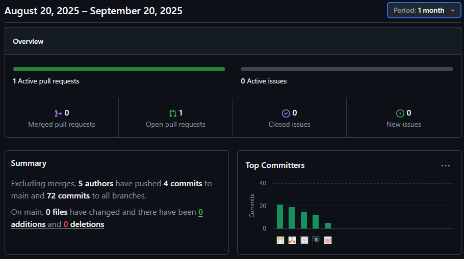
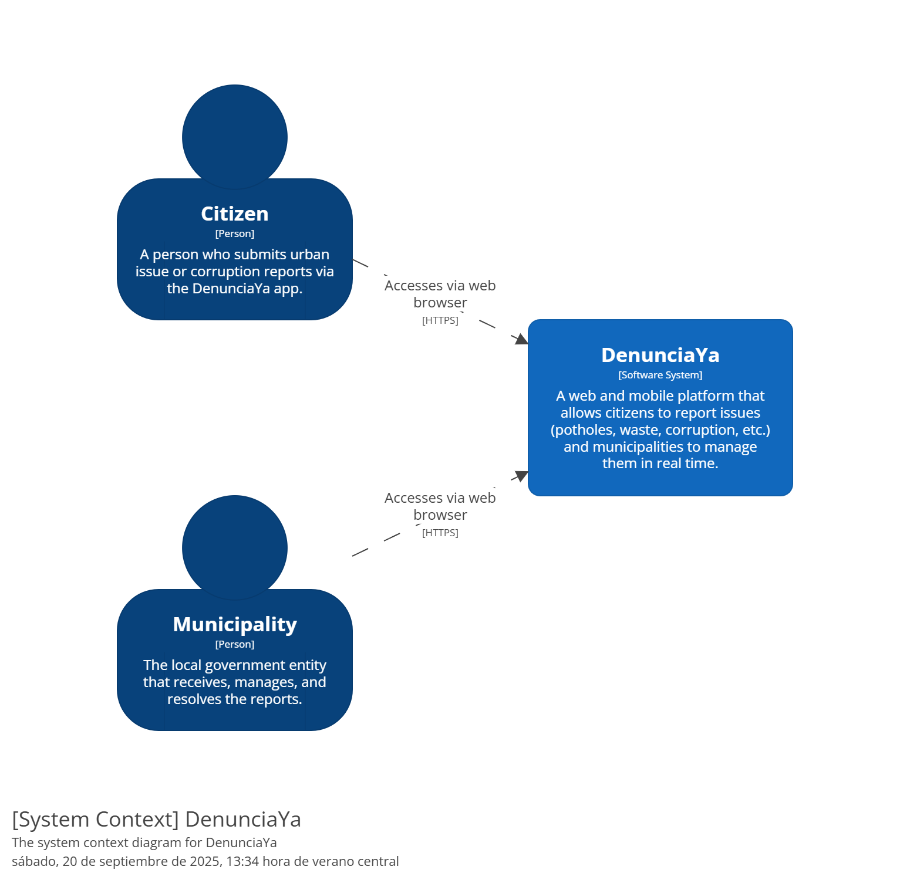
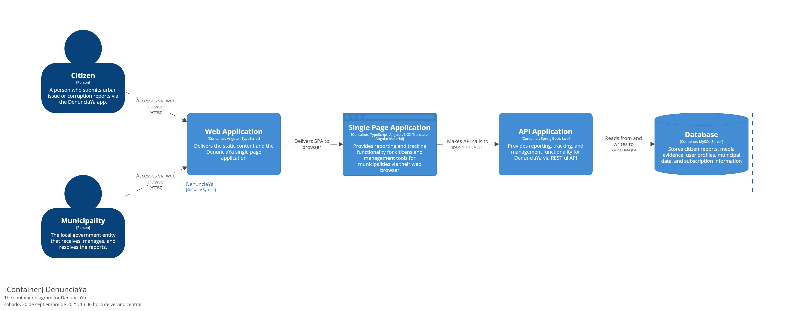

<div align="center">


# UNIVERSIDAD PERUANA DE CIENCIAS APLICADAS

### Carrera: Ingeniería de Software

### Desarrollo de Aplicaciones Open Source - Presencial (1ASI0729)

### Profesor: Hugo Allan Mori Paiva

### NRC: 7401

## Informe - TB1

## Startup: Prodevs

## Producto: DenunciaYa

### INTEGRANTES

<div style="text-align: center;">

|       Apellidos y Nombres        | Código de Alumno |
|:--------------------------------:|:----------------:|
|  Mamani Marca, Gabriel Cristian  |    u202220659    |
|  Omar Harold Rivera Ticllacuri   |    u202214214    |
|     Franco Diego Rioja Nuñez     |    u202221597    |
| Gabriel Anthony Brabuaite Toledo |    U20201e889    |
|  Augusto Sebastian Montes Maza   |    u202218645    |

</div>

### Ciclo 2025-20

---

</div>

# Registro de versiones del informe

| Versión | Fecha       | Autor(es)                                                                                           | Descripción de modificación                                                                                                                                                                                                 |
|---------|-------------|------------------------------------------------------------------------------------------------------|-----------------------------------------------------------------------------------------------------------------------------------------------------------------------------------------------------------------------------|
| TB1     | 10/09/2024  | Mamani Marca, Gabriel Cristian <br> Omar Harold Rivera Ticllacuri  <br> Franco Diego Rioja Nuñez  <br> Gabriel Anthony Brabuaite Toledo  <br> Augusto Sebastian Montes Maza  | Se agregó el contenido del capítulo 1 (apartados 1.1, 1.2 y 1.3); el contenido del capítulo 2 (apartados 2.1, 2.2, 2.3, 2.4); el contenido del capítulo 3 (apartados 3.1, 3.2, 3.3 y 3.4); el contenido del capítulo 4 (apartados 4.1, 4.2, 4.3, 4.4, 4.5, 4.6, 4.7 y 4.8); y el contenido del capítulo 5 (apartados 5.1 y 5.2). |

# PROJECT REPORT COLLABORATION INSIGHTS

| Repositorio del Informe en GitHub |
|--|
| https://github.com/1ASI0729-7401-2520-Prodevs-DenunciaYa/DenunciaYa-Proyect-Report

TB1: Las tareas asignadas para la entrega TB1 se han completado y están documentadas en el siguiente repositorio de GitHub perteneciente a la organización del equipo: 
[Repositorio GitHUb](https://github.com/1ASI0729-7401-2520-Prodevs-DenunciaYa/DenunciaYa-Proyect-Report), link: | https://github.com/1ASI0729-7401-2520-Prodevs-DenunciaYa/DenunciaYa-Proyect-Report

### 2. Actividades de elaboracion del informe 
Durante la elaboración del informe se realizaron diversas actividades. Cada integrante redactó y diagramó sus contenidos asignados en formato Markdown, registrando posteriormente commits que permitieron mantener un control del avance en el repositorio. Asimismo, se generaron los artefactos correspondientes con las herramientas establecidas y se obtuvieron los enlaces de las imágenes desde la carpeta Assets ubicada en la rama develop del repositorio del informe. Finalmente, se llevaron a cabo reuniones de coordinación para supervisar el progreso del trabajo y compartir los avances vinculados al Sprint 1, cuyo objetivo principal fue la Landing Page.
### 3. Capturas en imagen de los analíticos de colaboración y commits en GitHub


### 4. Evidencia de participacion de todos los miembros del equipo 


# Contenido

## Tabla de Contenidos

### [Registro de versiones del informe](#registro-de-versiones-del-informe)

### [Project Report Collaboration Insights](#project-report-collaboration-insights)

### [Contenido](#contenido)

### [Student Outcome](#student-outcome-1)

### [Capítulo I: Introducción](#capc3adtulo-i-introduccic3b3n-1)

- [1.1. Startup Profile](#11-startup-profile)
    - [1.1.1. Descripción de la Startup](#111-description-de-la-startup)
    - [1.1.2. Perfiles de integrantes del equipo](#112-perfiles-de-integrantes-del-equipo)
- [1.2. Solution Profile](#12-solution-profile)
    - [1.2.1 Antecedentes y problemática](#121-antecedentes-y-problemática)
    - [1.2.2 Lean UX Process](#122-lean-ux-process)
        - [1.2.2.1. Lean UX Problem Statements](#1221-lean-ux-problem-statements)
        - [1.2.2.2. Lean UX Assumptions](#1222-lean-ux-assumptions)
        - [1.2.2.3. Lean UX Hypothesis Statements](#1223-lean-ux-hypothesis-statements)
        - [1.2.2.4. Lean UX Canvas](#1224-lean-ux-canvas)
- [1.3. Segmentos objetivo](#13-segmentos-objetivo)

### [Capítulo II: Requirements Elicitation & Analysis](#capc3adtulo-ii-requirements-elicitation--analysis-1)

- [2.1. Competidores](#21-competidores)
    - [2.1.1. Análisis competitivo](#211-análisis-competitivo)
    - [2.1.2. Estrategias y tácticas frente a competidores](#212-estrategias-y-tácticas-frente-a-competidores)
- [2.2. Entrevistas](#22-entrevistas)
    - [2.2.1. Diseño de entrevistas](#221-diseño-de-entrevistas)
    - [2.2.2. Registro de entrevistas](#222-registro-de-entrevistas)
    - [2.2.3. Análisis de entrevistas](#223-análisis-de-entrevistas)
- [2.3. Needfinding](#23-needfinding)
    - [2.3.1. User Personas](#231-user-personas)
    - [2.3.2. User Task Matrix](#232-user-task-matrix)
    - [2.3.3. User Journey Mapping](#233-user-journey-mapping)
    - [2.3.4. Empathy Mapping](#234-empathy-mapping)
    - [2.3.5. As-is Scenario Mapping](#235-as-is-scenario-mapping)
    - [2.4. Ubiquitous Language](#24-Ubiquitous-language)

### [Capítulo III: Requirements Specification](#capc3adtulo-iii-requirements-specification-1)

- [3.1. To-Be Scenario Mapping](#31-to-be-scenario-mapping)
- [3.2. User Stories](#32-user-stories)
- [3.3. Impact Mapping](#33-impact-mapping)
- [3.4. Product Backlog](#34-product-backlog)

### [Capítulo IV: Product Design](#capc3adtulo-iv-product-design-1)

- [4.1. Style Guidelines](#41-style-guidelines)
    - [4.1.1. General Style Guidelines](#411-general-style-guidelines)
    - [4.1.2. Web Style Guidelines](#412-web-style-guidelines)
- [4.2. Information Architecture](#42-information-architecture)
    - [4.2.1. Organization Systems](#421-organization-systems)
    - [4.2.2. Labeling Systems](#422-labeling-systems)
    - [4.2.3. SEO Tags and Meta Tags](#423-seo-tags-and-meta-tags)
    - [4.2.4. Searching Systems](#424-searching-systems)
    - [4.2.5. Navigation Systems](#425-navigation-systems)
- [4.3. Landing Page UI Design](#43-landing-page-ui-design)
    - [4.3.1. Landing Page Wireframe](#431-landing-page-wireframe)
    - [4.3.2. Landing Page Mock-up](#432-landing-page-mock-up)
- [4.4. Web Applications UX/UI Design](#44-web-applications-uxui-design)
    - [4.4.1. Web Applications Wireframes](#441-web-applications-wireframes)
    - [4.4.2. Web Applications Wireflow Diagrams](#442-web-applications-wireflow-diagrams)
    - [4.4.3. Web Applications Mock-ups](#443-web-applications-mock-ups)
    - [4.4.4. Web Applications User Flow Diagrams](#444-web-applications-user-flow-diagrams)
- [4.5. Web Applications Prototyping](#45-web-applications-prototyping)
- [4.6. Domain-Driven Software Architecture](#46-domain-driven-software-architecture)
    - [4.6.1. Software Architecture Context Diagram](#461-software-architecture-context-diagram)
    - [4.6.2. Software Architecture Container Diagrams](#462-software-architecture-container-diagrams)
    - [4.6.3. Software Architecture Components Diagrams](#463-software-architecture-components-diagrams)
- [4.7. Software Object-Oriented Design](#47-software-object-oriented-design)
    - [4.7.1. Class Diagrams](#471-class-diagrams)
    - [4.7.2. Class Dictionary](#472-class-dictionary)
- [4.8. Database Design](#48-database-design)
    - [4.8.1. Database Diagram](#481-database-diagram)

### [Capítulo V: Product Implementation, Validation & Deployment](#capc3adtulo-v-product-implementation-validation--deployment-1)

- [5.1. Software Configuration Management.](#51-software-configuration-management)
    - [5.1.1. Software Development Environment Configuration.](#511-software-development-environment-configuration)
    - [5.1.2. Source Code Management.](#512-source-code-management)
    - [5.1.3. Source Code Style Guide \& Conventions.](#513-source-code-style-guide--conventions)
    - [5.1.4. Software Deployment Configuration.](#514-software-deployment-configuration)
- [5.2. Landing Page, Services \& Applications Implementation.](#52-landing-page-services--applications-implementation)
    - [5.2.1. Sprint 1](#521-sprint-1)
    - [5.2.1.1. Sprint Planning 1.](#5211-sprint-planning-1)
    - [5.2.1.2. Aspect Leaders and Collaborators.](#5212-aspect-leaders-and-collaborators)
    - [5.2.1.3. Sprint Backlog 1.](#5213-sprint-backlog-1)
    - [5.2.1.4. Development Evidence for Sprint Review.](#5214-development-evidence-for-sprint-review)
    - [5.2.1.5. Execution Evidence for Sprint Review.](#5215-execution-evidence-for-sprint-review)
    - [5.2.1.6. Services Documentation Evidence for Sprint Review.](#5216-services-documentation-evidence-for-sprint-review)
    - [5.2.1.7. Software Deployment Evidence for Sprint Review.](#5217-software-deployment-evidence-for-sprint-review)
    - [5.2.1.8. Team Collaboration Insights during Sprint.](#5218-team-collaboration-insights-during-sprint)

# Student Outcome

**ABET – EAC - Student Outcome 5**  
*Criterio: La capacidad de funcionar efectivamente en un equipo cuyos miembros juntos proporcionan liderazgo, crean un
entorno de colaboración e inclusivo, establecen objetivos, planifican tareas y cumplen objetivos.*

| Criterio específico                                                   | Acciones realizadas                                                                                                                                                                                                                                                                                                                                                                                                                                                                                                                                                                                                                                                                                                                                                                                                                                                                                                                                                                                                                                                                                                                                             | Conclusiones |
|-----------------------------------------------------------------------|-----------------------------------------------------------------------------------------------------------------------------------------------------------------------------------------------------------------------------------------------------------------------------------------------------------------------------------------------------------------------------------------------------------------------------------------------------------------------------------------------------------------------------------------------------------------------------------------------------------------------------------------------------------------------------------------------------------------------------------------------------------------------------------------------------------------------------------------------------------------------------------------------------------------------------------------------------------------------------------------------------------------------------------------------------------------------------------------------------------------------------------------------------------------|-------------|
| Comunica oralmente con efectividad a diferentes rangos de audiencia.  | **TB1 <br> Gabriel Braithwaite:** Se comunicó con el equipo para el planeamiento del proyecto.<br>Comunicó la propuesta del proyecto hacia una persona de uno de los segmentos objetivos definidos mediante una entrevista oral. <br> **Gabriel Mamani**:Me comuniqué eficazmente y organicé mi tiempo para poder cumplir con mis responsabilidades tanto en las historias de usuario como en el capítulo de C4 diagrams.<br> **TB1 <br> Omar Rivera:** Me comuniqué con mi equipo para coordinar y liderar la parte del diseño de la landing page, asegurando que la propuesta reflejara los objetivos del proyecto.<br>Expliqué de forma clara las ideas y lineamientos generales de estilo para que el equipo pudiera aplicarlos en el desarrollo de los mockups y wireframes de las aplicaciones web. <br>  **TB1 <br> Franco Rioja:**: Contacté constantemente con el equipo para ayudar a que estemos en constante avance mutuo para estar todos alineados   <br>  **TB1 <br> Augusto Montes:** Dirección de entrevista con los segmentos objetivos clave para el proyecto. Estableciendo un diálogo claro y conciso para obtener información valiosa sobre las necesidades y expectativas de los usuarios, comunicación fue crucial para la definición de los requisitos del proyecto.                                                                                                                                                                                           | TB1:  El equipo demostró una comunicación efectiva y constante tanto interna como externa, lo que permitió mantener alineación en los objetivos y claridad en la transmisión de ideas; cada integrante organizó adecuadamente su tiempo y responsabilidades, aportando en áreas clave como las historias de usuario, los diagramas C4 y el diseño de la landing page, mientras que la coordinación y colaboración continua favorecieron el avance mutuo y el cumplimiento de los objetivos del proyecto.      |
| Comunica por escrito con efectividad a diferentes rangos de audiencia | **TB1 - Gabriel Braithwaite:** Comunicó las propuestas para diferentes puntos del proyecto de manera escrita para los miembros del equipo.<br>Los puntos realizados para el proyecto fueron documentados de manera escrita en el repositorio del reporte.<br>Gabriel Mamani: Durante el desarrollo del proyecto, desempeñé un rol integral al liderar la creación de los event storming, un proceso fundamental para establecer los requisitos y funcionalidades clave de nuestra aplicación.<br>**TB1 <br> Omar Rivera:** Documenté las guías generales de estilo y la propuesta de diseño en el repositorio del proyecto para facilitar su aplicación por el equipo.<br>Desarrollé y dejé registrados los mockups y wireframes tanto de la landing page como de las web applications, asegurando consistencia visual y comunicando de manera escrita las decisiones clave de diseño. **TB1 <br> Franco Rioja:**: Mi labro fue la realización de los user persona a partir de las entrevistas, a partir de eso completé la mayoría de apartados del needfiding, además hice una pequeña parte importante del capítulo 4 como por ejemplo el diagrama de clases <br> **TB1 <br> Augusto Montes:** Determinación de los segmentos objetivos finales del proyecto. Redacción de resumen claro y conciso de los logros y el progreso del equipo durante el sprint. | TB1:   En esta etapa del proyecto, el equipo se enfocó en la documentación y definición de requisitos, dejando un registro claro y organizado de los avances; Gabriel Braithwaite plasmó las propuestas y puntos desarrollados en el repositorio del reporte, mientras que Gabriel Mamani lideró la construcción del event storming para definir funcionalidades clave; Omar Rivera consolidó las guías de estilo, mockups y wireframes con documentación detallada que garantizó consistencia visual, y Franco Rioja aportó con la creación de user persona, el needfinding y diagramas de clases, fortaleciendo el entendimiento del usuario y la estructura técnica del sistema.     |

# Capítulo I: Introducción

## 1.1. Startup Profile

A continuación, se presenta información sobre a qué se dedica nuestra startup, Prodevs.

### 1.1.1. Descripción de la Startup

**Prodevs** es una startup tecnológica orientada a la creación de soluciones digitales que fortalecen la participación ciudadana y promueven la transparencia en la gestión pública. Nuestro objetivo general es cerrar la brecha entre los ciudadanos y las autoridades, utilizando la tecnología como un puente que facilite la comunicación, aumente la confianza y mejore la capacidad de respuesta de los gobiernos locales. Nos dedicamos a diseñar plataformas seguras, intuitivas y escalables que conviertan la voz ciudadana en datos accionables para la toma de decisiones.

Nuestra principal propuesta es **DenunciaYa**, una aplicación que permite a los ciudadanos reportar de manera rápida y segura problemas cotidianos como baches, basura, fugas de agua, corrupción o deficiencias en los servicios públicos. El propósito de la aplicación es simplificar el proceso de denuncia, garantizando anonimato opcional, seguimiento en tiempo real y notificaciones inmediatas sobre el estado de los reportes. Al mismo tiempo, ofrece a las autoridades un sistema integral de gestión con paneles de control, herramientas de análisis y métricas de eficiencia, contribuyendo a mejorar la calidad de los servicios municipales y gubernamentales.

**Misión:** Empoderar a los ciudadanos a través de la tecnología, brindándoles una herramienta confiable y accesible para denunciar problemas que afectan su entorno, mientras ayudamos a las autoridades a gestionar de manera más transparente, eficiente y responsable los recursos y soluciones públicas.

**Visión:** Convertirnos en la plataforma líder en Latinoamérica para denuncias ciudadanas y gestión de problemáticas urbanas, construyendo ciudades más transparentes, seguras y participativas, donde cada reporte ciudadano se traduzca en acción concreta y mejora de la calidad de vida.

**Alcance del proyecto:** Contempla en su fase inicial la implementación de la aplicación en municipios medianos y grandes, ofreciendo planes de suscripción adaptados a las capacidades de cada administración. A corto plazo, se busca consolidar la solución como un estándar en la gestión de denuncias urbanas; a mediano plazo, expandirse hacia distintas ciudades de la región, integrando la plataforma con sistemas existentes y canales de comunicación como WhatsApp; y a largo plazo, posicionarse como un ecosistema integral de gobernanza digital que promueva la participación activa de los ciudadanos y la modernización de los servicios públicos.

### 1.1.2. Perfiles de integrantes del equipo

| Foto                                                     |        Apellidos y Nombres        | Código de Alumno | Carrera                | Habilidades                                                                                                                                                                                                                                                                                                                                                                                                                                                             |
|----------------------------------------------------------|:---------------------------------:|:----------------:|------------------------|-------------------------------------------------------------------------------------------------------------------------------------------------------------------------------------------------------------------------------------------------------------------------------------------------------------------------------------------------------------------------------------------------------------------------------------------------------------------------|
|         |   Mamani Marca, Gabriel Cristian  | u202220659       | Ingenieria de software | Soy estudiante de sexto ciclo de la carrera de Ingeniería de Software.Durante el camino aprendi lenguajes como c++,python y java.Tambien,sobre motores de base de datos como MongoDb y MYSQL                                                                                                                                                                                                                                                                            |
|                 |   Omar Harold Rivera Ticllacuri   | u202214214       | Ingenieria de software | Soy estudiante de Ingeniería de Software, tengo 20 años y actualmente me encuentro en el sexto ciclo de mi carrera. Soy una persona con la cual tengo la disciplina y responsable para desarrollar proyectos de software y software de entretenimiento. Cuento con experiencia sobre el desarrollo de software de entretenimiento. Por ende, apoyaré al grupo en todo lo posible para poder desarrollar adecuadamente el trabajo y la propuesta que se nos asignó.	     |
|                                                          |      Franco Diego Rioja Nuñez     | u202221597       |    Ingenieria de software                    | Soy estudiante de Ingeniería de Software, tengo 20 años y actualmente curso el séptimo ciclo de la carrera. Me considero una persona proactiva y comprometida en el desarrollo de proyectos, además de ser colaborativa y atenta a las necesidades y problemas de mis compañeros de equipo. En paralelo, me encuentro llevando cursos de especialización en Análisis de Datos, con el objetivo de ampliar mis conocimientos y fortalecer mis competencias profesionales.                                                                                                                                                                                                                                                                                                                                                                                                                                   |
|  | Gabriel Anthony Brabuaite Toledo  | U20201e889       | Ingeniería de software | Soy estudiante de Ingeniería de Software. Tengo conocimientos en desarrollo web y móvil, así como en bases de datos y metodologías ágiles. Me considero una persona proactiva, responsable y con habilidades para trabajar en equipo. Estoy comprometido con la calidad del software y siempre busco aprender y mejorar mis habilidades técnicas y blandas. Estoy emocionado por contribuir al éxito de nuestro proyecto y aportar soluciones innovadoras.              |
|   |   Augusto Sebastian Montes Maza   | u202218645       | Ingenieria de software | Soy estudiante de Ingeniería de Software en sexto ciclo. Tengo una sólida formación en programación, análisis y diseño de sistemas, así como experiencia académica en el desarrollo de aplicaciones web y móviles, bases de datos y metodologías ágiles. Me destaco por mi capacidad de trabajo en equipo, pensamiento crítico y compromiso con la calidad del software, y busco aplicar mis habilidades para aportar soluciones innovadoras en proyectos tecnológicos. |

### 1.2. Solution Profile
**Product Name:** DenunciaYa

**Product Description:** DenunciaYa es una plataforma web y móvil que permite a los ciudadanos reportar problemas urbanos y actos de corrupción de forma rápida, segura y anónima. A través de fotos, videos y audios, los usuarios pueden denunciar incidencias como baches, fallas en el alumbrado público, acumulación de basura, fugas de agua y más. La aplicación envía los reportes a un sistema centralizado para que las autoridades municipales gestionen las incidencias en tiempo real. Además, ofrece notificaciones de seguimiento, paneles de control para gobiernos y herramientas de análisis que ayudan a mejorar la eficiencia y la transparencia en la gestión pública.

**Monetización:** El modelo de negocio está basado en suscripciones para gobiernos locales y entidades públicas, con distintos niveles de servicio:

* Plan Básico: recepción de denuncias y panel básico de gestión de tickets.
* Plan Premium: incluye analítica avanzada, dashboards, API para integraciones y soporte técnico prioritario.

### 1.2.1 Antecedentes y problemática

**Técnica de The 5 'W's y 2 'H's**

**What (Qué)?** <br>
¿Cuál es el problema?

En muchas ciudades de Latinoamérica, los ciudadanos enfrentan problemas cotidianos como baches, acumulación de basura, fugas de agua, fallas en el alumbrado público y actos de corrupción. Sin embargo, la mayoría de estos problemas no se denuncian debido a tres barreras principales:
- **Desconfianza**: Creen que reportar no servirá de nada.
- **Miedo**: Temen represalias si revelan su identidad.
- **Fricción**: Los procesos tradicionales (ir a oficinas, llenar formularios, esperar semanas) son lentos y poco accesibles.

Esto genera impunidad, baja calidad de vida y descontento ciudadano, mientras que las autoridades carecen de datos confiables y en tiempo real para gestionar los problemas urbanos de manera eficiente.


**When (Cuándo)?** <br>
¿Cuándo sucede el problema?

El problema ocurre a diario y de forma constante, ya que los desperfectos en la infraestructura urbana, la corrupción y las fallas en servicios públicos afectan a los ciudadanos en tiempo real. La falta de un canal accesible para reportar y dar seguimiento provoca que estas incidencias se acumulen, incrementando costos para los gobiernos y empeorando la percepción ciudadana de sus autoridades.


**Where (Dónde)?** <br>
¿Dónde surge el problema?

El problema surge principalmente en entornos urbanos de Latinoamérica, donde las ciudades crecen rápidamente pero los gobiernos locales no cuentan con plataformas modernas de gestión ciudadana. También se intensifica en comunidades donde existe desigualdad en el acceso a servicios digitales o falta de transparencia en la administración pública.


**Who (Quién)?** <br>
¿Quiénes son los afectados?

- **Ciudadanos**: Que viven con problemas no resueltos en su entorno inmediato.
- **Autoridades municipales y gubernamentales**: Que carecen de herramientas de gestión modernas y datos centralizados.
- **Comunidades enteras**: Que sufren deterioro en la calidad de vida y pérdida de confianza en las instituciones públicas.


**Why (Por qué)?** <br>
¿Cuál es la causa del problema?

- **Procesos de denuncia obsoletos**: Dependientes de oficinas físicas y trámites burocráticos.
- **Falta de transparencia**: Los ciudadanos rara vez reciben seguimiento sobre sus reportes.
- **Temor a represalias**: Muchos ciudadanos prefieren callar antes que exponerse.
- **Ausencia de datos estructurados**: Las autoridades no cuentan con métricas en tiempo real que les permitan priorizar y resolver de manera eficiente.
- **Escasa digitalización**: Muchos gobiernos locales aún no incorporan tecnologías de participación ciudadana.


**How (Cómo)?** <br>
¿Cómo se utilizará el producto?

DenunciaYa se utilizará como una plataforma integral accesible desde dispositivos móviles y web:

- **Para ciudadanos**:
    - Suben fotos, videos o audios de los problemas.
    - Pueden elegir entre anonimato total o parcial.
    - Obtienen un código de seguimiento y reciben notificaciones en tiempo real sobre el estado de su denuncia.

- **Para autoridades**:
    - Acceden a un panel de control centralizado para gestionar denuncias según ubicación, categoría, urgencia y estado.
    - Usan un sistema de ticketing para derivar reportes a las áreas correspondientes.
    - Visualizan dashboards y reportes automáticos para medir eficiencia y detectar patrones.
    - Se comunican de manera segura con los denunciantes sin exponer su identidad.


**How Much (Cuánto)?** <br>
¿Cuánto costará implementar la solución?

El modelo de negocio está basado en suscripciones para gobiernos locales y dependencias públicas, adaptadas a distintos niveles de gestión:

- **Plan Básico**: Recepción de denuncias y panel básico de asignación de tickets.
- **Plan Premium**: Incluye analytics, la API para integrarse con sus sistemas y soporte técnico prioritario.

La app será gratuita para los ciudadanos, con el objetivo de fomentar la participación masiva y la transparencia. La inversión inicial contempla el desarrollo de software, infraestructura en la nube, ciberseguridad y campañas de adopción ciudadana en municipios piloto.

### 1.2.2 Lean UX Process.

En esta sección, se presenta el proceso de Lean UX que se ha seguido para el desarrollo de la plataforma DenunciaYa. Este proceso incluye la creación de un Lean UX Problem Statement, Assumptions, Hypothesis Statements y un Lean UX Canvas.
El objetivo es definir claramente el problema que se busca resolver, las suposiciones que se tienen sobre los usuarios y el producto, así como las hipótesis que guiarán el desarrollo del mismo.

### 1.2.2.1. Lean UX Problem Statements.

Actualmente los ciudadanos enfrentan serias dificultades para denunciar problemas en sus comunidades, como baches, fallas en el alumbrado público, acumulación de basura, fugas de agua o incluso actos de corrupción. Los procesos tradicionales para reportar estas incidencias son lentos, burocráticos y poco accesibles, lo que genera desconfianza, miedo a represalias y una gran fricción para el ciudadano común. Como resultado, muchos problemas no se reportan ni se resuelven, lo que deteriora la calidad de vida, aumenta los costos de gestión y reduce la confianza en las instituciones públicas.

El desafío radica en que las soluciones actuales no ofrecen un canal unificado, seguro y accesible que permita a los ciudadanos denunciar de manera anónima, mientras que las autoridades carecen de datos en tiempo real para gestionar y priorizar los problemas urbanos de manera eficiente.

¿Cómo podemos construir una plataforma digital que permita a los ciudadanos reportar incidencias de forma rápida, anónima y confiable, y al mismo tiempo provea a las autoridades una herramienta moderna de gestión y análisis en tiempo real que aumente la transparencia y mejore la calidad de vida en las comunidades?

### 1.2.2.2. Lean UX Assumptions.

<ins>**Users Assumptions:**</ins>

1. **Creo que mis clientes necesitan** una herramienta fácil de usar para reportar problemas urbanos y actos de corrupción de forma rápida, segura y anónima, eliminando la fricción y la desconfianza de los procesos tradicionales.

2. **Estas necesidades se pueden resolver con** una aplicación web y móvil como DenunciaYa, que centraliza los reportes ciudadanos, permite el anonimato y brinda seguimiento en tiempo real a través de notificaciones.

3. **Mis clientes iniciales son** ciudadanos urbanos de Latinoamérica, especialmente jóvenes y adultos con acceso a smartphones, que enfrentan problemas en su entorno inmediato y desean denunciarlos de manera sencilla.

4. **El valor #1 que un cliente quiere de mi servicio es** la posibilidad de denunciar sin miedo ni burocracia, con la seguridad de que su reporte llegará a las autoridades y tendrá seguimiento.

5. **El cliente también puede obtener estos beneficios adicionales,** como recibir un código de seguimiento único, acceder a un historial de sus denuncias, contribuir a la transparencia en la gestión pública y mejorar la calidad de vida de su comunidad.

6. **Voy a adquirir la mayoría de mis clientes a través de estrategias de** campañas digitales en redes sociales, programas de concientización ciudadana y convenios con gobiernos locales como municipios piloto.

7. **Haré dinero a través de** un modelo de suscripción mensual o anual para gobiernos locales y entidades públicas, con diferentes niveles de servicio (básico y premium), mientras que la aplicación será gratuita para los ciudadanos.

8. **Mi competencia principal en el mercado serán** las plataformas municipales propias y otras aplicaciones de gestión ciudadana que suelen ser poco intuitivas, limitadas o con baja adopción.

9. **Los venceremos debido a** que ofrecemos una plataforma accesible, moderna y confiable, con énfasis en la facilidad de uso, la seguridad de datos y el anonimato del denunciante, lo que genera mayor confianza ciudadana.

10. **Mi mayor riesgo de producto es** que los ciudadanos no confíen en la plataforma, ya sea porque temen represalias, creen que su denuncia no será atendida o dudan de la transparencia de la gestión.

11. **Resolveremos esto a través de** un sistema de anonimato garantizado, un canal de seguimiento transparente con notificaciones en tiempo real, campañas educativas sobre la seguridad de la plataforma y convenios con autoridades que validen su uso.

12. **¿Qué otras suposiciones tenemos? ¿Eso, si se prueba que es falso, causará que nuestro negocio/proyecto no funcione?**

- Los ciudadanos están dispuestos a usar la aplicacion web para denunciar en lugar de métodos tradicionales.
- Las autoridades asignarán presupuesto y recursos para gestionar las denuncias en tiempo real.
- Los usuarios confiarán en que el anonimato está protegido y que no habrá represalias.
- Si alguna de estas suposiciones resulta falsa, el proyecto puede no generar adopción ni sostenibilidad.

**¿Quién es el usuario?**<br>

Vendrian a ser los ciudadanos urbanos que enfrentan problemas cotidianos en infraestructura y servicios públicos, así como los funcionarios municipales encargados de recibir, clasificar y atender las denuncias.

**¿Dónde encaja nuestro producto en su vida/trabajo?**<br>

Para los ciudadanos, el producto encaja en su vida diaria cuando necesitan reportar incidencias en tiempo real de forma sencilla. Para las autoridades, encaja en su trabajo cotidiano al centralizar reportes y permitir una gestión más ágil y transparente.

**¿Qué problemas tiene nuestro producto y cómo se pueden resolver?**<br>

El producto enfrenta problemas como la desconfianza en la gestión de denuncias, lo cual se puede resolver garantizando transparencia y brindando feedback en tiempo real. También sufre de baja adopción ciudadana, que puede superarse mediante un proceso de onboarding simple y campañas educativas. Además, existe resistencia institucional, que puede resolverse incentivando con dashboards de eficiencia y métricas claras de impacto social.

**¿¿Cuándo y cómo se usa el producto?**<br>

El ciudadano utiliza el producto en el momento en que observa un problema en la vía pública o un acto de corrupción, subiendo evidencia en forma de fotos, videos o audios desde su celular. El funcionario municipal lo utiliza de manera diaria para gestionar incidencias en un panel centralizado, asignarlas a las áreas responsables y darles seguimiento.

**¿Qué características son importantes?**<br>

Las características más importantes del producto son la posibilidad de realizar reportes rápidos con fotos, videos y audios, la opción de denuncia anónima o con identidad parcial, el uso de un código único con seguimiento en tiempo real, la existencia de un panel de control para autoridades con dashboards y analítica, la incorporación de un sistema de ticketing para priorizar incidencias y la seguridad y privacidad de los datos.

**¿Cómo debe verse nuestro producto y cómo debe comportarse?**<br>

Para los ciudadanos, el producto debe verse como una interfaz simple, limpia e intuitiva, con pasos mínimos para enviar una denuncia. Para las autoridades, debe presentarse como un panel profesional y moderno con visualizaciones claras de incidencias y métricas. El producto debe comportarse de manera estable, responsiva y rápida, ofreciendo notificaciones en tiempo real y un acceso fluido desde dispositivos móviles y web.

<ins>**Business Outcomes:**</ins>

1. Al desarrollar DenunciaYa, creemos que se generará una mayor confianza ciudadana en las autoridades gracias a un canal moderno, seguro y transparente.### 1.2.2.3. Lean UX Hypothesis Statements.
2. Generación de ingresos recurrentes mediante el modelo de suscripción a gobiernos locales.
3. Incremento de la eficiencia en la gestión municipal al centralizar reportes en tiempo real.
4. Posicionamiento como una plataforma líder en participación ciudadana y gobierno digital en Latinoamérica.

<ins>**User Outcomes:**</ins>

1. Los ciudadanos podrán denunciar sin miedo, de forma rápida y anónima.
2. Obtendrán visibilidad y seguimiento en tiempo real de sus reportes.
3. Las autoridades mejorarán su capacidad de respuesta y priorización de problemas urbanos.
4. La comunidad en general se beneficia de una mejor calidad de vida gracias a la resolución más rápida de incidencias.

<ins>**Features:**</ins>

- Envío de denuncias con foto, video y audio.
- Opción de denuncia anónima.
- Código de seguimiento y notificaciones en tiempo real.
- Panel de gestión centralizado para autoridades.
- Dashboards con métricas e indicadores de eficiencia.
- Historial de denuncias y estados.
- Sistema de ticketing para derivar incidencias.
- Gestión de suscripciones y planes para gobiernos.

### 1.2.2.4. Lean UX Canvas.


## 1.3. Segmentos objetivo.

1. Ciudadanos Urbanos Digitalmente Activos:
- Descripción: Este segmento incluye a personas cívicamente conscientes que residen en zonas urbanas, usan smartphones de forma habitual y desean un canal efectivo para reportar problemas que afectan a su comunidad.
Sexo: Masculino y femenino
- Edades: Adultos jóvenes (18-34 años), adultos de mediana edad (35-54 años) y adultos mayores (55+)
- Nivel socioeconómico: Clases B y C (Media-alta y media)
- Necesidades por satisfacer: La plataforma permite a estos usuarios superar la frustración y la desconfianza hacia las instituciones, ofreciendo un canal directo, rápido y seguro para ser escuchados. Satisface la necesidad de anonimato para evitar represalias, ahorra tiempo al eliminar procesos burocráticos y brinda certeza mediante notificaciones de seguimiento, empoderando al ciudadano para que participe activamente en la mejora de su entorno.
2. Entidades Gubernamentales y Autoridades Municipales:
- Descripción: El siguiente segmento incluye a las administraciones públicas y los funcionarios responsables de la gestión de servicios urbanos, obras públicas y participación ciudadana que buscan modernizar sus procesos y mejorar su capacidad de respuesta.
- Sexo: Masculino y Femenino
- Edades: Adultos jóvenes (18-34 años), Adultos de mediana edad (35 - 54) y adultos mayores (55+)
- Nivel socioeconómico: Clases B y C (Media-alta y media)
- Necesidades por satisfacer: Apoyar con el manejo de datos centralizados que se generan al momento en que los ciudadanos reportan incidencias. La plataforma ordena y prioriza los problemas, permitiendo tomar decisiones basadas en evidencia y optimizar el uso de recursos limitados. Además, promueve la transparencia y acelera los procesos de gestión, mejorando la percepción pública y la eficiencia interna de la administración.

# Capítulo II: Requirements Elicitation & Analysis

## 2.1. Competidores.

En esta sección se presentará un análisis de los posibles competidores de DenunciaYa y de sus respectivas tácticas. Asimismo, se incluirá un análisis competitivo con una comparación de fortalezas y debilidades entre cada competidor

### 2.1.1. Análisis competitivo.

<table>
  <tr>
    <th colspan="22">Competitive Analysis Landscape</th>
  </tr>
  <tr>
    <td colspan="1">¿Por qué llevar a cabo el análisis?</td>
    <td colspan="17">Este análisis se lleva a cabo con la finalidad de conocer a los competidores actuales en el ámbito de denuncias ciudadanas en línea, y cómo la propuesta <b>DenunciaYa</b> se diferencia al enfocarse en usabilidad, transparencia y cobertura integral de problemas cotidianos.</td>
  </tr>
  <tr>
    <td colspan="2"></td>
    <td><br></td>
    <td><br></td>
    <td><br></td>
    <td><br></td>
</tr>
  <tr>
    <td rowspan="2">Perfil</td>
    <td>Overview</td>
    <td>La plataforma de la Contraloría General de la República ayuda a que los ciudadanos denuncien casos de corrupción en entidades públicas. Se centra exclusivamente en irregularidades administrativas y de gestión pública.</td>
    <td>El sistema del Ministerio Público ayuda a que los ciudadanos presenten denuncias relacionadas a delitos como robo, estafa, homicidio, violencia, entre otros. El proceso es formal y se conecta directamente con la Fiscalía.</td>
    <td>La Central Única de Denuncias 1818 recibe, canaliza y deriva denuncias de delitos graves como trata de personas, extorsión, violencia familiar, corrupción y crimen organizado. Disponible en línea y vía llamada gratuita 1818.</td>
    <td><b>DenunciaYa</b> es una aplicacion web  que permite a los ciudadanos reportar problemas urbanos (baches, basura, agua, alumbrado, inseguridad) y actos de corrupción de manera rápida, anónima y con evidencia multimedia. Incluye un panel de seguimiento en tiempo real y herramientas para gobiernos locales.</td>
</tr>
 <tr>
  <td>Ventaja competitiva ¿Qué valor ofrece a los clientes?</td>
  <td><b>Contraloría</b> ofrece una plataforma enfocada exclusivamente en la lucha contra la corrupción en el sector público. Brinda a los ciudadanos un canal oficial con respaldo institucional, lo que asegura fiscalización formal y procesos de control directo sobre entidades estatales.</td>
  <td><b>Ministerio Público</b> proporciona un sistema de denuncias en línea con acceso directo a la Fiscalía. Ofrece a los ciudadanos la formalidad y el peso legal necesarios para iniciar procesos penales, garantizando seriedad y validez jurídica en cada denuncia presentada.</td>
  <td><b>Central Única de Denuncias 1818</b> ayuda a los ciudadanos a presentar denuncias de delitos graves a través de múltiples canales (web, teléfono y móvil). Su disponibilidad 24/7, junto con la opción de confidencialidad o anonimato, ofrece confianza y accesibilidad a nivel nacional.</td>
  <td><b>DenunciaYa</b> ofrece una aplicación web innovadora y fácil de usar para reportar problemas urbanos y corrupción. Brinda anonimato configurable, posibilidad de adjuntar evidencias multimedia y seguimiento en tiempo real. Además, proporciona paneles de transparencia y estadísticas para ciudadanos y gobiernos locales, fortaleciendo la participación ciudadana y la confianza pública.</td>
</tr>

<tr>
    <td rowspan="2">Perfil de Marketing</td>
    <td>Mercado Objetivo</td>
    <td>Ciudadanos que identifican actos de corrupción en entidades del Estado.</td>
    <td>Víctimas y testigos de delitos comunes y graves que buscan iniciar un proceso legal.</td>
    <td>Población en riesgo o testigos de delitos graves (corrupción, extorsión, trata de personas, violencia familiar).</td>
    <td>Ciudadanos en general y municipalidades que necesitan resolver problemas urbanos de forma rápida, transparente y eficiente. Está orientado a problemas cotidianos que impactan en la calidad de vida.</td>
  </tr>
  <tr>
  <td>Estrategias de Marketing</td>
    <td>Campañas de concientización anticorrupción, presencia institucional en medios y redes sociales.</td>
    <td>Campañas educativas sobre acceso a la justicia, difusión en medios y redes institucionales.</td>
    <td>Campañas masivas en radio, TV y redes sociales para fomentar el uso del número 1818 y la web.</td>
    <td>Campañas digitales en redes sociales, alianzas con municipalidades, gamificación de la denuncia ciudadana, incentivos a la participación y transparencia mediante reportes públicos.</td>
    </tr>
<tr>
    <td rowspan="3">Perfil de Producto</td>
    <td>Productos y Servicios</td>
    <td>Plataforma de denuncias en línea para corrupción administrativa. Genera alertas internas de fiscalización.</td>
    <td>Denuncia formal en línea con constancia digital que inicia el proceso legal ante el Ministerio Público.</td>
    <td>Plataforma web y línea 1818 para recibir denuncias de delitos graves. Incluye derivación y orientación legal.</td>
    <td>Plataforma web con registro multimedia (foto, video, audio), seguimiento en tiempo real, panel de gestión para municipios y tablero ciudadano de transparencia.</td>
  </tr>
  <tr>
  <td>Precios y Costos</td>
    <td>Servicio gratuito financiado por el Estado.</td>
    <td>Servicio gratuito financiado por el Estado.</td>
    <td>Servicio gratuito financiado por el Estado.</td>
    <td>Modelo SaaS dirigido a municipalidades y gratuito para los ciudadanos. También se ofrecen planes premium con análisis de datos avanzados.</td>
    </tr>
<td>Canales de distribución (Web y/o Móvil)</td>
    <td>Plataforma web oficial.</td>
    <td>Plataforma web oficial.</td>
    <td>Plataforma web, línea 1818 y aplicación móvil en algunos casos.</td>
    <td>Plataforma web y aplicación móvil para Android y IOS. Difusión directa en redes sociales y municipalidades.</td>
<tr>
    <td rowspan="4">Análisis SWOT</td>
    <td>Fortalezas</td>
    <td>Respaldo institucional de la Contraloría y enfoque en corrupción.</td>
    <td>Poder legal y formalidad en la denuncia, conexión directa con fiscales.</td>
    <td>Cobertura amplia de delitos, atención continua, múltiples canales.</td>
    <td>Innovación tecnológica, interfaz amigable, transparencia, alcance a problemas cotidianos, seguimiento en tiempo real.</td>
  </tr>
  <tr>
  <td>Debilidades</td>
    <td>Limitado solo a corrupción pública.</td>
    <td>Burocracia en los procesos y tiempos de respuesta largos.</td>
    <td>Sobrecarga de denuncias y limitaciones en derivación.</td>
    <td>Requiere adopción municipal, campañas de confianza y posicionamiento en el mercado.</td>
    </tr>
  <tr>
<td>Oportunidades</td>
    <td>Ampliar alcance a corrupción privada y municipal.</td>
    <td>Mayor digitalización del sistema judicial y conexión con otras instituciones.</td>
    <td>Integración con más servicios y uso de inteligencia artificial para clasificar denuncias.</td>
    <td>Alianzas con gobiernos locales, integración con sistemas de smart cities, analítica avanzada y big data para mejorar gestión pública.</td>
</tr>
  <tr>
<td>Amenazas</td>
    <td>Desconfianza ciudadana hacia instituciones públicas.</td>
    <td>Competencia de plataformas privadas de denuncias.</td>
    <td>Desconfianza por falta de resultados rápidos.</td>
    <td>Competencia con instituciones ya consolidadas, resistencia de gobiernos locales a utilizar la aplicacion web.</td>
</tr>
</table>


### 2.1.2. Estrategias y tácticas frente a competidores.

Elaborar estrategias y tácticas sólidas para competir de manera efectiva exige un enfoque estructurado y bien planificado. A continuación, se detallan algunas posibles estrategias y tácticas diseñadas para fortalecer la posición competitiva de DenunciaYa frente a alternativas del mercado, tomando en cuenta sus fortalezas, debilidades, oportunidades y amenazas:

* Usabilidad y accesibilidad: Frente a la complejidad burocrática de los competidores, DenunciaYa implementará una interfaz simple, intuitiva y disponible en web y móvil, reduciendo barreras técnicas y mejorando la experiencia ciudadana.

* Anonimato y seguridad: Dado que la desconfianza de los ciudadanos hacia las instituciones públicas representa una amenaza, DenunciaYa ofrecerá denuncias anónimas, confidencialidad garantizada y cifrado de evidencias multimedia, fortaleciendo la confianza del usuario.

* Cobertura integral y seguimiento en tiempo real: Cobertura integral y seguimiento en tiempo real: A diferencia de plataformas que solo se enfocan en delitos graves o corrupción, DenunciaYa permitirá reportar también problemas urbanos cotidianos. Esto aprovechará la oportunidad de vincularse con gobiernos locales

## 2.2. Entrevistas.

### 2.2.1. Diseño de entrevistas.

#### Preguntas para el segmento objetivo "Ciudadanos"
- ¿Alguna vez has presenciado problemas en tu zona (como baches, basura, corrupción, accidentes de tránsito, entre otros)?
- ¿Encontraste alguna plataforma para presentar una queja o denuncia?
- ¿Tuviste alguna dificultad al hacer la denuncia? ¿Cómo lo hiciste?
- ¿Crees que existen causas que te desmotivan a presentar una denuncia ?
- ¿Cuánta confianza tienes en nuestras autoridades que atienden y resuelven las denuncias de los ciudadanos?
- ¿Qué tipo de anonimato te daría más confianza para denunciar (público, identificado solo para autoridades, completamente anónimo)?
- ¿Como te gustaría dar seguimiento a tu denuncia?(Aplicación Web,mensaje,correo o mediante llamada)
- ¿Si te llegaran notificaciones de denuncias hechas por otras personas que viven cerca del lugar donde vives?
- ¿Tuviste alguna experiencia de hacer una denuncia y nunca recibir la ayuda necesaria?
- Imagina una application web que te permita denunciar fácil y dar seguimiento en tiempo real. ¿Qué características te parecerían más útiles?
- ¿Qué sucesos te harían dejar de usar una aplicación web de denuncias (por ejemplo: procesos lentos, exceso de datos personales, poca respuesta de autoridades)?
#### Preguntas para el segmento objetivo  "Autoridades Municipales y Gubernamentales"

- ¿Por qué medio reciben las denuncias de ciudadanos actualmente?
- ¿Se te hace fácil o difícil dar seguimiento constante a las denuncias?
- ¿A qué problemas te enfrentas al gestionar las denuncias?
- ¿Cómo asignan las denuncias a cada departamento o funcionario responsable?
- ¿Tienen algún sistema o software que utilicen para gestionar denuncias?
- ¿Qué tan importante es para ustedes poder comunicarse con el denunciante para pedir más información, manteniendo su anonimato si lo solicita?
- Si tuvieran un dashboard centralizado, ¿qué información debería mostrar para que realmente les ayude en su trabajo diario?
- ¿Qué riesgos ven en crear una aplicación web de denuncias ciudadanas?
- ¿Qué funcionalidades serían más valiosas en una aplicación web de gestión de denuncias?
- Si existieran planes de suscripción (básico y premium), ¿qué características diferenciales harían que valga la pena pagar por un plan más avanzado?
- 
### 2.2.2. Registro de entrevistas.

### 2.2.3. Análisis de entrevistas.

## 2.3. Needfinding.

### 2.3.1. User Personas.

## User Persona - Ciudadano


## User Persona - Autoridad


### 2.3.2. User Task Matrix.

## Task Matrix - Ciudadano

|                                      **Tarea**                                       | **Frecuencia** | **Importancia** |
|:------------------------------------------------------------------------------------:|----------------|-----------------|
| Identificar problemas en su distrito (baches, basura, alumbrado, fugas, corrupción). | Alta           | Alta            |
|         Intentar reportar problemas en la municipalidad (presencial o web).          | Media          | Alta            |
| Usar redes sociales (WhatsApp, Facebook) para compartir evidencias (fotos, videos).  | Alta           | Media           |
|                  Adjuntar fotos, videos o ubicación como evidencia.                  | Media          | Alta            |
|                     Dar seguimiento al estado de las denuncias.                      | Media          | Alta            |
|            Escuchar comentarios de vecinos sobre problemas no resueltos.             | Alta           | Media           |
|       Expresar frustración o desconfianza en la respuesta de las autoridades.        | Media          | Alta            |
|           Buscar soluciones digitales alternativas (apps, foros, grupos).            | Baja           | Media           |
|                Desistir de denunciar por percibir que “no pasa nada”.                | Media          | Alta            |

## Task Matrix - Autoridad

|                                  **Tarea**                                  | **Frecuencia** | **Importancia** |
|:---------------------------------------------------------------------------:|----------------|-----------------|
|    Recibir denuncias por múltiples canales (teléfono, WhatsApp, correo).    | Alta           | Alta            |
| Registrar manualmente casos en hojas de cálculo u otros sistemas dispersos. | Alta           | Alta            |
|  Clasificar y organizar denuncias según tipo, urgencia o área responsable.  | Alta           | Alta            |
|         Comunicar demoras o falta de información a los ciudadanos.          | Media          | Alta            |
|          Coordinar con otras áreas municipales para derivar casos.          | Media          | Alta            |
|        Escuchar quejas ciudadanas por la lentitud en las respuestas.        | Alta           | Alta            |
|              Buscar maneras de reducir sobrecarga de trabajo.               | Media          | Alta            |
|      Explicar procesos internos a superiores para justificar retrasos.      | Media          | Media           |
|   Imaginar o investigar soluciones digitales que automaticen su trabajo.    | Baja           | Alta            |

### 2.3.3. User Journey Mapping.

## Journey Map - Ciudadano


## Journey Map - Autoridad


### 2.3.4. Empathy Mapping.

## Empathy map - Ciudadano


## Empathy map - Autoridad


## 2.4. Big Picture Event Storming.

A continuación, se presenta el Big Picture Event Storming realizado para el sistema DenunciaYa. Esta representación visual permite identificar los eventos más relevantes del dominio, mostrando de manera colaborativa cómo los segmentos objetivos interactúan con la plataforma en distintos procesos, como la creación de denuncias, gestión de cuentas, publicación de contenido, recepción de notificaciones y personalización de la experiencia. Este primer nivel de exploración brinda una visión general del negocio, resaltando los procesos clave y posibles áreas de mejora u oportunidad.


**Link del figma:** https://acortar.link/eh5Gx6
## 2.5. Ubiquitous Language.

A continuación, se presenta el Ubiquitous Language desarrollado para el sistema DenunciaYa. Este glosario de términos clave define de manera clara y precisa los conceptos fundamentales del dominio, facilitando la comunicación efectiva entre todos los miembros del equipo y asegurando una comprensión compartida de los elementos esenciales del negocio. Al establecer un lenguaje común, se minimizan las ambigüedades y se promueve la colaboración fluida durante todo el ciclo de vida del proyecto.


## Actores / Roles
| Término       | Definición                                                                 |
|---------------|----------------------------------------------------------------------------|
| Visitante     | Usuario no registrado que accede a la landing page.                        |
| Ciudadano     | Usuario registrado que realiza denuncias, las gestiona y participa en la comunidad. |
| Autoridad / Administrador | Usuario con privilegios avanzados para gestionar denuncias, ver métricas y dashboards. |
| Developer     | Miembro del equipo técnico responsable del diseño y funcionamiento.        |

---

## Conceptos Clave (Landing Page)
| Término            | Definición                                                                 |
|--------------------|----------------------------------------------------------------------------|
| Landing Page       | Página principal que presenta la plataforma a los visitantes.              |
| How it works       | Sección que explica de manera resumida el proceso de denuncia.             |
| About us           | Información sobre el objetivo y equipo desarrollador.                      |
| Testimonials       | Opiniones de ciudadanos que generan confianza.                             |
| News & Blog        | Espacio con novedades y artículos de la plataforma.                        |
| CTA (Call to Action)| Botón de acceso a la aplicación.                                           |
| Sección de Soporte | Espacio con FAQs, guías o contacto para resolver dudas.                    |
| Sección de Contacto| Información para comunicarse con el equipo (correo u otros medios).        |

---

## Denuncias
| Término             | Definición                                                                 |
|---------------------|----------------------------------------------------------------------------|
| Denuncia            | Reporte ciudadano de un problema urbano o de corrupción.                   |
| Categoría de denuncia | Clasificación del incidente (baches, basura, alumbrado, etc.).            |
| Ubicación           | Dirección exacta o zona del incidente.                                     |
| Descripción         | Texto explicativo del problema.                                            |
| Evidencia           | Archivos adjuntos (fotos, videos, audios).                                 |
| Borrador de denuncia| Denuncia guardada sin enviar para completarla más tarde.                   |
| Resumen de denuncia | Vista previa antes de enviar.                                              |
| Código de seguimiento| Identificador único generado al enviar.                                   |

---

## Gestión de Denuncias
| Término     | Definición                                                                 |
|-------------|----------------------------------------------------------------------------|
| Historial   | Lista de denuncias registradas por un usuario.                             |
| Detalle de denuncia | Información completa de un caso.                                    |
| Filtros     | Opciones para reducir los resultados (estado, categoría, fecha, ubicación).|
| Ordenar     | Reorganizar denuncias por fecha o estado.                                  |
| Búsqueda    | Localizar denuncias por número o palabra clave.                            |
| Timeline / Evolución del caso | Línea de tiempo con actualizaciones de estado.            |
| Empty state | Mensaje mostrado cuando no existen denuncias registradas.                  |

---

## Dashboard de Autoridades
| Término               | Definición                                                                 |
|-----------------------|----------------------------------------------------------------------------|
| Dashboard / Panel de control | Vista centralizada de métricas y denuncias.                          |
| Asignación de denuncia| Derivación de denuncias a un área responsable.                             |
| Métricas de eficiencia| Reportes de tiempos de resolución y desempeño de áreas.                    |
| Patrones de incidencias| Tendencias en categorías o zonas críticas.                                |
| Alertas internas      | Notificaciones para casos urgentes.                                        |
| Comunicación segura   | Mensajería entre autoridad y ciudadano manteniendo anonimato si aplica.    |

---

## Directorio
| Término             | Definición                                                                 |
|---------------------|----------------------------------------------------------------------------|
| Directorio de recursos | Listado de oficinas, contactos y recursos relevantes.                     |
| Filtros de directorio | Filtrar por región o distrito.                                             |
| Búsqueda de directorio | Localizar oficinas/contactos por nombre o palabra clave.                  |
| Detalle de contacto | Información detallada (dirección, teléfono, correo, horario).               |
| Acceso extendido    | Vista adicional para autoridades (responsables, jerarquía interna).         |

---

## Historial de Intervenciones
| Término                 | Definición                                                                 |
|-------------------------|----------------------------------------------------------------------------|
| Historial de intervenciones | Registro cronológico de acciones asociadas a una denuncia.             |
| Intervención            | Acción específica tomada en el proceso (asignación, comentario, adjunto). |
| Responsable             | Autoridad o área que ejecutó la acción.                                   |
| Adjunto                 | Documentos o reportes cargados en el historial.                           |
| Notificación de actualización | Aviso automático al ciudadano sobre cambios.                         |

---

## Autenticación y Gestión de Cuentas
| Término          | Definición                                                                 |
|------------------|----------------------------------------------------------------------------|
| Registro         | Creación de una cuenta (ciudadano o autoridad).                            |
| Inicio de sesión | Acceso a la plataforma con credenciales.                                   |
| Recuperar contraseña | Función para recuperar acceso en caso de olvido.                       |
| Restablecer contraseña | Definir nueva contraseña para volver a acceder.                       |
| Perfil básico    | Información básica del usuario.                                            |

---

## Comunidad
| Término             | Definición                                                                 |
|---------------------|----------------------------------------------------------------------------|
| Publicación / Post  | Mensaje creado por un ciudadano (texto, imagen, video, GIF, encuesta, emoji, recordatorio). |
| Me gusta            | Reacción positiva a una publicación.                                       |
| Comentario          | Respuesta a una publicación.                                               |
| Compartir publicación | Difusión de publicaciones de otros en el propio feed.                    |
| Encuesta            | Publicación interactiva con opciones de voto.                             |
| Feed comunitario    | Línea de tiempo de publicaciones de la comunidad.                         |

# Capítulo III: Requirements Specification

## 3.1. User Stories.

En esta sección se describen las historias de usuario que representan las funcionalidades y características del producto
desde la perspectiva del usuario final. Cada historia de usuario incluye una descripción clara y concisa de la necesidad
del usuario, el valor que aporta y los criterios de aceptación para su implementación.

| Epic / Story ID | Título                                           | Descripción                                                                                                                                                                                                                              | Criterios de Aceptación                                                                                                                                                                                                                                                                                                                                                                                                                                                                                                                                                                                                                                       | Relacionado con (Epic ID) |
|-----------------|--------------------------------------------------|------------------------------------------------------------------------------------------------------------------------------------------------------------------------------------------------------------------------------------------|---------------------------------------------------------------------------------------------------------------------------------------------------------------------------------------------------------------------------------------------------------------------------------------------------------------------------------------------------------------------------------------------------------------------------------------------------------------------------------------------------------------------------------------------------------------------------------------------------------------------------------------------------------------|---------------------------|
| EP1             | Landing Page de DenunciaYa                       | Como visitante quiero visualizar una descripción clara de la plataforma para comprender su propósito y beneficios.                                                                                                                       |                                                                                                                                                                                                                                                                                                                                                                                                                                                                                                                                                                                                                                                               | -                         |
| US1             | Sección “How it works”                           | Como visitante quiero ver un resumen de cómo funciona la plataforma para entender fácilmente el proceso de denuncia.                                                                                                                     | Scenario: Visualización del proceso<br>Given que el visitante accede a la Landing Page<br>When la sección “¿Cómo funciona?” está disponible<br>Then el visitante observa los pasos del flujo de denuncia descritos de manera resumida.                                                                                                                                                                                                                                                                                                                                                                                                                        | EP1                       |
| US2             | Sección “Home”                                   | Como visitante quiero ver una explicación clara sobre qué es DenunciaYa para comprender su propósito principal.                                                                                                                          | Scenario: Visualización de sección “Qué es”<br>Given que el visitante accede a la Landing Page<br>When la página carga<br>Then el visitante observa un bloque con la explicación de qué es la plataforma.                                                                                                                                                                                                                                                                                                                                                                                                                                                     | EP1                       |
| US3             | Llamado a la acción (CTA)                        | Como visitante quiero encontrar un botón de acceso a la aplicación para comenzar a utilizar la plataforma de manera inmediata.                                                                                                           | Scenario: Acceso a la app<br>Given que el visitante accede a la Landing Page<br>When el visitante visualiza el CTA<br>Then el visitante identifica un botón que le permite ingresar a la aplicación web.                                                                                                                                                                                                                                                                                                                                                                                                                                                      | EP1                       |
| US4             | Seccion About us                                 | Como visitante quiero conocer el objetivo principal de la plataforma y el equipo detrás de ella para generar confianza y credibilidad.                                                                                                   | Scenario: Visualización de sección “About us”<br>Given que el visitante accede a la Landing Page<br>When la sección “About us” está disponible<br>Then el visitante observa información sobre el objetivo de la plataforma y detalles del equipo desarrollador.                                                                                                                                                                                                                                                                                                                                                                                               | EP1                       |
| US5             | Sección Testimonials                             | Como visitante quiero leer testimonios de usuarios satisfechos para aumentar mi confianza en la plataforma.                                                                                                                              | Scenario: Visualización de testimonios<br>Given que el visitante accede a la Landing Page<br>When la sección “Testimonials” está disponible<br>Then el visitante puede leer opiniones positivas de usuarios que han utilizado la plataforma.                                                                                                                                                                                                                                                                                                                                                                                                                  | EP1                       |
| US6             | Sección News & Blog                              | Como visitante quiero mantenerme informado sobre cambios que haya en la plataforma y leer artículos relacionados para estar al día con las novedades.                                                                                    | Scenario: Visualización de sección “News & Blog”<br>Given que el visitante accede a la Landing Page<br>When la sección “News & Blog” está disponible<br>Then el visitante puede leer artículos y noticias relevantes sobre la plataforma y temas relacionados.                                                                                                                                                                                                                                                                                                                                                                                                | EP1                       |
| US7             | Sección de Soporte                               | Como visitante quiero encontrar una sección de soporte o ayuda para resolver dudas comunes o problemas que tenga utilizando la plataforma.                                                                                               | Scenario: Visualización de sección de soporte<br>Given que el visitante accede a la Landing Page<br>When la sección de soporte está disponible<br>Then el visitante puede acceder a FAQs, guías o contacto para asistencia.                                                                                                                                                                                                                                                                                                                                                                                                                                   | EP1                       |
| US8             | Sección de Contacto                              | Como visitante quiero encontrar una sección de contacto para comunicarme con el equipo de DenunciaYa en caso de necesitar asistencia personalizada.                                                                                      | Scenario: Visualización de sección de contacto<br>Given que el visitante accede a la Landing Page<br>When la sección de contacto está disponible<br>Then el visitante puede ver información para comunicarse con el equipo (correo).                                                                                                                                                                                                                                                                                                                                                                                                                          | EP1                       |
| TS1             | Responsive Design                                | Como developer quiero implementar un diseño adaptable para que la landing page se visualice correctamente en dispositivos móviles, tablets y desktops.                                                                                   | Scenario: Visualización en distintos dispositivos<br>Given que un visitante accede a la Landing Page desde un dispositivo móvil<br>When la página carga<br>Then el contenido se adapta al tamaño de la pantalla sin perder legibilidad ni funcionalidad.<br><br>Scenario: Visualización en desktop<br>Given que un visitante accede desde un computador<br>When la página carga<br>Then los elementos se ajustan al ancho de pantalla manteniendo coherencia visual.<br><br>Scenario: Visualización en tablet<br>Given que un visitante accede desde una tablet<br>When la página carga<br>Then los elementos se muestran de manera proporcional y navegable. | EP1                       |
| EP2             | Creación de denuncias                            | Como ciudadano quiero realizar una denuncia siguiendo un proceso guiado para asegurar la captura completa de datos.                                                                                                                      |                                                                                                                                                                                                                                                                                                                                                                                                                                                                                                                                                                                                                                                               | -                         |
| US9             | Selección de categoría                           | Como ciudadano quiero seleccionar la categoría de la denuncia para clasificar mi reporte correctamente.                                                                                                                                  | Scenario: Selección de categoría<br>Given que el ciudadano se encuentra en el paso de categoría<br>When elige una opción válida<br>Then la categoría queda registrada para la denuncia. <br><br>Scenario: Validación obligatoria<br>Given que el ciudadano intenta continuar sin seleccionar categoría<br>When presiona “Siguiente”<br>Then el sistema muestra un mensaje de error indicando que el campo es obligatorio.                                                                                                                                                                                                                                     | EP2                       |
| US10            | Registro de ubicación                            | Como ciudadano quiero ingresar la ubicación exacta del incidente para contextualizar la denuncia.                                                                                                                                        | Scenario: Registro de ubicación<br>Given que el ciudadano se encuentra en el paso de ubicación<br>When ingresa una dirección válida<br>Then el sistema guarda la ubicación en la denuncia. <br><br>Scenario: Validación de obligatoriedad<br>Given que el ciudadano no ingresa ubicación<br>When intenta continuar<br>Then el sistema muestra un mensaje de error indicando que la ubicación es requerida.                                                                                                                                                                                                                                                    | EP2                       |
| US11            | Registro de la descripción del incidente         | Como ciudadano quiero ingresar la descripción del incidente para aportar datos importantes.                                                                                                                                              | Scenario: Ingreso de descripción <br>Given que el ciudadano se encuentra en el paso descripción<br>When ingresa la información de la denuncia <br>Then el sistema guarda la descripción de la denuncia. <br><br>Scenario: Validación de descripción<br>Given que el ciudadano no ingesa una descripción<br>When intenta continuar<br>Then el sistema muestra un mensaje indicando que la descripción no puede estar vacía.                                                                                                                                                                                                                                    | EP2                       |
| US12            | Ingreso de descripción                           | Como ciudadano quiero redactar una descripción detallada del problema para explicar el incidente.                                                                                                                                        | Scenario: Ingreso de descripción<br>Given que el ciudadano se encuentra en el paso de descripción<br>When ingresa al menos 20 caracteres<br>Then el sistema guarda la descripción en la denuncia.<br><br>Scenario: Validación de mínimo<br>Given que el ciudadano ingresa menos de 20 caracteres<br>When intenta continuar<br>Then el sistema muestra un mensaje de error indicando que debe completar la descripción.                                                                                                                                                                                                                                        | EP2                       |
| US13            | Adjuntar evidencias                              | Como ciudadano quiero adjuntar fotos, videos o audios para respaldar la denuncia.                                                                                                                                                        | Scenario: Adjuntar archivo válido<br>Given que el ciudadano adjunta un archivo JPG o PNG menor a 5 MB<br>When confirma la acción<br>Then el archivo queda registrado como evidencia de la denuncia.<br><br>Scenario: Adjuntar archivo inválido<br>Given que el ciudadano adjunta un archivo de formato no permitido<br>When intenta cargarlo<br>Then el sistema muestra un mensaje de error indicando los formatos válidos.                                                                                                                                                                                                                                   | EP2                       |
| US14            | Guardar denuncia como borrador                   | Como ciudadano quiero guardar mi denuncia en cualquier paso como borrador para completarla más tarde.                                                                                                                                    | Scenario: Guardar borrador<br>Given que el ciudadano se encuentra en cualquier paso del wizard<br>When selecciona “Guardar borrador”<br>Then el sistema almacena los datos ingresados hasta ese momento.<br><br>Scenario: Reanudar borrador<br>Given que el ciudadano tiene denuncias guardadas<br>When selecciona reanudar<br>Then el sistema carga los datos previamente guardados en el wizard.                                                                                                                                                                                                                                                            | EP2                       |
| US15            | Revisión de datos antes de enviar                | Como ciudadano quiero revisar un resumen de la denuncia antes de enviarla para confirmar su exactitud.                                                                                                                                   | Scenario: Visualización de resumen<br>Given que el ciudadano completa todos los pasos<br>When accede al último paso<br>Then el sistema muestra un resumen con categoría, ubicación, fecha, descripción y evidencias.<br><br>Scenario: Corrección<br>Given que el ciudadano detecta un error en el resumen<br>When selecciona editar<br>Then el sistema lo redirige al paso correspondiente para corregir.                                                                                                                                                                                                                                                     | EP2                       |
| US16            | Envío de denuncia y código de seguimiento        | Como ciudadano quiero enviar la denuncia y recibir un código de seguimiento único para consultar su estado.                                                                                                                              | Scenario: Envío exitoso<br>Given que el ciudadano completó todos los pasos<br>When selecciona “Enviar”<br>Then el sistema registra la denuncia, genera un código de seguimiento y muestra un mensaje de confirmación.<br><br>Scenario: Error en el envío<br>Given que ocurre un error al registrar la denuncia<br>When el ciudadano intenta enviar<br>Then el sistema muestra un mensaje de error invitando a reintentar más tarde.                                                                                                                                                                                                                           | EP2                       |
| EP3             | Historial y seguimiento de denuncias             | Como ciudadano quiero consultar, filtrar y dar seguimiento al estado de mis denuncias a través de un historial organizado y accesible.                                                                                                   |                                                                                                                                                                                                                                                                                                                                                                                                                                                                                                                                                                                                                                                               | -                         |
| US17            | Ver historial básico                             | Como ciudadano autenticado quiero ver una lista de todas mis denuncias registradas para consultar su estado actual y acceder a los detalles.                                                                                             | Scenario: Lista de denuncias visible<br>Given que el usuario tiene denuncias registradas<br>When accede a la sección de Historial<br>Then debe visualizar una lista con Nº de denuncia, categoría, estado y fecha<br>                                                                                                                                                                                                                                                                                                                                                                                                                                         | EP3                       |
| US18            | Ver detalles de denuncia                         | Como ciudadano quiero acceder al detalle completo de una denuncia seleccionada para revisar su descripción, evidencias y estado de seguimiento.                                                                                          | Scenario: Acceso al detalle de denuncia<br>Given que el usuario abre una denuncia desde el historial<br>When selecciona "Ver"<br>Then el sistema muestra todos los campos capturados y el timeline de cambios<br>                                                                                                                                                                                                                                                                                                                                                                                                                                             | EP3                       |
| US19            | Filtrar denuncias                                | Como ciudadano o autoridad quiero filtrar mis denuncias por categoría, estado, fecha o ubicación para encontrar rápidamente la denuncia que busco.                                                                                       | Scenario: Aplicar filtros de estado<br>Given que el usuario está en el historial de denuncias<br>When selecciona el filtro "Estado: En proceso"<br>Then el sistema muestra solo las denuncias con dicho estado<br>                                                                                                                                                                                                                                                                                                                                                                                                                                            | EP3                       |
| US20            | Ordenar denuncias                                | Como usuario quiero ordenar mis denuncias por fecha o estado para visualizar primero las más relevantes para mí.                                                                                                                         | Scenario: Ordenar por fecha más reciente<br>Given que el usuario está en el historial de denuncias<br>When selecciona el orden "Más reciente"<br>Then el sistema muestra primero las denuncias con fecha más cercana<br>                                                                                                                                                                                                                                                                                                                                                                                                                                      | EP3                       |
| US21            | Búsqueda de denuncias                            | Como usuario quiero buscar una denuncia por número, categoría o palabra clave para ubicar rápidamente un caso específico.                                                                                                                | Scenario: Búsqueda por número de denuncia<br>Given que el usuario introduce un Nº de denuncia válido en la barra de búsqueda<br>When confirma la búsqueda<br>Then el sistema muestra el resultado exacto de la denuncia<br>                                                                                                                                                                                                                                                                                                                                                                                                                                   | EP3                       |
| US22            | Timeline de seguimiento                          | Como ciudadano quiero visualizar un timeline con los cambios de estado de mi denuncia para entender el progreso y acciones tomadas.                                                                                                      | Scenario: Visualización del timeline<br>Given que el usuario abre el detalle de una denuncia<br>When accede a la sección "Evolución del caso"<br>Then el sistema muestra una línea de tiempo cronológica con cada actualización de estado<br>                                                                                                                                                                                                                                                                                                                                                                                                                 | EP3                       |
| US23            | Empty states en historial                        | Como usuario nuevo sin denuncias registradas quiero ver un mensaje claro cuando no existan denuncias en mi historial para entender que debo registrar una nueva denuncia.                                                                | Scenario: Historial vacío<br>Given que el usuario no tiene denuncias registradas<br>When accede a la sección Historial<br>Then el sistema muestra el mensaje "Aún no tienes denuncias registradas"<br>                                                                                                                                                                                                                                                                                                                                                                                                                                                        | EP3                       |
| EP4             | Dashboard de autoridades/admins                  | Como autoridad o administrador quiero un panel de control centralizado que me permita gestionar denuncias, priorizar casos, analizar métricas y derivar reportes a las áreas correspondientes.                                           |                                                                                                                                                                                                                                                                                                                                                                                                                                                                                                                                                                                                                                                               | -                         |
| US24            | Visualizar tablero principal                     | Como autoridad quiero acceder a un panel centralizado con resumen de denuncias por estado, categoría y distrito para obtener una visión general de la situación.                                                                         | Scenario: Acceso al tablero principal<br>Given que la autoridad inicia sesión<br>When accede al dashboard<br>Then visualiza métricas generales (denuncias por estado, categoría y ubicación)<br>                                                                                                                                                                                                                                                                                                                                                                                                                                                              | EP4                       |
| US25            | Filtrar denuncias en el dashboard                | Como autoridad quiero aplicar filtros por categoría, estado, fecha o ubicación para analizar casos específicos y priorizarlos.                                                                                                           | Scenario: Filtro por categoría en el dashboard<br>Given que la autoridad accede al dashboard<br>When aplica el filtro "Categoría: Baches"<br>Then el sistema muestra únicamente las métricas y denuncias relacionadas a baches<br>                                                                                                                                                                                                                                                                                                                                                                                                                            | EP4                       |
| US26            | Asignar denuncias a áreas responsables           | Como autoridad quiero derivar denuncias a diferentes departamentos municipales para que se atiendan de manera más eficiente.                                                                                                             | Scenario: Asignación de denuncia<br>Given que la autoridad visualiza una denuncia sin asignar<br>When selecciona "Asignar" y elige un área responsable<br>Then la denuncia queda registrada bajo el área seleccionada<br>                                                                                                                                                                                                                                                                                                                                                                                                                                     | EP4                       |
| US27            | Visualizar métricas de eficiencia                | Como autoridad quiero consultar reportes automáticos sobre tiempos de resolución, volumen de denuncias y desempeño de áreas para evaluar la eficiencia de la gestión.                                                                    | Scenario: Consulta de métricas<br>Given que la autoridad accede al dashboard<br>When abre la sección de métricas<br>Then el sistema muestra reportes con tiempos promedio de resolución y desempeño de áreas<br>                                                                                                                                                                                                                                                                                                                                                                                                                                              | EP4                       |
| US28            | Detectar patrones de incidencias                 | Como autoridad quiero identificar tendencias o patrones en las denuncias (ej. categorías frecuentes o zonas críticas) para tomar decisiones preventivas.                                                                                 | Scenario: Detección de patrones<br>Given que la autoridad accede al dashboard<br>When abre la vista de "Patrones"<br>Then el sistema muestra gráficas de distribución por categorías y zonas con mayor incidencia<br>                                                                                                                                                                                                                                                                                                                                                                                                                                         | EP4                       |
| US29            | Comunicación segura con ciudadanos               | Como autoridad quiero enviar mensajes al ciudadano denunciante de manera segura, manteniendo su anonimato si corresponde, para dar seguimiento al caso.                                                                                  | Scenario: Comunicación anónima<br>Given que la denuncia fue registrada como anónima<br>When la autoridad responde al ciudadano<br>Then el sistema entrega el mensaje sin exponer los datos personales del denunciante<br>                                                                                                                                                                                                                                                                                                                                                                                                                                     | EP4                       |
| US30            | Alertas y notificaciones internas                | Como autoridad quiero recibir alertas sobre denuncias críticas o urgentes para priorizar su atención de inmediato.                                                                                                                       | Scenario: Alerta de denuncia urgente<br>Given que se registra una denuncia marcada como urgente<br>When la autoridad accede al dashboard<br>Then el sistema muestra una notificación prioritaria en la bandeja de alertas<br>                                                                                                                                                                                                                                                                                                                                                                                                                                 | EP4                       |
| EP5             | Directorio de recursos y contactos               | Proveer un directorio de recursos, oficinas y contactos relevantes para que los ciudadanos y autoridades encuentren rápidamente la información y responsables adecuados para casos de denuncia o soporte.                                |                                                                                                                                                                                                                                                                                                                                                                                                                                                                                                                                                                                                                                                               | -                         |
| US31            | Acceder al directorio                            | Como ciudadano quiero acceder a un directorio de oficinas municipales y recursos disponibles para identificar dónde acudir según mi necesidad.                                                                                           | Scenario: Acceso al directorio<br>Given que el ciudadano accede al menú "Directorio"<br>When selecciona la opción<br>Then visualiza un listado de oficinas y recursos disponibles<br>                                                                                                                                                                                                                                                                                                                                                                                                                                                                         | EP5                       |
| US32            | Búsqueda por nombre o palabra clave              | Como ciudadano quiero buscar oficinas o contactos específicos por nombre o palabra clave para encontrarlos rápidamente.                                                                                                                  | Scenario: Búsqueda en directorio<br>Given que el ciudadano accede al directorio<br>When ingresa "Oficina de Limpieza Pública" en el buscador<br>Then el sistema muestra coincidencias relacionadas con Limpieza Pública<br>                                                                                                                                                                                                                                                                                                                                                                                                                                   | EP5                       |
| US33            | Filtrar por región o distrito                    | Como ciudadano quiero filtrar los contactos y oficinas por región o distrito para ver solo las que me corresponden.                                                                                                                      | Scenario: Filtrado por distrito<br>Given que el ciudadano accede al directorio<br>When aplica el filtro "Distrito: San Isidro"<br>Then el sistema muestra únicamente oficinas relacionadas a San Isidro<br>                                                                                                                                                                                                                                                                                                                                                                                                                                                   | EP5                       |
| US34            | Visualizar información detallada de contacto     | Como ciudadano quiero ver información detallada de una oficina (dirección, teléfono, correo, horario) para contactarme directamente.                                                                                                     | Scenario: Visualización de información<br>Given que el ciudadano selecciona una oficina en el directorio<br>When abre la tarjeta de detalle<br>Then el sistema muestra dirección, teléfono, correo y horario de atención<br>                                                                                                                                                                                                                                                                                                                                                                                                                                  | EP5                       |
| US35            | Acceso para autoridades                          | Como autoridad quiero acceder al mismo directorio con información extendida (responsables, jerarquía interna) para identificar rápidamente a quién derivar un caso.                                                                      | Scenario: Acceso extendido para autoridades<br>Given que la autoridad inicia sesión en la aplicación<br>When accede al directorio<br>Then visualiza información adicional como responsables y jerarquía<br>                                                                                                                                                                                                                                                                                                                                                                                                                                                   | EP5                       |
| EP6             | Historial de intervenciones y timeline de casos  | Permitir a ciudadanos y autoridades consultar el historial completo de acciones e intervenciones asociadas a cada denuncia, en formato cronológico, para garantizar transparencia y trazabilidad del proceso.                            |                                                                                                                                                                                                                                                                                                                                                                                                                                                                                                                                                                                                                                                               | -                         |
| US36            | Visualizar historial de una denuncia             | Como ciudadano quiero ver un historial cronológico de todas las acciones relacionadas con mi denuncia para conocer el progreso.                                                                                                          | Scenario: Visualización del historial<br>Given que el ciudadano accede al detalle de su denuncia<br>When selecciona la pestaña "Historial"<br>Then el sistema muestra en orden cronológico todas las intervenciones registradas<br>                                                                                                                                                                                                                                                                                                                                                                                                                           | EP6                       |
| US37            | Mostrar fecha y responsable de cada intervención | Como ciudadano quiero que cada acción del historial muestre fecha, hora y responsable para asegurar la transparencia del proceso.                                                                                                        | Scenario: Detalles de intervención<br>Given que el ciudadano visualiza el historial<br>When revisa una intervención<br>Then el sistema muestra fecha, hora y responsable asignado<br>                                                                                                                                                                                                                                                                                                                                                                                                                                                                         | EP6                       |
| US38            | Actualización automática del timeline            | Como ciudadano quiero que el historial de mi denuncia se actualice automáticamente cuando se registra una nueva acción para mantenerme informado en tiempo real.                                                                         | Scenario: Actualización del historial<br>Given que la autoridad registra una nueva acción en la denuncia<br>When el ciudadano abre el historial<br>Then el sistema refleja inmediatamente la nueva intervención registrada<br>                                                                                                                                                                                                                                                                                                                                                                                                                                | EP6                       |
| US39            | Acceso extendido para autoridades                | Como autoridad quiero ver un timeline con mayor nivel de detalle (comentarios internos, reasignaciones, adjuntos) para gestionar mejor los casos.                                                                                        | Scenario: Vista extendida para autoridades<br>Given que la autoridad accede al historial de una denuncia<br>When revisa el timeline<br>Then el sistema muestra detalles internos como reasignaciones y adjuntos<br>                                                                                                                                                                                                                                                                                                                                                                                                                                           | EP6                       |
| US40            | Adjuntar documentos o reportes al timeline       | Como autoridad quiero adjuntar documentos o reportes dentro del historial de una denuncia para mantener toda la información centralizada.                                                                                                | Scenario: Adjuntar documento al timeline<br>Given que la autoridad gestiona una denuncia<br>When sube un reporte en la sección de historial<br>Then el sistema guarda y muestra el documento como parte del timeline<br>                                                                                                                                                                                                                                                                                                                                                                                                                                      | EP6                       |
| US41            | Notificaciones por actualización de historial    | Como ciudadano quiero recibir notificaciones cada vez que se actualice el historial de mi denuncia para estar informado del avance.                                                                                                      | Scenario: Notificación por actualización<br>Given que la autoridad registra una nueva intervención<br>When el sistema actualiza el historial<br>Then se envía una notificación al ciudadano informando del cambio<br>                                                                                                                                                                                                                                                                                                                                                                                                                                         | EP6                       |
| EP7             | Autenticación y gestión de cuentas               | Permitir a ciudadanos y autoridades registrarse, iniciar sesión de manera segura, recuperar acceso en caso de olvido de contraseña y gestionar su perfil básico para poder utilizar la aplicación.                                       |                                                                                                                                                                                                                                                                                                                                                                                                                                                                                                                                                                                                                                                               | -                         |
| US42            | Registro de ciudadanos                           | Como ciudadano quiero registrarme en la plataforma proporcionando mis datos básicos para acceder a los servicios de denuncias.                                                                                                           | Scenario: Registro de ciudadano exitoso<br>Given que un visitante accede al formulario de registro<br>When completa los campos requeridos y selecciona el rol "Ciudadano"<br>Then el sistema crea su cuenta y confirma el registro<br>                                                                                                                                                                                                                                                                                                                                                                                                                        | EP7                       |
| US43            | Registro de autoridades                          | Como autoridad quiero registrarme en la plataforma con un rol diferenciado para acceder a las funciones de gestión y dashboard.                                                                                                          | Scenario: Registro de autoridad exitoso<br>Given que un visitante accede al formulario de registro<br>When completa los campos requeridos y selecciona el rol "Autoridad"<br>Then el sistema crea su cuenta con privilegios de autoridad<br>                                                                                                                                                                                                                                                                                                                                                                                                                  | EP7                       |
| US44            | Inicio de sesión                                 | Como usuario registrado quiero iniciar sesión con mi correo y contraseña para acceder a mis funciones según mi rol.                                                                                                                      | Scenario: Inicio de sesión exitoso<br>Given que el usuario registrado accede al formulario de login<br>When ingresa credenciales válidas<br>Then el sistema lo autentica y lo redirige a su panel correspondiente (ciudadano o autoridad)<br>                                                                                                                                                                                                                                                                                                                                                                                                                 | EP7                       |
| US45            | Recuperar contraseña olvidada                    | Como usuario quiero recuperar mi acceso en caso de olvidar mi contraseña para no perder mi cuenta.                                                                                                                                       | Scenario: Recuperar contraseña<br>Given que el usuario no recuerda su contraseña<br>When selecciona la opción "¿Olvidaste tu contraseña?" e ingresa un correo válido<br>Then el sistema envía un enlace de restablecimiento<br>                                                                                                                                                                                                                                                                                                                                                                                                                               | EP7                       |
| US46            | Restablecer contraseña                           | Como usuario quiero establecer una nueva contraseña ingresándola dos veces para confirmar, de modo que pueda recuperar acceso de forma segura.                                                                                           | Scenario: Restablecer contraseña<br>Given que el usuario accede al enlace de restablecimiento válido<br>When ingresa la nueva contraseña dos veces y ambas coinciden<br>Then el sistema guarda la nueva contraseña y permite iniciar sesión con ella<br>                                                                                                                                                                                                                                                                                                                                                                                                      | EP7                       |
| EP8             | Sección Community                                | Como ciudadano quiero acceder a un espacio comunitario donde pueda publicar mensajes, imágenes, encuestas y noticias, así como interactuar con publicaciones de otros ciudadanos, para mantenerme informado y contribuir a mi comunidad. |                                                                                                                                                                                                                                                                                                                                                                                                                                                                                                                                                                                                                                                               | -                         |
| US47            | Publicar post de texto                           | Como ciudadano, quiero publicar un post de texto, para compartir información con mi comunidad.                                                                                                                                           | Scenario: Publicar un post de texto  Given que el ciudadano está en la sección "¿Qué está pasando?"  When escribe un texto y presiona "Submit"  Then el sistema publica el post en el feed de la comunidad                                                                                                                                                                                                                                                                                                                                                                                                                                                    | EP8                       |
| US48            | Publicar imagen o video                          | Como ciudadano, quiero adjuntar imágenes o videos a mi publicación, para ilustrar mejor mi mensaje.                                                                                                                                      | Scenario: Adjuntar imagen a publicación  Given que el ciudadano está en "¿Qué está pasando?"  When selecciona una imagen y presiona "Submit"  Then el sistema publica el post con la imagen adjunta                                                                                                                                                                                                                                                                                                                                                                                                                                                           | EP8                       |
| US49            | Publicar GIF                                     | Como ciudadano, quiero incluir un GIF en mis publicaciones, para expresarme de manera más dinámica.                                                                                                                                      | Scenario: Adjuntar GIF a publicación  Given que el ciudadano está en "¿Qué está pasando?"  When selecciona un GIF y presiona "Submit"  Then el sistema publica el post con el GIF adjunto                                                                                                                                                                                                                                                                                                                                                                                                                                                                     | EP8                       |
| US50            | Publicar encuesta                                | Como ciudadano, quiero crear una encuesta en mi publicación, para recoger opiniones de la comunidad.                                                                                                                                     | Scenario: Crear encuesta en publicación  Given que el ciudadano está en "¿Qué está pasando?"  When define una pregunta con opciones de respuesta y presiona "Submit"  Then el sistema publica el post con la encuesta disponible para votar                                                                                                                                                                                                                                                                                                                                                                                                                   | EP8                       |
| US51            | Publicar con emoji                               | Como ciudadano, quiero añadir emojis en mis publicaciones, para expresar emociones o ideas de forma visual.                                                                                                                              | Scenario: Añadir emoji a publicación  Given que el ciudadano está en "¿Qué está pasando?"  When selecciona un emoji y presiona "Submit"  Then el sistema publica el post con el emoji incluido                                                                                                                                                                                                                                                                                                                                                                                                                                                                | EP8                       |
| US52            | Publicar recordatorio                            | Como ciudadano, quiero añadir un recordatorio o fecha importante a mi publicación, para informar a otros sobre eventos relevantes.                                                                                                       | Scenario: Añadir recordatorio a publicación  Given que el ciudadano está en "¿Qué está pasando?"  When selecciona una fecha y presiona "Submit"  Then el sistema publica el post con el recordatorio visible                                                                                                                                                                                                                                                                                                                                                                                                                                                  | EP8                       |
| US53            | Dar me gusta a publicación                       | Como ciudadano, quiero dar "me gusta" a una publicación, para expresar apoyo o interés en el contenido.                                                                                                                                  | Scenario: Dar me gusta a publicación  Given que el ciudadano visualiza un post en el feed  When presiona el botón "Me gusta"  Then el sistema registra el "me gusta" y actualiza el contador                                                                                                                                                                                                                                                                                                                                                                                                                                                                  | EP8                       |
| US54            | Comentar publicación                             | Como ciudadano, quiero comentar en una publicación, para compartir mi opinión o información adicional.                                                                                                                                   | Scenario: Comentar publicación  Given que el ciudadano visualiza un post en el feed  When escribe un comentario y presiona "Enviar"  Then el sistema muestra el comentario debajo del post                                                                                                                                                                                                                                                                                                                                                                                                                                                                    | EP8                       |
| US55            | Compartir publicación                            | Como ciudadano, quiero compartir publicaciones de otros, para difundir información relevante en la comunidad.                                                                                                                            | Scenario: Compartir publicación  Given que el ciudadano visualiza un post en el feed  When presiona el botón "Compartir"  Then el sistema publica la publicación compartida en su propio feed                                                                                                                                                                                                                                                                                                                                                                                                                                                                 | EP8                       |

## 3.2. Impact Mapping.

El Impact Mapping de DenunciaYa busca establecer la relación entre los objetivos estratégicos del proyecto (Business
Goals), los actores principales (ciudadanos y autoridades municipales), los cambios de comportamiento esperados (
Impacts), los entregables funcionales de la aplicación (Deliverables) y las User Stories que los habilitan. Esta
herramienta permite alinear el desarrollo de la plataforma con metas claras y medibles, garantizando trazabilidad entre
lo que se implementa y el valor generado para los distintos segmentos de usuarios.


## 3.3. Product Backlog

El Product Backlog es una lista de User Stories ordenadas por prioridad, que se utiliza para definir el trabajo
que se debe realizar en el proyecto.

| # Orden | User Story Id | Título                                           | Descripción                                                                                                                                                               | Story Points (1/2/3/5/8) |
|---------|---------------|--------------------------------------------------|---------------------------------------------------------------------------------------------------------------------------------------------------------------------------|--------------------------|
| 1       | US2           | Sección “Home”                                   | Como visitante quiero ver una explicación clara sobre qué es DenunciaYa para comprender su propósito principal.                                                           | 2                        |
| 2       | US3           | Llamado a la acción (CTA)                        | Como visitante quiero encontrar un botón de acceso a la aplicación para comenzar a utilizar la plataforma de manera inmediata.                                            | 2                        |
| 3       | US1           | Sección “How it works”                           | Como visitante quiero ver un resumen de cómo funciona la plataforma para entender fácilmente el proceso de denuncia.                                                      | 2                        |
| 4       | US4           | Seccion About us                                 | Como visitante quiero conocer el objetivo principal de la plataforma y el equipo detrás de ella para generar confianza y credibilidad.                                    | 2                        |
| 5       | US5           | Sección Testimonials                             | Como visitante quiero leer testimonios de usuarios satisfechos para aumentar mi confianza en la plataforma.                                                               | 2                        |
| 6       | US6           | Sección News & Blog                              | Como visitante quiero mantenerme informado sobre cambios que haya en la plataforma y leer artículos relacionados para estar al día con las novedades.                     | 2                        |
| 7       | US7           | Sección de Soporte                               | Como visitante quiero encontrar una sección de soporte o ayuda para resolver dudas comunes o problemas que tenga utilizando la plataforma.                                | 2                        |
| 8       | US8           | Sección de Contacto                              | Como visitante quiero encontrar una sección de contacto para comunicarme con el equipo de DenunciaYa en caso de necesitar asistencia personalizada.                       | 2                        |
| 9       | TS1           | Responsive Design                                | Como developer quiero implementar un diseño adaptable para que la landing page se visualice correctamente en dispositivos móviles, tablets y desktops.                    | 3                        |
| 10      | US9           | Selección de categoría                           | Como ciudadano quiero seleccionar la categoría de la denuncia para clasificar mi reporte correctamente.                                                                   | 3                        |
| 11      | US10          | Registro de ubicación                            | Como ciudadano quiero ingresar la ubicación exacta del incidente para contextualizar la denuncia.                                                                         | 3                        |
| 12      | US11          | Registro de la descripción del incidente         | Como ciudadano quiero ingresar la descripción del incidente para aportar datos importantes.                                                                               | 3                        |
| 13      | US12          | Ingreso de descripción                           | Como ciudadano quiero redactar una descripción detallada del problema para explicar el incidente.                                                                         | 3                        |
| 14      | US13          | Adjuntar evidencias                              | Como ciudadano quiero adjuntar fotos, videos o audios para respaldar la denuncia.                                                                                         | 5                        |
| 15      | US14          | Guardar denuncia como borrador                   | Como ciudadano quiero guardar mi denuncia en cualquier paso como borrador para completarla más tarde.                                                                     | 3                        |
| 16      | US15          | Revisión de datos antes de enviar                | Como ciudadano quiero revisar un resumen de la denuncia antes de enviarla para confirmar su exactitud.                                                                    | 3                        |
| 17      | US16          | Envío de denuncia y código de seguimiento        | Como ciudadano quiero enviar la denuncia y recibir un código de seguimiento único para consultar su estado.                                                               | 5                        | 
| 18      | US17          | Ver historial básico                             | Como ciudadano autenticado quiero ver una lista de todas mis denuncias registradas para consultar su estado actual y acceder a los detalles.                              | 5                        |
| 19      | US18          | Ver detalles de denuncia                         | Como ciudadano quiero acceder al detalle completo de una denuncia seleccionada para revisar su descripción, evidencias y estado de seguimiento.                           | 3                        |
| 20      | US19          | Filtrar denuncias                                | Como ciudadano o autoridad quiero filtrar mis denuncias por categoría, estado, fecha o ubicación para encontrar rápidamente la denuncia que busco.                        | 5                        |
| 21      | US20          | Ordenar denuncias                                | Como usuario quiero ordenar mis denuncias por fecha o estado para visualizar primero las más relevantes para mí.                                                          | 5                        | 
| 22      | US21          | Búsqueda de denuncias                            | Como usuario quiero buscar una denuncia por número, categoría o palabra clave para ubicar rápidamente un caso específico.                                                 | 5                        |
| 23      | US22          | Timeline de seguimiento                          | Como ciudadano quiero visualizar un timeline con los cambios de estado de mi denuncia para entender el progreso y acciones tomadas.                                       | 5                        | 
| 24      | US23          | Empty states en historial                        | Como usuario nuevo sin denuncias registradas quiero ver un mensaje claro cuando no existan denuncias en mi historial para entender que debo registrar una nueva denuncia. | 2                        | 
| 25      | US24          | Visualizar tablero principal                     | Como autoridad quiero acceder a un panel centralizado con resumen de denuncias por estado, categoría y distrito para obtener una visión general de la situación.          | 8                        | 
| 26      | US25          | Filtrar denuncias en el dashboard                | Como autoridad quiero aplicar filtros por categoría, estado, fecha o ubicación para analizar casos específicos y priorizarlos.                                            | 3                        |
| 27      | US26          | Asignar denuncias a áreas responsables           | Como autoridad quiero derivar denuncias a diferentes departamentos municipales para que se atiendan de manera más eficiente.                                              | 3                        |
| 28      | US27          | Visualizar métricas de eficiencia                | Como autoridad quiero consultar reportes automáticos sobre tiempos de resolución, volumen de denuncias y desempeño de áreas para evaluar la eficiencia de la gestión.     | 8                        |
| 29      | US28          | Detectar patrones de incidencias                 | Como autoridad quiero identificar tendencias o patrones en las denuncias (ej. categorías frecuentes o zonas críticas) para tomar decisiones preventivas.                  | 5                        |
| 30      | US29          | Comunicación segura con ciudadanos               | Como autoridad quiero enviar mensajes al ciudadano denunciante de manera segura, manteniendo su anonimato si corresponde, para dar seguimiento al caso.                   | 3                        |
| 31      | US30          | Alertas y notificaciones internas                | Como autoridad quiero recibir alertas sobre denuncias críticas o urgentes para priorizar su atención de inmediato.                                                        | 3                        | 
| 32      | US31          | Acceder al directorio                            | Como ciudadano quiero acceder a un directorio de oficinas municipales y recursos disponibles para identificar dónde acudir según mi necesidad.                            | 3                        |
| 33      | US32          | Búsqueda por nombre o palabra clave              | Como ciudadano quiero buscar oficinas o contactos específicos por nombre o palabra clave para encontrarlos rápidamente.                                                   | 3                        |
| 34      | US33          | Filtrar por región o distrito                    | Como ciudadano quiero filtrar los contactos y oficinas por región o distrito para ver solo las que me corresponden.                                                       | 3                        |
| 35      | US34          | Visualizar información detallada de contacto     | Como ciudadano quiero ver información detallada de una oficina (dirección, teléfono, correo, horario) para contactarme directamente.                                      | 3                        |
| 36      | US35          | Acceso para autoridades                          | Como autoridad quiero acceder al mismo directorio con información extendida (responsables, jerarquía interna) para identificar rápidamente a quién derivar un caso.       | 3                        |
| 37      | US36          | Visualizar historial de una denuncia             | Como ciudadano quiero ver un historial cronológico de todas las acciones relacionadas con mi denuncia para conocer el progreso.                                           | 5                        |
| 38      | US37          | Mostrar fecha y responsable de cada intervención | Como ciudadano quiero que cada acción del historial muestre fecha, hora y responsable para asegurar la transparencia del proceso.                                         | 3                        |
| 39      | US38          | Actualización automática del timeline            | Como ciudadano quiero que el historial de mi denuncia se actualice automáticamente cuando se registra una nueva acción para mantenerme informado en tiempo real.          | 5                        |
| 40      | US39          | Acceso extendido para autoridades                | Como autoridad quiero ver un timeline con mayor nivel de detalle (comentarios internos, reasignaciones, adjuntos) para gestionar mejor los casos.                         | 5                        |
| 41      | US40          | Adjuntar documentos o reportes al timeline       | Como autoridad quiero adjuntar documentos o reportes dentro del historial de una denuncia para mantener toda la información centralizada.                                 | 3                        |
| 42      | US41          | Notificaciones por actualización de historial    | Como ciudadano quiero recibir notificaciones cada vez que se actualice el historial de mi denuncia para estar informado del avance.                                       | 3                        |
| 43      | US47          | Publicar post de texto                           | Como ciudadano, quiero publicar un post de texto, para compartir información con mi comunidad.                                                                            | 3                        |
| 44      | US48          | Publicar imagen o video                          | Como ciudadano, quiero adjuntar imágenes o videos a mi publicación, para ilustrar mejor mi mensaje.                                                                       | 3                        |
| 45      | US49          | Publicar GIF                                     | Como ciudadano, quiero incluir un GIF en mis publicaciones, para expresarme de manera más dinámica.                                                                       | 3                        |
| 46      | US50          | Publicar encuesta                                | Como ciudadano, quiero crear una encuesta en mi publicación, para recoger opiniones de la comunidad.                                                                      | 3                        |
| 47      | US51          | Publicar con emoji                               | Como ciudadano, quiero añadir emojis en mis publicaciones, para expresar emociones o ideas de forma visual.                                                               | 3                        |
| 48      | US52          | Publicar recordatorio                            | Como ciudadano, quiero añadir un recordatorio o fecha importante a mi publicación, para informar a otros sobre eventos relevantes.                                        | 3                        |
| 49      | US53          | Dar me gusta a publicación                       | Como ciudadano, quiero dar "me gusta" a una publicación, para expresar apoyo o interés en el contenido.                                                                   | 3                        |
| 50      | US54          | Comentar publicación                             | Como ciudadano, quiero comentar en una publicación, para compartir mi opinión o información adicional.                                                                    | 3                        |
| 51      | US55          | Compartir publicación                            | Como ciudadano, quiero compartir publicaciones de otros, para difundir información relevante en la comunidad.                                                             | 3                        |
| 52      | US42          | Registro de ciudadanos                           | Como ciudadano quiero registrarme en la plataforma proporcionando mis datos básicos para acceder a los servicios de denuncias.                                            | 3                        |
| 53      | US43          | Registro de autoridades                          | Como autoridad quiero registrarme en la plataforma con un rol diferenciado para acceder a las funciones de gestión y dashboard.                                           | 3                        |
| 54      | US44          | Inicio de sesión                                 | Como usuario registrado quiero iniciar sesión con mi correo y contraseña para acceder a mis funciones según mi rol.                                                       | 3                        |
| 55      | US45          | Recuperar contraseña olvidada                    | Como usuario quiero recuperar mi acceso en caso de olvidar mi contraseña para no perder mi cuenta.                                                                        | 3                        |
| 56      | US46          | Restablecer contraseña                           | Como usuario quiero establecer una nueva contraseña ingresándola dos veces para confirmar, de modo que pueda recuperar acceso de forma segura.                            | 3                        |

# Capítulo IV: Product Design

## 4.1. Style Guidelines.

En este apartado, se mostrará de manera organizada los estilos y herramientas que se usarán para diseñar nuestra solución.

### 4.1.1. General Style Guidelines.
#### Brand Overview  

En muchas ciudades de Latinoamérica, los ciudadanos enfrentan barreras para reportar problemas que afectan su entorno, desde baches y basura acumulada hasta casos de corrupción o deficiencias en los servicios públicos. La mayoría de los procesos actuales son engorrosos, poco transparentes y generan desconfianza hacia las autoridades. Esto provoca que muchos reportes nunca lleguen a resolverse y que los ciudadanos sientan que su voz no es escuchada.  

**DenunciaYa** nace como una solución tecnológica que conecta directamente a los ciudadanos con las autoridades locales a través de un sistema simple, seguro y confiable. Nuestra plataforma permite realizar denuncias de manera rápida y opcionalmente anónima, con seguimiento en tiempo real y notificaciones inmediatas del estado de cada reporte. Al mismo tiempo, brinda a las autoridades paneles de control, métricas de eficiencia y herramientas de análisis que les ayudan a gestionar los problemas de forma más transparente y efectiva.  

De esta manera, **DenunciaYa no solo fortalece la participación ciudadana**, sino que también promueve gobiernos más abiertos, responsables y orientados a resultados.  

---

#### Brand name  

El nombre de nuestra solución, **DenunciaYa**, refleja su esencia: un llamado directo y urgente a la acción. La palabra **“Denuncia”** conecta inmediatamente con la función principal de la aplicación, mientras que **“Ya”** transmite inmediatez y simplicidad, invitando a los ciudadanos a reportar sin obstáculos ni demoras.  

Hemos elegido un nombre en español para que sea fácilmente identificable y comprensible en toda Latinoamérica, generando cercanía y confianza con los usuarios.  

**Logo:**  


---

#### Typography  

En **DenunciaYa**, la tipografía es un elemento esencial para comunicar confianza, cercanía y profesionalismo. Hemos seleccionado dos tipografías complementarias de Google Fonts que reflejan la identidad de la plataforma:  

- **Akshar**: utilizada en los *headings* y títulos principales. Su estilo moderno, limpio y geométrico transmite innovación y solidez, aportando jerarquía visual a la interfaz.  
- **Alegreya Sans**: aplicada en el *body text* y contenido general. Su diseño humanista y altamente legible brinda calidez y accesibilidad, asegurando que la experiencia de lectura sea cómoda y clara en cualquier dispositivo.  

Esta combinación logra un balance elegante entre **modernidad tecnológica** y **cercanía ciudadana**, asegurando que la aplicación sea visualmente atractiva, funcional y coherente en todos sus niveles de comunicación.  

**Typography Example:**  


---

#### Colors  

La paleta de colores de **DenunciaYa** está diseñada para transmitir solidez, confianza y cercanía, garantizando una experiencia visual clara y consistente. Los colores principales y secundarios definen la identidad de la marca, mientras que la gama de apoyo aporta flexibilidad para diferentes contextos de la interfaz.  

- **Color Primario (Azul Cívico – #3897F5):** Color principal de la marca, utilizado en elementos destacados como botones de acción y componentes clave de la interfaz. 

- **Color Secundario (Azul Profundo – #112433):** Aporta contraste y solidez. Ideal para fondos, encabezados o secciones que requieren un tono más institucional.  
 

- **Color Secundario (Blanco – #FFFFFF):** Mantiene la claridad y la legibilidad en toda la aplicación. Usado como fondo principal y para generar equilibrio visual.  
 

- **Color Terciario (Amarillo – #FFCB2E):** Complementa la identidad cromática y resalta elementos puntuales de la interfaz con energía y visibilidad.  
 

La identidad de **DenunciaYa** se completa con una gama de apoyo que permite jerarquizar la información, mantener consistencia y cubrir diferentes estados visuales:  


#### Spacing  

El **espaciado** en **DenunciaYa** cumple un rol fundamental para garantizar orden, legibilidad y claridad en la experiencia del usuario. Una estructura bien definida de márgenes, paddings y separaciones permite que cada elemento tenga el aire suficiente para destacar sin sobrecargar la interfaz.  

Hemos adoptado un **sistema de 8px** como unidad base, por ser un estándar ampliamente utilizado en diseño digital. Esto asegura consistencia en todos los niveles de la aplicación, facilita la escalabilidad y mantiene armonía visual en cualquier dispositivo.  

- **Micro-spacing (4px):** usado para separaciones muy pequeñas, como íconos dentro de botones o elementos estrechamente relacionados.  
- **Base-spacing (8px):** unidad principal para definir márgenes, paddings y distancias regulares entre componentes.  
- **Medium-spacing (16px):** recomendado para separar bloques de contenido, tarjetas o secciones dentro de la interfaz.  
- **Large-spacing (24px – 32px):** aplicado en márgenes exteriores, secciones principales o espacios que requieren mayor aire visual.  

Este sistema modular no solo aporta **consistencia visual**, sino que también mejora la **jerarquía de la información**, logrando que los reportes, formularios y paneles de control sean fáciles de leer, navegar y comprender.  

**Ejemplo visual de spacing:**  
  


#### Tone of Voice and Communication  

El tono de comunicación de **DenunciaYa** se alinea con los valores de confianza, cercanía y responsabilidad ciudadana. Hemos adoptado un estilo:  

- **Serio pero accesible**, ya que aborda problemas relevantes que impactan en la comunidad.  
- **Formal en su estructura**, pero **claro y sencillo en su lenguaje**, para que cualquier ciudadano pueda entenderlo sin dificultad.  
- **Respetuoso y transparente**, transmitiendo legitimidad y profesionalismo.  
- **Entusiasta y motivador**, para invitar a la acción inmediata de los usuarios sin caer en la rigidez institucional.  

De esta manera, el lenguaje utilizado refuerza la misión de la aplicación: **hacer que la voz de los ciudadanos sea escuchada y atendida**.


### 4.1.2. Web Style Guidelines.

Nuestra plataforma web está diseñada bajo un enfoque **responsive first**, garantizando que la experiencia sea clara, accesible y consistente en cualquier dispositivo. Todas las decisiones visuales se han tomado siguiendo principios de simplicidad, legibilidad y usabilidad, asegurando que los ciudadanos puedan navegar fácilmente y realizar denuncias sin obstáculos.  

---

#### Layout y Grid System  

El diseño de **DenunciaYa** se basa en un **sistema de 12 columnas** que permite una disposición flexible y escalable en todos los tamaños de pantalla. En la página de inicio se emplea un **patrón de lectura en Z**, que guía naturalmente la vista del usuario hacia los elementos más importantes:  

1. **Logo y menú principal** en la parte superior izquierda.  
2. **Botón de acción principal “Denunciar Ahora”** en la parte superior derecha.  
3. **Bloques informativos o destacados** en el centro.  
4. **Llamado a la acción o contacto** en la parte inferior derecha.  


Este sistema asegura jerarquía visual y mantiene coherencia entre las distintas secciones de la plataforma.  

---

#### Responsive Design  

Hemos definido **breakpoints principales** para garantizar que la interfaz se adapte a diferentes dispositivos sin perder claridad ni funcionalidad:  

- **Mobile (≤480px):**  
  - Menú en formato hamburguesa.  
  - Tipografía adaptada a 14–16px para máxima legibilidad.  
  - Botones ocupan el 100% del ancho para facilitar la interacción táctil.  
  - Formularios en una sola columna.  

- **Tablet (481–768px):**  
  - Distribución en dos columnas.  
  - Íconos más visibles y textos acompañados de descripciones cortas.  
  - Botones medianos con mayor espaciado.  

- **Desktop (≥1024px):**  
  - Estructura en 3 o 4 columnas según el contenido.  
  - Menú principal desplegado en la parte superior.  
  - Mayor aprovechamiento del espacio para paneles de control, métricas y gráficos.  


---


#### Componentes UI  

Los **componentes de interfaz** siguen los principios de consistencia, simplicidad y accesibilidad.  

**Botones:**  
- **Primario:** Azul Cívico (#3897F5) con texto blanco. Uso en acciones principales como “Denunciar Ahora”.  
- **Secundario:** Azul Profundo (#112433) con texto blanco. Uso en acciones de navegación o secundarias.  
- **Hover:** aumento de sombra sutil y variación ligera de color.  
- **Disabled:** tono gris (#D3D3D3) con texto atenuado.  

**Inputs y Formularios:**  
- Bordes redondeados de **8px** para transmitir accesibilidad y modernidad.  
- Estados claros:  
  - **Normal:** borde gris claro.  
  - **Hover:** borde azul (#3897F5).  
  - **Error:** borde rojo (#FF4C4C) con mensaje explicativo.  
  - **Success:** borde verde (#4CAF50).  

**Cards y Secciones:**  
- Esquinas redondeadas de **12px**.  
- Sombra ligera para dar profundidad.  
- Imagen o ícono en la parte superior, texto y acción en la parte inferior.  


---

#### Interacciones y Estados  

La plataforma utiliza microinteracciones para mejorar la experiencia del usuario:  

- Los **botones** muestran una ligera animación de escala al hacer *hover*.  
- Los **inputs** cambian de color al enfocarse, reforzando el estado activo.  
- Los **formularios** validan datos en tiempo real, mostrando feedback inmediato.  
- Los **links** subrayan al pasar el cursor, reforzando su función de navegación.  

---

#### Navegación  

La navegación se ha diseñado bajo los principios de **claridad y accesibilidad**:  

- **Barra superior fija (sticky navbar):** visible en todo momento para facilitar el acceso a “Denunciar Ahora” y al menú principal.  
- **Menú hamburguesa en mobile:** que despliega las opciones de navegación.  
- **Footer:** contiene accesos rápidos a ayuda, políticas de privacidad, términos de uso y contacto.  

---

#### Accesibilidad  

**DenunciaYa** se ha construido con un compromiso hacia la accesibilidad. 

- **Tipografía legible**, con tamaños mínimos de entre 10px a 14px en dispositivos móviles.  
- Uso de **atributos ARIA** en formularios y menús para apoyar la navegación con lectores de pantalla.  
- Todo el contenido puede ser navegado únicamente con teclado, garantizando inclusión.  

---


## 4.2. Information Architecture
En esta sección, el equipo define la manera en que se organizará el contenido dentro de la plataforma de denuncias, considerando tanto la página principal como la aplicación web. El objetivo es que los usuarios puedan entender y utilizar las funciones sin dificultad, logrando que el proceso de registrar, consultar o dar seguimiento a una denuncia sea lo más claro posible.  

Las decisiones abarcan la forma en que se estructuran las categorías de denuncias, el sistema de etiquetado para clasificar cada caso, la navegación entre secciones y los mecanismos de búsqueda que permitan localizar rápidamente información relevante. De esta forma, se busca garantizar una experiencia accesible y eficiente para todos los usuarios.  
### 4.2.1. Organization Systems

La organización de la información en DenunciaYa aplica distintos sistemas (jerárquico, secuencial, matricial) según el tipo de contenido y la meta del usuario. A continuación se detalla qué sistema se aplica a cada grupo de información y qué esquema de categorización se usará.

#### Aplicación por grupos de información

- **Landing Page (Información pública, acceso y conversión)**  
  - **Sistema:** **Jerárquico (visual hierarchy)** — la home prioriza mensajes clave (propuesta de valor, CTA "Denunciar" o "Denunciar Ahora", cómo funciona).  
  - **Categorización:** por **tópicos** (Qué es, Cómo funciona,Sobre Nosotros, Testimonios, Blog, Soporte y Contactos).  
  - **Justificación:** orientada a conversión y comprensión rápida.

- **Flujo de creación de denuncia (forms / wizard)**  
  - **Sistema:** **Secuencial (step-by-step)** — proceso guiado por pasos: 1) Seleccionar categoría -> 2) Ubicación-> 3) Descripción y evidencias -> 4) Revisión y envío.  
  - **Categorización:** por **audiencia** (ciudadano que reporta, anónimo vs identificado) y por **tópico** (tipo de incidencia).  
  - **Justificación:** evita errores y asegura captura completa de datos.

- **Historial / Lista de denuncias (usuario)**  
  - **Sistema:** **Jerárquico + filtrable** — lista con tarjetas ordenadas por prioridad/fecha y filtros laterales.  
  - **Categorización:** **Cronológica** por defecto (más reciente arriba); opción alternativa por **tópicos** o **estado**.  
  - **Justificación:** usuarios consultan por fecha y estado.

- **Panel de control / Dashboard (autoridades / admins)**  
  - **Sistema:** **Matricial** (grid / matrix) — vistas con matrices que cruzan dimensiones (ej. *categoría × distrito*, *estado × prioridad*).  
  - **Categorización:** **por tópico** y **por audiencia** (departamento responsable).  
  - **Justificación:** facilita análisis y priorización.

- **Directorio de recursos y contactos**  
  - **Sistema:** **Alfabético** para listados (oficinas, departamentos), con filtros por región.  
  - **Categorización:** **Alfabética** y por **audiencia** (ciudadano / empresa / autoridad).

- **Historial de intervenciones y timeline de casos**  
  - **Sistema:** **Cronológico** (línea de tiempo por caso).  
  - **Justificación:** rastrear evolución de la denuncia en tiempo.

#### Esquemas de categorización aplicados (resumen)
- **Alfabético:** directorios, listas de autoridades, glosarios.  
- **Cronológico:** historial de denuncias, timelines de caso, logs de actividad.  
- **Por tópicos:** categorías de denuncia (Infraestructura y Espacios Públicos, Servicios Públicos, Medio Ambiente, Seguridad Ciudadana, Transporte y Movilidad, Salud Pública, Comercio Informal, entre otros).  
- **Por audiencia:** vistas y accesos adaptados (ciudadano, gestor municipal, agente de campo, soporte).

---

### 4.2.2. Labeling Systems

El sistema de etiquetado prioriza **brevedad, consistencia, accesibilidad y claridad**. Se empleará ingles neutral (EN), lenguaje en **sentence case** (mayúscula sólo en la primera palabra salvo nombres propios), y un máximo recomendado de **1–2 palabras** en la mayor parte de botones y menús. Se define además una lista completa de etiquetas clave y reglas de microcopy.

#### Reglas generales de etiquetado
- Idioma: **Ingles (en-US)** por defecto, luego sera cambiado por internacionalizacion.  
- Longitud: **1–2 palabras** para botones y menús; **hasta 6–8 palabras** para títulos de secciones si es necesario.  
- Casos: **Sentence case** -> ej. **Denunciar**, **Mis Denuncias(historial)**, **Mi perfil**.  
- Iconos: usar icono + etiqueta para acciones primarias en móvil; icono sólo para estados secundarios.  
- Abreviación: evitar abreviaciones; si son necesarias, mostrar tooltip con la forma completa.  
- Plurales: usar forma singular en botones de acción, plural en listados.  
- Accesibilidad: todas las etiquetas deben tener atributos `aria-label` y textos alternativos en imágenes.

#### Etiquetas primarias (menú y CTAs)
- Menú superior / global: **Inicio**, **Notificaciones**, **Informacion de la cuneta**.  
- CTA primario: **Denunciar** o **Denunciar ahora**.  
- Footer: **Ayuda**, **Términos**, **Política de privacidad**, **Contacto**.  

### Etiquetas internas y de formularios
- **Formulario (pasos):** Categoría, Ubicación, Fecha, Descripción, Evidencia, Revisar y enviar  
- **Botones:**Continuar, Siguiente, Anterior, Enviar, Guardar borrador  
- **Estados de denuncia:** Pendiente, En proceso, Resuelto, Rechazado  
- **Acciones en listado:** Ver, Editar, 
- **Campos frecuentes:** Número de denuncia, Nombre (opcional si se activa el anonimato total), Teléfono (opcional), Correo , Adjuntar foto, anonimato total(checkbox).


#### Microcopy / mensajes y estados

**Mensajes de éxito**
- `Tu denuncia fue enviada correctamente. N.º: 12345.`
- `Los cambios se guardaron con éxito.`

**Mensajes de error**
- `Por favor, selecciona una categoría.`
- `No pudimos enviar tu denuncia. Inténtalo de nuevo más tarde.`
- `Archivo no válido. Sube una foto en formato JPG o PNG.`

**Mensajes de validación**
- `El campo correo electrónico no es válido.`
- `La descripción debe tener al menos 20 caracteres.`

**Mensajes de vacíos (empty states)**
- `Aún no tienes denuncias registradas.`
- `No se encontraron resultados para tu búsqueda.`

**Confirmaciones**
- `¿Estás seguro de que deseas eliminar esta denuncia?`
- `¿Deseas salir sin guardar los cambios?`

**Tooltips**
- `Número de denuncia: referencia única para seguimiento.`
- `Adjuntar foto: máximo 5 MB.`

---

### 4.2.3. SEO Tags and Meta Tags

Se definen tags base para cada tipo de página. 

### Reglas SEO generales
- **Title:** 50–60 caracteres recomendados.  
- **Meta description:** 140–160 caracteres.  
- **Keywords:** uso limitado (no spam).  
- **Canonical:** en páginas con contenido duplicado.  
- **Lang & hreflang:** `lang="en-US"` en HTML.  


#### Ejemplos de tags 

**Landing Page (index.html)**
```html
<title>DenunciaYa – Plataforma para reportar incidencias ciudadanas</title>
<meta name="description" content="DenunciaYa permite reportar incidencias de manera rápida, segura y en tiempo real. Únete y haz que tu voz sea escuchada.">
<meta name="keywords" content="denuncias, reportes ciudadanos, incidencias, participación ciudadana">
<meta name="author" content="Equipo DenunciaYa">
<meta name="robots" content="index, follow">
```

**Web Application — Panel**
```html
<title>Mi Panel – DenunciaYa</title>
<meta name="description" content="Gestiona tus denuncias, sigue su estado y accede a soporte desde tu panel en DenunciaYa.">
```

**Página de detalle de denuncia (dinámico)**
- **Title dinámico:** `Denuncia #12345 – Pendiente | DenunciaYa`  
- **Description dinámica:** `Detalle de la denuncia #12345: categoría, fecha, ubicación y estado. Sigue el avance en tiempo real.`

---

### 4.2.4. Searching Systems

El sistema de búsqueda está diseñado para ser **rápido, tolerante a errores y con filtros poderosos**. Se prioriza la usabilidad y la accesibilidad.

#### Ubicación e interacción principal
- Barra de búsqueda principal en la parte superior del panel de denuncias con placeholder:  
`Buscar por N.° de denuncia, categoría o palabra clave`  
- Atributos ARIA: `aria-label="Buscar denuncias"` y `role="search"`.

#### Capacidades de búsqueda
- **Autocompletado y sugerencias** en tiempo real.  
- **Búsqueda por campos:** N.º de denuncia, texto libre, etiquetas, ubicación.  
- **Filtros (facetas):** Categoría, Estado, Fechas, Prioridad, Ubicación, Evidencia, Responsable.  
- **Ordenamiento:** Más reciente, Más antiguo, Estado, Relevanci`.  
- **Resultados:** tarjetas con Nº de denuncia, categoría, estado, fecha, resumen y Ver.  
- **Paginación:** Paginacion Numerica.  
- **Empty state:** No se encontraron resultados. Revisa la ortografía o cambia los filtros.


**Para Ciudadanos:**
- **Reporte Guiado por Categorías:** Menú con las 7 categorías principales (Infraestructura, Servicios Públicos, etc.) y sus subcategorías.
- **Búsqueda por Palabras Clave:** Menu de categorias mas frecuentes.

**Para Autoridades:**
- **Dashboard de Gestión:** Vista principal con panel de filtros avanzados.
- **Búsqueda por ID:** Acceso directo a un reporte específico.
- **Mapa Interactivo:** Para visualizar incidencias por ubicación.


---

### 4.2.5. Navigation Systems

La navegación está pensada para que el usuario cumpla su objetivo en el menor número de pasos y con la menor fricción posible.

#### Patrón de navegación global
- **Desktop:** barra superior fija (logo a la izquierda, menú principal a la derecha, CTA Denunciar destacado).  
- **Mobile:** menú hamburguesa y botón flotante (FAB) Denunciar.  
- **Aplicación web (panel):** barra lateral colapsable con breadcrumb en el contenido.  
- **Footer:** accesos secundarios (Ayuda, Términos, Política).

#### Flujos de navegación clave
- **Crear denuncia (ciudadano):** Inicio -> Denunciar ->Wizard paso a paso -> Confirmación.  
- **Ver estado de una denuncia:** Panel -> Historial -> Seleccionar denuncia -> Detalle.  
- **Gestión (autoridad):** Panel -> Filtros/Alertas -> Seleccionar caso → Asignar responsable.

#### Buenas prácticas de navegación
- **Breadcrumbs** en páginas internas (`Panel > Mis denuncias > Denuncia #12345`).  
- **Persistencia del CTA `Denunciar`** siempre visible.  
- **Deep links** en notificaciones (/denuncias/{id}).  
- **Back button:** confirmar salida si hay datos sin guardar.  
- **Sitemap y URLs limpias:** `/`, `/denunciar`, `/denuncias`, `/denuncias/{id}`, `/panel`, `/soporte`.  
- **Accesibilidad:** navegación completa por teclado con foco visible.

## 4.3. Landing Page UI Design.
Presentamos los primeros diseños de la Landing Page en UI.
### 4.3.1. Landing Page Wireframe.


### 4.3.2. Landing Page Mock-up.


## 4.4. Web Applications UX/UI Design.
Presentamos los primeros diseños de la Web Aplication en UI.
### 4.4.1. Web Applications Wireframes.
## 1. Pantalla de Login  
**Wireframe**  
  

**Explicación**  
- **Principios de diseño:** Jerarquía visual clara con logo en la parte superior, formulario centrado y botón principal destacado.  
- **Elementos de diseño:** Colores claros y precisos, tipografía consistente y botones con esquinas redondeadas para mayor accesibilidad.  
- **Diseño inclusivo:** Contraste suficiente entre texto y fondo, etiquetas visibles en los campos, soporte para teclado.  
- **Arquitectura de información:** Flujo simple: logo → email/contraseña → entra al dashboard principal de ciudadano y autoridad.  
- **Design System:** Botón primario con color principal del sistema, tipografía uniforme y campos reutilizables.  

---

## 2. Pantalla de Register  
**Wireframe**  
  

**Explicación**  
- **Principios de diseño:** Uso de agrupación por proximidad para los campos.  
- **Elementos de diseño:** Campos con iconos de apoyo, botón destacado al final del formulario.  
- **Diseño inclusivo:** Labels claros, mensajes de error accesibles y compatibilidad con lector de pantalla.  
- **Arquitectura de información:** Orden lógico de los datos solicitados (nombre, apellido, correo, contraseña, teléfono opcional y confirmación).  
- **Design System:** Botón secundario para volver al login (return), estilos de formulario consistentes.  

---

## 3. Pantalla de Payment Card  
**Wireframe**  
  

**Explicación**  
- **Principios de diseño:** Contraste entre datos de la tarjeta y el fondo, buena alineación.  
- **Diseño inclusivo:** Tamaño de campos adecuado, validación visual clara de errores.  
- **Arquitectura de información:** Flujo secuencial: datos de tarjeta → confirmación → confirmar el pago.  
- **Design System:** Colores corporativos en botones, tarjetas con bordes redondeados, consistencia visual.  

---

## 4. Pantalla de Mis Denuncias  
**Wireframe**  
  

**Explicación**  
- **Principios de diseño:** Listado organizado en filas con jerarquía clara entre N° denuncia, categoría, estado y fecha.  
- **Elementos de diseño:** Colores para estados (verde: resuelto, azul: en proceso, amarillo: pendiente, rojo: rechazado, gris: guardado).  
- **Diseño inclusivo:** Iconografía + texto para estado, buena separación visual.  
- **Arquitectura de información:** Ordenado cronológicamente con filtros por estado/categoría.  
- **Design System:** Reutilización de componentes de listado.  

---

## 5. Pantalla de Denunciar Ahora  
**Wireframe**  
  

**Explicación**  
- **Principios de diseño:** Agrupación por secciones: datos básicos, descripción, adjuntos.  
- **Elementos de diseño:** Botón de adjuntar archivos, área de texto amplia.  
- **Diseño inclusivo:** Instrucciones claras, ayudas contextuales, validación accesible.  
- **Arquitectura de información:** Flujo guiado paso a paso.  
- **Design System:** Campos y botones reutilizados de otros formularios.  

---

## 6. Pantalla de Detalles de la Denuncia  
**Wireframe**  
  

**Explicación**  
- **Principios de diseño:** Línea de tiempo horizontal con estados en orden cronológico.  
- **Elementos de diseño:** Íconos de estado, colores diferenciados.  
- **Diseño inclusivo:** Texto acompañando a cada ícono para claridad.  
- **Arquitectura de información:** Organización secuencial que refleja el progreso.  
- **Design System:** Timeline consistente con estilo de tarjetas y colores institucionales.  

---

## 7. Pantalla de Community  
**Wireframe**  
  

**Explicación**  
- **Principios de diseño:** Uso de tarjetas para cada post, jerarquía clara entre usuario, texto e interacciones.  
- **Elementos de diseño:** Íconos reconocibles (me gusta, comentar, compartir).  
- **Diseño inclusivo:** Texto alternativo para imágenes, interacciones accesibles vía teclado.  
- **Arquitectura de información:** Feed con scroll vertical y orden cronológico.  
- **Design System:** Botones e íconos consistentes con los demás módulos.  

---

## 8. Pantalla de Editar Denuncia  
**Wireframe**  
  

**Explicación**  
- **Principios de diseño:** Campos editables resaltados, botones de acción claramente visibles.  
- **Elementos de diseño:** Ícono de lápiz para edición, botones guardar/cancelar.  
- **Diseño inclusivo:** Mensajes de confirmación accesibles.  
- **Arquitectura de información:** Mantiene el mismo orden de campos que la denuncia original.  
- **Design System:** Reutilización de formularios ya definidos.  

---

## 9. Pantalla de Agregar Responsable  
**Wireframe**  
  

**Explicación**  
- **Principios de diseño:** Flujo lógico de datos personales → cargo → contacto.  
- **Elementos de diseño:** Campos con iconos de apoyo (celular, correo).  
- **Diseño inclusivo:** Etiquetas claras y soporte para autocompletar.  
- **Arquitectura de información:** Orden de captura de datos optimizado para usuario.  
- **Design System:** Campos de formulario y botones consistentes con otros módulos.  

---

## 10. Pantalla de Inicio  
**Wireframe**  
  

**Explicación**  
- **Principios de diseño:** Uso de visualizaciones claras (barras, pastel) con contraste de colores.  
- **Elementos de diseño:** Gráficas, tarjetas de resumen con métricas clave.  
- **Diseño inclusivo:** Texto acompañando a gráficas, colores accesibles.  
- **Arquitectura de información:** Métricas arriba, gráficas abajo, navegación lateral fija.  
- **Design System:** Gráficas integradas con tipografía y colores de la marca.  

---

## 11. Pantalla de Detalles de Equipo  
**Wireframe**  
  

**Explicación**  
- **Principios de diseño:** Información agrupada en tarjetas (nombre, estado, responsables).  
- **Elementos de diseño:** Íconos de estado, botones de acción.  
- **Diseño inclusivo:** Texto alternativo en imágenes y colores con suficiente contraste.  
- **Arquitectura de información:** Detalle individual en la parte superior, información complementaria en secciones inferiores.  
- **Design System:** Reutilización de componentes de formularios.  

### 4.4.2. Web Applications Wireflow Diagrams.

### User goal: Creación de quejas

#### Happy path:


#### Unhappy path:


### User goal: Directorio de recursos y contactos


### User goal: Historial de seguimiento de quejas


### User goal: Panel de autoridades

#### Happy path:


#### Unhappy path:


### User goal: Authentication y gestión de cuentas

#### Happy path:


#### Unhappy path:


### User goal: Comunidad


### 4.4.3. Web Applications Mock-ups.

---

##  Pantalla de Login  
**Mock-up**  


**Explicación**  
- **Principios de diseño:** Jerarquía visual clara con logo en la parte superior, formulario centrado y botón principal destacado.  
- **Elementos de diseño:** Colores claros y precisos, tipografía consistente y botones con esquinas redondeadas para mayor accesibilidad.  
- **Diseño inclusivo:** Contraste suficiente entre texto y fondo, etiquetas visibles en los campos, soporte para teclado.  
- **Arquitectura de información:** Flujo simple: logo → email/contraseña → entra al dashboard principal de ciudadano y autoridad.  
- **Design System:** Botón primario con color principal del sistema, tipografía uniforme y campos reutilizables.  

---

## Pantalla de Register  
**Mock-up**  


**Explicación**  
- **Principios de diseño:** Uso de agrupación por proximidad para los campos.  
- **Elementos de diseño:** Campos con iconos de apoyo, botón destacado al final del formulario.  
- **Diseño inclusivo:** Labels claros, mensajes de error accesibles y compatibilidad con lector de pantalla.  
- **Arquitectura de información:** Orden lógico de los datos solicitados (nombre, apellido, correo, contraseña,telefono(opcional) y confirmación).  
- **Design System:** Botón secundario para volver al login(return), estilos de formulario consistentes.  

---

## 3. Pantalla de Payment Card  
**Mock-up**  


**Explicación**  
- **Principios de diseño:** Contraste entre datos de la tarjeta y el fondo, buena alineación.  
- **Diseño inclusivo:** Tamaño de campos adecuado, validación visual clara de errores.  
- **Arquitectura de información:** Flujo secuencial: datos de tarjeta → confirmación → confirmar el pago.  
- **Design System:** Colores corporativos en botones, tarjetas con bordes redondeados, consistencia visual.  

---

## 4. Pantalla de Mis Denuncias 
**Mock-up**  


**Explicación**  
- **Principios de diseño:** Listado organizado en filas con jerarquía clara entre N° denuncia,categoria, estado y fecha.  
- **Elementos de diseño:** Colores para estados (verde: resuelto, azul: en proceso, amarillo: pendiente,rojo rechazado, gris en guardado).  
- **Diseño inclusivo:** Iconografía + texto para estado, buena separación visual.  
- **Arquitectura de información:** Ordenado cronológicamente con filtros por estado/categoría.  
- **Design System:** Reutilización de componentes de listado.  

---

## 5. Pantalla de Denunciar Ahora   
**Mock-up**  


**Explicación**  
- **Principios de diseño:** Agrupación por secciones: datos básicos, descripción, adjuntos.  
- **Elementos de diseño:** Botón de adjuntar archivos, área de texto amplia.  
- **Diseño inclusivo:** Instrucciones claras, ayudas contextuales, validación accesible.  
- **Arquitectura de información:** Flujo guiado paso a paso.  
- **Design System:** Campos y botones reutilizados de otros formularios.  

---

## 6. Pantalla de Detalles de la Denuncia
**Mock-up**  


**Explicación**  
- **Principios de diseño:** Línea de tiempo horizontal con estados en orden cronológico.  
- **Elementos de diseño:** Íconos de estado, colores diferenciados.  
- **Diseño inclusivo:** Texto acompañando a cada ícono para claridad.  
- **Arquitectura de información:** Organización secuencial que refleja el progreso.  
- **Design System:** Timeline consistente con estilo de tarjetas y colores institucionales.  

---

## 7. Pantalla de Community   
**Mock-up**  


**Explicación**  
- **Principios de diseño:** Uso de tarjetas para cada post, jerarquía clara entre usuario, texto e interacciones.  
- **Elementos de diseño:** Íconos reconocibles (me gusta, comentar, compartir).  
- **Diseño inclusivo:** Texto alternativo para imágenes, interacciones accesibles vía teclado.  
- **Arquitectura de información:** Feed con scroll vertical y orden cronológico.  
- **Design System:** Botones e íconos consistentes con los demás módulos.  

---

## 8. Pantalla de Editar Denuncia  
**Mock-up**  


**Explicación**  
- **Principios de diseño:** Campos editables resaltados, botones de acción claramente visibles.  
- **Elementos de diseño:** Ícono de lápiz para edición, botones guardar/cancelar.  
- **Diseño inclusivo:** Mensajes de confirmación accesibles.  
- **Arquitectura de información:** Mantiene el mismo orden de campos que la denuncia original.  
- **Design System:** Reutilización de formularios ya definidos.  

---

## 9. Pantalla de Agregar Responsable 
**Mock-up**  

  

**Explicación**  
- **Principios de diseño:** Flujo lógico de datos personales → cargo → contacto.  
- **Elementos de diseño:** Campos iocnos de apoyo (celular, correo).  
- **Diseño inclusivo:** Etiquetas claras y soporte para autocompletar.  
- **Arquitectura de información:** Orden de captura de datos optimizado para usuario.  
- **Design System:** Campos de formulario y botones consistentes con otros módulos.  

---

## 10. Pantalla de Inicio  
**Mock-up**  


**Explicación**  
- **Principios de diseño:** Uso de visualizaciones claras (barras, pastel) con contraste de colores.  
- **Elementos de diseño:** Gráficas, tarjetas de resumen con métricas clave.  
- **Diseño inclusivo:** Texto acompañando a gráficas, colores accesibles.  
- **Arquitectura de información:** Métricas arriba, gráficas abajo, navegación lateral fija.  
- **Design System:** Gráficas integradas con tipografía y colores de la marca.  

---

## 11. Pantalla de Detalles de Equipo  
**Mock-up**  


**Explicación**  
- **Principios de diseño:** Información agrupada en tarjetas (nombre, estado, responsables).  
- **Elementos de diseño:** Íconos de estado, botones de acción.  
- **Diseño inclusivo:** Texto alternativo en imágenes y colores con suficiente contraste.  
- **Arquitectura de información:** Detalle individual en la parte superior, información complementaria en secciones inferiores.  
- **Design System:** Reutilización de componentes de formularios.

### 4.4.4. Web Applications User Flow Diagrams

### User goal: Creación de quejas

#### Happy path:


#### Unhappy path:


### User goal: Directorio de recursos y contactos


### User goal: Historial de seguimiento de quejas


### User goal: Panel de autoridades

#### Happy path:


#### Unhappy path:


### User goal: Authentication y gestión de cuentas

#### Happy path:


#### Unhappy path:


### User goal: Comunidad


## 4.5. Web Applications Prototyping.

En esta sección se muestran los prototipos de la aplicación web DenunciaYa. Estos prototipos funcionan como representaciones interactivas que permiten a los usuarios visualizar y probar la interfaz antes de su implementación definitiva. Ofrecen una comprensión clara sobre la navegación, la organización de los elementos y las principales funcionalidades de la aplicación.

Módulos principales:

- Mis Denuncias – Sección destinada a la visualización y gestión de las denuncias registradas.

- Denunciar Ahora – Funcionalidad para la creación y envío de nuevas denuncias.

- Notificaciones – Módulo encargado de la gestión de alertas y actualizaciones de la aplicación.

- Ayuda y Soporte – Apartado con preguntas frecuentes y canales de contacto con el equipo de soporte.

- Directorio – Espacio que centraliza información y recursos relacionados con las denuncias.

- Comunidad – Sección orientada a la interacción entre usuarios mediante publicaciones y comunicación constante.


**Link del prototipo:** https://www.figma.com/proto/OSRDXwebVTO7alXvVswuVC/Untitled?node-id=1-2&t=ZSbswItIrTFjIDj7-1&starting-point-node-id=1%3A2

#### Exposición del prototipo 

A continuación, se presentará un video que expone el prototipo de DenunciaYa. En él se explicará en detalle cada una de las opciones del prototipo y cómo estas se implementarán en la aplicación frontend.


**Link del video:** https://upcedupe-my.sharepoint.com/personal/u202220659_upc_edu_pe/_layouts/15/stream.aspx?id=%2Fpersonal%2Fu202220659%5Fupc%5Fedu%5Fpe%2FDocuments%2Fupc%2Dpre%2D202520%2D1asi0729%2D7401%2DProdevs%2Dprototypeproductnavigation%2Dsprint%2D1%2Emkv&nav=eyJyZWZlcnJhbEluZm8iOnsicmVmZXJyYWxBcHAiOiJTdHJlYW1XZWJBcHAiLCJyZWZlcnJhbFZpZXciOiJTaGFyZURpYWxvZy1MaW5rIiwicmVmZXJyYWxBcHBQbGF0Zm9ybSI6IldlYiIsInJlZmVycmFsTW9kZSI6InZpZXcifX0&ga=1&referrer=StreamWebApp%2EWeb&referrerScenario=AddressBarCopied%2Eview%2Ed99a5fff%2D8ac9%2D4616%2Db288%2D86d971e6102f


Web Aplication Prototyping Web Broswer Mobile 


link del Web Broswer Mobile en figma: https://www.figma.com/proto/ZoYnEmqqHBoCxPxLuVJJsg/DenunciaYa--Figma?node-id=187-13524&p=f&t=OaYMeQfkVqIwWOwI-0&scaling=scale-down&content-scaling=fixed&page-id=4%3A2390&starting-point-node-id=187%3A13524&show-proto-sidebar=1


link del video: https://upcedupe-my.sharepoint.com/:v:/g/personal/u202214214_upc_edu_pe/EcOYs3tWsYlAn8AZg2On-S4BEbvQwjJU5MeJHtJeR29Umg?nav=eyJyZWZlcnJhbEluZm8iOnsicmVmZXJyYWxBcHAiOiJTdHJlYW1XZWJBcHAiLCJyZWZlcnJhbFZpZXciOiJTaGFyZURpYWxvZy1MaW5rIiwicmVmZXJyYWxBcHBQbGF0Zm9ybSI6IldlYiIsInJlZmVycmFsTW9kZSI6InZpZXcifX0%3D&e=MYOiXr

## 4.6. Domain-Driven Software Architecture.

### 4.6.1. Design-Level Event Storming.

En esta sección se presenta el Design-Level EventStorming realizado para DenunciaYa. A través de esta actividad se identificaron con mayor detalle los eventos de dominio, comandos, actores, agregados, vistas y procesos de negocio que conforman cada Bounded Context. El resultado permite visualizar de forma clara la dinámica interna de cada contexto y cómo se relacionan entre sí, facilitando un entendimiento más profundo del dominio.


**Link del miro: https://miro.com/app/board/uXjVJFFImso=/?share_link_id=911352325**

### 4.6.2. Software Architecture Context Diagram.

A continuación, se presenta el diagrama de contexto para el sistema DenunciaYa. Este nivel muestra cómo la plataforma se relaciona con los segmentos objetivos principales: los ciudadanos, que reportan incidencias urbanas y actos de corrupción, y las autoridades municipales, que gestionan dichos reportes. También se ilustra la interacción entre los usuarios y el sistema a través de la aplicación web



### 4.6.3. Software Architecture Container Diagrams.

A continuación, se presenta el diagrama de contenedores para el sistema DenunciaYa. Este nivel muestra los principales elementos de software que conforman la solución y cómo se relacionan entre sí para ofrecer la experiencia completa a los segmentos objetivos. La aplicación web entrega la interfaz y los recursos estáticos, mientras que la Single Page Application, desarrollada con Angular, proporciona la funcionalidad para ciudadanos y municipios directamente en el navegador. La API Application, implementada con Spring Boot, concentra la lógica de negocio y expone servicios REST para la gestión de denuncias, usuarios, comunidad y paneles de control. Finalmente, la base de datos, implementada en MySQL, almacena la información esencial como denuncias, perfiles, evidencias y datos de gestión municipal.



### 4.6.4. Software Architecture Components Diagrams.

A continuación, se presenta el diagrama de componentes para el sistema DenunciaYa. Este nivel muestra los Bounded Contexts definidos dentro de la API Application, cada uno con responsabilidades específicas orientadas a los segmentos objetivos. Se incluyen la gestión de autenticación y cuentas, la creación y el seguimiento de denuncias, los paneles de análisis para autoridades, la interacción social en la comunidad y el directorio de recursos y contactos. Este diagrama refleja cómo los componentes se integran con la base de datos y con la SPA para dar soporte a los principales flujos del sistema.


## 4.7. Software Object-Oriented Design.
En esta sección, se detallan los aspectos clave del diseño orientado a objetos de la solución, incluyendo diagramas de
clases y una descripción las entidades principales, sus atributos y métodos. Este enfoque asegura que el sistema sea
modular, escalable y fácil de mantener.

### 4.7.1. Class Diagrams.

En esta sección, se presentan los diagramas de clases que ilustran las principales entidades del sistema, sus atributos y las relaciones entre ellas. Estos diagramas son fundamentales para entender la estructura del software y cómo interactúan los diferentes componentes.

Se considera lo siguiente:
- Atributos en private (-)
- Métodos en public (+)

**COMPLAINT CREATION BOUNDED CONTEXT UML**


- **Citizen** como actor principal que crea/gestiona denuncias.
- **Complaint** como entidad central con relación a Category, Location y Evidence.
- **Controller**, **Service**, **Repository** con interfaz `IComplaintRepository`.
- **Enums** para `ComplaintStatus` y `EvidenceType`.

**DIRECTORY OF RESOURCES & CONTACTS BOUNDED CONTEXT UML**


- **Roles principales (Citizen y Authority)** como consumidores.
- **ContactDirectory** para información general.
- **ExtendedDirectoryEntry** para autoridades con datos internos (jerarquías/responsables).
- **Technical layer**: Controller, Service y Repository.
- **Enum ContactType** para clasificar contactos.
- **interfaz** IDirectoryRepository.
- `DirectoryService` no depende directamente de la clase concreta `DirectoryRepository`, sino de la **interfaz**, siguiendo el principio de inversión de dependencias.

**HISTORY AND FOLLOW-UP OF COMPLAINTS BOUNDED CONTEXT UML**

- El **ciudadano** puede ver el historial de denuncias y consultar su estado.
- Cada **denuncia (Complaint)** tiene un estado (`ComplaintStatus`) y múltiples registros de seguimiento (`ComplaintTracking`).
- La **autoridad** actualiza estados y registra acciones.
- La capa de aplicación está organizada con **Controller → Service → Repository (interface + implementación).**

**AUTHORITIES DASHBOARD BOUNDED CONTEXT UML**


- **Authority** accede a un **Dashboard** personalizado.
- El **Dashboard** muestra estadísticas, alertas y un resumen de denuncias.
- Incluye **ComplaintSummary** (versión ligera de las denuncias para listado rápido).
- Manejo de **notificaciones** asociadas a las denuncias.
- Arquitectura organizada con **Controller → Service → Repository (interface + implementación)**.

**AUTHENTICATION & ACCOUNT MANAGEMENT BOUNDED CONTEXT UML**


- `User` es la clase base con credenciales y rol.
- `Citizen` y `Authority` heredan de User.
- `UserProfile` maneja la info editable del usuario.
- Se agregan servicios (`AuthService`, `UserService`) y el controlador (`AuthController`).
- El repositorio sigue el patrón `IUserRepository` con su implementación concreta.
- El enum `UserRole` asegura control de permisos.

**COMMUNITY BOUNDED CONTEXT UML**


## 4.8. Database Design.

En esta sección, se presenta el diseño de la base de datos para la solución, incluyendo diagramas entidad-relación (ER) y una descripción de las tablas principales, sus atributos y relaciones. Este diseño asegura que los datos se almacenen de manera eficiente y coherente, facilitando el acceso y la gestión de la información.

### 4.8.1. Database Diagrams.

**COMPLAINT CREATION BOUNDED CONTEXT ERD**


**Tablas y atributos principales**

- Citizens
Almacena la información de los ciudadanos que presentan denuncias.<br>
***Atributos: id, name, email, phone.***

- Complaints
Es la entidad central que representa cada denuncia registrada en el sistema.<br>
***Atributos: id, citizen_id, category_id, location_id, description, status, created_at, updated_at.***

- Categories
Define los tipos de denuncias disponibles (ej: basura, baches, alumbrado).<br>
***Atributos: id, name, description.***

- Locations
Registra la ubicación de la denuncia. <br>
***Atributos: id, address, latitude, longitude.***

- Evidences
Guarda los archivos o pruebas que sustentan una denuncia. <br>
***Atributos: id, complaint_id, type, file_path, uploaded_at.***

**DIRECTORY OF RESOURCES & CONTACTS BOUNDED CONTEXT ERD**


**Tablas y atributos principales**

- Citizens: Registra la información básica de los ciudadanos que consultan o utilizan el directorio de contactos.<br>
***Atributos: id, name, email, address, phone.***

- Contact_directories: Representa los contactos disponibles en el directorio, con sus datos generales y de referencia.<br><br
***Atributos: id, contact_type_id, citizen_id, name, region, address, phone, email, office_hours.***

- Authorities: Contiene los datos de las autoridades relacionadas al directorio.<br>
***Atributos: id, name, position, institution.***

- Extended_directories_entries: Almacena la información extendida de un contacto dentro del directorio, vinculándolo con una autoridad y detallando aspectos internos.<br>
***Atributos: id, contact_id, authority_id, responsible, hierarchy, institution.***

- Contact_types: Tabla de catálogo para clasificar los contactos según su tipo<br>
***Atributos: id, name.***

**HISTORY AND FOLLOW-UP OF COMPLAINTS BOUNDED CONTEXT ERD**


**Tablas y atributos principales**

- **Citizens:** Almacena la información básica de los ciudadanos que presentan denuncias y pueden consultar su historial.  
  **Atributos:** `id`, `name`, `email`, `address`, `phone`.

- **Complaints:** Representa cada denuncia registrada en el sistema, incluyendo su título, descripción, fechas y estado actual.  
  **Atributos:** `id`, `title`, `description`, `created_at`, `status_id`, `last_updated`, `citizen_id`.

- **Complaint_status:** Define los posibles estados de una denuncia dentro de su ciclo de vida (ejemplo: Registered, InReview, InProgress, Resolved, Closed).  
  **Atributos:** `id`, `name`.

- **Authorities:** Contiene la información de las autoridades responsables de dar seguimiento a las denuncias y registrar acciones.  
  **Atributos:** `id`, `name`, `institution`.

- **Complaint_trackings:** Registra el historial de seguimiento de cada denuncia, documentando las actualizaciones realizadas por una autoridad, las acciones tomadas y los próximos pasos.  
  **Atributos:** `tracking_id`, `complaint_id`, `authority_id`, `update_date`, `action_taken`, `next_step`.

**AUTHORITIES DASHBOARD BOUNDED CONTEXT ERD**


**Tablas y atributos principales**


- **Authorities:** Contiene la información de las autoridades que acceden al dashboard personalizado.  
  **Atributos:** `id`, `name`, `position`, `institution`.

- **Dashboards:** Representa el panel de control de cada autoridad, mostrando estadísticas de las denuncias asignadas.  
  **Atributos:** `id`, `authority_id`, `total_complaints`, `resolved_complaints`, `closed_complaints`.

- **Complaint_summaries:** Almacena una versión ligera de las denuncias para listados rápidos en el dashboard, incluyendo datos básicos y el estado actual.  
  **Atributos:** `id`, `dashboard_id`, `title`, `citizen_name`, `status_id`, `created_at`, `last_updated`.

- **Complaint_status:** Tabla de catálogo que define los posibles estados de una denuncia (ejemplo: *Registered, InReview, InProgress, Resolved, Closed*).  
  **Atributos:** `id`, `name`.

- **Notifications:** Registra las notificaciones asociadas al dashboard de una autoridad, indicando mensajes y fechas.  
  **Atributos:** `id`, `dashboard_id`, `type_id`, `message`, `date`.

- **Notifications_types:** Tabla de catálogo que clasifica las notificaciones según su naturaleza (ejemplo: *NewComplaint, Reminder, Escalation, General*).  
  **Atributos:** `id`, `name`.

**AUTHENTICATION & ACCOUNT MANAGEMENT BOUNDED CONTEXT ERD**


**Tablas y atributos principales**

- **User_roles:** Tabla de catálogo que define los roles disponibles dentro del sistema (ejemplo: *CITIZEN, AUTHORITY*).  
  **Atributos:** `id`, `name`.

- **Users:** Tabla base que almacena las credenciales y rol de cada usuario en el sistema.  
  **Atributos:** `id`, `email`, `password_hash`, `role_id`.

- **User_profiles:** Contiene la información editable y de contacto asociada a cada usuario.  
  **Atributos:** `id`, `user_id`, `full_name`, `contact_info`.

- **Citizens:** Tabla que hereda de `Users` y almacena información específica de los ciudadanos registrados.  
  **Atributos:** `id`, `user_id`, `name`, `address`, `phone`.

- **Authorities:** Tabla que hereda de `Users` y almacena información específica de las autoridades.  
  **Atributos:** `id`, `user_id`, `name`, `institution`, `position`.

**COMMUNITY BOUNDED CONTEXT ERD**


**Tablas y atributos principales**

- **Users:** Almacena la información de los usuarios registrados en la comunidad.  
  **Atributos:** `id`, `name`, `role`.

- **Posts:** Representa las publicaciones creadas por los usuarios dentro de la comunidad.  
  **Atributos:** `id`, `content`, `created_at`, `author_id`.

- **Comments:** Registra los comentarios hechos por los usuarios en relación a un post.  
  **Atributos:** `id`, `content`, `created_at`, `author_id`, `post_id`.

# Capítulo V: Product Implementation, Validation & Deployment.

## 5.1. Software Configuration Management.

### 5.1.1. Software Development Environment Configuration.

### 5.1.2. Source Code Management.

### 5.1.3. Source Code Style Guide & Conventions.

### 5.1.4. Software Deployment Configuration.

## 5.2. Landing Page, Services & Applications Implementation.

### 5.2.1. Sprint 1

### 5.2.1.1. Sprint Planning 1.

### 5.2.1.2. Aspect Leaders and Collaborators.

### 5.2.1.3. Sprint Backlog 1.

### 5.2.1.4. Development Evidence for Sprint Review.

### 5.2.1.5. Execution Evidence for Sprint Review.

### 5.2.1.6. Services Documentation Evidence for Sprint Review.

### 5.2.1.7. Software Deployment Evidence for Sprint Review.

### 5.2.1.8. Team Collaboration Insights during Sprint.

Conclusiones
Bibliografía
Anexos
